# Backend Fundamentals — Notes Set 01

> Covers: Backend Basics · HTTP Deep Dive · Routing · Serialization/Deserialization · AuthN/AuthZ

---

# SECTION 1 — Backend Basics

## 1.1 What is a Backend?

**Definition:** The backend is the part of software that runs on a server, hidden from the user, that stores data, applies business rules, and sends back a response.

| You see (Frontend) | You don't see (Backend) |
|---|---|
| Buttons, forms, pages | Database, business logic, servers |
| Runs on user's device | Runs on a remote machine |
| Handles *display* | Handles *truth & rules* |

**Analogy — Restaurant:** Frontend = the waiter and menu (what you interact with). Backend = the kitchen (where the actual food/data is prepared, and rules like "no refund after eating" are enforced).

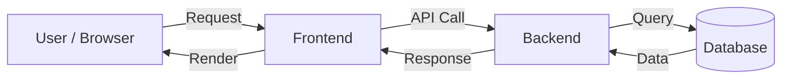

**Key Point:** Frontend = *presentation*. Backend = *data + rules + security*.

---

## 1.2 How Backends Work

| Step | What happens |
|---|---|
| 1 | Client sends an HTTP request (e.g., "get my orders") |
| 2 | Server's router matches the URL to a handler function |
| 3 | Handler validates request (auth, input checks) |
| 4 | Business logic runs (calculate, transform, decide) |
| 5 | Database is queried/updated if needed |
| 6 | Server builds a response (JSON, HTML, etc.) |
| 7 | Response sent back over the network |

> 💡 **Tip:** Every backend request is basically: **Receive → Validate → Process → Persist → Respond.**

---

## 1.3 Why Do We Need Backends?

| Problem without a Backend | How Backend Solves It |
|---|---|
| Anyone can read/edit frontend code (browser dev tools) | Sensitive logic & secrets stay on server, invisible to user |
| No central place to store shared data | Database on server = single source of truth |
| No way to control who can do what | Backend enforces auth rules before acting |
| Business logic (pricing, discounts) could be tampered with | Logic runs server-side, client can't fake it |
| Data needs to be shared across devices | Server is the common meeting point for all clients |

⚠️ **Warning:** Never trust data coming from the frontend. The browser is controlled by the user — they can change values, skip validations, or call your API directly. Always re-validate on the backend.

---

## 1.4 How Frontends Work

**Definition:** The frontend is the part of the app that runs *inside the user's browser/device*, built with HTML (structure), CSS (style), and JavaScript (behavior).

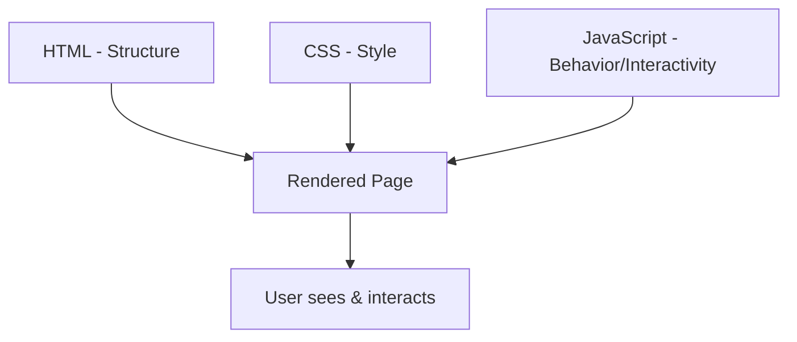

| Job | Tool |
|---|---|
| What's on the page | HTML |
| How it looks | CSS |
| What happens on click/input | JavaScript |
| Talking to backend | `fetch` / `axios` (HTTP calls) |

---

## 1.5 Why Can't We Write Backend Logic Inside the Frontend?

| Reason | Explanation |
|---|---|
| **Security** | Frontend code is 100% visible via "View Source" / DevTools. Secrets (API keys, passwords, business rules) would be exposed. |
| **Trust** | Frontend runs on the *user's* machine — they can modify it. You can't trust anything computed there. |
| **Data integrity** | Database credentials/access must stay server-side, or anyone could read/write your DB directly. |
| **Consistency** | If logic lived in each user's browser, different versions/bugs could cause different users to see different "truths." |

⚠️ **Common mistake beginners make:** Doing price calculation or discount logic in JavaScript on the frontend. A user can open DevTools, change the price variable, and submit — unless the backend re-validates, this becomes a real exploit.

---

### 📌 Section 1 — Learning Connections

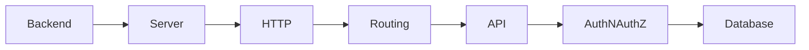

### 📝 Section 1 — Cheatsheet

| Concept | One-liner |
|---|---|
| Backend | Server-side logic + data + rules |
| Frontend | Client-side display + interaction |
| Why backend | Security, trust, central data, business rules |
| Why not logic in frontend | Anyone can see/edit it — never trust the client |

---
---

# SECTION 2 — Understanding HTTP for Backend Engineers

## 2.1 HTTP Intro

**Definition:** HTTP (HyperText Transfer Protocol) is the language/rulebook that browsers and servers use to talk to each other.

**Analogy — Postal system:** HTTP is like a standard letter format — sender address, receiver address, message body — that both post office and receiver understand, regardless of what's inside.

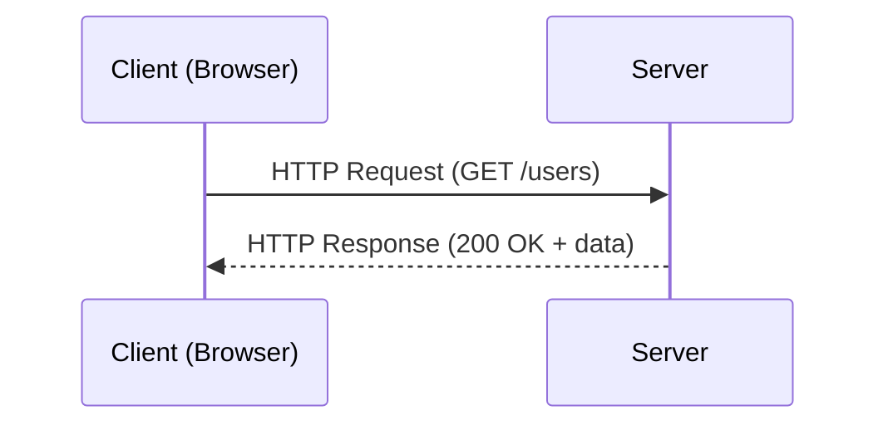

> 💡 HTTP is **stateless** — each request is independent; the server doesn't remember previous requests by default (that's why we need cookies/tokens/sessions).

---

## 2.2 Evolution of HTTP

| Version | Year | Key Change |
|---|---|---|
| HTTP/0.9 | 1991 | Only GET, only HTML, no headers |
| HTTP/1.0 | 1996 | Added headers, status codes, other methods |
| HTTP/1.1 | 1997 | Persistent connections (keep-alive), chunked transfer, host header |
| HTTP/2 | 2015 | Binary protocol, multiplexing (many requests on 1 connection), header compression |
| HTTP/3 | 2020+ | Runs over QUIC (UDP-based) instead of TCP — faster connection setup, no head-of-line blocking |

> 💡 **Tip:** Interviewers love asking "HTTP/1.1 vs HTTP/2 vs HTTP/3" — the core answer is: **each version fixes the previous one's speed/connection limitations.**

---

## 2.3 HTTP Messages

An HTTP message is just structured text sent between client and server. Two types: **Request** and **Response**.

| Part | Request | Response |
|---|---|---|
| Start line | `GET /users HTTP/1.1` | `HTTP/1.1 200 OK` |
| Headers | Metadata (Host, Auth, Content-Type) | Metadata (Content-Type, Cache-Control) |
| Blank line | separates headers from body | same |
| Body | Optional (data being sent, e.g. JSON) | Optional (data being returned) |

```
GET /api/users HTTP/1.1
Host: example.com
Authorization: Bearer xyz

(no body for GET)
```

```
HTTP/1.1 200 OK
Content-Type: application/json

{"id": 1, "name": "Aditi"}
```

---

## 2.4 Why Do We Need HTTP Headers

**Definition:** Headers are key-value pairs of metadata sent along with a request/response — extra info *about* the message, not the message content itself.

**Analogy — Courier parcel:** The package (body) is your data. The label on it (headers) tells the courier: fragile, weight, sender, destination, "signature required" — instructions without opening the box.

| Without Headers | With Headers |
|---|---|
| Server doesn't know data format | `Content-Type` tells it: JSON? HTML? |
| Server doesn't know who's asking | `Authorization` identifies the caller |
| No caching possible | `Cache-Control` enables smart caching |
| No compression | `Accept-Encoding` negotiates gzip/br |

---

## 2.5 Types of HTTP Headers

| Category | Purpose | Examples |
|---|---|---|
| **General** | Apply to both request & response | `Date`, `Connection` |
| **Request** | Info about client/request | `Host`, `User-Agent`, `Accept`, `Authorization` |
| **Response** | Info about the response | `Set-Cookie`, `Server`, `Cache-Control` |
| **Representation/Entity** | Info about the body | `Content-Type`, `Content-Length`, `Content-Encoding` |
| **Security** | Protect client/server | `CORS headers`, `CSP`, `Strict-Transport-Security` |

> 💡 **Tip:** Group headers mentally into "who is sending," "what is being sent," and "how should it be handled."

---

## 2.6 HTTP Methods

| Method | Purpose | Has Body? | Safe? |
|---|---|---|---|
| GET | Read data | No | Yes |
| POST | Create new data | Yes | No |
| PUT | Replace entire resource | Yes | No |
| PATCH | Partially update resource | Yes | No |
| DELETE | Remove resource | Rarely | No |
| HEAD | Like GET but only headers, no body | No | Yes |
| OPTIONS | Ask server "what methods/headers are allowed?" | No | Yes |

*"Safe" = doesn't change server state.*

---

## 2.7 Idempotent vs Non-Idempotent

**Definition:** Idempotent = calling it once or 100 times gives the **same end result** on the server.

| Method | Idempotent? | Why |
|---|---|---|
| GET | ✅ Yes | Reading doesn't change anything |
| PUT | ✅ Yes | Replacing with same data = same end state every time |
| DELETE | ✅ Yes | Deleting an already-deleted item still results in "it's gone" |
| POST | ❌ No | Calling twice = 2 new records created |
| PATCH | ⚠️ Usually No | Depends — "increment by 1" run twice ≠ run once |

⚠️ **Common misconception:** People think idempotent means "read-only." It actually means "repeatable with the same outcome" — DELETE and PUT change data but are still idempotent.

---

## 2.8 OPTIONS Method and CORS Workflow

**Definition:** CORS (Cross-Origin Resource Sharing) is a browser security rule that blocks a webpage from calling an API on a *different* domain unless that API explicitly allows it.

**Why it exists:** Without CORS, any malicious website could silently call your bank's API using your logged-in cookies.

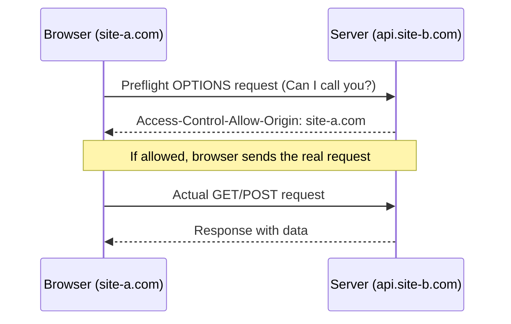

| Term | Meaning |
|---|---|
| Origin | scheme + domain + port (e.g. `https://app.com:443`) |
| Preflight request | Browser's automatic `OPTIONS` check before "unsafe" requests |
| `Access-Control-Allow-Origin` | Header telling browser which origins are allowed |
| Simple request | GET/POST with basic headers — skips preflight |

> 💡 **Tip:** CORS is enforced by the **browser**, not the server. Tools like Postman/cURL ignore CORS entirely — that's why "it works in Postman but not in browser" is a classic CORS bug.

---

## 2.9 Response Status Codes

| Range | Category | Meaning |
|---|---|---|
| 1xx | Informational | Request received, continuing |
| 2xx | Success | Request worked |
| 3xx | Redirection | Go somewhere else |
| 4xx | Client Error | You (client) made a mistake |
| 5xx | Server Error | Server messed up |

| Code | Name | When |
|---|---|---|
| 200 | OK | Success |
| 201 | Created | New resource created (after POST) |
| 204 | No Content | Success, nothing to return |
| 301 | Moved Permanently | Resource has a new permanent URL |
| 304 | Not Modified | Cached version is still valid |
| 400 | Bad Request | Malformed/invalid request |
| 401 | Unauthorized | Not authenticated (no/invalid credentials) |
| 403 | Forbidden | Authenticated but not allowed |
| 404 | Not Found | Resource doesn't exist |
| 409 | Conflict | Request conflicts with current state (e.g. duplicate) |
| 429 | Too Many Requests | Rate-limited |
| 500 | Internal Server Error | Unhandled server-side bug |
| 502 | Bad Gateway | Upstream server sent invalid response |
| 503 | Service Unavailable | Server overloaded/down for maintenance |

⚠️ **Common misconception:** 401 vs 403 is confused constantly. **401 = "I don't know who you are."** **403 = "I know who you are, but you're not allowed."**

---

## 2.10 HTTP Caching

**Definition:** Caching means storing a copy of a response so future requests can be served faster, without re-doing the full work.

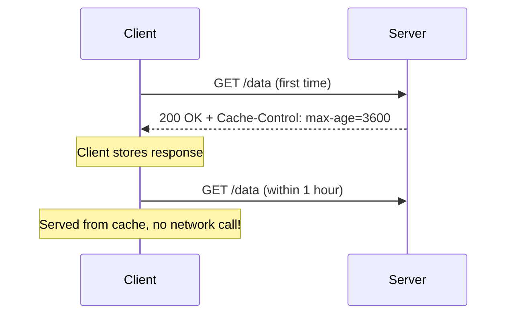

| Header | Purpose |
|---|---|
| `Cache-Control: max-age=3600` | Cache valid for 3600 seconds |
| `ETag` | Fingerprint/hash of the resource, used to check "did it change?" |
| `Last-Modified` | Timestamp of last change |
| `304 Not Modified` | Server says "your cached copy is still fine" |

> 💡 **Tip:** Caching happens at multiple layers — browser cache, CDN cache, reverse-proxy cache (e.g. Nginx), and application-level cache (e.g. Redis).

---

## 2.11 HTTP Content Negotiation

**Definition:** The process where client and server agree on the *best format* for the response (language, data type, encoding).

| Header (Request) | Negotiates |
|---|---|
| `Accept` | Response format (`application/json` vs `text/html`) |
| `Accept-Language` | Language (`en-US`, `hi-IN`) |
| `Accept-Encoding` | Compression (`gzip`, `br`) |

**Analogy:** Like a waiter asking "What language menu would you like, and do you want it summarized or full?" — server picks best match from what it can offer.

---

## 2.12 HTTP Compression

**Definition:** Shrinking response body size before sending, to save bandwidth and speed up transfer.

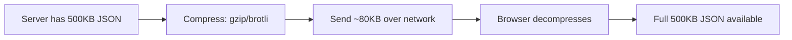

| Header | Role |
|---|---|
| `Accept-Encoding: gzip, br` | Client says what it can decompress |
| `Content-Encoding: gzip` | Server says what it actually used |

---

## 2.13 Persistent Connections and Keep-Alive

**Definition:** Instead of opening a new TCP connection for every single request, `Connection: keep-alive` lets multiple requests reuse the same connection.

| Without Keep-Alive | With Keep-Alive |
|---|---|
| New TCP handshake per request | One handshake, many requests |
| Slow (handshake overhead every time) | Faster, less overhead |

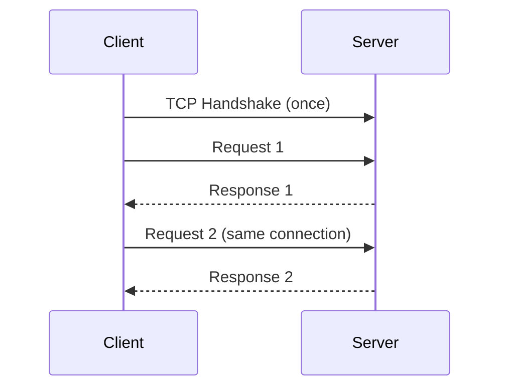

---

## 2.14 Multipart Data and Chunked Transfer

| Concept | Definition | Use case |
|---|---|---|
| **Multipart data** | Body split into multiple named parts, each with its own headers | File uploads + form fields together |
| **Chunked transfer** | Response sent in small pieces ("chunks") when total size isn't known upfront | Streaming large/generated content |

```
Content-Type: multipart/form-data; boundary=XYZ

--XYZ
Content-Disposition: form-data; name="username"

aditi
--XYZ
Content-Disposition: form-data; name="file"; filename="pic.jpg"
Content-Type: image/jpeg

<binary data>
--XYZ--
```

> 💡 **Tip:** Chunked transfer is why you can watch a video start playing before the whole file finishes downloading — server sends `Transfer-Encoding: chunked` piece by piece.

---

## 2.15 SSL, TLS and HTTPS

| Term | What it is |
|---|---|
| **SSL** | Secure Sockets Layer — the *old* encryption protocol (deprecated, insecure now) |
| **TLS** | Transport Layer Security — the *modern* replacement for SSL |
| **HTTPS** | HTTP running *on top of* TLS — encrypted HTTP |

**Analogy:** HTTP is sending a postcard (anyone in transit can read it). HTTPS is sending a sealed, tamper-proof envelope.

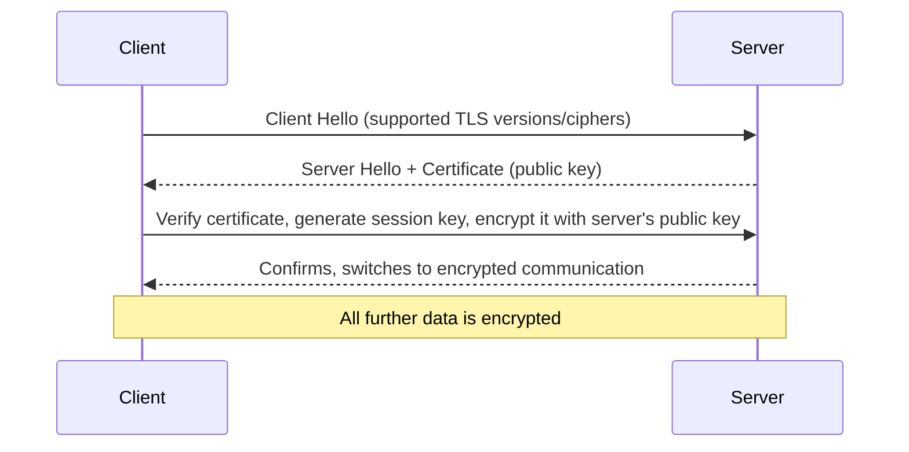

| Provides | How |
|---|---|
| **Encryption** | Data unreadable to eavesdroppers |
| **Integrity** | Data can't be silently altered in transit |
| **Authentication** | Certificate proves server is who it claims to be |

⚠️ **Common misconception:** HTTPS doesn't mean the *website* is trustworthy/safe — it only means the *connection* is encrypted. A phishing site can still have valid HTTPS.

---

### 📌 Section 2 — Learning Connections


### 📝 Section 2 — Cheatsheet

| Topic | Key takeaway |
|---|---|
| HTTP | Stateless request/response protocol |
| HTTP/2 vs 1.1 | Multiplexing over single connection, binary, header compression |
| Headers | Metadata about request/response |
| Idempotent | Same result no matter how many times you call it |
| 401 vs 403 | 401 = who are you? 403 = not allowed |
| CORS | Browser-enforced, blocks cross-origin calls unless allowed |
| Caching | Avoids redundant work using `Cache-Control`/`ETag` |
| Keep-Alive | Reuse TCP connection across requests |
| Chunked transfer | Stream response before full size is known |
| HTTPS | HTTP + TLS = encrypted, verified connection |

---
---

# SECTION 3 — What is Routing in Backend?

## 3.1 Definition

Routing is the mechanism that matches an incoming request's **URL + HTTP method** to the specific piece of code that should handle it.

## 3.2 Why It Exists

Without routing, a server would have no organized way to know "this URL + this method = run *this* function." Routing is the map from address → handler.

**Analogy — Hospital reception:** You tell reception your symptom + department (method + path). Reception (router) directs you to the exact right doctor's room (handler function) — not a random one.

## 3.3 How It Works

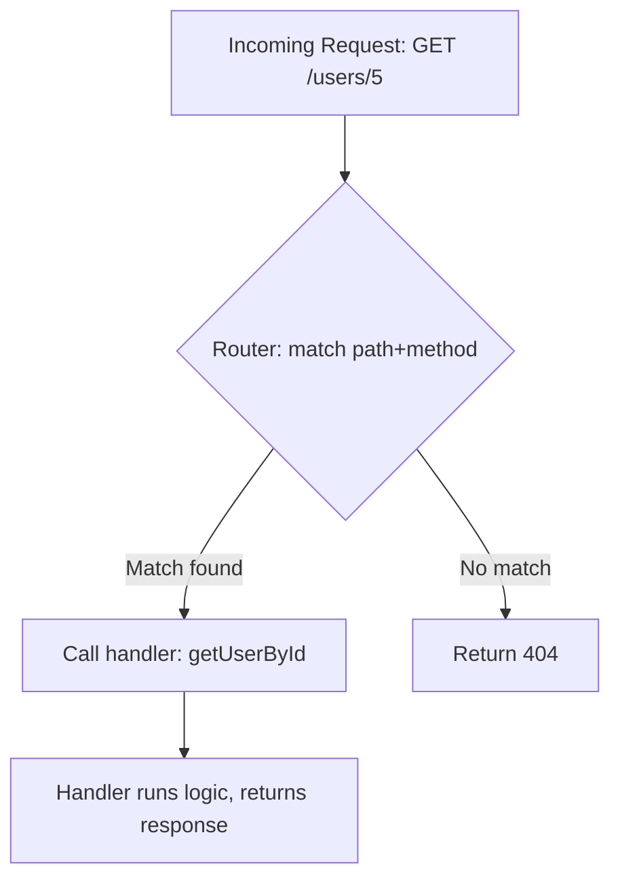

| Component | Role |
|---|---|
| **Route** | A rule: `METHOD + path pattern → handler` |
| **Path parameter** | Dynamic part of URL, e.g. `/users/:id` → `id=5` |
| **Query parameter** | Extra key-values after `?`, e.g. `?sort=asc` |
| **Middleware** | Code that runs *before* the handler (auth check, logging) |
| **Handler / Controller** | The actual function that processes the request |
| **404 fallback** | Default response when no route matches |

## 3.4 Internal Working

1. Request arrives at server with a URL and method.
2. Router checks its route table (list of registered path patterns) top to bottom (or via a tree/trie structure for speed).
3. First matching pattern wins (order can matter!).
4. Any middleware attached to that route runs first (e.g., check token).
5. If middleware passes, the handler executes.
6. Handler returns response through the same chain back to client.

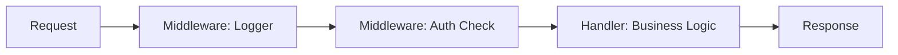

## 3.5 Example

```
GET  /users          → listUsers()
GET  /users/:id       → getUser()
POST /users           → createUser()
PUT  /users/:id       → updateUser()
```

## 3.6 Common Misconceptions

| Misconception | Reality |
|---|---|
| "Routing = URLs" | Routing = URL **+ method** combo. `GET /users` and `POST /users` are different routes. |
| "Order of routes doesn't matter" | It often does — more specific routes should usually be defined before generic/catch-all ones. |

## 3.7 Best Practices

- Keep routes RESTful and predictable (`/users/:id/orders`, not `/getUserOrdersById`).
- Separate routing from business logic (router calls controller, controller doesn't know about HTTP details).
- Use middleware for cross-cutting concerns (auth, logging, validation) instead of repeating code in every handler.

### 📝 Section 3 — Cheatsheet

| Concept | One-liner |
|---|---|
| Routing | Maps `method + path` → handler function |
| Path param | Dynamic segment in URL (`/users/:id`) |
| Middleware | Runs before handler (auth, logging, validation) |
| 404 | No route matched |

---
---

# SECTION 4 — Serialization and Deserialization

## 4.1 Definition

- **Serialization:** Converting an in-memory object/data structure into a format (like JSON, XML, binary) that can be sent over a network or saved to disk.
- **Deserialization:** The reverse — converting that format back into an in-memory object your program can use.

## 4.2 Why It Exists

A program's in-memory objects (like a Python dict or a Java object) only make sense *inside that program's memory*. To send data between two different systems (client ↔ server, or server ↔ database), it must be converted into a universal, transportable format first.

**Analogy — Shipping furniture:** You can't ship an assembled sofa easily. You disassemble it into flat-packed parts (serialize), ship it, and the receiver reassembles it (deserialize) into a usable sofa again.

## 4.3 How It Works

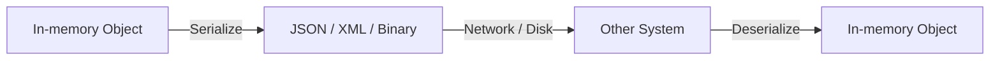

| Format | Human-readable? | Speed | Common use |
|---|---|---|---|
| JSON | ✅ Yes | Medium | REST APIs |
| XML | ✅ Yes | Slower | Legacy enterprise systems, SOAP |
| Protocol Buffers (protobuf) | ❌ No | Fast | gRPC, high-performance microservices |
| MessagePack | ❌ No | Fast | Compact binary alternative to JSON |
| YAML | ✅ Yes | Medium | Config files |

## 4.4 Internal Working (Example: JSON)

1. Backend has an object: `{id: 1, name: "Aditi"}` in memory.
2. Serializer walks through the object's fields.
3. Converts each field into JSON-compatible types (string, number, bool, array, object).
4. Produces a string: `'{"id":1,"name":"Aditi"}'`.
5. String is sent over HTTP as the response body.
6. Client receives string, runs `JSON.parse()` → gets a usable object back (deserialization).

## 4.5 Example

```json
// Serialized (sent over the wire)
{"id": 101, "name": "Aditi", "isActive": true}
```

```python
# Deserialized (Python object)
{"id": 101, "name": "Aditi", "isActive": True}
```

## 4.6 Common Misconceptions

| Misconception | Reality |
|---|---|
| "JSON is the only serialization format" | Many exist — protobuf, XML, MessagePack, Avro — chosen based on speed/size/compatibility needs. |
| "Serialization is just formatting" | It also involves handling types not natively supported (e.g., dates, binary data must be encoded specially, like Base64). |

## 4.7 Best Practices

- Never serialize sensitive internal fields (e.g., password hashes) directly — use DTOs (Data Transfer Objects) to control exactly what's exposed.
- Version your serialization schema (especially for protobuf/Avro) so old and new clients don't break.
- Validate data *after* deserializing — never trust incoming data blindly.

### 📝 Section 4 — Cheatsheet

| Concept | One-liner |
|---|---|
| Serialization | Object → transportable format (JSON, protobuf) |
| Deserialization | Transportable format → object |
| Why | Systems can't share raw memory directly |
| DTO | Controls what fields get exposed during serialization |

---
---

# SECTION 5 — Authentication and Authorization

## 5.1 Definition

- **Authentication (AuthN):** Verifying *who you are*.
- **Authorization (AuthZ):** Verifying *what you're allowed to do*.

| | Authentication | Authorization |
|---|---|---|
| Question answered | "Who are you?" | "What can you do?" |
| Happens | First | After authentication |
| Failure code | 401 Unauthorized | 403 Forbidden |
| Example | Login with password | "Only admins can delete users" |

## 5.2 Why It Exists

Without AuthN, a server can't tell who is making a request. Without AuthZ, even a known/identified user could do anything — including things they shouldn't (like deleting other people's data).

**Analogy — Airport:** Authentication = showing your passport at security (proving who you are). Authorization = your boarding pass determining which gate/flight you can board (what you're allowed to access).

## 5.3 How It Works — Authentication Flow

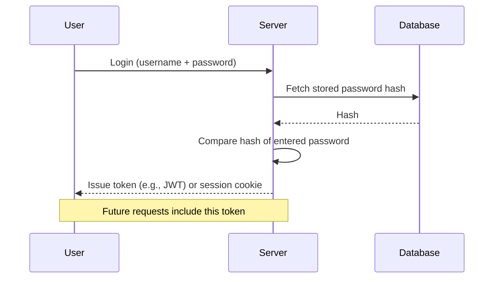

## 5.4 How It Works — Authorization Flow

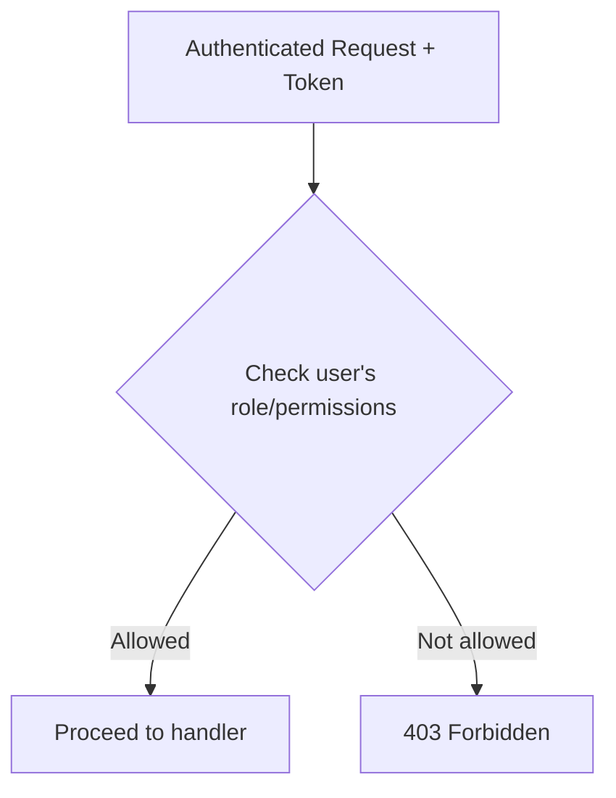

## 5.5 Internal Working — Key Building Blocks

| Concept | Definition |
|---|---|
| **Password hashing** | Passwords are never stored as plain text — stored as a one-way hash (e.g., bcrypt, argon2), so even the server can't "see" the real password. |
| **Salt** | Random data added to a password before hashing, so identical passwords don't produce identical hashes. |
| **Session-based auth** | Server stores session state; client holds a session ID cookie. Server must remember (stateful). |
| **Token-based auth (JWT)** | Server issues a signed token containing claims (user id, role, expiry). Server doesn't need to store it (stateless) — it just verifies the signature. |
| **OAuth 2.0** | A standard protocol for delegated access (e.g., "Login with Google") — lets a third party grant limited access without sharing passwords. |
| **RBAC** | Role-Based Access Control — permissions assigned to roles (admin, user), users assigned to roles. |
| **ABAC** | Attribute-Based Access Control — permissions based on attributes (department, time of day, resource owner) — more fine-grained than RBAC. |

## 5.6 Session vs Token — Comparison

| | Session-based | Token-based (JWT) |
|---|---|---|
| Storage | Server keeps session store | Server stores nothing (stateless) |
| Scalability | Harder (needs shared session store across servers) | Easier (any server can verify token) |
| Revocation | Easy (delete session on server) | Harder (must use blocklists/short expiry) |
| Typical carrier | Cookie | Authorization header (`Bearer <token>`) |

## 5.7 Example — JWT Structure

```
header.payload.signature

eyJhbGciOiJIUzI1NiJ9.eyJ1c2VySWQiOjEwMX0.4f8a...
```

| Part | Contains |
|---|---|
| Header | Algorithm used (e.g., HS256) |
| Payload | Claims (userId, role, expiry) — **not encrypted, just encoded** |
| Signature | Proves token wasn't tampered with (signed with server's secret key) |

⚠️ **Warning:** JWT payload is Base64-encoded, **not encrypted** — anyone can decode and read it. Never put secrets/passwords inside a JWT payload.

## 5.8 Common Misconceptions

| Misconception | Reality |
|---|---|
| "JWT is encrypted" | It's only signed, not encrypted — payload is readable by anyone. |
| "Authentication and Authorization are the same" | AuthN = identity. AuthZ = permission. Completely different checks. |
| "Storing plain-text passwords with a backup is fine if the DB is secure" | Always hash passwords — DB breaches happen; hashing limits damage. |
| "HTTPS alone secures authentication" | HTTPS protects data in transit, but you still need proper hashing, token expiry, and validation. |

## 5.9 Best Practices

- Always hash + salt passwords (bcrypt/argon2) — never store or log plain-text passwords.
- Set short expiry on tokens + use refresh tokens for long sessions.
- Always check authorization on the **backend**, even if the frontend hides a button.
- Use HTTPS everywhere so tokens/cookies aren't intercepted.
- Apply principle of least privilege — give users/services the minimum access they need.
- Refer to the **OWASP Cheat Sheet Series** for deep, up-to-date security guidance: https://cheatsheetseries.owasp.org/

### 📌 Section 5 — Learning Connections

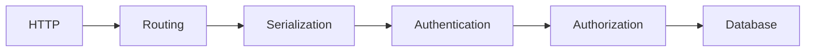

### 📝 Section 5 — Cheatsheet

| Concept | One-liner |
|---|---|
| Authentication | Who are you? (login) |
| Authorization | What can you do? (permissions) |
| 401 vs 403 | 401 = not authenticated, 403 = not authorized |
| Password storage | Hash + salt, never plain text |
| JWT | Signed, stateless token — NOT encrypted |
| Session | Stateful, server-stored |
| RBAC | Role → permissions mapping |
| OAuth 2.0 | Delegated access standard ("Login with Google") |

---

# 🧠 Master Learning Map (All Sections)

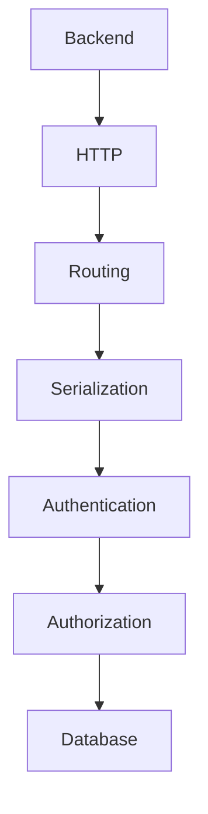

# ⚡ Full Interview Revision Sheet (2-Minute Read)

| Topic | Must-Remember Fact |
|---|---|
| Backend | Server-side logic, data, and rules — never trust the frontend |
| HTTP | Stateless request/response protocol |
| Idempotent | GET, PUT, DELETE — same result no matter how many calls |
| 401 vs 403 | 401 = unknown identity, 403 = known but not allowed |
| CORS | Browser-enforced; blocks cross-origin JS calls unless server allows |
| HTTPS | HTTP + TLS = encrypted, tamper-proof, authenticated connection |
| Routing | `method + path` → handler; middleware runs before handler |
| Serialization | Object → JSON/protobuf for transport; deserialize to use again |
| Authentication | Verifies identity (login) |
| Authorization | Verifies permission (role/access check) |
| JWT | Signed NOT encrypted — don't put secrets in payload |
| Password storage | Always hash + salt (bcrypt/argon2) |


# Backend Fundamentals — Notes Set 02

> Covers: Validation & Transformation · Controllers/Services/Repositories/Middleware/Request Context · Complete REST API Design · Databases with Postgres · Caching & Redis

---
---

# SECTION 6 — Validation and Transformation

## 6.1 Definition

- **Validation:** Checking that incoming data is correct, complete, and safe *before* your app acts on it.
- **Transformation:** Converting data from one shape/format/type into the shape your app actually needs.

## 6.2 Why It Exists

| Without Validation | Without Transformation |
|---|---|
| Bad/malicious data reaches business logic & DB | App constantly deals with inconsistent formats |
| Crashes from unexpected types (`null`, wrong type) | Duplicate "clean-up" code scattered everywhere |
| Security holes (SQL injection, XSS via unescaped input) | Bugs from mismatched units/formats (e.g. `"5"` vs `5`) |

**Analogy — Airport:** Validation = security check (are you allowed to board? valid ticket, no banned items). Transformation = customs converting your currency/paperwork into the format the destination country accepts.

## 6.3 The Pipeline

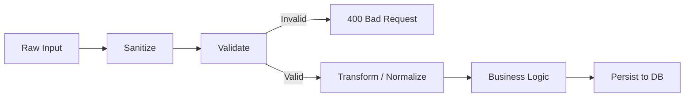

| Stage | Purpose | Example |
|---|---|---|
| **Sanitize** | Remove/escape dangerous content | Strip HTML tags, trim whitespace |
| **Validate** | Check correctness against rules | `email` must match email format, `age >= 18` |
| **Transform** | Reshape into internal format | `"true"` string → `true` boolean, `"2024-01-01"` → `Date` object |
| **Normalize** | Make consistent | Lowercase emails, trim strings, standardize phone format |
| **Enrich** | Add derived data | Add `createdAt`, `requestId`, computed fields |

## 6.4 Types of Validation

| Type | Checks | Example |
|---|---|---|
| **Type validation** | Correct data type | `age` must be a number, not a string |
| **Schema validation** | Structure matches expected shape | Required fields present, no extra unknown fields |
| **Format validation** | Matches a pattern | Valid email, valid UUID, valid phone number |
| **Range/Boundary validation** | Within acceptable limits | `1 <= quantity <= 100` |
| **Business rule validation** | Domain-specific logic | "End date must be after start date," "Can't book past dates" |
| **Cross-field validation** | Relationship between fields | `password === confirmPassword` |
| **Uniqueness validation** | No duplicates | Email not already registered (usually checked at DB/service level) |

## 6.5 Where Validation Should Happen

| Layer | Should validate? | Why |
|---|---|---|
| Frontend | ✅ Yes (UX only) | Fast feedback to user — but never trusted |
| API boundary (Controller/DTO) | ✅ Yes — primary defense | First real gatekeeper on the server |
| Service layer | ✅ Yes (business rules) | Domain logic that schema validation can't express |
| Database (constraints) | ✅ Yes — last line of defense | `NOT NULL`, `UNIQUE`, `CHECK` constraints catch anything that slipped through |

⚠️ **Warning:** Frontend validation is a UX nicety, not security. Attackers can call your API directly (Postman, cURL) — always re-validate on the backend.

## 6.6 Common Tools

| Language | Popular Libraries |
|---|---|
| JavaScript/TypeScript | Zod, Joi, Yup, class-validator |
| Python | Pydantic, Marshmallow |
| Java | Hibernate Validator (Bean Validation / JSR-380) |
| Go | validator (go-playground) |

## 6.7 Common Misconceptions

| Misconception | Reality |
|---|---|
| "Validation and transformation are the same thing" | Validation = *is it acceptable?* Transformation = *reshape it.* Different responsibilities. |
| "Frontend validation is enough" | Backend must always re-validate — frontend can be bypassed. |
| "Validation belongs inside business logic functions" | Better to validate at the boundary (DTO/schema) so business logic can assume clean data. |

## 6.8 Best Practices

- **Whitelist, don't blacklist** — define what's allowed, reject everything else, instead of trying to block "bad" patterns.
- **Fail fast** — validate before touching DB or running expensive logic.
- Use **schema-based validation libraries** instead of hand-written `if` chains — more maintainable and self-documenting.
- Keep validation **declarative** (schema describes rules) so it doubles as documentation.
- Return **clear, field-level error messages** so API consumers know exactly what to fix.

### 📝 Section 6 — Cheatsheet

| Concept | One-liner |
|---|---|
| Validation | Is this data acceptable? |
| Transformation | Reshape data into what the app needs |
| Pipeline order | Sanitize → Validate → Transform → Business Logic |
| Golden rule | Never trust client input — validate server-side always |

---
---

# SECTION 7 — Controllers, Services, Repositories, Middlewares & Request Context

## 7.1 Definition

This is **layered architecture** — splitting backend code into layers, each with one clear responsibility, so a request flows through a predictable pipeline instead of one giant tangled function.

## 7.2 Why It Exists

| Without Layers | With Layers |
|---|---|
| One function does HTTP parsing + business rules + DB queries — impossible to test or reuse | Each layer has single responsibility, easy to test in isolation |
| Changing DB means rewriting business logic too | Swap database without touching business logic (repository abstracts it) |
| Duplicate auth/logging code in every route | Middleware handles cross-cutting concerns once, for all routes |

**Analogy — Restaurant:**

| Layer | Restaurant Equivalent |
|---|---|
| Middleware | Bouncer at the door (checks ID before you even enter) |
| Controller | Waiter (takes your order, doesn't cook, just relays it correctly) |
| Service | Chef (actual business logic — how the dish/decision is made) |
| Repository | Store-room/inventory manager (fetches raw ingredients/data) |
| Request Context | The order ticket that travels with your order — table number, who ordered, notes |

## 7.3 The Layers

| Layer | Responsibility | Knows about HTTP? | Knows about DB? |
|---|---|---|---|
| **Middleware** | Cross-cutting logic that runs before/after handlers (auth, logging, rate limiting, CORS) | Yes | No |
| **Controller / Handler** | Parses request, calls service, formats HTTP response | Yes | No |
| **Service** | Core business logic, rules, orchestration | No | No (talks to repository, not DB directly) |
| **Repository / DAO** | Data access — talks to the database, abstracts queries | No | Yes |
| **Request Context** | Request-scoped data (user, request ID, trace ID) passed along the whole chain | N/A (a data carrier) | N/A |

## 7.4 Full Request Lifecycle

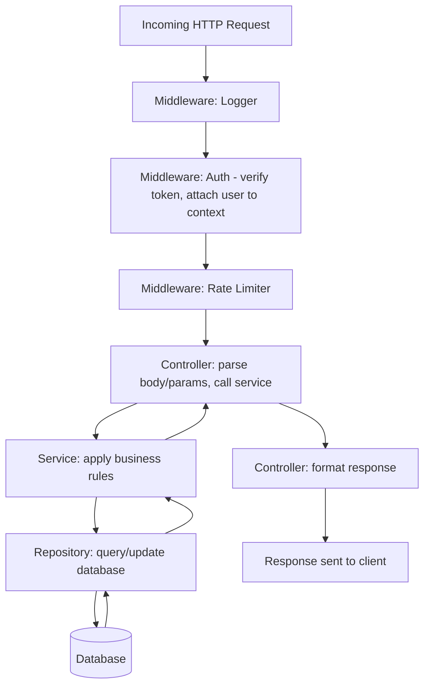

## 7.5 Request Context — Deep Dive

**Definition:** An object created at the start of a request that carries request-scoped data through every layer, without passing 10 separate parameters manually.

| Typically holds | Example |
|---|---|
| Authenticated user | `{id: 101, role: "admin"}` |
| Request ID / Trace ID | For logging & distributed tracing |
| Locale / language | `en-US` |
| Start time | For calculating request duration |

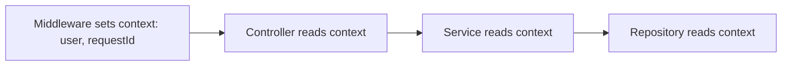

> 💡 **Tip:** Request context is why you can log `[requestId=abc123] User 101 fetched order 55` consistently across every layer — every layer has access to the same context object.

## 7.6 Middleware Deep Dive

| Type | Example | Runs |
|---|---|---|
| **Global** | Logging, CORS | On every request |
| **Route-specific** | Auth check on `/admin/*` only | Only on matching routes |
| **Error-handling** | Catch thrown errors, format error response | At the end of the chain, on failure |

```mermaid
flowchart LR
    Req --> M1[Logger] --> M2[Auth] --> M3[Validation] --> H[Handler] --> M4[Error Handler] --> Res
```

## 7.7 Example (Pseudocode)

```
// Controller — only handles HTTP concerns
function getUserController(req, res) {
  const userId = req.params.id;
  const user = userService.getUserById(userId, req.context);
  res.status(200).json(user);
}

// Service — business logic
function getUserById(id, context) {
  if (!context.user.isAdmin && context.user.id !== id) {
    throw new ForbiddenError();
  }
  return userRepository.findById(id);
}

// Repository — data access only
function findById(id) {
  return db.query("SELECT * FROM users WHERE id = $1", [id]);
}
```

## 7.8 Common Misconceptions

| Misconception | Reality |
|---|---|
| "Controllers can contain business logic for simple cases" | Even "simple" logic belongs in service layer — keeps controllers testable & thin. |
| "Repository = the database" | Repository is an *abstraction* over the database — business logic never talks to SQL/DB driver directly. |
| "Middleware is only for auth" | Middleware handles any cross-cutting concern: logging, rate-limiting, compression, request-id generation, etc. |

## 7.9 Best Practices

- **Thin controllers, fat services** — controllers should just translate HTTP ↔ service calls.
- Repository pattern lets you **swap databases** (e.g., Postgres → MongoDB) without touching business logic.
- Use **dependency injection** so services/repositories can be mocked in tests.
- Keep **middleware order intentional** — e.g., auth must run before rate-limiting-by-user.

### 📌 Section 7 — Learning Connections

```mermaid
flowchart LR
    Routing --> Middleware --> Controller --> Service --> Repository --> Database
```

### 📝 Section 7 — Cheatsheet

| Layer | One-liner |
|---|---|
| Middleware | Cross-cutting logic before/after handler |
| Controller | Translates HTTP ↔ service call |
| Service | Business logic & rules |
| Repository | Data access abstraction |
| Request Context | Request-scoped data carried across layers |

---
---

# SECTION 8 — Complete REST API Design

## 8.1 Definition

**REST** (Representational State Transfer) is an architectural style for designing APIs where everything is modeled as **resources**, accessed via standard HTTP methods, using URLs as resource identifiers.

## 8.2 The 6 REST Constraints

| Constraint | Meaning |
|---|---|
| **Client-Server** | Frontend and backend are separate, independently evolvable |
| **Statelessness** | Each request contains all info needed; server doesn't store client session state between requests |
| **Cacheability** | Responses must define themselves as cacheable or not |
| **Uniform Interface** | Consistent way to interact with resources (standard methods, predictable URLs) |
| **Layered System** | Client doesn't need to know if it's talking directly to the server or through proxies/load balancers |
| **Code on Demand** *(optional)* | Server can send executable code (e.g., JS) to client |

## 8.3 Resource Naming Conventions

| Good | Bad | Why |
|---|---|---|
| `/users` | `/getUsers` | URL = resource (noun), method = action (verb) |
| `/users/101/orders` | `/getOrdersForUser?id=101` | Nesting shows relationship clearly |
| `/orders` (plural) | `/order` (singular) | Consistency — always plural for collections |
| `/users/101` | `/users/101/getUser` | The GET method already implies "get" |

## 8.4 CRUD → HTTP Mapping

| Action | Method | URL | Success Code |
|---|---|---|---|
| List all | GET | `/users` | 200 |
| Get one | GET | `/users/101` | 200 |
| Create | POST | `/users` | 201 |
| Full update | PUT | `/users/101` | 200 |
| Partial update | PATCH | `/users/101` | 200 |
| Delete | DELETE | `/users/101` | 204 |

## 8.5 Pagination

| Style | How it works | Pros | Cons |
|---|---|---|---|
| **Offset-based** | `?page=2&limit=20` (skip N, take N) | Simple, supports jumping to any page | Slow on large datasets, inconsistent if data changes mid-scroll |
| **Cursor-based** | `?after=eyJpZCI6MjB9` (pointer to last seen item) | Fast & consistent even with live data | Can't jump to arbitrary page number |

```mermaid
flowchart LR
    A[Page 1: items 1-20] --> B[Page 2: items 21-40]
    B --> C[Page 3: items 41-60]
```

## 8.6 Filtering, Sorting, Searching

| Purpose | Example query param |
|---|---|
| Filter | `/products?category=shoes&inStock=true` |
| Sort | `/products?sort=price&order=asc` |
| Search | `/products?q=running+shoes` |
| Field selection | `/products?fields=id,name,price` |

## 8.7 Versioning Strategies

| Strategy | Example | Notes |
|---|---|---|
| **URI versioning** | `/v1/users` | Most common, very explicit, easy to route |
| **Header versioning** | `Accept: application/vnd.api.v1+json` | Cleaner URLs, but harder to test/debug |
| **Query param versioning** | `/users?version=1` | Rare, easy to forget/misuse |

> 💡 **Tip:** Never break an existing API version — add a new version instead, and deprecate the old one gradually with a sunset notice.

## 8.8 Standard Error Response Format

```json
{
  "error": {
    "code": "VALIDATION_ERROR",
    "message": "Email is invalid",
    "field": "email",
    "requestId": "abc-123"
  }
}
```

| Why standardize | Benefit |
|---|---|
| Predictable shape | Frontend can handle all errors the same way |
| Includes `requestId` | Easy to trace in logs/support tickets |
| Machine-readable `code` | Frontend can branch logic without parsing message text |

## 8.9 Idempotency for Non-Idempotent Methods

**Problem:** POST isn't idempotent — if a network retry happens (client didn't get the response), you might create a duplicate resource (e.g., double payment).

**Solution — Idempotency Key:**

```
POST /payments
Idempotency-Key: 7d8f3a2b-...
```

Server remembers this key + response; if the same key arrives again, it returns the *same* result instead of creating a duplicate.

## 8.10 Rate Limiting

| Concept | Meaning |
|---|---|
| **Rate limiting** | Restrict number of requests a client can make in a time window |
| **429 Too Many Requests** | Response when limit exceeded |
| **Common headers** | `X-RateLimit-Limit`, `X-RateLimit-Remaining`, `Retry-After` |

| Algorithm | How it works |
|---|---|
| Fixed window | Count resets every N seconds (e.g., every minute) |
| Sliding window | Rolling count over the last N seconds — smoother |
| Token bucket | Tokens refill at a steady rate; each request consumes one |

## 8.11 HATEOAS (Advanced REST)

**Definition:** Responses include links to related actions, so the client discovers what it can do next — instead of hardcoding URLs.

```json
{
  "id": 101,
  "status": "pending",
  "links": {
    "self": "/orders/101",
    "cancel": "/orders/101/cancel"
  }
}
```

> 💡 Very few real-world APIs fully implement HATEOAS — but it's a common interview theory question.

## 8.12 API Documentation

| Tool/Standard | Purpose |
|---|---|
| **OpenAPI (Swagger)** | Machine-readable spec describing every endpoint, auto-generates docs + client SDKs |
| **Postman Collections** | Shareable, testable API examples |

## 8.13 Common Misconceptions

| Misconception | Reality |
|---|---|
| "REST requires JSON" | REST doesn't mandate a format — JSON is just the most popular choice today. |
| "Any API with URLs is RESTful" | True REST follows all 6 constraints, especially statelessness and uniform interface — many "REST APIs" are really just HTTP+JSON APIs. |
| "PUT and PATCH are interchangeable" | PUT replaces the *whole* resource; PATCH updates *part* of it. |

## 8.14 Best Practices

- Use **nouns, not verbs**, in URLs; let HTTP methods represent actions.
- Always **version** your API from day one.
- Return **consistent error shapes** across all endpoints.
- Support **pagination** on any endpoint that can return a large list.
- Use proper **status codes** — don't return 200 for errors.
- Document with **OpenAPI/Swagger** so consumers don't need to guess.

### 📝 Section 8 — Cheatsheet

| Topic | Key takeaway |
|---|---|
| Resource naming | Plural nouns, no verbs (`/users`, not `/getUsers`) |
| Versioning | URI versioning (`/v1/...`) is most common & explicit |
| Pagination | Offset = simple; Cursor = scalable & consistent |
| Idempotency key | Prevents duplicate POST side-effects on retry |
| Rate limiting | Token bucket is the most flexible algorithm |
| HATEOAS | Response includes links to next possible actions |

---
---

# SECTION 9 — Mastering Databases with Postgres

## 9.1 Definition

A **database** is organized, persistent storage for data that survives beyond a single program run, supports structured querying, and (in RDBMS like Postgres) enforces rules about data integrity.

**Analogy — Library:** Tables = sections (Fiction, Science). Rows = individual books. Columns = book attributes (title, author, year). Indexes = the card catalog that lets you find a book fast without scanning every shelf.

## 9.2 SQL (RDBMS) vs NoSQL

| | SQL (Postgres, MySQL) | NoSQL (MongoDB, DynamoDB) |
|---|---|---|
| Structure | Fixed schema, tables + rows | Flexible schema, documents/key-value/graph |
| Relationships | Strong, via foreign keys + joins | Usually denormalized/embedded |
| Consistency | Strong (ACID) | Often eventual consistency (tunable) |
| Best for | Structured data, complex relationships, transactions | High-scale, flexible/evolving schema, huge write throughput |

## 9.3 Core Building Blocks

| Term | Meaning |
|---|---|
| **Table** | A collection of rows with the same columns |
| **Row (record/tuple)** | A single entry in a table |
| **Column (field)** | An attribute of the data, with a defined type |
| **Primary Key (PK)** | Uniquely identifies each row |
| **Foreign Key (FK)** | Column referencing another table's primary key — enforces relationships |
| **Unique constraint** | Ensures no duplicate values in a column |
| **Composite key** | Primary key made of multiple columns together |

## 9.4 Relationships

```mermaid
erDiagram
    USERS ||--o{ ORDERS : places
    ORDERS ||--|{ ORDER_ITEMS : contains
    PRODUCTS ||--o{ ORDER_ITEMS : "referenced in"
```

| Type | Example | How it's modeled |
|---|---|---|
| **One-to-One** | User ↔ Profile | FK with unique constraint |
| **One-to-Many** | User → Orders | FK on the "many" side |
| **Many-to-Many** | Students ↔ Courses | Junction/join table with two FKs |

## 9.5 Normalization vs Denormalization

| | Normalization | Denormalization |
|---|---|---|
| Goal | Eliminate redundant data | Optimize for read speed |
| How | Split data into related tables | Duplicate data to avoid joins |
| Trade-off | More joins needed, less duplication | Fewer joins, but risk of inconsistent copies |

| Normal Form | Rule |
|---|---|
| 1NF | Each column holds atomic (indivisible) values, no repeating groups |
| 2NF | 1NF + every non-key column depends on the *whole* primary key |
| 3NF | 2NF + no column depends on another non-key column (no transitive dependency) |

> 💡 **Tip:** Most production systems aim for 3NF, then *strategically* denormalize specific hot paths for performance.

## 9.6 Indexes

**Definition:** A separate data structure that lets the database find rows fast, without scanning the entire table.

```mermaid
flowchart LR
    A[Query: WHERE email = 'x@y.com'] --> B{Index exists on email?}
    B -->|Yes| C[Direct lookup - fast]
    B -->|No| D[Full table scan - slow]
```

| Index Type | Best for |
|---|---|
| **B-Tree** (default) | Equality & range queries (`=`, `<`, `>`, `BETWEEN`) |
| **Hash** | Pure equality lookups only |
| **GIN** | Full-text search, JSONB, arrays |
| **Composite index** | Queries filtering on multiple columns together |

⚠️ **Warning:** Indexes speed up reads but **slow down writes** (every INSERT/UPDATE must also update the index) and use extra storage. Don't index every column blindly.

## 9.7 Transactions & ACID

**Definition:** A transaction groups multiple operations into one all-or-nothing unit.

| Property | Meaning |
|---|---|
| **Atomicity** | All operations succeed, or none do (rollback on failure) |
| **Consistency** | DB moves from one valid state to another, respecting all constraints |
| **Isolation** | Concurrent transactions don't interfere with each other |
| **Durability** | Once committed, data survives even a crash |

```sql
BEGIN;
UPDATE accounts SET balance = balance - 100 WHERE id = 1;
UPDATE accounts SET balance = balance + 100 WHERE id = 2;
COMMIT;
```

**Analogy — Bank transfer:** Money must leave account A *and* arrive in account B together — never just one half. That's atomicity.

## 9.8 Isolation Levels

| Level | Prevents | Allows |
|---|---|---|
| Read Uncommitted | Nothing | Dirty reads (rare in Postgres) |
| Read Committed *(Postgres default)* | Dirty reads | Non-repeatable reads |
| Repeatable Read | Dirty + non-repeatable reads | Phantom reads (mostly) |
| Serializable | Everything | Fully isolated, but slowest |

## 9.9 Locking

| Type | Behavior |
|---|---|
| **Optimistic locking** | Assume no conflict; check a version number before committing — retry if it changed |
| **Pessimistic locking** | Lock the row upfront (`SELECT ... FOR UPDATE`) so no one else can touch it until you're done |

## 9.10 Joins

| Join Type | Returns |
|---|---|
| **INNER JOIN** | Only matching rows in both tables |
| **LEFT JOIN** | All rows from left table + matches from right (nulls if no match) |
| **RIGHT JOIN** | All rows from right table + matches from left |
| **FULL OUTER JOIN** | All rows from both, matched where possible |

```mermaid
flowchart LR
    A((Users)) -->|INNER JOIN| B((Orders))
    B --> C[Only users WITH orders]
```

## 9.11 Query Execution Plan

**Definition:** Postgres's `EXPLAIN ANALYZE` shows *how* it will execute a query — which indexes it uses, in what order, and estimated cost — critical for debugging slow queries.

```sql
EXPLAIN ANALYZE SELECT * FROM orders WHERE user_id = 5;
```

## 9.12 The N+1 Query Problem

⚠️ **Common performance bug:** Fetching a list, then running a separate query *per item* to get related data.

```mermaid
flowchart TD
    A[1 query: get 20 users] --> B[20 more queries: get each user's orders]
    B --> C[21 total queries instead of 2!]
```

**Fix:** Use a JOIN, or batch-fetch with `WHERE user_id IN (...)`.

## 9.13 Connection Pooling

**Definition:** Reusing a small set of already-open DB connections instead of opening a new one per request (opening connections is expensive).

```mermaid
flowchart LR
    R1[Request 1] --> P[Connection Pool]
    R2[Request 2] --> P
    R3[Request 3] --> P
    P --> DB[(Postgres)]
```

## 9.14 Migrations

**Definition:** Version-controlled, incremental scripts that evolve the database schema over time (add column, create table) — so schema changes are tracked like code.

| Without Migrations | With Migrations |
|---|---|
| Manual, undocumented schema changes | Every change is a reviewable, repeatable script |
| Hard to sync across dev/staging/prod | Same migration runs identically everywhere |

## 9.15 Replication, Sharding & Partitioning

| Technique | What it does | Solves |
|---|---|---|
| **Replication** | Copies of the DB (replicas) stay in sync with the primary | Read scaling, high availability |
| **Sharding** | Splits data *horizontally* across multiple independent databases (e.g., by user ID range) | Write scaling, huge datasets |
| **Partitioning** | Splits one large table into smaller pieces *within the same DB* (e.g., by date) | Query performance on huge tables |

```mermaid
flowchart TD
    Primary[(Primary DB - writes)] --> R1[(Replica 1 - reads)]
    Primary --> R2[(Replica 2 - reads)]
```

## 9.16 Common Misconceptions

| Misconception | Reality |
|---|---|
| "More indexes = always faster" | Indexes slow down writes and cost storage — index only what you query often. |
| "NoSQL is always faster than SQL" | Depends on access pattern — Postgres with proper indexing can outperform NoSQL for relational data. |
| "Transactions are only for banking apps" | Any multi-step operation that must succeed/fail together needs a transaction. |

## 9.17 Best Practices

- Always use **migrations**, never manual schema edits in production.
- Add indexes based on **actual query patterns** (check `EXPLAIN ANALYZE`), not guesses.
- Use **connection pooling** (e.g., PgBouncer) in production.
- Wrap multi-step writes in **transactions**.
- Avoid **SELECT \*** in production code — select only needed columns.
- Watch for and fix **N+1 queries** — a very common performance killer.

### 📝 Section 9 — Cheatsheet

| Concept | One-liner |
|---|---|
| Primary key | Uniquely identifies a row |
| Foreign key | Enforces relationship between tables |
| Normalization | Reduce redundancy by splitting into related tables |
| Index | Speeds up reads, slows down writes |
| ACID | Atomicity, Consistency, Isolation, Durability |
| N+1 problem | 1 query becomes N+1 due to per-item lookups — fix with JOIN/batching |
| Replication | Copies for read scaling & availability |
| Sharding | Splits data across DBs for write scaling |

---
---

# SECTION 10 — Caching: The Secret Behind It All

## 10.1 Definition

**Caching** means storing a copy of frequently-needed data somewhere *faster to access* than its original source, so future requests can be served quicker.

**Analogy — Kitchen prep:** Instead of walking to the store (database) every time you need salt, you keep a jar on the counter (cache) — much faster, refilled occasionally.

## 10.2 Why It Exists

| Problem | Caching Solves It By |
|---|---|
| Database is slow relative to memory | Serving hot data from RAM instead of disk |
| Same expensive computation repeated | Storing the computed result once |
| Network latency to origin server | Storing data closer to the user (CDN) |

## 10.3 Real-World Examples

| Example | What's cached |
|---|---|
| Browser cache | Images, CSS, JS files |
| DNS cache | Domain → IP address mappings |
| CDN | Static assets served from a nearby edge server |
| CPU cache (L1/L2/L3) | Frequently accessed memory addresses |
| Database query cache | Results of expensive/frequent queries |
| App-level cache (Redis) | Session data, computed results, rate-limit counters |

## 10.4 Caching at Every Level

```mermaid
flowchart TD
    A[CPU L1/L2/L3 Cache] --> B[OS Disk Cache]
    B --> C[Browser Cache]
    C --> D[DNS Cache]
    D --> E[CDN - Network Level]
    E --> F[Reverse Proxy Cache - Nginx/Varnish]
    F --> G[Application Cache - Redis/Memcached]
    G --> H[Database Query Cache]
```

| Level | Layer | Example |
|---|---|---|
| **Hardware** | CPU registers/cache | L1/L2/L3 CPU cache — nanosecond access |
| **Network** | Between client and origin | CDN (Cloudflare, Akamai), DNS cache |
| **Software/Application** | Inside your backend stack | Redis, Memcached, in-process memory cache |

## 10.5 Caching Strategies

| Strategy | How it works | Trade-off |
|---|---|---|
| **Cache-Aside (Lazy loading)** | App checks cache first; on miss, reads DB and populates cache | Simple, but first request is always slow ("cold") |
| **Write-Through** | Every write goes to cache *and* DB at the same time | Cache always fresh, but writes are slightly slower |
| **Write-Back (Write-Behind)** | Write to cache immediately, DB updated asynchronously later | Very fast writes, but risk of data loss if cache fails before sync |
| **Write-Around** | Write goes directly to DB, skipping cache | Good for data rarely read again immediately after write |

```mermaid
sequenceDiagram
    participant App
    participant Cache as Redis
    participant DB
    App->>Cache: GET user:101
    alt Cache Hit
        Cache-->>App: Return cached data
    else Cache Miss
        Cache-->>App: Not found
        App->>DB: Query user 101
        DB-->>App: Data
        App->>Cache: SET user:101 (populate cache)
    end
```

## 10.6 Cache Eviction Policies

**Why needed:** Cache memory is limited — old/unneeded entries must be removed to make room.

| Policy | Rule |
|---|---|
| **LRU** (Least Recently Used) | Evict the item not accessed for the longest time |
| **LFU** (Least Frequently Used) | Evict the item accessed the fewest times |
| **FIFO** | Evict the oldest-added item, regardless of usage |
| **TTL** (Time To Live) | Item automatically expires after a set duration |

## 10.7 Cache Invalidation

> *"There are only two hard things in Computer Science: cache invalidation and naming things."* — classic engineering joke, but true.

| Problem | Meaning |
|---|---|
| **Stale data** | Cache still holds old data after the source changed |
| **Invalidation strategies** | Delete/update cache entry when the underlying data changes; or just rely on short TTL |

## 10.8 Distributed Caching Problems

| Problem | Description | Fix |
|---|---|---|
| **Cache stampede / Thundering herd** | Cache expires, and thousands of requests hit the DB simultaneously trying to refill it | Locking (only one request refills, others wait), staggered TTLs |
| **Cache consistency** | Multiple app servers with local caches can go out of sync | Use a shared/distributed cache (Redis) instead of per-server memory cache |
| **Hot key problem** | One extremely popular key overloads a single cache node | Replicate hot key across nodes, or add local micro-cache in front |

```mermaid
flowchart TD
    A[Cache Key Expires] --> B{Many requests arrive at once}
    B --> C[All miss cache simultaneously]
    C --> D[All hit DB at once - Stampede!]
```

## 10.9 Redis Deep Dive

**Definition:** Redis is an in-memory, key-value data store, often used as a cache, message broker, and lightweight database.

| Data Structure | Use Case |
|---|---|
| **String** | Simple key-value, counters (`INCR`) |
| **Hash** | Object-like data (e.g., a user record: `field → value`) |
| **List** | Ordered collection, queues |
| **Set** | Unique unordered items, fast membership checks |
| **Sorted Set (ZSet)** | Leaderboards, ranked data (score-based ordering) |
| **Stream** | Append-only log, event streaming |

| Feature | Purpose |
|---|---|
| **TTL / Expiry** | `EXPIRE key seconds` — auto-remove after time |
| **Pub/Sub** | Real-time messaging between services |
| **Persistence — RDB** | Periodic snapshots of the dataset to disk |
| **Persistence — AOF** | Append-Only File — logs every write operation for durability |
| **Replication** | Primary-replica setup for read scaling & failover |
| **Cluster mode** | Sharding across multiple Redis nodes for horizontal scaling |

```mermaid
flowchart LR
    App -->|SET / GET| Redis[(Redis - In-Memory)]
    Redis -->|Snapshot RDB / AOF log| Disk[(Disk - durability)]
```

> 💡 **Tip:** Redis is single-threaded for command execution (per core) — this is why individual commands are extremely fast and predictable, but a single slow command (e.g., `KEYS *` on a huge dataset) can block everything else.

## 10.10 Other In-Memory Stores

| Store | Known for |
|---|---|
| **Memcached** | Simpler, pure key-value cache, multi-threaded, no persistence |
| **Redis** | Richer data structures, persistence, pub/sub, more feature-rich |

## 10.11 Common Misconceptions

| Misconception | Reality |
|---|---|
| "Caching always makes things more accurate" | Caching trades some accuracy/freshness for speed — data can be briefly stale. |
| "Redis is a database replacement" | Redis is usually a cache/complement to a primary DB, not a full replacement (though it *can* be used as a primary store in specific cases). |
| "More caching is always better" | Over-caching can hide bugs (stale data) and add invalidation complexity — cache deliberately. |

## 10.12 Best Practices

- Set sensible **TTLs** — don't cache forever unless the data truly never changes.
- Use **cache-aside** for most general read-heavy workloads — it's the simplest, most predictable pattern.
- Protect against **stampede** with locks or staggered expiry on hot keys.
- Monitor **cache hit ratio** — a low hit ratio means your caching strategy isn't paying off.
- Never cache **sensitive data** (like raw passwords) without strict access control.

### 📌 Section 10 — Learning Connections

```mermaid
flowchart LR
    Database --> Caching --> Redis --> DistributedSystems --> Scalability
```

### 📝 Section 10 — Cheatsheet

| Concept | One-liner |
|---|---|
| Caching | Store data somewhere faster than the original source |
| Cache-aside | Check cache → miss → read DB → populate cache |
| Write-through | Write to cache and DB together |
| LRU | Evict least recently used item |
| Cache stampede | Mass simultaneous cache-miss overload on DB |
| Redis | In-memory store with rich data structures + persistence |
| RDB vs AOF | Snapshot backup vs write-by-write log |

---

# 🧠 Master Learning Map (Sections 6–10)

```mermaid
flowchart TD
    Validation --> Transformation --> Layers
    Layers --> Controllers --> Services --> Repositories --> Database
    Database --> RESTAPI[REST API Design]
    Database --> Postgres
    Postgres --> Caching --> Redis
```

# ⚡ Full Interview Revision Sheet — Sections 6-10 (2-Minute Read)

| Topic | Must-Remember Fact |
|---|---|
| Validation | Never trust client input — validate server-side, whitelist not blacklist |
| Transformation | Reshape/normalize data after validating, before business logic |
| Controller | Thin — only translates HTTP ↔ service |
| Service | Fat — holds business logic |
| Repository | Abstracts DB access — swap DBs without touching business logic |
| Request Context | Carries user/requestId across all layers |
| REST | Nouns for URLs, HTTP methods for actions, versioned from day one |
| Pagination | Offset = simple; Cursor = scalable |
| Idempotency key | Prevents duplicate POST effects on retry |
| Postgres PK/FK | PK = unique row ID; FK = enforces relationships |
| Normalization | Reduce redundancy by splitting tables (up to 3NF typically) |
| Index | Speeds reads, slows writes — index by query pattern, not guesswork |
| ACID | Atomicity, Consistency, Isolation, Durability |
| N+1 problem | Fix with JOIN or batched `IN (...)` queries |
| Caching | Trade freshness for speed — always set TTL |
| Cache-aside | Most common strategy: check cache → miss → DB → populate |
| Cache stampede | Many requests hit DB at once when cache expires — fix with locks |
| Redis | In-memory store: strings, hashes, lists, sets, sorted sets + persistence (RDB/AOF) |