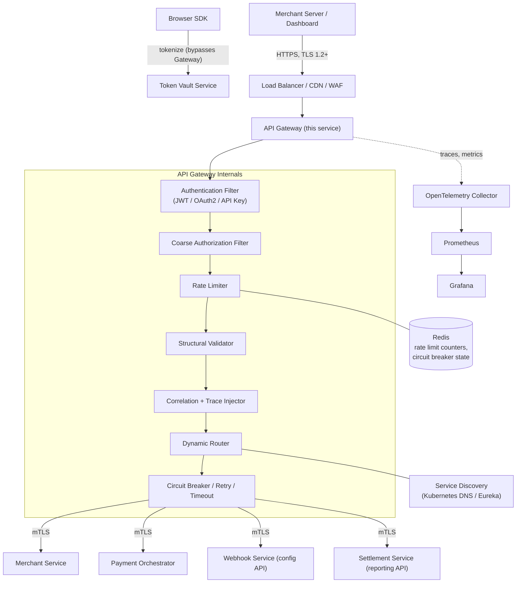
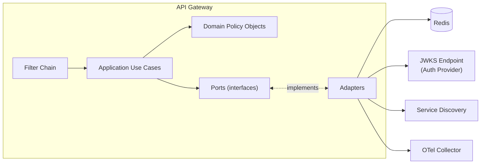
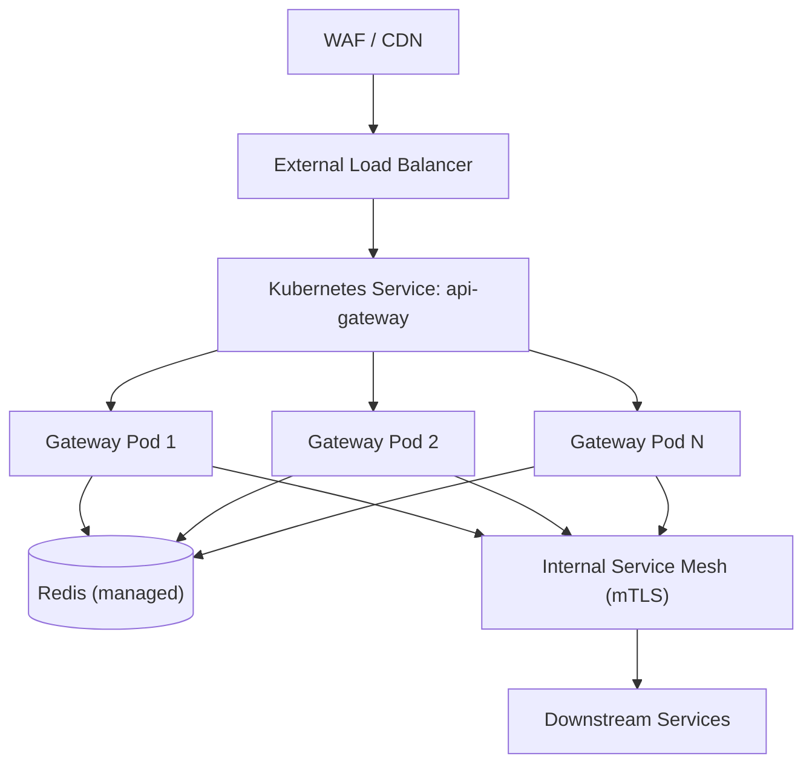
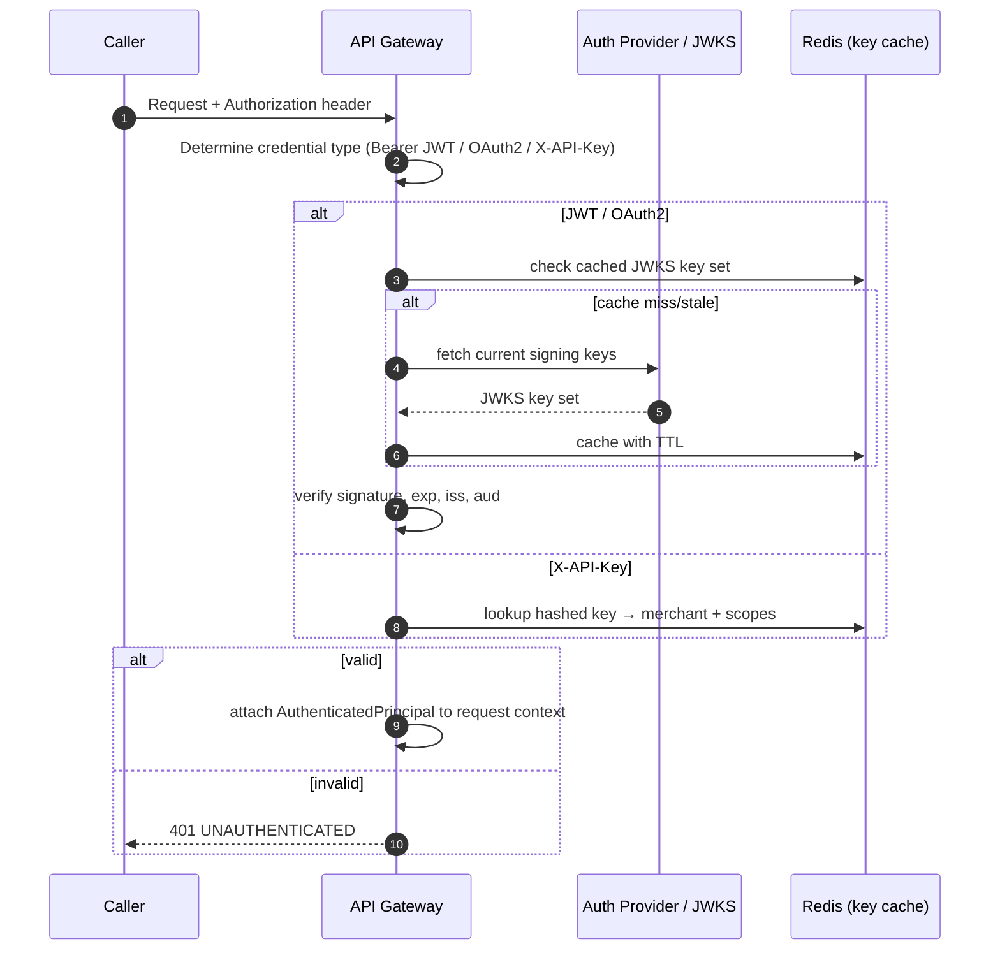
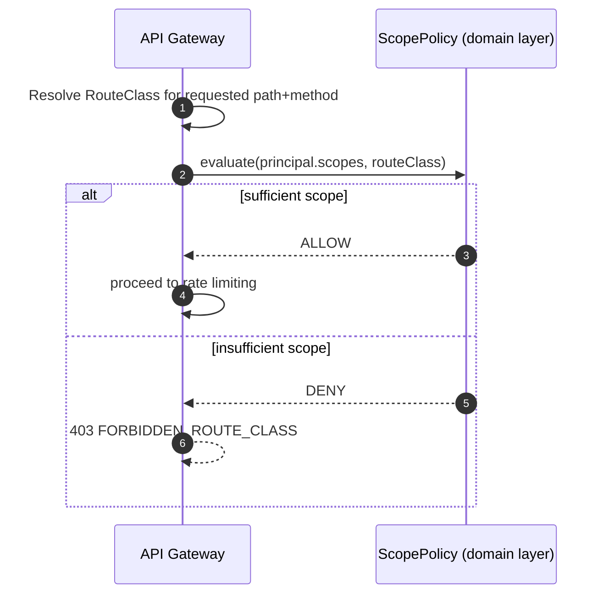
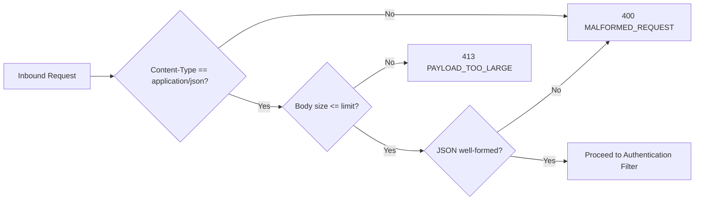
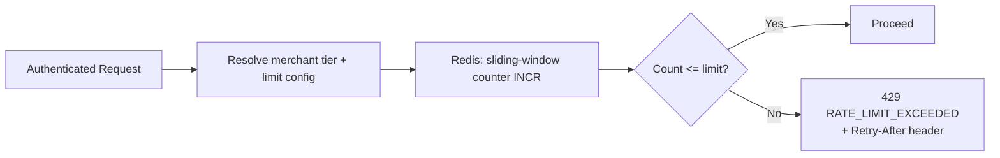
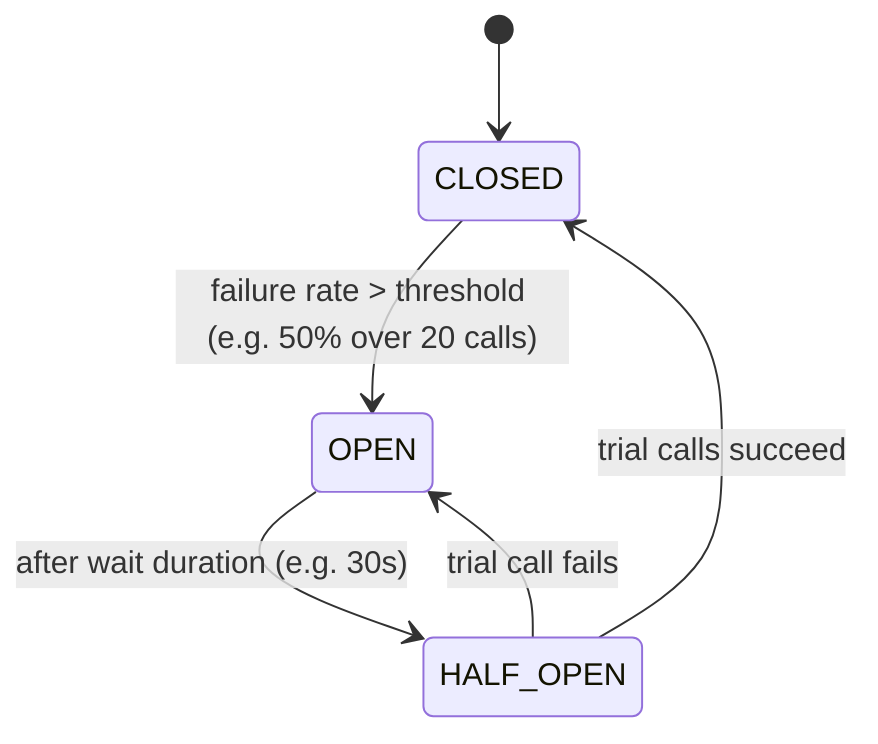
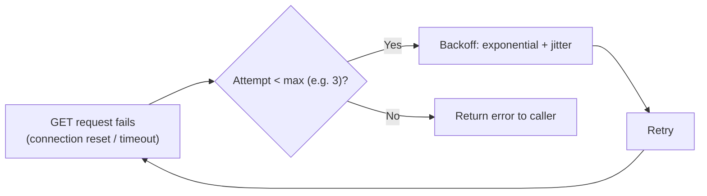
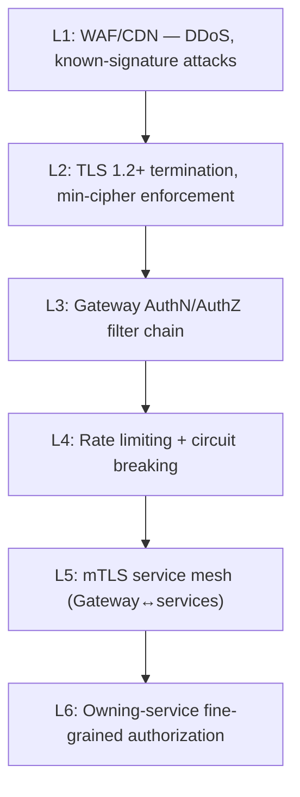

# API Gateway — Software Architecture Specification
## Part 1 of 4: Vision, Responsibilities, Requirements, Architecture

Document status: Draft for architecture review
Service: API Gateway
Platform: Distributed Payment Gateway (Stripe/Razorpay-class, sandbox/portfolio implementation, PCI-DSS-aligned — not certified)

---

# 1. Executive Summary

The API Gateway is the single ingress point for all external traffic entering the Distributed Payment Gateway platform. It is not a payment
service itself — it holds no payment domain logic, no ledger, no state machine — and its entire reason for existing is to make every downstream
service (Merchant Service, Token Vault Service, Payment Orchestrator Service, Acquiring Adapter Service, Webhook Service, Settlement Service)
safe to expose indirectly without each of them having to reimplement authentication, rate limiting, routing, and edge-level resilience.

Every request a merchant or the Browser SDK sends — whether it is a payment authorization, a webhook configuration change, or a settlement
status query — passes through this gateway first. This makes the Gateway the platform's primary blast-radius boundary: if it is compromised or
mis-configured, every downstream service is reachable; if it fails closed correctly, downstream services stay fully protected even during
an active attack or partial platform outage.

The Gateway is deliberately kept "thin" in business terms and "thick" in cross-cutting terms. It routes, authenticates, authorizes at a coarse
grain, rate-limits, validates request shape (not business rules), enforces idempotency-key presence, and produces the correlation/trace
context that every downstream service relies on for observability. It does not decide whether a payment should be approved, does not touch the
ledger, and does not know what a "capture" or "refund" means beyond the URL pattern used to reach that operation.

This document (Part 1 of 4) establishes what the Gateway is for, what it must never do, the requirements it must satisfy, and the architectural
shape — layers, packages, components — that the remaining three parts build on top of.

---

# 2. Service Purpose

The API Gateway exists to answer one question, cheaply and correctly,for every single inbound request before any business service is
touched: **"Is this request allowed to proceed, and if so, where does it go?"**

Concretely, its purpose is to:

- Terminate external TLS and re-establish internal mTLS to downstream
  services, so no service-to-service hop on the platform is ever
  plaintext.
- Authenticate the caller (merchant API key, OAuth2 client credentials,
  or end-user JWT depending on the calling context) before any
  downstream service is invoked.
- Apply coarse-grained authorization — "is this merchant allowed to hit
  this route at all" — leaving fine-grained, resource-level
  authorization (e.g. "does this merchant own this specific paymentId")
  to the owning service, which alone has the data to check it correctly.
- Enforce per-merchant and global rate limits before load reaches
  business services, protecting the Payment Orchestrator and Acquiring
  Adapter from both abusive and accidental traffic spikes.
- Apply structural request validation (well-formed JSON, required
  headers present, content-type correct, request size within bounds)
  before a request is forwarded, so malformed traffic is rejected at the
  edge rather than consuming compute in a downstream service.
- Establish and propagate correlation IDs, trace IDs, and idempotency
  keys consistently, so that every downstream service, and every log
  line and trace span produced by this request, can be tied back to one
  originating call.
- Provide circuit breaking and retry at the edge for transient
  downstream failures, so a struggling service degrades gracefully
  instead of cascading failure back to the caller as a hang.
- Route requests to the correct service and correct version of that
  service's API, supporting the platform's API versioning strategy
  without callers needing to know service topology.

The Gateway's purpose is explicitly **not** to implement payment
business logic, not to be a second source of truth for merchant data,
and not to make irreversible business decisions. It is a decision-maker
only about traffic — never about money.

---

# 3. Responsibilities

The Gateway owns the following responsibilities, and is the *only* place in the platform where each of them is enforced at the edge:

## 3.1 Traffic and Routing
- Dynamic routing of inbound requests to the correct backend service
  based on path, header, or version.
- API versioning resolution (URI-based, e.g. `/v1/payments`) and routing
  to the corresponding service version.
- Load balancing across healthy instances of each downstream service.
- Service discovery integration to resolve live, healthy backend
  instances rather than static addresses.

## 3.2 Security (Edge-Level)
- TLS termination at the edge; mTLS re-establishment for every
  gateway-to-service hop.
- JWT validation (signature, expiry, issuer, audience) for end-user and
  merchant-user-context tokens.
- OAuth2 client-credentials validation for machine-to-machine merchant
  API calls.
- API key validation for merchant server-to-server integrations that use
  static credentials rather than OAuth2.
- Coarse-grained authorization: does this authenticated principal have
  any right to call this route class at all (e.g. a read-only API key
  must never reach a mutating route).
- IP allow-listing where a merchant has opted into it.
- CORS policy enforcement for the Browser SDK's cross-origin calls.
- CSRF protection for any browser-originated state-changing request that
  relies on cookies (the platform primarily uses bearer tokens, but CSRF
  defenses remain mandatory wherever cookie-based session state exists).
- First line of DDoS mitigation (connection-level and request-rate
  based) ahead of upstream WAF/CDN protections.

## 3.3 Resilience
- Rate limiting per merchant, per API key, and globally.
- Circuit breaking per downstream route so one degraded service cannot
  exhaust Gateway threads or connections meant for others.
- Retry with bounded attempts and backoff for idempotent GET/read
  operations only — the Gateway never retries a non-idempotent
  financial mutation on the caller's behalf without a validated
  Idempotency-Key, and even then, retries at the edge are limited to
  connection-level failures, not business-level failures.
- Timeouts enforced per route, tuned to each downstream service's
  realistic latency budget.
- Bulkheading: isolated connection pools/thread pools per downstream
  service so a slow Acquiring Adapter cannot starve calls destined for
  Merchant Service.

## 3.4 Observability
- Correlation ID and trace ID generation (if absent) or propagation (if
  the caller supplied one).
- Structured access logging for every request/response, excluding all
  sensitive payload data.
- Metrics emission: request rate, error rate, latency percentiles, per
  route and per downstream service.
- Health, readiness, and liveness endpoints for its own orchestration by
  Kubernetes.

## 3.5 Contract Enforcement (Structural, Not Business)
- Enforcing required headers (`Authorization`, `Idempotency-Key` where
  mandated by route, `X-Correlation-Id` if supplied by caller,
  `Content-Type`).
- Enforcing request size limits and basic schema well-formedness.
- Enforcing API versioning rules and rejecting calls to
  retired/unsupported versions with a clear, standard error.

---

# 4. Non-Responsibilities

To keep the Gateway thin in the dimension that matters — business
correctness — it explicitly does **not**:

- Implement or validate payment business rules (authorization limits,
  refund eligibility, settlement calculations, state machine
  transitions). These live in the Payment Orchestrator.
- Store or process raw PAN, CVV, or any cardholder data in any form,
  even transiently. The Gateway never sees tokenized or raw card data —
  the Browser SDK talks to the Token Vault Service directly, bypassing
  the Gateway for tokenization specifically, exactly as defined in
  `SYSTEM_DESIGN.md`.
- Own a ledger, a payment table, or any financial system-of-record data.
  The Gateway is stateless with respect to business data; its only
  state is operational (rate-limit counters, circuit breaker state,
  route cache).
- Perform fine-grained authorization that requires business data (e.g.
  "does paymentId X belong to merchant Y") — this check happens in the
  owning service, which has the authoritative data.
- Guarantee exactly-once delivery to downstream services. The Gateway
  forwards each accepted request at-least-once at the transport level;
  idempotency correctness downstream is the receiving service's
  responsibility via its own Idempotency-Key handling, per
  `SYSTEM_DESIGN.md`.
- Publish or consume Kafka events. The Gateway is a synchronous,
  request/response component only; it has no producer or consumer role
  in `payment.events`, `ledger.events`, `webhook.events`, or
  `settlement.events`.
- Perform settlement, reconciliation, or webhook delivery. Those are
  Settlement Service and Webhook Service concerns entirely.
- Cache or serve business data as a read model. Any caching the Gateway
  performs is limited to routing/config/rate-limit metadata, never
  merchant or payment data.

---

# 5. Business Goals

| Goal | Why it matters | How the Gateway serves it |
|---|---|---|
| Protect platform availability | A payment platform's core value proposition is uptime; an outage directly stops merchants from getting paid | Rate limiting, circuit breaking, and bulkheading at the edge prevent one bad actor or one degraded service from taking down the platform |
| Minimize blast radius of credential compromise | Fortune-100-grade payment platforms are high-value attack targets | Centralized authn/authz means a leaked API key can be revoked and rate-limited in one place, not N places |
| Enable safe, fast merchant onboarding | Business growth depends on merchants integrating quickly and confidently | Consistent API versioning, clear error contracts, and predictable auth flows reduce integration friction |
| Support consistent observability across a distributed system | Debugging a distributed payment failure without correlation is operationally unworkable | Correlation ID / trace ID propagation from the very first hop |
| Enable independent scaling of business services | 10,000+ TPS targets require each service to scale on its own bottleneck | The Gateway isolates traffic per downstream service via bulkheads, so scaling one service doesn't require scaling all of them together |
| Reduce compliance surface area | PCI-DSS-aligned design reduces audit and remediation cost even without formal certification | The Gateway never touches cardholder data, keeping the certifiable surface area limited to the Token Vault Service |

---

# 6. Functional Requirements

## FR-1 Routing
FR-1.1 The Gateway shall route each request to exactly one downstream
service based on URI path prefix (e.g. `/v1/merchants/**` →
Merchant Service, `/v1/payments/**` → Payment Orchestrator).

FR-1.2 The Gateway shall support versioned routing, resolving
`/v1/**` vs `/v2/**` (or later versions) to the correct service
deployment independently per route.

FR-1.3 The Gateway shall resolve backend instances dynamically via
service discovery and shall never route to a statically configured,
unverified instance address.

FR-1.4 The Gateway shall reject requests to unknown or retired routes
with a standard 404/410 error body, never a raw framework stack trace.

## FR-2 Authentication
FR-2.1 The Gateway shall validate JWTs on every route that requires
end-user or merchant-user context, verifying signature, expiry,
issuer, and audience before forwarding the request.

FR-2.2 The Gateway shall validate OAuth2 client-credentials tokens for
machine-to-machine merchant integrations.

FR-2.3 The Gateway shall validate static API keys for merchant
server-to-server calls that do not use OAuth2, resolving the key to a
merchant identity and scope set.

FR-2.4 The Gateway shall reject any request with a missing, malformed,
expired, or otherwise invalid credential with a standard 401 response
before any downstream call is made.

## FR-3 Authorization
FR-3.1 The Gateway shall enforce route-class-level authorization (e.g.
a read-only scoped API key must never reach a route classified as
mutating).

FR-3.2 The Gateway shall attach the resolved principal's identity and
scopes to the downstream request context (via a signed internal header)
so the receiving service can perform fine-grained authorization without
re-validating the original credential.

FR-3.3 The Gateway shall never make a resource-ownership authorization
decision (e.g. "does merchant X own payment Y") since it does not have
access to that data; this is delegated to the owning service.

## FR-4 Idempotency
FR-4.1 The Gateway shall require an `Idempotency-Key` header on every
route classified as a financial mutation (payment creation, capture,
refund, cancellation) and shall reject requests missing it with a
standard 400 error.

FR-4.2 The Gateway shall forward the `Idempotency-Key` unmodified to
the downstream service; the Gateway itself does not perform idempotency
deduplication, since that requires business-transactional guarantees
that only the owning service's database can provide.

## FR-5 Rate Limiting
FR-5.1 The Gateway shall enforce a per-merchant rate limit, configurable
per merchant tier.

FR-5.2 The Gateway shall enforce a global rate limit as a platform-wide
circuit breaker of last resort.

FR-5.3 The Gateway shall return a standard 429 response with a
`Retry-After` header when a rate limit is exceeded.

## FR-6 Request Validation
FR-6.1 The Gateway shall reject requests exceeding a configured maximum
body size with a standard 413 response.

FR-6.2 The Gateway shall reject requests with malformed JSON or an
unsupported `Content-Type` with a standard 400 response before
forwarding.

FR-6.3 The Gateway shall not perform field-level business validation
(e.g. "amount must be positive") — this is the owning service's
responsibility, since it requires business context the Gateway does
not have.

## FR-7 Resilience
FR-7.1 The Gateway shall apply a circuit breaker per downstream service
route group, opening the circuit after a configured failure threshold
and shedding load with a standard 503 response while open.

FR-7.2 The Gateway shall apply a per-route timeout budget and return a
standard 504 response when a downstream call exceeds it.

FR-7.3 The Gateway shall retry only safe, idempotent read operations
(GET) on transient network-level failures, bounded to a small, fixed
number of attempts with exponential backoff, and shall never retry a
financial mutation automatically.

## FR-8 Observability
FR-8.1 The Gateway shall generate a correlation ID for any request that
does not supply one, and shall propagate a caller-supplied correlation
ID unchanged otherwise.

FR-8.2 The Gateway shall generate or continue a distributed trace
(OpenTelemetry) for every request, propagating trace context headers to
the downstream service.

FR-8.3 The Gateway shall emit structured access logs for every request
containing method, path, status, latency, correlation ID, and resolved
merchant identity — and shall never log Authorization header values,
API keys, JWTs, or any request/response body content.

## FR-9 Health
FR-9.1 The Gateway shall expose liveness and readiness endpoints
suitable for Kubernetes probes, independent of downstream service
health for liveness, and dependent on critical dependency
availability (e.g. Redis for rate limiting) for readiness.

FR-9.2 The Gateway shall support graceful shutdown, draining in-flight
requests before terminating on a scale-down or deployment event.

---

# 7. Non-Functional Requirements

## NFR-1 Performance
- The Gateway shall add no more than **5ms p50 / 15ms p99** of its own
  processing overhead per request, excluding downstream service latency.
- The Gateway shall sustain **10,000+ requests/sec** platform-wide
  aggregate throughput at the target production scale, horizontally
  scaled.

## NFR-2 Availability
- The Gateway shall be deployed with no single point of failure; target
  availability is **99.95%** monthly for the Gateway tier itself
  (independent of downstream service availability, which is tracked
  separately per service).

## NFR-3 Security
- All external traffic shall be TLS 1.2+ only; TLS 1.0/1.1 shall be
  rejected at the load balancer ahead of the Gateway.
- All Gateway-to-service traffic shall use mTLS with certificates
  rotated automatically via the platform's secret management system.
- No cardholder data (PAN, CVV) shall ever be logged, cached, or
  persisted by the Gateway under any circumstance.

## NFR-4 Scalability
- The Gateway shall scale horizontally with no shared mutable in-memory
  state; all shared state (rate limit counters, circuit breaker
  aggregate state where clustered) lives in Redis, not in-process.

## NFR-5 Observability
- 100% of requests shall produce a trace span and a structured log
  line; sampling (if applied at high volume) shall apply only to trace
  export, never to error-path logging, which is always fully retained.

## NFR-6 Maintainability
- Routing configuration shall be externalized (not hardcoded) so new
  routes or version changes do not require a full redeploy where
  feasible via configuration reload.

## NFR-7 Compliance
- The Gateway's design shall align with PCI-DSS requirements relevant
  to a component that is "in scope" only for network segmentation and
  access control purposes (it touches no cardholder data), without
  claiming formal certification.

---

# 8. Service Boundaries

The Gateway's boundary is defined by what crosses it and what
deliberately does not:

**Crosses the Gateway:**
- All external merchant API calls (REST) for Merchant Service, Payment
  Orchestrator, Webhook Service (config endpoints), and Settlement
  Service (reporting endpoints).
- All authenticated dashboard/admin traffic, if a merchant or internal
  dashboard exists.

**Does NOT cross the Gateway:**
- Browser SDK → Token Vault Service tokenization calls. This is a
  deliberate architectural exception: the SDK talks directly to the
  Token Vault Service over its own TLS endpoint so that raw card data
  never transits a shared, multi-tenant routing component, minimizing
  PCI scope. This exception is documented and treated as the single
  most security-sensitive routing decision in the platform — it must
  never be "simplified" by routing vault traffic through the Gateway
  for convenience.
- Service-to-service calls (e.g. Payment Orchestrator → Acquiring
  Adapter, Payment Orchestrator → Token Vault Service). These occur over
  the internal service mesh directly, not through the edge Gateway,
  since the Gateway's authentication model is built for external
  callers, not internal service identity (which uses mTLS + internal
  service tokens instead).
- Kafka producer/consumer traffic. The Gateway has no Kafka client role.
- Webhook delivery traffic (Webhook Service → merchant endpoints). This
  is outbound from the platform, not inbound through the Gateway.

---

# 9. High-Level Architecture



The Gateway is a single logical component deployed as multiple stateless
replicas behind the platform load balancer. It holds no business data
and no durable state of its own — Redis is the only external dependency
it treats as authoritative, and only for operational (not business)
concerns.

---

# 10. Low-Level Architecture

The Gateway processes every request through an ordered filter chain.
Order matters and is fixed, because each filter's correctness depends on
the previous one having already run:

1. **TLS termination** (handled by the ingress/load balancer layer, not
   application code, but the Gateway enforces minimum TLS version at
   its own listener as defense-in-depth).
2. **Correlation/Trace Context Filter** — establishes or continues
   correlation ID and trace context *first*, so that every subsequent
   filter's logs and rejections are already traceable.
3. **Structural Validation Filter** — rejects malformed requests
   (oversized body, bad `Content-Type`, malformed JSON) before spending
   any authentication effort on them.
4. **Authentication Filter** — validates JWT / OAuth2 token / API key,
   resolving a principal. Requests without a resolvable principal are
   rejected here.
5. **Coarse Authorization Filter** — checks the resolved principal's
   scopes against the route's required scope class.
6. **Rate Limiting Filter** — checks per-merchant and global limits
   using the resolved principal's identity (rate limiting after
   authentication ensures limits are applied per real identity, not
   per anonymous IP, except for a separate unauthenticated-traffic
   limiter that runs earlier for unauthenticated routes such as
   health checks or OAuth2 token issuance itself).
7. **Idempotency Header Enforcement Filter** — checks required headers
   are present for routes classified as mutating; does not perform
   deduplication itself.
8. **Dynamic Routing Resolution** — resolves the target service and
   instance via service discovery, applying version-based route
   selection.
9. **Resilience Wrapper** — wraps the outbound call in the route's
   configured circuit breaker, timeout, and (for safe methods only)
   retry policy.
10. **Response Mapping Filter** — normalizes downstream error responses
    into the platform's standard error model before returning to the
    caller, and strips any internal headers that should not leak
    externally.

This is implemented as a reactive, non-blocking filter chain (the
Gateway sits on the same non-blocking philosophy as the rest of the
platform) so that a slow downstream call never ties up a request-
handling thread while waiting.

---

# 11. Clean Architecture Layers

Although the Gateway is a routing/cross-cutting component rather than a
domain-rich service, it still follows Clean Architecture separation so
that its cross-cutting rules (auth, rate limiting, routing policy) are
testable independent of the underlying framework (Spring Cloud Gateway
or equivalent) and independent of Redis/service-discovery specifics.

**Domain Layer (innermost)**
Contains the Gateway's own "domain," which is *policy*, not payments:
route classification (mutating vs read), scope requirements per route
class, rate limit tiers, circuit breaker policy definitions. Pure Java,
no Spring/framework types.

**Application Layer**
Use cases such as "authenticate and authorize an inbound request,"
"resolve the route for a request," "apply rate limiting decision." These
orchestrate domain policy objects and call out to ports (interfaces)
for anything external (token validation service, rate limit store,
service discovery).

**Adapter Layer**
Implements the ports defined by the application layer: a Redis-backed
rate limit store adapter, a JWKS-based JWT validation adapter, a
Kubernetes-DNS-based service discovery adapter, an OpenTelemetry
tracing adapter.

**Framework/Infrastructure Layer (outermost)**
Spring Cloud Gateway (or the chosen reactive gateway framework) route
definitions, filter registration, configuration binding, actuator
endpoints, and the reactive HTTP server itself.

This layering means the routing/auth/rate-limit *policy* can be unit
tested with plain Java objects and fakes, while the framework wiring is
covered separately by integration tests (detailed in Part 4).

---

# 12. Package Structure

```
api-gateway/
└── src/main/java/.../gateway/
    ├── config/
    │   ├── GatewayRouteConfig.java        # static/documented route definitions
    │   ├── SecurityConfig.java
    │   ├── RateLimitConfig.java
    │   └── ResilienceConfig.java
    ├── domain/
    │   ├── route/
    │   │   ├── RouteClass.java            # sealed: READ, MUTATING, ADMIN
    │   │   └── RouteDefinition.java
    │   ├── policy/
    │   │   ├── ScopePolicy.java
    │   │   └── RateLimitPolicy.java
    │   └── principal/
    │       └── AuthenticatedPrincipal.java
    ├── application/
    │   ├── AuthenticateRequestUseCase.java
    │   ├── AuthorizeRequestUseCase.java
    │   ├── ResolveRouteUseCase.java
    │   └── ApplyRateLimitUseCase.java
    ├── port/
    │   ├── TokenValidationPort.java
    │   ├── RateLimitStorePort.java
    │   ├── ServiceDiscoveryPort.java
    │   └── TracingContextPort.java
    ├── adapter/
    │   ├── security/
    │   │   ├── JwtTokenValidationAdapter.java
    │   │   ├── OAuth2TokenValidationAdapter.java
    │   │   └── ApiKeyValidationAdapter.java
    │   ├── ratelimit/
    │   │   └── RedisRateLimitStoreAdapter.java
    │   ├── discovery/
    │   │   └── KubernetesServiceDiscoveryAdapter.java
    │   └── tracing/
    │       └── OtelTracingContextAdapter.java
    ├── filter/
    │   ├── CorrelationTraceFilter.java
    │   ├── StructuralValidationFilter.java
    │   ├── AuthenticationFilter.java
    │   ├── CoarseAuthorizationFilter.java
    │   ├── RateLimitFilter.java
    │   ├── IdempotencyHeaderFilter.java
    │   └── ResponseMappingFilter.java
    ├── error/
    │   ├── GatewayErrorModel.java
    │   └── GlobalErrorHandler.java
    ├── health/
    │   ├── LivenessIndicator.java
    │   └── ReadinessIndicator.java
    └── constant/
        └── HeaderNames.java
```

Note: `service/`, `controller/`, `repository/`, `entity/` from the
platform's standard package shape are intentionally thin-to-absent here
— the Gateway has no persistence layer and no traditional REST
controllers of its own (it is a routing layer, not a resource server),
so `filter/`, `adapter/`, and `port/` take their place as the
dominant packages. This deviation from the standard shape is deliberate
and should be called out in an ADR referencing this document.

---

# 13. Component Diagram



---

# 14. Deployment Diagram (Architectural View)

A full Kubernetes/Helm deployment specification belongs in Part 3
(Scaling, Performance, Deployment); at the architectural level, the
Gateway is characterized as:

- A stateless Deployment with multiple replicas, fronted by a
  Kubernetes Service and an external Ingress/Load Balancer/WAF.
- No persistent volumes; Redis is an external managed dependency, not
  co-located storage.
- Configuration (routes, rate limit tiers, scope policies) supplied via
  ConfigMap/externalized configuration, with secrets (mTLS certs,
  OAuth2/JWT signing keys or JWKS endpoint URLs) supplied via the
  platform Secret Manager abstraction, never baked into the image.
- Each replica is fully interchangeable; a request may land on any
  replica with identical behavior because all shared state lives in
  Redis, not in-process memory.



---

# 15. Dependency Matrix

| Dependency | Type | Criticality | Failure Behavior |
|---|---|---|---|
| Redis | External, shared | Critical for rate limiting and clustered circuit-breaker state | Readiness probe fails if Redis is unreachable beyond a short grace period; Gateway degrades to a conservative local-only rate limit as a fallback rather than allowing unlimited traffic |
| Service Discovery (Kubernetes DNS / registry) | External, platform | Critical for routing | If discovery is unavailable, Gateway serves from last-known-good cached route table for a bounded staleness window, then fails readiness |
| Auth Provider / JWKS endpoint | External | Critical for JWT validation | JWKS keys are cached with a refresh interval; a transient JWKS outage does not immediately break validation, but prolonged unavailability of new keys will eventually reject newly-issued tokens using unrecognized key IDs |
| OpenTelemetry Collector | External, observability | Non-critical to request serving | If unreachable, tracing/metrics export is buffered/dropped; request serving continues unaffected |
| Downstream services (Merchant, Orchestrator, Webhook, Settlement) | Internal | Critical per-route | Isolated per-service circuit breaker/bulkhead ensures one downstream outage does not affect routes to healthy services |

---

# 16. External Systems

- **CDN / WAF provider** — sits ahead of the Gateway; the Gateway trusts
  and consumes forwarded headers (`X-Forwarded-For`, WAF verdict
  headers) from this layer, but does not depend on its internal
  implementation.
- **Identity Provider (OAuth2/OIDC)** — issues merchant machine tokens
  and/or end-user tokens; the Gateway is a resource-server/relying party
  only, never an identity provider itself.
- **Kubernetes control plane** — source of truth for service discovery
  and pod health, consulted via standard Kubernetes DNS/service
  abstractions rather than a bespoke registry.
- **Secret Manager** — supplies mTLS certificates, JWT signing/JWKS
  configuration, and API key hashing secrets; the Gateway never stores
  these as plaintext configuration.

---

*End of Part 1. Part 2 will cover API Contracts, Routing, Authentication
and Security in full detail, building directly on the responsibilities,
requirements, and architecture established here.*

# API Gateway — Software Architecture Specification
## Part 2 of 4: API Contracts, Routing, Authentication, Security

---

# 17. API Contracts

## 17.1 URI Standards
- Base pattern: `https://api.{platform-domain}/{version}/{resource}`
- Resources are plural nouns: `/v1/payments`, `/v1/merchants`, `/v1/webhooks`, `/v1/settlements`.
- Sub-resources nest one level max: `/v1/payments/{paymentId}/refunds`.
- No verbs in URIs (`/v1/payments/{id}/capture` is the one accepted exception, modeled as a resource-state-transition endpoint, not an RPC-style verb proliferation — capture/cancel/refund are the only such transition endpoints permitted, mirroring the payment state machine).
- Path parameters are UUIDs or platform-issued IDs only, never sequential integers (enumeration resistance).
- Query parameters used only for filtering/pagination/sorting on read (GET) endpoints — never for routing decisions.

## 17.2 HTTP Method Semantics
| Method | Usage | Idempotent | Gateway Retry Eligible |
|---|---|---|---|
| GET | Read resource/collection | Yes | Yes (bounded) |
| POST | Create resource / trigger state transition (capture, refund) | No (unless Idempotency-Key honored downstream) | No |
| PUT | Full replace (rare in this platform — used for merchant config) | Yes | No (edge never assumes downstream idempotency) |
| PATCH | Partial update (webhook config, merchant profile) | No | No |
| DELETE | Deactivate resource (e.g. revoke API key) | Yes | No |

## 17.3 Header Standards
| Header | Direction | Required | Notes |
|---|---|---|---|
| `Authorization: Bearer {token}` | Inbound | Yes (except public/health routes) | JWT or OAuth2 token |
| `X-API-Key` | Inbound | Conditional | Alternative to Bearer for server-to-server static-key merchants |
| `Idempotency-Key` | Inbound | Yes on MUTATING routes | UUID, forwarded unmodified |
| `X-Correlation-Id` | Inbound/Outbound | Optional inbound, always set outbound | Gateway generates if absent |
| `traceparent` / `tracestate` (W3C Trace Context) | Inbound/Outbound | Always outbound | OTel propagation |
| `X-Merchant-Id` (internal, signed) | Outbound only (Gateway→service) | Always | Gateway-attested principal identity; downstream trusts only via mTLS channel |
| `X-Api-Version` | Outbound (response) | Always | Echoes resolved version |
| `Content-Type: application/json` | Both | Yes on bodies | Others rejected at Structural Validation Filter |
| `Retry-After` | Outbound | On 429/503 | Seconds until safe retry |

## 17.4 API Versioning
- URI-based versioning (`/v1`, `/v2`) — chosen over header-based versioning for cache-ability, debuggability, and explicitness in logs/traces.
- Each version maps to a distinct upstream service deployment (or the same deployment serving multiple contract versions where backward compatible).
- Deprecation lifecycle: `Active → Deprecated (Sunset header emitted) → Retired (410 Gone)`. Minimum deprecation window: 180 days, per merchant-integration-stability business goal.
- Breaking changes mandate a new major version; additive changes (new optional fields) do not.

## 17.5 Standard Error Model
```json
{
  "error": {
    "code": "RATE_LIMIT_EXCEEDED",
    "message": "Request rate limit exceeded for this merchant.",
    "correlationId": "c7e1...-uuid",
    "timestamp": "2026-07-22T10:15:30Z",
    "details": []
  }
}
```
- `code` is a stable machine-readable enum — never a raw HTTP reason phrase.
- `message` is human-readable, safe to display, never includes stack traces or internal identifiers.
- `details` is an optional array of field-level structural issues (populated only for 400-class validation errors raised by the Gateway itself).

## 17.6 Error Codes (Gateway-Originated Only)
| Code | HTTP Status | Trigger |
|---|---|---|
| `UNAUTHENTICATED` | 401 | Missing/invalid/expired credential |
| `FORBIDDEN_ROUTE_CLASS` | 403 | Principal scope insufficient for route class |
| `MISSING_IDEMPOTENCY_KEY` | 400 | Mutating route without required header |
| `MALFORMED_REQUEST` | 400 | Invalid JSON / wrong Content-Type |
| `PAYLOAD_TOO_LARGE` | 413 | Body exceeds configured limit |
| `ROUTE_NOT_FOUND` | 404 | No matching route |
| `VERSION_RETIRED` | 410 | Sunset API version called |
| `RATE_LIMIT_EXCEEDED` | 429 | Per-merchant/global limit breached |
| `DOWNSTREAM_TIMEOUT` | 504 | Route timeout budget exceeded |
| `DOWNSTREAM_UNAVAILABLE` | 503 | Circuit breaker open |

Gateway never forwards or reformats downstream services' own domain error codes (e.g. `INSUFFICIENT_FUNDS`) — those pass through unmodified as the owning service's contract, ensuring the Gateway does not become a second source of truth for business error semantics.

## 17.7 Exception Mapping
- Gateway-originated exceptions → `GlobalErrorHandler` → standard error model above.
- Downstream 5xx responses → passed through unless the circuit breaker/timeout intercepted first, in which case Gateway substitutes `DOWNSTREAM_UNAVAILABLE`/`DOWNSTREAM_TIMEOUT`.
- Downstream 4xx responses → passed through verbatim; Gateway does not reinterpret business validation errors.

---

# 18. Routing

## 18.1 Static Route Table (illustrative)
| Path Prefix | Target Service | Route Class |
|---|---|---|
| `/v1/merchants/**` | Merchant Service | MUTATING / READ (method-dependent) |
| `/v1/payments/**` | Payment Orchestrator | MUTATING / READ |
| `/v1/payments/{id}/capture` | Payment Orchestrator | MUTATING |
| `/v1/payments/{id}/refunds` | Payment Orchestrator | MUTATING |
| `/v1/webhooks/**` | Webhook Service | MUTATING / READ |
| `/v1/settlements/**` | Settlement Service | READ |
| `/v1/oauth/token` | Identity Provider (proxied) | PUBLIC |
| `/actuator/health/**` | Self (Gateway) | PUBLIC |

## 18.2 Dynamic Routing Resolution
- Route table resolved from externalized config (ConfigMap or config-server), hot-reloadable without redeploy.
- Backend instance resolution via Service Discovery port (Kubernetes DNS-based `Service` abstraction) — Gateway never load-balances against a hardcoded IP list.
- Header-based canary override supported (`X-Route-Variant`) for internal blue/green or canary testing only — never merchant-controllable.

## 18.3 Service Discovery
- Kubernetes-native: Gateway resolves `http://{service-name}.{namespace}.svc.cluster.local` via cluster DNS; readiness gates ensure only Ready pods receive traffic.
- Discovery failure fallback: last-known-good route cache held in-memory per replica, bounded TTL (e.g. 30s staleness ceiling) before failing readiness.

## 18.4 Load Balancing
- Client-side load balancing at the reactive HTTP client layer (round-robin default, latency-aware optional) across resolved healthy instances.
- No sticky sessions — every downstream call is stateless; session affinity is never required since business state lives in each service's own store, not in Gateway-held session data.

---

# 19. Authentication Flow



- JWT validation: RS256/ES256 only (no symmetric HS256 accepted from external callers — prevents key-confusion attacks); signature, `exp`, `nbf`, `iss`, `aud` all mandatory checks.
- OAuth2 client-credentials tokens validated identically to JWTs once issued (platform Identity Provider issues JWT-format access tokens).
- API keys are never stored or compared in plaintext — Gateway stores/compares a salted hash (Redis-cached) resolved from Merchant Service's credential store at issuance time, refreshed on revocation events.
- Zero downstream service ever re-validates the original external credential; they trust `X-Merchant-Id`/principal headers solely because the hop arrives over authenticated mTLS from the Gateway, closing the trust boundary at exactly one point.

---

# 20. Authorization Flow



- Coarse-grained only: `READ`, `MUTATING`, `ADMIN` route classes checked against principal scopes (`payments:read`, `payments:write`, `merchant:admin`, etc.).
- Fine-grained ownership checks (does this API key's merchant own this specific `paymentId`) are explicitly out of scope here — delegated downstream per Non-Responsibilities (Part 1, §4).

---

# 21. Request Validation Flow



Structural validation only — no field-level/business-rule validation (e.g. amount bounds) is performed at the Gateway, consistent with Non-Responsibilities.

---

# 22. Rate Limiting Flow



- Algorithm: sliding-window counter in Redis (Lua script for atomic check-and-increment), chosen over fixed-window for burst-smoothing without token-bucket's added client-side complexity.
- Two tiers evaluated: per-merchant (business tier-configured) and global platform ceiling (last line of defense, protects shared downstream capacity).
- Unauthenticated routes (health, OAuth2 token issuance) rate-limited by IP with a much stricter ceiling, evaluated before the Authentication Filter.

---

# 23. Circuit Breaker Flow



- One circuit breaker instance per downstream service route group (Merchant, Orchestrator, Webhook, Settlement) — isolation ensures Orchestrator degradation never opens the Merchant Service circuit.
- OPEN state short-circuits immediately with `503 DOWNSTREAM_UNAVAILABLE`, avoiding wasted connection attempts against a known-failing dependency.
- Circuit state shared across replicas via Redis-backed metrics aggregation (or eventually-consistent per-replica state as an acceptable simplification — documented tradeoff: per-replica state trips slightly later platform-wide but avoids a Redis round-trip on every call's success/failure recording).

---

# 24. Retry Flow



- Retry eligibility: GET only, and only for connection-level failures (reset, timeout before any response received) — never for a received 4xx/5xx business response.
- Max 3 attempts, exponential backoff with jitter (base 100ms, cap 1s), bounded by the route's overall timeout budget so retries never silently extend caller-perceived latency past the documented SLA.
- POST/PUT/PATCH/DELETE are never retried by the Gateway under any failure mode — this is a hard rule protecting financial mutation safety, reinforcing that Idempotency-Key correctness is the receiving service's job, not a Gateway-side safety net.

---

# 25. Security Architecture

## 25.1 Defense-in-Depth Layering


## 25.2 JWT Validation (detail)
- Algorithms allow-listed: RS256, ES256. Algorithm confusion attacks mitigated by never trusting the `alg` header alone — verification library configured with the expected algorithm set explicitly.
- Key rotation via JWKS `kid` header lookup; Gateway caches keyset with short TTL (e.g. 15 min) plus immediate refresh-on-miss for a `kid` not yet cached.
- Clock skew tolerance: ±60s on `exp`/`nbf`.

## 25.3 OAuth2 Flow
- Client-credentials grant only (machine-to-machine); no authorization-code/implicit flows needed since there is no third-party end-user consent screen in this platform's merchant-integration model.
- Token introspection avoided in the hot path — Gateway validates self-contained JWT access tokens locally (signature + claims) rather than calling the Identity Provider per request, preserving the NFR-1 latency budget.

## 25.4 mTLS
- Every Gateway→service hop requires mutual certificate authentication; service mesh (e.g. Istio/Linkerd-class sidecar or Spring-native mTLS config) issues short-lived certs per pod identity.
- Certificate rotation automated via the platform Secret Manager; no long-lived static certs.

## 25.5 IP Allow-listing
- Optional, opt-in, per-merchant, evaluated at the Coarse Authorization stage after identity resolution (not before — an IP-based pre-filter without identity would be trivially bypassable via header spoofing at L1, whereas identity-then-IP-check binds the restriction to a specific credential).

## 25.6 WAF Integration
- Gateway trusts WAF-verdict headers only when the request's source IP matches the platform's WAF/CDN's published IP ranges — prevents verdict-header spoofing by a caller connecting directly to the Gateway's origin.

## 25.7 DDoS Protection
- L1 (WAF/CDN) absorbs volumetric attacks; Gateway's own rate limiter is the second layer, tuned for application-layer (slow-loris-style, credential-stuffing-style) abuse that a generic WAF signature won't catch.

## 25.8 CORS Strategy
- Allow-list of merchant-registered origins only (no wildcard `*` for any route accepting credentials); preflight `OPTIONS` handled at the Gateway before the filter chain's auth stage (preflight carries no credentials).

## 25.9 CSRF Strategy
- Primary API surface uses bearer tokens (not cookies), which are inherently CSRF-resistant; CSRF tokens (double-submit cookie pattern) required only on any browser-session/cookie-based dashboard routes, kept architecturally separate from the merchant API surface.

## 25.10 TLS Strategy
- TLS 1.2 minimum, TLS 1.3 preferred; strong cipher suites only (AEAD ciphers, no CBC/RC4); HSTS enforced on all external responses.

## 25.11 Secret Management
- All credentials (mTLS certs, JWKS config, API-key hashing pepper) sourced from the platform Secret Manager abstraction at startup and on rotation events — never baked into images or plaintext ConfigMaps.

## 25.12 API Key Validation
- Keys generated with high entropy (≥256-bit), stored downstream (Merchant Service) as salted hashes; Gateway receives only a Redis-cached hash-lookup result, never the Merchant Service's raw credential store.

# API Gateway — Software Architecture Specification
## Part 3 of 4: Observability, Scaling, Performance, Deployment

---

# 26. Request Context, Correlation IDs, Trace IDs

- `X-Correlation-Id`: business-level identifier tying every log/event/webhook back to one originating caller request. Generated (UUIDv4) if absent inbound; propagated verbatim otherwise. Persisted by every downstream service in its own logs and outbox events.
- Trace ID / Span ID: W3C Trace Context (`traceparent`, `tracestate`) generated/continued independently of correlation ID — trace ID is infrastructure-level (OTel), correlation ID is business-level (appears in merchant-facing error bodies and support tooling); the two are linked via a shared attribute on the root span but serve different audiences.
- Request Context object built once at the Correlation/Trace filter stage, immutable, carried through the reactive context (`Reactor Context`, not `ThreadLocal`, since the chain is non-blocking) for the remainder of the filter chain.

---

# 27. OpenTelemetry Strategy

- Auto-instrumentation for the reactive HTTP server/client layer (inbound spans + outbound spans per downstream call).
- Span attributes: `merchant.id`, `route.class`, `api.version`, `http.status_code`, `correlation.id` — never request/response body content, never Authorization header values.
- Context propagation: `traceparent` injected on every outbound call to downstream services; downstream services continue the same trace, giving one end-to-end trace per merchant request across all 6 services.
- Sampling: head-based sampling at a configurable rate for successful (2xx) traces to control export volume; **100% retention for any span ending in 4xx/5xx** — errors are never sampled out.
- Exporter: OTLP to the platform's OpenTelemetry Collector, decoupling the Gateway from any specific backend (Grafana Tempo, Jaeger, etc.).

---

# 28. Logging Standards

- Structured JSON logs only (no plain-text log lines) — fields: `timestamp (UTC)`, `level`, `correlationId`, `traceId`, `route`, `method`, `status`, `latencyMs`, `merchantId` (if resolved), `errorCode` (if applicable).
- Never logged: `Authorization` header, `X-API-Key` value, JWT contents, full request/response bodies, any cardholder-adjacent field even if it should never appear here (defense-in-depth log-scrubbing filter runs regardless).
- Log levels: `INFO` for every request's access log line; `WARN` for 4xx; `ERROR` for 5xx and circuit-breaker state transitions; `DEBUG` disabled by default in production, enabled per-instance only via runtime flag for incident triage.
- Access logs and application logs are separate streams to avoid noise drowning out business-relevant error diagnostics.

---

# 29. Metrics

| Metric | Type | Labels |
|---|---|---|
| `gateway_requests_total` | Counter | route, method, status, merchantTier |
| `gateway_request_duration_seconds` | Histogram | route, method |
| `gateway_downstream_duration_seconds` | Histogram | targetService |
| `gateway_rate_limit_rejections_total` | Counter | merchantId, limitType (per-merchant/global) |
| `gateway_circuit_breaker_state` | Gauge (0/1/2 = closed/open/half-open) | targetService |
| `gateway_auth_failures_total` | Counter | reason (expired/invalid-sig/missing) |
| `gateway_active_connections` | Gauge | — |

- Emitted via Micrometer, scraped by Prometheus at a 15s interval; all histograms use native Prometheus buckets tuned around the NFR-1 latency budget (5ms/15ms boundaries represented explicitly as bucket edges).

---

# 30. Health Checks, Readiness, Liveness

- **Liveness**: process is up and the reactive event loop is not deadlocked; independent of any external dependency — a Redis outage must never fail liveness (that would cause Kubernetes to kill and restart healthy pods during a Redis blip, worsening the incident).
- **Readiness**: liveness conditions **and** Redis reachable **and** route table successfully loaded (fresh or within staleness ceiling). A pod failing readiness is removed from the Service load-balancer pool but not restarted.
- Both exposed as standard Spring Actuator-style endpoints (`/actuator/health/liveness`, `/actuator/health/readiness`), consumed directly by Kubernetes probes.

---

# 31. Graceful Shutdown

- On `SIGTERM` (Kubernetes pod termination): stop accepting new connections immediately, continue draining in-flight requests up to a bounded grace period (e.g. 20s, tuned below Kubernetes' `terminationGracePeriodSeconds`), then force-close remaining connections and exit.
- Readiness flips to `false` the instant `SIGTERM` is received (before drain completes), so the Service removes the pod from rotation immediately while it finishes existing work — this ordering (readiness-false before drain-complete) is what prevents new traffic from landing on a pod that is already shutting down.

---

# 32. Redis Usage

## 32.1 Redis Key Design
| Key Pattern | Purpose | TTL |
|---|---|---|
| `ratelimit:merchant:{merchantId}:{window}` | Sliding-window request counter | Window length + buffer |
| `ratelimit:global:{window}` | Platform-wide ceiling counter | Window length + buffer |
| `apikey:hash:{sha256(apiKey)}` | Resolved merchant identity + scopes | Cache TTL, invalidated on revocation event |
| `jwks:keyset:{issuer}` | Cached JWKS public keys | 15 min |
| `circuitbreaker:state:{targetService}` | Aggregate open/closed signal (if clustered CB state chosen) | Rolling |

## 32.2 Cache Strategy
- Redis used exclusively for **operational** state — never business/domain data — reinforcing the Non-Responsibilities boundary from Part 1.
- Read-through caching for JWKS and API-key-hash lookups; write-through invalidation for API-key revocation (Merchant Service publishes a revocation signal the Gateway's adapter consumes to evict, or, simpler, a short TTL bounds staleness without requiring an invalidation channel — the latter is the default unless revocation latency requirements demand the former).

## 32.3 Cache Invalidation
- TTL-based expiry is the default and sufficient mechanism given the short TTLs chosen; explicit invalidation is a documented enhancement (Part 3 §41 Future Enhancements references this), not a Phase-1 requirement.

---

# 33. Configuration

## 33.1 Environment Variables (representative, non-secret)
```
GATEWAY_PORT
GATEWAY_RATE_LIMIT_DEFAULT_TIER
GATEWAY_ROUTE_CONFIG_SOURCE
GATEWAY_CB_FAILURE_THRESHOLD
GATEWAY_CB_WAIT_DURATION_MS
GATEWAY_TIMEOUT_DEFAULT_MS
GATEWAY_MAX_BODY_SIZE_BYTES
REDIS_HOST
REDIS_PORT
JWKS_ISSUER_URI
OTEL_EXPORTER_OTLP_ENDPOINT
```
Secrets (mTLS material, API-key hashing pepper, JWKS client credentials if any) are never environment variables in plaintext — sourced at runtime from the Secret Manager abstraction and mounted/injected accordingly.

## 33.2 Feature Flags
- `feature.rate-limit.global-ceiling.enabled`
- `feature.retry.get-requests.enabled`
- `feature.canary-routing.enabled`
- Flags evaluated per-request from a fast in-memory flag cache refreshed from the flag provider on an interval, never a per-request remote call (latency budget protection).

---

# 34. Horizontal Scaling & Autoscaling

- Stateless replica set; horizontal scaling is the only scaling dimension used (no vertical scaling reliance).
- Kubernetes HPA driven by **CPU utilization** as the primary signal and **`gateway_active_connections`/request-rate** as a secondary custom-metric signal (via Prometheus Adapter), since a reactive event loop can show low CPU while still approaching connection-handling limits.
- Scale-out target: maintain p99 latency within NFR-1 budget under load; scale-in cooldown longer than scale-out cooldown to avoid flapping during bursty payment traffic (e.g. flash-sale-style merchant spikes).

---

# 35. Kubernetes / Docker / Helm (Architectural View)

- Packaged as a single container image per release, no embedded config baked in (config/secrets externalized per §33).
- Helm chart parameterizes: replica count bounds, resource requests/limits, route-config ConfigMap reference, HPA thresholds, PodDisruptionBudget (minimum available replicas during voluntary disruption/rolling upgrade).
- `PodDisruptionBudget` and `topologySpreadConstraints` ensure replicas are spread across nodes/zones — no zone is a single point of failure for the Gateway tier, supporting the NFR-2 99.95% availability target.

---

# 36. Resource Limits, Connection Pooling, Thread Pools

- Reactive, event-loop-based server (Netty-class) — thread pool sizing follows the "small, fixed event-loop thread count (≈ CPU cores)" reactive pattern, not a large blocking thread-per-request pool.
- Per-downstream-service connection pool sized and **isolated** (bulkhead) so Acquiring Adapter connection exhaustion cannot starve Merchant Service calls — each pool has its own max-connections, max-pending-acquire, and acquire-timeout configuration.
- Container resource requests/limits set with request ≈ steady-state observed usage and limit providing headroom for burst, avoiding both OOM-kill risk and wasteful over-provisioning.

---

# 37. Load Balancing (Infrastructure Level)

- External: Layer 7 load balancer/ingress distributes across Gateway replicas (round-robin or least-connections).
- Internal (Gateway→services): client-side load balancing at the Gateway's reactive HTTP client, informed by Service Discovery's live healthy-instance list (§18.3), independent of the external LB tier.

---

# 38. Performance Optimization

- Non-blocking I/O end-to-end (no blocking calls anywhere in the filter chain, including JWKS/Redis clients, which must be reactive clients, not blocking ones wrapped in a scheduler — a blocking call here silently reintroduces thread starvation risk under load).
- JWKS and route-table lookups served from in-memory cache on the hot path; no per-request remote calls for anything cacheable.
- Response mapping avoids unnecessary body buffering/deserialization — the Gateway streams proxied response bodies through rather than fully materializing them in memory where the payload is large (report/export endpoints).

---

# 39. Capacity Planning

- Baseline: NFR-1 target of 10,000+ req/sec platform aggregate; Gateway tier capacity planned with headroom above this (e.g. provisioned for 1.5–2x expected peak) given it is the single ingress chokepoint.
- Per-replica capacity benchmarked (Part 4 Performance Testing) to derive the HPA scaling curve rather than assumed — capacity claims are only finalized after the load tests specified in Part 4.
- Downstream bulkhead pool sizes derived from each downstream service's own documented capacity (its own SYSTEM_DESIGN/spec), not sized independently by the Gateway team in isolation.

---

# 40. Database Interaction

None. The Gateway holds no database of its own — its only persistent-adjacent dependency is Redis, which is explicitly operational-cache state, not a system of record. This is intentional and reinforces the stateless-replica scaling model in §34.

---

# 41. Deployment Strategy Considerations (Scaling-Relevant)

- Rolling updates are the default deployment mode for routine releases, `maxUnavailable=0` / `maxSurge=1` tuned to guarantee capacity never dips during a release, given the Gateway is the platform's single ingress point.
- Canary and Blue-Green strategies are covered in full in Part 4 (Deployment Strategy) alongside their rollback runbooks; this section notes only the scaling implication — canary replicas are sized and HPA-scoped identically to the stable pool so a canary slice receiving its traffic share does not itself become a bottleneck skewing the comparison.

# API Gateway — Software Architecture Specification
## Part 4 of 4: Testing, Operations, Runbooks, Production Readiness

---

# 42. Testing Strategy

## 42.1 Unit Tests
- Scope: domain layer (`RouteClass`, `ScopePolicy`, `RateLimitPolicy`) and application use cases, tested with plain Java against fake port implementations — no Spring context, no Redis, no network.
- Coverage targets: 100% of domain policy branches (scope evaluation, route classification), since these are pure decision logic with no excuse for untested edge cases.
- Example cases: expired-token rejection, algorithm-mismatch rejection, scope-insufficient-for-route-class, missing-Idempotency-Key-on-mutating-route, malformed-JSON rejection before auth is attempted.

## 42.2 Integration Tests
- Scope: adapter layer against real dependencies via Testcontainers — real Redis container for rate-limit/circuit-breaker state, WireMock for JWKS endpoint and downstream service stubs.
- Verifies: filter chain ordering end-to-end (structural validation → auth → authz → rate limit → idempotency header check → routing → resilience wrapper → response mapping) produces correct status codes at each rejection point.
- Verifies: correlation ID propagation and trace context injection appear correctly on both the response and the simulated downstream call.

## 42.3 Contract Tests
- Consumer-driven contracts (e.g. Pact) between the Gateway and each downstream service's routing expectations — ensures a downstream service's API version change is caught before it silently breaks Gateway routing.
- Contract tests also pin the **standard error model** shape (§17.5) so a refactor cannot accidentally change the merchant-facing error contract.

## 42.4 Performance Tests
- Tooling: Gatling or k6, executed against a staging deployment sized identically to a single production replica, then against the full HPA-scaled tier.
- Scenarios: sustained load at target TPS share, burst/spike load (flash-sale simulation), soak test (multi-hour steady load to catch memory/connection leaks a short test would miss).
- Every published latency/throughput number (including any "10,000 TPS" claim at the platform level) must trace to a committed load-test report with methodology, environment spec, and raw results — never an assumed or extrapolated figure.

## 42.5 Chaos Tests
- Inject: downstream service latency spikes, downstream service hard-down, Redis unavailability, JWKS endpoint unavailability, network partition between Gateway and one downstream service.
- Assert: circuit breaker opens within expected failure-threshold window; bulkhead isolation confirmed (unaffected services keep serving); readiness correctly reflects Redis-down state; no thread/connection exhaustion cascades from one degraded dependency into unrelated routes.

## 42.6 Security Tests
- JWT algorithm-confusion attempts (`alg: none`, HS256-signed-with-public-key attempts) rejected.
- Expired/not-yet-valid token rejection at boundary conditions (±1s around `exp`/`nbf`).
- CORS preflight rejection for non-allow-listed origins.
- Rate-limit bypass attempts (header spoofing of merchant identity, IP rotation) confirmed ineffective since limits key off authenticated principal, not caller-supplied identifiers.
- WAF-verdict-header spoofing from a non-WAF source IP confirmed rejected (§25.6).

## 42.7 Penetration Tests
- Scheduled, scoped penetration test against the Gateway's external attack surface prior to each major version release and at a minimum annual cadence.
- Scope explicitly includes: TLS configuration (cipher/version downgrade attempts), authentication bypass attempts, rate-limit and circuit-breaker evasion, header-injection/smuggling attempts (HTTP request smuggling between Gateway and downstream mTLS hop).
- Findings tracked to remediation with severity-based SLAs (Critical: 7 days, High: 30 days) before the next release is considered production-ready.

---

# 43. Production Readiness Checklist

- [ ] All Functional and Non-Functional Requirements (Part 1 §6–7) verified against automated tests, not manual inspection.
- [ ] Liveness/readiness probes verified to behave correctly under Redis-down and downstream-service-down conditions specifically (not just happy-path).
- [ ] Graceful shutdown verified to drain in-flight requests without dropped connections in a rolling-update rehearsal.
- [ ] Per-downstream-service circuit breaker and bulkhead isolation confirmed via chaos test (§42.5), not assumed from config alone.
- [ ] Rate limiting verified accurate under concurrent load (no under- or over-counting from the Redis sliding-window script under race conditions).
- [ ] mTLS certificate rotation rehearsed at least once in staging without a restart-induced outage.
- [ ] JWKS key rotation rehearsed; Gateway correctly picks up a new `kid` without redeploy.
- [ ] All secrets confirmed sourced from Secret Manager, zero plaintext secrets in images/ConfigMaps (verified by a CI scan, not a manual check).
- [ ] Dashboards (§45) live and showing real traffic in staging before go-live.
- [ ] Alerts (§46) tested to actually fire (synthetic breach of each threshold), not just configured.
- [ ] Load test report (§42.4) committed to `docs/` with methodology and results, ahead of any published TPS claim.
- [ ] Penetration test findings at Critical/High severity resolved or explicitly risk-accepted by security sign-off.
- [ ] Runbooks (§47) reviewed by on-call rotation, not just written.
- [ ] Rollback procedure (§48) rehearsed at least once against a real deployed version.

---

# 44. SLA / SLO / SLI

| Tier | Metric | Target |
|---|---|---|
| SLA (external commitment) | Monthly availability | 99.9% |
| SLO (internal target, stricter than SLA) | Monthly availability | 99.95% |
| SLO | p99 Gateway-added latency | ≤ 15ms |
| SLO | Error rate (5xx originated by Gateway itself, excluding passthrough downstream errors) | < 0.1% of requests |
| SLI | `gateway_requests_total{status=~"5.."} / gateway_requests_total` | Measured continuously, windowed hourly and monthly for SLO burn-rate alerting |
| SLI | `gateway_request_duration_seconds` p99 | Measured continuously |

- Error budget policy: SLO burn-rate alerting (fast-burn: 2% budget in 1 hour; slow-burn: 10% budget in 6 hours) drives incident severity classification, not raw threshold breaches alone.

---

# 45. Dashboards

- **Traffic Overview**: request rate, error rate, latency percentiles (p50/p95/p99) — global and per-route.
- **Downstream Health**: per-service circuit breaker state timeline, per-service call latency, per-service bulkhead saturation (active vs max connections).
- **Security**: authentication failure rate by reason, rate-limit rejection rate by merchant (top-N), WAF-verdict-header rejection count.
- **Capacity**: replica count vs HPA target, CPU/connection utilization vs configured limits, Redis latency/hit-rate for cache lookups.
- **SLO Burn Rate**: real-time error-budget consumption against the SLOs in §44.

---

# 46. Alerts

| Alert | Condition | Severity |
|---|---|---|
| High 5xx rate (Gateway-originated) | > 0.5% over 5 min | Critical |
| SLO fast-burn | 2% monthly error budget consumed in 1 hour | Critical |
| SLO slow-burn | 10% monthly error budget consumed in 6 hours | High |
| Circuit breaker open | Any downstream circuit OPEN > 2 min | High |
| Redis unreachable | Readiness failures due to Redis > 1 min | Critical |
| JWKS refresh failure | Consecutive refresh failures > 3 | High |
| Rate-limit rejection spike | > 5x baseline for a single merchant | Medium (possible integration bug or abuse) |
| p99 latency breach | > 15ms Gateway-added latency over 10 min | High |
| Replica count pinned at HPA max | Sustained at max replicas > 10 min | High (capacity planning trigger) |

---

# 47. Runbooks

## 47.1 Circuit Breaker Stuck Open
1. Check `gateway_circuit_breaker_state` dashboard to confirm which downstream service and since when.
2. Check the downstream service's own health/dashboards — this is almost always a symptom, not the root cause.
3. If downstream is genuinely recovered but breaker remains open: verify half-open trial calls are reaching it (check for a secondary issue, e.g. DNS/service-discovery staleness).
4. Do not manually force-close a breaker without confirming downstream health first — this directly risks reintroducing cascading failure.

## 47.2 Redis Unavailability
1. Readiness will already be failing and pods removed from rotation — confirm via dashboard that traffic has shifted or degraded gracefully rather than erroring.
2. Confirm whether this is a full Redis outage or a network partition between the Gateway and Redis specifically.
3. If prolonged: consider the documented conservative local-only rate-limit fallback (§Dependency Matrix, Part 1 §15) as an explicit, monitored temporary state — not a silent one.
4. Restore Redis; confirm readiness recovers automatically across all replicas without requiring a manual restart.

## 47.3 Suspected Credential Compromise (Leaked API Key)
1. Revoke the specific API key at Merchant Service immediately.
2. Confirm the Gateway's cached hash-lookup entry expires within its documented TTL, or trigger the invalidation channel if implemented (§32.3).
3. Review `gateway_auth_failures_total` and access logs (correlation-ID keyed) for the affected merchant to scope the exposure window.
4. Notify the affected merchant per the platform's incident communication policy.

## 47.4 Sudden Rate-Limit Rejection Spike for One Merchant
1. Confirm via dashboard whether this is a legitimate traffic surge, a misbehaving integration (retry storm), or abuse.
2. If legitimate surge: consider a temporary tier adjustment via config (no redeploy required, per §33 externalized config).
3. If retry storm: contact merchant integration support — this is frequently a caller-side bug (e.g. retrying on 429 without honoring `Retry-After`).

## 47.5 Rolling Deployment Causing Errors
1. Halt the rollout immediately (`kubectl rollout pause` or Helm equivalent).
2. Check whether errors are isolated to new-version replicas via the version label on metrics.
3. If isolated to new version: roll back (§48) rather than attempting a forward-fix under incident pressure.

---

# 48. Rollback Procedure

1. Identify last known-good release tag/image digest from deployment history.
2. Execute rollback via the standard Kubernetes/Helm rollback command referencing that revision — this is a pre-rehearsed, single-command operation, not an improvised redeploy.
3. Confirm readiness across all replicas post-rollback before declaring the incident resolved.
4. Rollback of a Gateway release never requires downstream service coordination unless the specific release also changed the route table's downstream API version target — this dependency must be checked explicitly before rollback if a route-config change shipped alongside the code release.

---

# 49. Deployment Strategy

## 49.1 Rolling (Default)
- Used for routine, low-risk releases (bug fixes, non-behavioral changes). `maxUnavailable=0`, `maxSurge=1`, health-gated progression between batches.

## 49.2 Blue-Green
- Used for releases changing security-sensitive logic (auth filter changes, TLS/cipher changes) where instantaneous full-traffic cutover with an immediate, single-action rollback is preferable to a gradual rolling window during which two behaviorally-different versions serve traffic simultaneously.
- Full parallel environment stood up, smoke-tested, then traffic cut over at the load balancer level; prior environment kept warm for immediate rollback.

## 49.3 Canary
- Used for releases with performance or behavioral uncertainty (new routing logic, new rate-limit algorithm tuning). Traffic shifted incrementally (e.g. 1% → 5% → 25% → 100%) with automatic halt-and-rollback if canary-slice error rate or latency deviates beyond a defined threshold versus the stable slice.
- Canary analysis compares the metrics in §29/§45 between canary and stable cohorts, not absolute thresholds alone, since it directly controls for external traffic-pattern variance.

---

# 50. Future Enhancements

- Explicit Redis-based API-key revocation invalidation channel (replacing TTL-only staleness bound) once revocation-latency requirements are formally specified by the Security Architect.
- GraphQL or gRPC ingress support if a future merchant integration tier requires it — deliberately out of scope for the initial REST-only implementation.
- Adaptive/AI-assisted anomaly-based rate limiting as a complement to fixed-tier limits, once sufficient traffic-pattern baseline data exists.
- Per-route dynamic timeout tuning based on observed downstream latency distributions rather than static per-route configuration.
- Full request/response schema validation (OpenAPI-contract-enforced) at the Gateway as an optional stricter mode for merchants who opt in, without becoming a mandatory business-validation layer that would violate the Non-Responsibilities boundary (Part 1 §4) by default.