# Acquiring Adapter — Software Architecture Specification
## Part 1: Vision, Architecture, Components, Lifecycle

---

# 1. Executive Summary

The Acquiring Adapter is the platform's abstraction boundary between the Payment Orchestrator and every external (simulated) bank/acquirer/PSP it talks to. It exists so the Orchestrator never needs to know which specific provider is authorizing a given payment — only that it can call `authorize`, `capture`, `refund`, `void`, and `getStatus` uniformly, regardless of how many acquirers the platform integrates with.

Every provider-specific quirk — request shape, response format, error codes, retry semantics — is absorbed here. Adding a new acquirer to the platform means adding one new connector to this service, never touching the Orchestrator's SAGA logic.

---

# 2. Service Purpose

- **Primary objective**: provide a single, stable, internal contract (`authorize`/`capture`/`refund`/`void`/`getStatus`) that the Payment Orchestrator calls, regardless of which real-world acquirer ultimately processes the request.
- **Why this abstraction matters**: the Orchestrator's SAGA logic (`Payment-Orchestrator-Part-02.md` §17) is written once against this stable contract — it never contains acquirer-specific branching, HTTP formats, or error-code mappings. That complexity lives entirely inside this service's connectors.
- **Scope**: request/response transformation, provider routing, provider-specific retry/error handling. It owns no payment state machine, no ledger, and no merchant data — those remain the Orchestrator's and Merchant Service's domains respectively.
- **Plug-and-play model**: a new acquirer integration is a new `ProviderConnector` implementation registered in the Adapter Registry — no change to any calling service, no change to the platform's payment state machine.

---

# 3. Responsibilities / Non-Responsibilities

| Responsibilities | Non-Responsibilities | Why |
|---|---|---|
| Expose a uniform authorize/capture/refund/void/status contract | Own the payment state machine | Payment Orchestrator's domain (`Payment-Orchestrator-Part-01.md` §9) |
| Translate internal payment model → provider-specific request format | Store cardholder data (PAN/CVV) | Token Vault's exclusive domain — this service receives only a transient PAN reference from the Orchestrator, never a vault token directly |
| Translate provider-specific response/error → normalized internal model | Decide SAGA compensation logic | Orchestrator's Compensation Manager owns that decision; this service only reports outcomes |
| Route a request to the correct provider connector | Compute settlement payouts | Settlement Service's domain |
| Apply provider-specific retry/circuit-breaking policy | Enforce merchant eligibility | Merchant Service's domain |
| Publish acquirer-interaction events for observability | Deliver merchant webhooks | Webhook Service's domain |

---

# 4. Key Definitions

| Term | Definition |
|---|---|
| Acquirer | The (simulated) bank/financial institution that ultimately approves or declines a transaction |
| PSP | Payment Service Provider — an intermediary that may aggregate multiple acquirers behind one API; modeled identically to a direct acquirer via its own connector |
| Authorization | Confirming funds are available/reserved without moving them |
| Capture | Finalizing a previously authorized fund movement |
| Void | Cancelling an authorization before capture, releasing reserved funds |
| Refund | Reversing all or part of a captured amount |
| Settlement | Downstream payout computation — outside this service's scope, owned by Settlement Service |
| Adapter | This service's core pattern: a uniform interface hiding provider-specific implementation |
| Routing | Selecting which provider connector handles a given request |
| Connector | A single provider-specific implementation of the common provider interface |
| Payment Gateway | The overall platform this service is one component of, not a synonym for this service itself |

---

# 5. High-Level Architecture

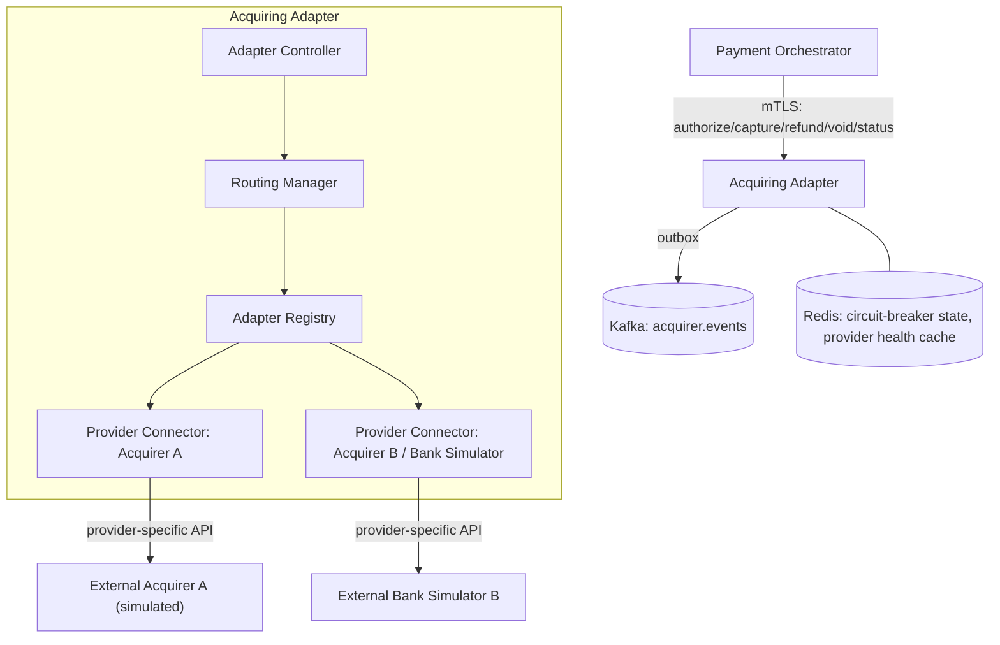
```mermaid
flowchart TB
    POS["Payment Orchestrator"] -->|"mTLS: authorize/capture/refund/void/status"| AA["Acquiring Adapter"]

    subgraph AA_INTERNAL["Acquiring Adapter"]
        CTRL["Adapter Controller"]
        REG["Adapter Registry"]
        ROUTE["Routing Manager"]
        CONN1["Provider Connector: Acquirer A"]
        CONN2["Provider Connector: Acquirer B / Bank Simulator"]
    end

    CTRL --> ROUTE --> REG
    REG --> CONN1
    REG --> CONN2
    CONN1 -->|"provider-specific API"| EXT1["External Acquirer A (simulated)"]
    CONN2 -->|"provider-specific API"| EXT2["External Bank Simulator B"]

    AA -->|"outbox"| KAFKA[("Kafka: acquirer.events")]
    AA --- REDIS[("Redis: circuit-breaker state, provider health cache")]
```

| Integration | Direction | Notes |
|---|---|---|
| Payment Orchestrator → Acquiring Adapter | Sync, mTLS | The only caller of this service (`Payment-Orchestrator-Part-01.md` §12) |
| Acquiring Adapter → External Acquirers | Sync, provider-specific protocol | Isolated per connector, never a shared client |
| Acquiring Adapter → Kafka | Async, Outbox | `acquirer.events` — interaction/observability events, no cardholder data |
| Acquiring Adapter ↔ Redis | Sync | Per-provider circuit-breaker state, provider-health cache |

---

# 6. Adapter Pattern

- **Why used**: the Orchestrator must call one stable interface regardless of how many acquirers exist behind it — without this pattern, every new acquirer integration would require changes to the Orchestrator's SAGA logic itself, directly violating the platform's Clean Architecture dependency rule (`SYSTEM_DESIGN.md` §14 equivalent principle applied here).
- **Plug-and-play integration**: each acquirer implements a single `ProviderConnector` port; the Adapter Registry discovers/registers connectors at startup; the Routing Manager selects among registered connectors purely by configuration (payment method, merchant preference, health), never by code change.
- **Isolation benefit**: a defect or outage in one connector's provider-specific code can never affect another connector's behavior — each connector holds its own circuit breaker, its own request/response mapping, its own error-translation logic.

---

# 7. Internal Components

| Component | Purpose |
|---|---|
| Adapter Controller | Internal-only REST entry point receiving Orchestrator calls |
| Adapter Registry | Holds all registered `ProviderConnector` implementations, keyed by acquirer ID |
| Routing Manager | Selects the target connector per request (payment method, merchant preference, health — mirrors `Payment-Orchestrator-Part-02.md` §15's routing decision, executed here against the connector level) |
| Provider Connectors | Provider-specific implementations of authorize/capture/refund/void/status |
| Request Mapper | Transforms the internal payment model into a connector's expected request shape |
| Response Mapper | Transforms a connector's raw response into the normalized internal response model |
| Retry Manager | Applies per-connector retry/backoff policy for transient provider failures |
| Error Translator | Maps provider-specific error codes into the platform's standard error taxonomy |
| Event Publisher | Publishes `acquirer.events` via the platform-standard Outbox pattern |

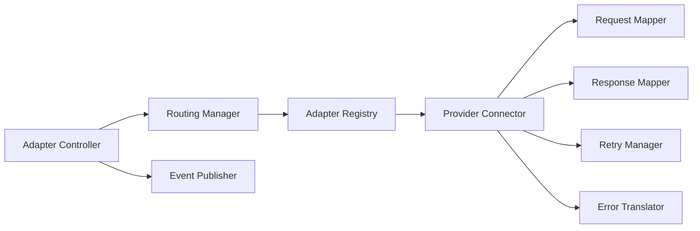
```mermaid
flowchart LR
    CTRL["Adapter Controller"] --> ROUTE["Routing Manager"]
    ROUTE --> REG["Adapter Registry"]
    REG --> CONN["Provider Connector"]
    CONN --> REQM["Request Mapper"]
    CONN --> RESM["Response Mapper"]
    CONN --> RETRY["Retry Manager"]
    CONN --> ERR["Error Translator"]
    CTRL --> PUB["Event Publisher"]
```

---

# 8. Provider Abstraction

- Every connector implements the same internal port (conceptually: `authorize(request) → result`, `capture(...)`, `refund(...)`, `void(...)`, `getStatus(...)`), regardless of the target provider's actual API shape (REST, SOAP, proprietary format).
- The **Request Mapper** and **Response Mapper** are connector-scoped — each connector owns its own mapping logic, so Provider A's field-naming/structure differences from Provider B never leak into the Orchestrator or into any other connector.
- The **Error Translator** ensures every connector, regardless of how a provider signals "insufficient funds" or "card declined" internally, ultimately reports the same standard outcome enum to the Orchestrator — this is what allows the Orchestrator's SAGA/retry logic (`Payment-Orchestrator-Part-02.md` §18) to reason about "business decline vs transient failure" without any provider-specific knowledge.

---

# 9. Request Transformation

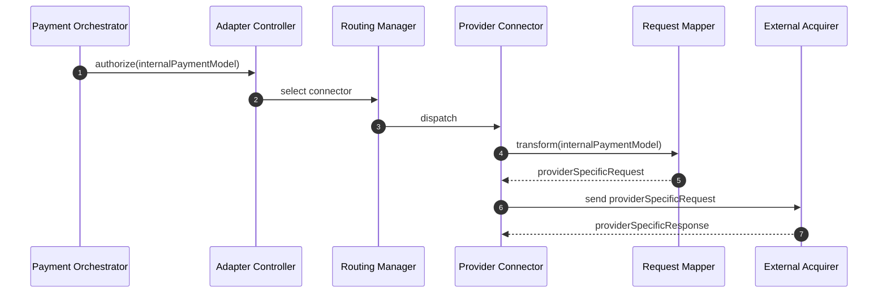
```mermaid
sequenceDiagram
    autonumber
    participant POS as Payment Orchestrator
    participant CTRL as Adapter Controller
    participant ROUTE as Routing Manager
    participant CONN as Provider Connector
    participant REQM as Request Mapper
    participant EXT as External Acquirer

    POS->>CTRL: authorize(internalPaymentModel)
    CTRL->>ROUTE: select connector
    ROUTE->>CONN: dispatch
    CONN->>REQM: transform(internalPaymentModel)
    REQM-->>CONN: providerSpecificRequest
    CONN->>EXT: send providerSpecificRequest
    EXT-->>CONN: providerSpecificResponse
```

The internal payment model passed into this service contains only the transient PAN reference forwarded from the Orchestrator's own detokenize call — never a vault token, never raw cardholder data at rest — consistent with the platform's 50ms PAN-lifetime invariant (`Token-Vault-Part-01.md` §7).

---

# 10. Response Transformation

- Every connector's **Response Mapper** normalizes a provider-specific response into the platform's standard result model: `outcome` (`APPROVED`/`DECLINED`/`FAILED`), `providerTransactionId`, `declineReason` (if applicable), `timestamp`.
- The **Error Translator** classifies failures into exactly the categories the Orchestrator's retry policy already understands (`Payment-Orchestrator-Part-02.md` §18): business decline (never retried) vs transient/system failure (retried per policy) — this classification happens entirely within this service, so the Orchestrator never has to interpret a provider-specific error code itself.
- No provider-specific field, error code, or raw response body is ever passed back to the Orchestrator unmapped — the normalized model is the only contract the Orchestrator ever sees.

---

# 11. Payment Lifecycle inside Adapter

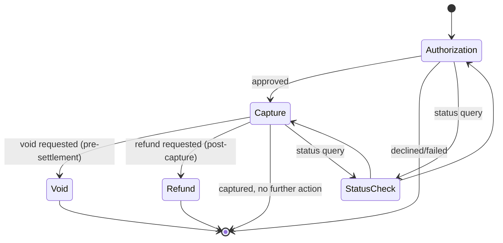
```mermaid
stateDiagram-v2
    [*] --> Authorization
    Authorization --> Capture : approved
    Authorization --> [*] : declined/failed
    Capture --> Void : void requested (pre-settlement)
    Capture --> Refund : refund requested (post-capture)
    Capture --> [*] : captured, no further action
    Void --> [*]
    Refund --> [*]
    Capture --> StatusCheck : status query
    Authorization --> StatusCheck : status query
    StatusCheck --> Capture
    StatusCheck --> Authorization
```

- This lifecycle mirrors, but is distinct from, the Orchestrator's own payment state machine (`Payment-Orchestrator-Part-01.md` §9) — this one tracks the state of the **acquirer-side interaction** for a given step, not the platform's overall payment state.
- `StatusCheck` exists specifically to resolve ambiguous outcomes (e.g. a timeout where the Orchestrator doesn't know if the acquirer actually processed the request) — the Retry Manager consults `getStatus` before blindly retrying a non-idempotent provider call, avoiding an accidental duplicate authorization at the provider level.

---

# 12. Clean Architecture

| Layer | Contents |
|---|---|
| Presentation | Adapter Controller, internal request/response DTOs |
| Application | Use cases: `AuthorizePaymentUseCase`, `CapturePaymentUseCase`, `RefundPaymentUseCase`, `VoidPaymentUseCase`, `GetStatusUseCase` |
| Domain | Standard result model, error taxonomy, `ProviderConnector` port definition |
| Infrastructure | Concrete `ProviderConnector` implementations, Request/Response Mappers, Outbox adapter |

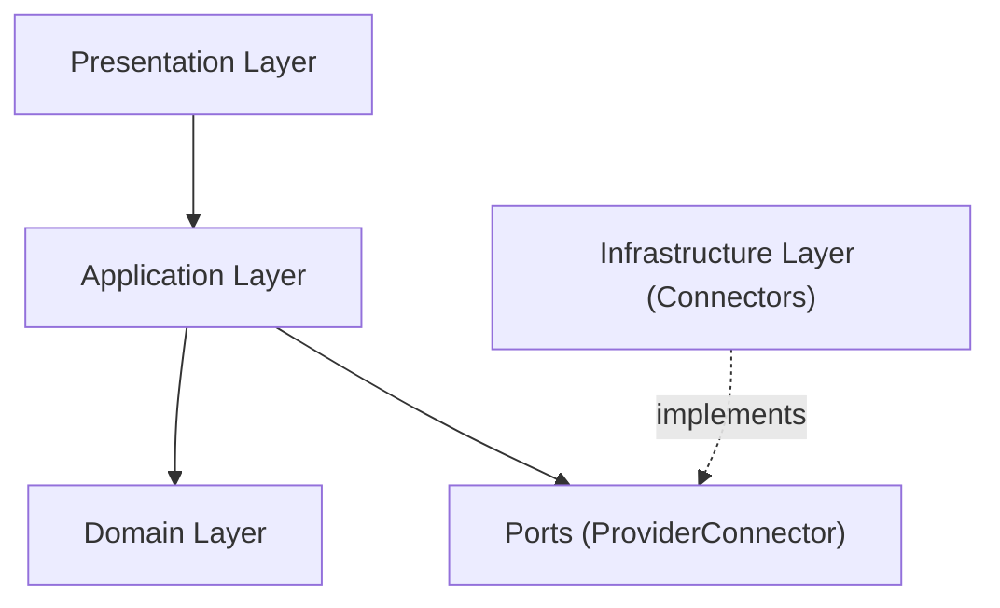
```mermaid
flowchart TB
    PRES["Presentation Layer"] --> APP["Application Layer"]
    APP --> DOM["Domain Layer"]
    APP --> PORTS["Ports (ProviderConnector)"]
    INFRA["Infrastructure Layer (Connectors)"] -.implements.-> PORTS
```

Dependency Rule: identical to every prior service — dependencies point inward; the domain layer's `ProviderConnector` port has zero knowledge of any specific provider's API shape, ensuring a new acquirer integration touches only the infrastructure layer.

---

# 13. Dependencies

| Dependency | Purpose | Communication | Criticality |
|---|---|---|---|
| Payment Orchestrator | Sole caller of this service | Sync, mTLS (inbound) | Critical |
| External Acquirers/PSPs (simulated) | Actual authorization/capture/refund processing | Sync, provider-specific protocol | Critical (per-connector; one acquirer's outage doesn't affect others, per §6 isolation) |
| Kafka | `acquirer.events` publication | Async, Outbox | Non-critical (foreground) |
| Redis | Per-connector circuit-breaker state, provider-health cache | Sync | Non-critical (degrades to local circuit-breaker state) |


# Acquiring Adapter — Software Architecture Specification
## Part 2: API Specification, Provider Integrations, Routing, Resilience

---

# 14. REST APIs

Internal-only surface, mTLS-authenticated, reachable exclusively by the Payment Orchestrator (`Acquiring-Adapter-Part-01.md` §5, §13).

| Endpoint | Purpose | Request | Response | Status Codes |
|---|---|---|---|---|
| `POST /internal/v1/authorizations` | Authorize a payment | `paymentId`, `amount`, `currency`, `panReference`, `merchantId`, `preferredAcquirer` (optional) | `outcome`, `providerTransactionId`, `acquirerId`, `declineReason` (if applicable) | `200`, `400`, `503` |
| `POST /internal/v1/authorizations/{providerTransactionId}/capture` | Capture a prior authorization | `amount` (optional partial) | `outcome`, `providerTransactionId` | `200`, `409`, `503` |
| `POST /internal/v1/authorizations/{providerTransactionId}/void` | Void a pre-capture authorization | `reason` | `outcome` | `200`, `409` |
| `POST /internal/v1/authorizations/{providerTransactionId}/refunds` | Refund a captured amount | `amount` (optional partial), `reason` | `refundId`, `outcome` | `200`, `409`, `503` |
| `GET /internal/v1/authorizations/{providerTransactionId}/status` | Query current acquirer-side status | — | `status`, `lastUpdated` | `200`, `404` |

- All endpoints require `Idempotency-Key` forwarded unmodified from the Orchestrator (§21) and `X-Correlation-Id` per platform standard.
- Error responses use the platform-standard envelope (`API-Gateway-Part-02.md` §17.5) with this service's own error codes (§20).

---

# 15. Provider Integrations

Each provider is modeled as an independent `ProviderConnector` implementation (`Acquiring-Adapter-Part-01.md` §6/§12) — the following illustrates connector-specific concerns for four representative provider integration styles, all conforming to the same internal port.

| Provider Connector | Auth Style | Notable Connector-Specific Concern |
|---|---|---|
| Provider Connector A (Stripe-style API) | API key (secret key, bearer-style) | Idempotency handled both at this service's layer and passed through as the provider's own native idempotency header, since the provider supports it natively |
| Provider Connector B (Razorpay-style API) | API key + secret pair (basic-auth-style) | Order-then-payment two-step flow internally, abstracted so the Orchestrator only ever sees a single `authorize` call |
| Provider Connector C (Adyen-style API) | API key + HMAC-signed webhooks for async status updates | Async status callbacks reconciled against `getStatus` polling for consistency, since some outcomes arrive asynchronously rather than in the synchronous response |
| Provider Connector D (PayPal-style API) | OAuth2 client-credentials, provider-issued access token | Access-token caching/refresh handled entirely inside the connector, invisible to the Routing Manager and the Orchestrator |

- **Minimal-change new-provider onboarding**: implement one new `ProviderConnector` (Request Mapper, Response Mapper, Error Translator, provider-specific auth handling), register it in the Adapter Registry, add a routing-configuration entry (§17) — no change to the Orchestrator, no change to any other connector, no change to the platform's payment state machine.

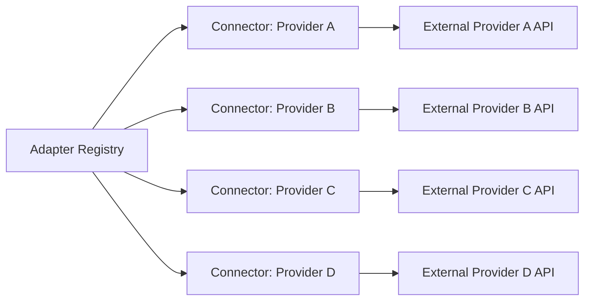
```mermaid
flowchart LR
    REG["Adapter Registry"] --> C1["Connector: Provider A"]
    REG --> C2["Connector: Provider B"]
    REG --> C3["Connector: Provider C"]
    REG --> C4["Connector: Provider D"]
    C1 --> P1["External Provider A API"]
    C2 --> P2["External Provider B API"]
    C3 --> P3["External Provider C API"]
    C4 --> P4["External Provider D API"]
```

---

# 16. Authentication

| Mechanism | Used By | Notes |
|---|---|---|
| API Keys | Provider Connectors A, B | Stored via the platform Secret Manager abstraction, never hardcoded or logged |
| OAuth2 (client-credentials) | Provider Connector D | Access-token lifecycle (fetch, cache, refresh) fully encapsulated inside the connector |
| HMAC | Provider Connector C (webhook verification) | Verifies authenticity of asynchronous provider callbacks before treating them as trusted status updates |
| mTLS | Orchestrator → Adapter (inbound) | Platform-standard internal service authentication (`Token-Vault-Part-02.md` §19.3 pattern, applied here for the Adapter's own internal surface) |
| Certificates | Any provider requiring client-certificate authentication | Certificate material sourced from Secret Manager, rotated per platform standard, never provider-specific credentials embedded in code |

No provider credential of any kind is ever visible to the Payment Orchestrator or any other service — each connector owns and isolates its own provider authentication entirely.

---

# 17. Request Flow

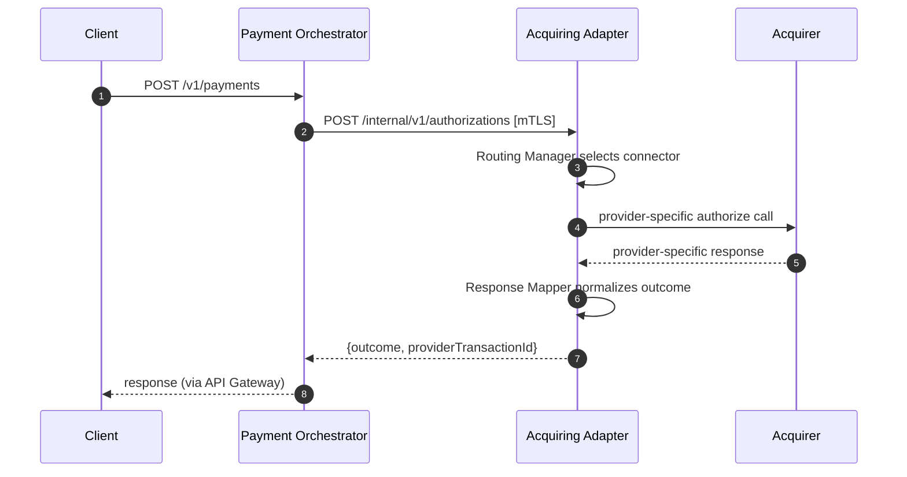
```mermaid
sequenceDiagram
    autonumber
    participant Client
    participant POS as Payment Orchestrator
    participant AA as Acquiring Adapter
    participant ACQ as Acquirer

    Client->>POS: POST /v1/payments
    POS->>AA: POST /internal/v1/authorizations [mTLS]
    AA->>AA: Routing Manager selects connector
    AA->>ACQ: provider-specific authorize call
    ACQ-->>AA: provider-specific response
    AA->>AA: Response Mapper normalizes outcome
    AA-->>POS: {outcome, providerTransactionId}
    POS-->>Client: response (via API Gateway)
```

---

# 18. Smart Routing

## 18.1 Selection Factors
| Factor | Description |
|---|---|
| Merchant preference | Merchant-configured preferred acquirer, sourced from Merchant Service config via the Orchestrator |
| Geography | Connector must support the cardholder's/merchant's region |
| Currency | Connector must support the payment's currency |
| Provider health | Per-connector circuit-breaker state (§19) |
| Priority | Platform-default ordered fallback list per payment method |

## 18.2 Decision Table
| Condition | Routing Decision |
|---|---|
| Merchant preference set AND connector healthy AND currency/geography supported | Route to preferred connector |
| Merchant preference set AND connector unhealthy | Failover to next-priority connector supporting currency/geography |
| No merchant preference | Use platform default priority list, filtered by currency/geography |
| No connector supports currency/geography | Reject with `NO_ELIGIBLE_PROVIDER` |

This mirrors the Orchestrator's own routing decision (`Payment-Orchestrator-Part-02.md` §15) but operates at the connector-selection level within this service — the Orchestrator selects a payment *route*, this service selects the concrete *connector* fulfilling that route.

---

# 19. Retry Strategy

| Failure Type | Retry? | Max Attempts | Backoff |
|---|---|---|---|
| Network timeout to provider | Yes | 3 | Exponential + jitter |
| Provider 5xx | Yes | 3 | Exponential + jitter |
| Provider decline (business response) | No | — | Terminal |
| Ambiguous outcome (timeout, unknown provider-side state) | Status check first, then conditional retry | 1 status check + up to 2 retries | Short fixed delay before status check |

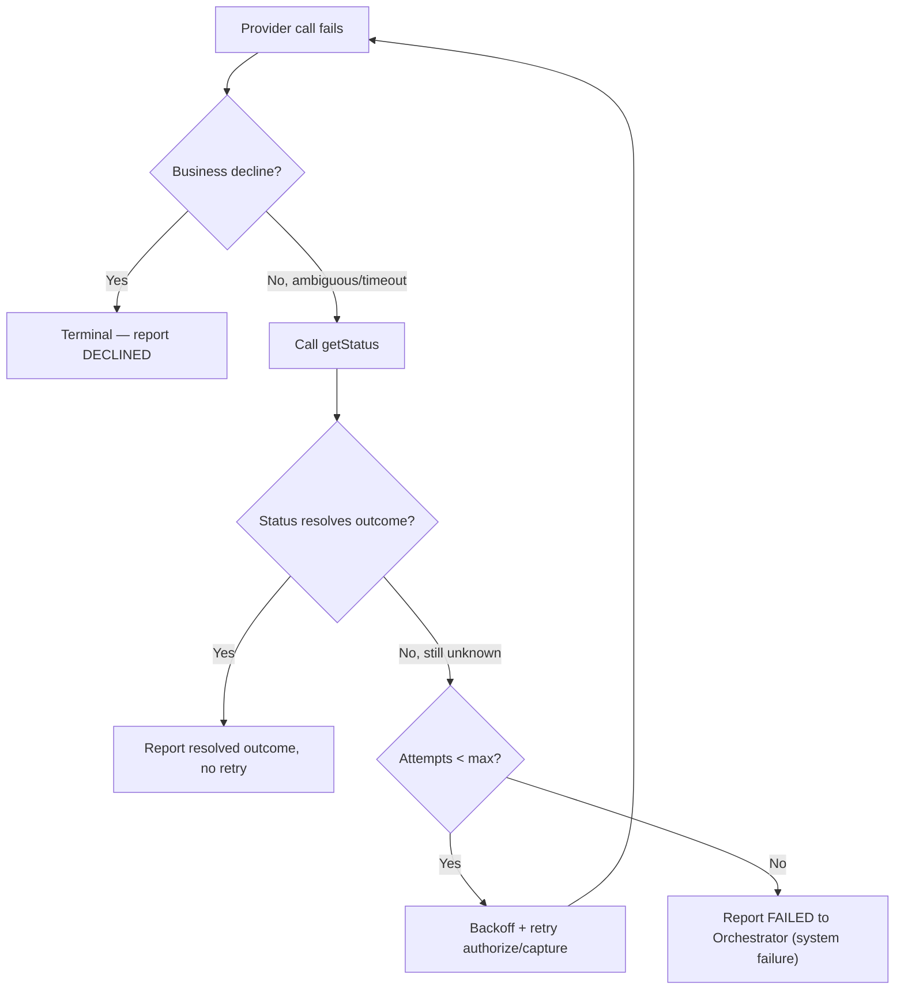
```mermaid
flowchart TD
    A["Provider call fails"] --> B{"Business decline?"}
    B -->|Yes| C["Terminal — report DECLINED"]
    B -->|No, ambiguous/timeout| D["Call getStatus"]
    D --> E{"Status resolves outcome?"}
    E -->|Yes| F["Report resolved outcome, no retry"]
    E -->|No, still unknown| G{"Attempts < max?"}
    G -->|Yes| H["Backoff + retry authorize/capture"]
    H --> A
    G -->|No| I["Report FAILED to Orchestrator (system failure)"]
```

Non-idempotent provider calls (e.g. a provider without native idempotency support) are never blindly retried without a preceding `getStatus` check — this prevents a duplicate authorization at the provider level even when this service's own retry logic is functioning correctly.

---

# 20. Timeout Handling

| Call Type | Timeout Budget | On Timeout |
|---|---|---|
| Authorize | Per-connector configured budget, tuned to that provider's typical latency | Treated as ambiguous outcome (§19) — status check before retry |
| Capture | Per-connector configured budget | Same ambiguous-outcome handling |
| Refund/Void | Per-connector configured budget | Same ambiguous-outcome handling |
| Status check | Short, fixed budget | Treated as a transient failure, retried per §19's bounded policy |

Every timeout is reported to the Orchestrator using the same normalized outcome model as any other failure (§10, Part 1) — the Orchestrator never sees a raw timeout exception, only a classified outcome it already knows how to handle (`Payment-Orchestrator-Part-02.md` §18/§21).

---

# 21. Error Mapping

| Provider-Side Condition (generic) | Normalized Outcome | Retryable? |
|---|---|---|
| Insufficient funds | `DECLINED` | No |
| Card/account restricted or blocked | `DECLINED` | No |
| Invalid/expired card data | `DECLINED` | No |
| Provider rate-limited this connector | `FAILED` (system) | Yes |
| Provider internal server error | `FAILED` (system) | Yes |
| Provider unreachable / connection failure | `FAILED` (system) | Yes |
| Provider authentication failure (this service's credential issue) | `FAILED` (system) | No (requires operator intervention, not a request-level retry) |
| Ambiguous/unknown provider response | `FAILED` (system, pending status check) | Conditional (§19) |

The Error Translator (`Acquiring-Adapter-Part-01.md` §7/§10) is the single place this mapping is implemented per connector — ensuring every provider's idiosyncratic error vocabulary converges on this same small, stable outcome set before ever reaching the Orchestrator.

---

# 22. Idempotency

- `Idempotency-Key` forwarded unmodified from the Payment Orchestrator's own request (`Payment-Orchestrator-Part-02.md` §20) — this service does not generate its own key, preserving one consistent deduplication identity across the full call chain.
- Where the underlying provider supports native idempotency (e.g. Provider Connector A), the key is passed through to the provider directly, gaining provider-side deduplication as an additional layer.
- Where the provider does not support native idempotency, this service's own `getStatus`-before-retry discipline (§19) is the sole safeguard against a duplicate provider-side authorization.
- A duplicate request (same key) reaching this service before the original completes is held/rejected rather than double-dispatched — the second caller receives the first request's eventual result, never a second provider call.

---

# 23. Validation

Structural validation performed before any provider call is attempted, avoiding a wasted external call on a request that could never succeed:

| Validation | Rule |
|---|---|
| Amount | Positive, within the provider connector's supported min/max range |
| Currency | Must be one the target connector supports |
| `panReference` | Must be a valid, non-expired transient reference from the Orchestrator's detokenize call — never a raw PAN or a vault token itself |
| `Idempotency-Key` | Required, UUID format |
| Merchant eligibility | Not re-validated here — already confirmed by the Orchestrator/Merchant Service upstream; this service trusts that check rather than duplicating it |

Business-level validation (e.g. "is this specific PAN valid for this specific transaction type") is providers' own concern, surfaced back through the normalized error model (§21) rather than pre-validated here.

---

# 24. Sequence Diagrams

## 24.1 Authorization
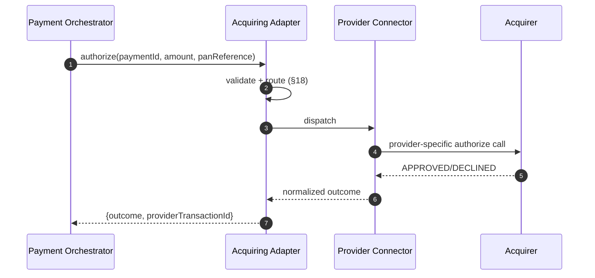
```mermaid
sequenceDiagram
    autonumber
    participant POS as Payment Orchestrator
    participant AA as Acquiring Adapter
    participant CONN as Provider Connector
    participant ACQ as Acquirer

    POS->>AA: authorize(paymentId, amount, panReference)
    AA->>AA: validate + route (§18)
    AA->>CONN: dispatch
    CONN->>ACQ: provider-specific authorize call
    ACQ-->>CONN: APPROVED/DECLINED
    CONN-->>AA: normalized outcome
    AA-->>POS: {outcome, providerTransactionId}
```

## 24.2 Capture
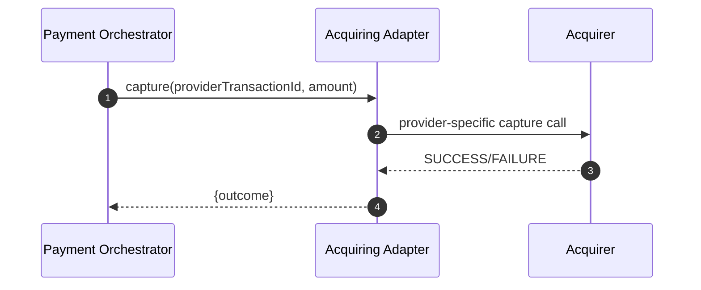
```mermaid
sequenceDiagram
    autonumber
    participant POS as Payment Orchestrator
    participant AA as Acquiring Adapter
    participant ACQ as Acquirer

    POS->>AA: capture(providerTransactionId, amount)
    AA->>ACQ: provider-specific capture call
    ACQ-->>AA: SUCCESS/FAILURE
    AA-->>POS: {outcome}
```

## 24.3 Refund
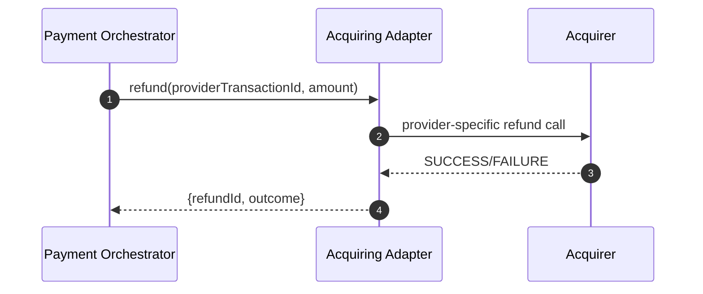
```mermaid
sequenceDiagram
    autonumber
    participant POS as Payment Orchestrator
    participant AA as Acquiring Adapter
    participant ACQ as Acquirer

    POS->>AA: refund(providerTransactionId, amount)
    AA->>ACQ: provider-specific refund call
    ACQ-->>AA: SUCCESS/FAILURE
    AA-->>POS: {refundId, outcome}
```

## 24.4 Void
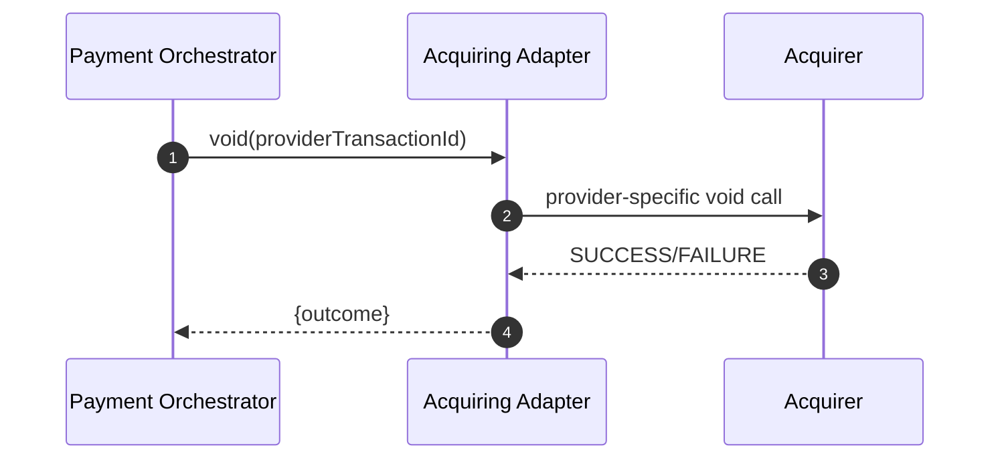
```mermaid
sequenceDiagram
    autonumber
    participant POS as Payment Orchestrator
    participant AA as Acquiring Adapter
    participant ACQ as Acquirer

    POS->>AA: void(providerTransactionId)
    AA->>ACQ: provider-specific void call
    ACQ-->>AA: SUCCESS/FAILURE
    AA-->>POS: {outcome}
```

## 24.5 Provider Timeout
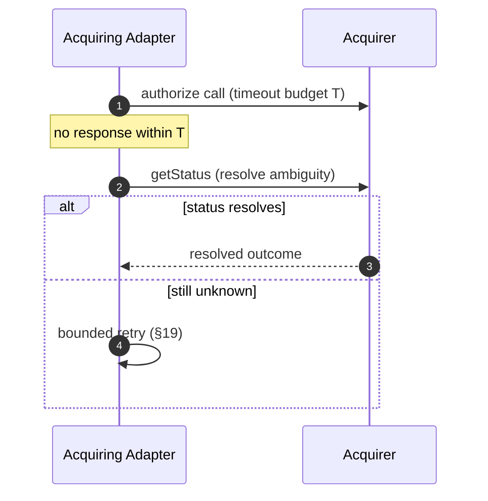
```mermaid
sequenceDiagram
    autonumber
    participant AA as Acquiring Adapter
    participant ACQ as Acquirer

    AA->>ACQ: authorize call (timeout budget T)
    Note over AA: no response within T
    AA->>ACQ: getStatus (resolve ambiguity)
    alt status resolves
        ACQ-->>AA: resolved outcome
    else still unknown
        AA->>AA: bounded retry (§19)
    end
```

## 24.6 Provider Failure
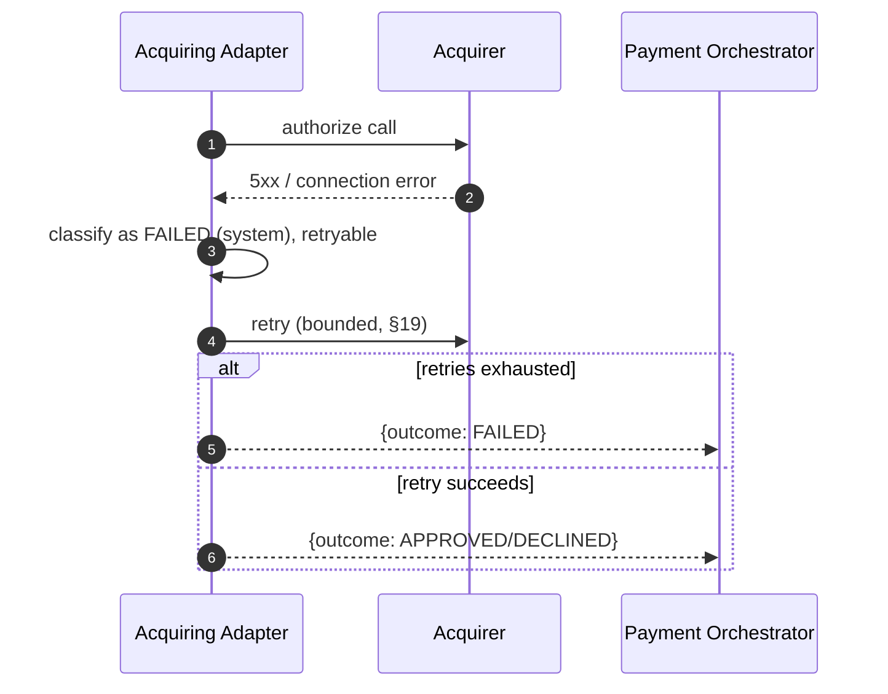
```mermaid
sequenceDiagram
    autonumber
    participant AA as Acquiring Adapter
    participant ACQ as Acquirer
    participant POS as Payment Orchestrator

    AA->>ACQ: authorize call
    ACQ-->>AA: 5xx / connection error
    AA->>AA: classify as FAILED (system), retryable
    AA->>ACQ: retry (bounded, §19)
    alt retries exhausted
        AA-->>POS: {outcome: FAILED}
    else retry succeeds
        AA-->>POS: {outcome: APPROVED/DECLINED}
    end
```

## 24.7 Failover Routing
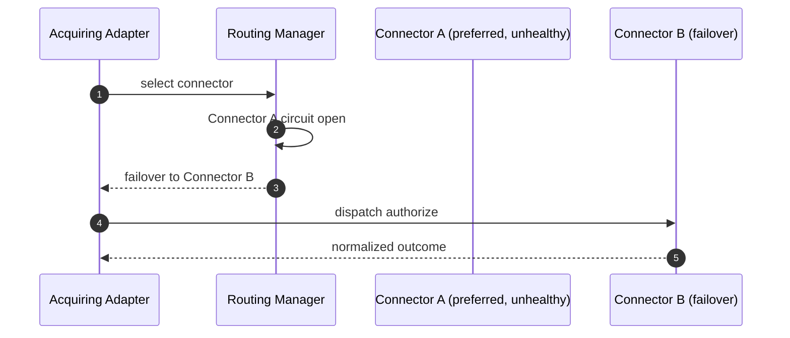
```mermaid
sequenceDiagram
    autonumber
    participant AA as Acquiring Adapter
    participant ROUTE as Routing Manager
    participant C1 as Connector A (preferred, unhealthy)
    participant C2 as Connector B (failover)

    AA->>ROUTE: select connector
    ROUTE->>ROUTE: Connector A circuit open
    ROUTE-->>AA: failover to Connector B
    AA->>C2: dispatch authorize
    C2-->>AA: normalized outcome
```

# Acquiring Adapter — Software Architecture Specification
## Part 3: Data, Messaging, Performance, Observability

---

# 25. Database Design

Minimal persistence — this service is largely stateless per-request, holding only what's needed to reconcile ambiguous outcomes (§19, Part 2) and support the Outbox pattern. No cardholder data, no payment state machine, no ledger (those remain the Payment Orchestrator's and Token Vault's domains).

| Entity | Purpose | Lifecycle |
|---|---|---|
| `provider_transaction` | Tracks the connector-side interaction for a given `providerTransactionId` — status, connector used, last-known outcome | Created at authorize, updated through capture/refund/void/status-check, retained for reconciliation |
| `outbox_event` | Reliable event publication | Platform-standard, partitioned by month |
| `idempotency_record` | Deduplication for mutating internal-API calls | Short-TTL, keyed by `(paymentId, idempotencyKey, endpoint)` |

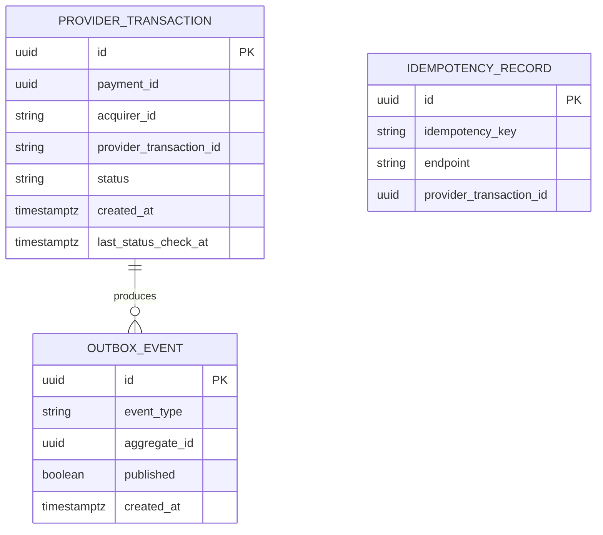
```mermaid
erDiagram
    PROVIDER_TRANSACTION ||--o{ OUTBOX_EVENT : produces

    PROVIDER_TRANSACTION {
        uuid id PK
        uuid payment_id
        string acquirer_id
        string provider_transaction_id
        string status
        timestamptz created_at
        timestamptz last_status_check_at
    }
    OUTBOX_EVENT {
        uuid id PK
        string event_type
        uuid aggregate_id
        boolean published
        timestamptz created_at
    }
    IDEMPOTENCY_RECORD {
        uuid id PK
        string idempotency_key
        string endpoint
        uuid provider_transaction_id
    }
```

---

# 26. Redis

| Usage | Description |
|---|---|
| Idempotency | Fast-path dedup check ahead of the DB constraint, identical platform-standard pattern (`Payment-Orchestrator-Part-03.md` §25) |
| Provider health | Per-connector circuit-breaker state, consulted by the Routing Manager before dispatch (`Acquiring-Adapter-Part-02.md` §18) |
| Routing cache | Cached routing-decision inputs (merchant preference, currency/geography support matrix) to avoid recomputing on every request |

## Redis Key Design
| Key Pattern | TTL | Purpose |
|---|---|---|
| `idempotency:{paymentId}:{key}:{endpoint}` | Matches platform-standard idempotency TTL | Fast-path dedup |
| `provider:health:{acquirerId}` | Short, refreshed continuously by circuit-breaker state changes | Routing Manager health check |
| `routing:cache:{merchantId}:{method}` | Short TTL, invalidated on merchant config change event | Avoids repeat Merchant Service config lookups |

PostgreSQL/the originating config service remain authoritative; Redis unavailability degrades to direct lookup, never gates readiness for core authorize/capture calls.

---

# 27. Kafka

## Topics
| Topic | Publishers | Consumers |
|---|---|---|
| `acquirer.events` | Acquiring Adapter | Analytics, Security monitoring |

## Event Flow
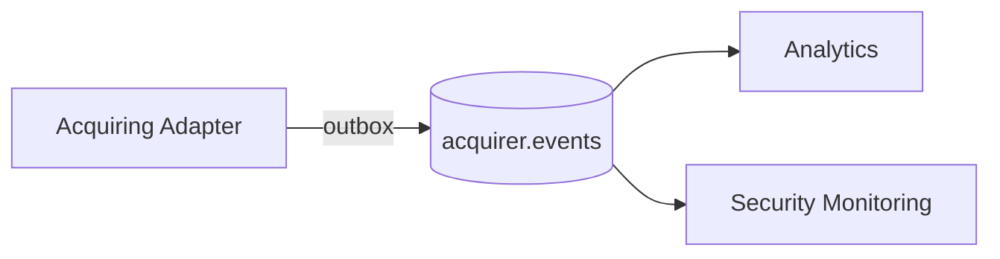
```mermaid
flowchart LR
    AA["Acquiring Adapter"] -->|"outbox"| KAFKA[("acquirer.events")]
    KAFKA --> ANALYTICS["Analytics"]
    KAFKA --> SECMON["Security Monitoring"]
```

Partitioned by `paymentId`, at-least-once delivery via platform-standard Outbox — identical pattern to every other service's event publication (`SYSTEM_DESIGN.md` §7).

---

# 28. Event Catalog

| Event | Producer | Consumer | Purpose |
|---|---|---|---|
| `ProviderAuthorizationRequested` | Acquiring Adapter | Analytics | Records routing decision + connector dispatched |
| `ProviderAuthorizationCompleted` | Acquiring Adapter | Analytics | Records normalized outcome (approved/declined/failed) |
| `ProviderCaptureCompleted` | Acquiring Adapter | Analytics | Records capture outcome |
| `ProviderRefundCompleted` | Acquiring Adapter | Analytics | Records refund outcome |
| `ProviderVoidCompleted` | Acquiring Adapter | Analytics | Records void outcome |
| `ProviderCircuitOpened` | Acquiring Adapter | Security Monitoring | A connector's circuit breaker opened — routing-health signal |
| `ProviderFailoverTriggered` | Acquiring Adapter | Analytics | A request failed over to a non-preferred connector |

No event payload contains cardholder data or provider credentials — only `paymentId`, `acquirerId`, outcome, and timing metadata.

---

# 29. Performance

| Technique | Application |
|---|---|
| Async processing (non-blocking I/O) | Reactive HTTP clients for every provider connector, consistent with the platform's WebFlux-first standard (`SYSTEM_DESIGN.md` Mandatory Architecture Rules) |
| Connection pooling | Isolated pool per connector — one provider's connection exhaustion never starves another (bulkhead pattern, identical to every other platform service) |
| HTTP client optimization | Per-connector timeout/retry tuning matched to that specific provider's real-world latency profile, rather than one generic client configuration for all |
| Parallel requests | Where a status-check-before-retry (§19, Part 2) and a routing-health check are both needed, they're issued concurrently rather than sequentially, minimizing added latency on the ambiguous-outcome path |

---

# 30. Scaling

- **Stateless design**: no in-memory session or routing state persists across requests — any replica handles any request identically.
- **Horizontal scaling**: primary scaling lever, HPA-driven by request-rate/CPU, identical philosophy to every other platform service.
- **Load balancing**: client-side load balancing at the Payment Orchestrator's outbound call, informed by service discovery — no special routing affinity required since this service holds no per-request sticky state.

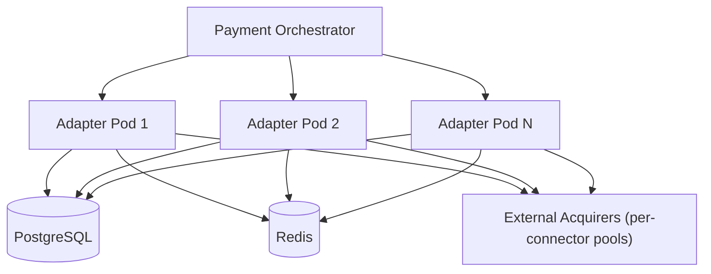
```mermaid
flowchart TB
    POS["Payment Orchestrator"] --> P1["Adapter Pod 1"]
    POS --> P2["Adapter Pod 2"]
    POS --> P3["Adapter Pod N"]
    P1 & P2 & P3 --> PG[("PostgreSQL")]
    P1 & P2 & P3 --> REDIS[("Redis")]
    P1 & P2 & P3 --> EXT["External Acquirers (per-connector pools)"]
```

---

# 31. Caching

- **Provider metadata cache**: connector capability matrix (supported currencies/geographies/payment methods per acquirer) cached in-memory/Redis rather than recomputed per request — this data changes rarely (only on a provider-integration config update) but is consulted on every routing decision (§18, Part 2), making it a clear caching win.
- Invalidated on an explicit configuration-change event, not left to TTL alone, since a stale capability entry could otherwise route a request to a connector that no longer (or doesn't yet) support the required currency/geography.

---

# 32. Logging

Structured JSON, platform-standard baseline (`Payment-Orchestrator-Part-03.md` §31). Never logged: PAN reference, provider credentials, raw provider request/response bodies containing sensitive fields.

| Field | Description |
|---|---|
| `correlationId` | Propagated from Payment Orchestrator |
| `traceId` | OpenTelemetry trace |
| `paymentId` | Cross-referenced with the Orchestrator's own payment |
| `acquirerId` | Which connector handled the request |
| `providerRequestId` | The provider's own transaction/request identifier, for cross-referencing with the provider's own dashboards during incident investigation |
| `outcome` | Normalized result |
| `latencyMs` | Per-provider-call latency |

---

# 33. Metrics

| Metric | Type | Purpose |
|---|---|---|
| `authorization_success_rate{acquirer}` | Gauge | Per-connector health/business signal |
| `provider_latency_seconds{acquirer}` | Histogram | Isolates provider-side latency contribution, mirroring Token Vault's HSM/KMS latency isolation approach (`Token-Vault-Part-03.md` §35.2) |
| `retry_count{acquirer}` | Counter | Retry-policy effectiveness per connector |
| `timeout_count{acquirer}` | Counter | Ambiguous-outcome frequency per connector |
| `error_rate{acquirer}` | Gauge | Per-connector system-failure trend |
| `circuit_breaker_state{acquirer}` | Gauge | Routing-health input |
| `failover_rate` | Counter | How often preferred-connector routing fails over |

---

# 34. Distributed Tracing

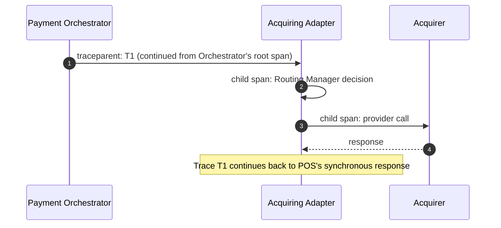
```mermaid
sequenceDiagram
    autonumber
    participant POS as Payment Orchestrator
    participant AA as Acquiring Adapter
    participant ACQ as Acquirer

    POS->>AA: traceparent: T1 (continued from Orchestrator's root span)
    AA->>AA: child span: Routing Manager decision
    AA->>ACQ: child span: provider call
    ACQ-->>AA: response
    Note over AA: Trace T1 continues back to POS's synchronous response
```

Identical continuation pattern to Token Vault's detokenize span (`Token-Vault-Part-03.md` §40.3) — this service's authorize/capture/refund/void calls are synchronous and latency-critical to the Orchestrator's caller, so they join the Orchestrator's root trace rather than starting an independent one. The `acquirer.events` publish path starts its own separate, async trace.

---

# 35. Disaster Recovery

- **Backup**: continuous WAL archiving on `provider_transaction`/outbox schema, point-in-time recovery.
- **Failover**: synchronous same-region standby, asynchronous cross-region standby — identical pattern to every other platform service's database DR posture.
- **Recovery**: readiness gates on PostgreSQL reachability; Redis/Kafka degrade gracefully, never gating.
- **Provider-side reconciliation**: after a regional failover, any `provider_transaction` row in an ambiguous status is resolved via `getStatus` calls to the relevant acquirer before being considered recovered — since the acquirer's own record of a transaction is authoritative for anything already dispatched externally, not this service's local state alone.

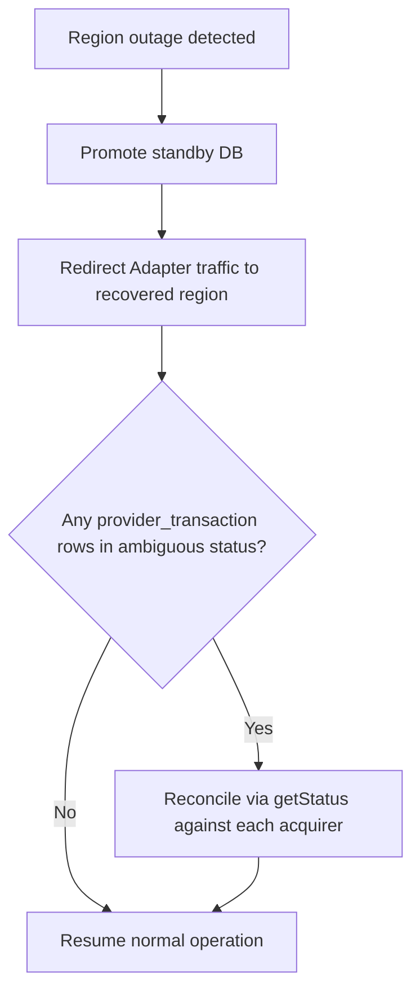
```mermaid
flowchart TD
    A["Region outage detected"] --> B["Promote standby DB"]
    B --> C["Redirect Adapter traffic to recovered region"]
    C --> D{"Any provider_transaction rows in ambiguous status?"}
    D -->|Yes| E["Reconcile via getStatus against each acquirer"]
    D -->|No| F["Resume normal operation"]
    E --> F
```

# Acquiring Adapter — Software Architecture Specification
## Part 4 (Final): Operations, Testing, Risk, Appendix

---

# 36. Production Readiness

## Checklist
- [ ] Every connector's authorize/capture/refund/void/status path verified against a provider sandbox
- [ ] Circuit breaker per connector verified to isolate one provider's outage from others (§6, Part 1)
- [ ] `getStatus`-before-retry discipline verified to prevent duplicate provider-side authorizations (§19, Part 2)
- [ ] Idempotency-Key pass-through verified end-to-end from Orchestrator through to native-provider idempotency where supported
- [ ] Error Translator verified to classify every documented provider error condition correctly (§21, Part 2)
- [ ] No cardholder data, provider credential, or raw provider payload present in any log/trace/event (§32/§28, Part 3)
- [ ] Load test report committed for the authorize path specifically, per connector
- [ ] Chaos test suite executed against provider unavailability, timeout, and malformed-response scenarios
- [ ] Dashboards and alerts live with real staging traffic
- [ ] Runbooks (§38) reviewed by on-call rotation

---

# 37. Health Checks

| Check | Gates Readiness? | Basis |
|---|---|---|
| Provider connectivity (per connector) | No (per-connector circuit breaker isolates, not a service-wide gate) | A single connector's unreachability degrades routing (failover), not the whole service |
| PostgreSQL | Yes | Required for `provider_transaction`/outbox writes |
| Redis | No | Degrades to direct lookup (§26, Part 3) |
| Kafka | No | Outbox guarantees eventual publish |
| Payment Orchestrator (inbound dependency) | N/A | This service has no outbound dependency on the Orchestrator; it only receives calls from it |

---

# 38. Operational Runbooks

## 38.1 Provider Down
- **Symptoms**: circuit breaker open for a specific connector; `error_rate{acquirer}` spike.
- **Investigation**: confirm via the provider's own status page/dashboard; check `provider_latency_seconds{acquirer}` trend leading up to the outage.
- **Resolution**: failover routing engages automatically (§18, Part 2) for other merchants/currencies with an eligible alternate connector; for merchants pinned to the down provider with no eligible alternate, payments fail with `NO_ELIGIBLE_PROVIDER` until recovery.

## 38.2 High Latency
- **Symptoms**: `provider_latency_seconds{acquirer}` p99 breach.
- **Investigation**: isolate whether latency is provider-side (correlate with provider status) or connector-side (check connection-pool saturation, §29 Part 3).
- **Resolution**: if provider-side, no adapter-level fix available beyond failover routing; if connector-side, investigate connection pool/timeout configuration.

## 38.3 Timeout Spike
- **Symptoms**: `timeout_count{acquirer}` spike.
- **Investigation**: check whether `getStatus` calls are successfully resolving ambiguous outcomes or also timing out.
- **Resolution**: if status checks also failing, treat as a full provider outage (§38.1); if status checks succeed but original calls time out, consider tuning that connector's timeout budget.

## 38.4 Authentication Failure
- **Symptoms**: elevated `FAILED` outcomes classified as provider-authentication errors (§21, Part 2).
- **Investigation**: verify the connector's credential (API key/OAuth2 token/certificate) hasn't expired or been rotated without this service's Secret Manager reference being updated.
- **Resolution**: rotate/refresh the credential via Secret Manager; this is never a request-level retry candidate (§21), so no automatic recovery occurs without operator action.

## 38.5 Retry Queue Growth
- **Symptoms**: `retry_count{acquirer}` trending upward.
- **Investigation**: identify whether retries are concentrated on one connector (provider-specific issue) or spread across all (platform-wide network issue).
- **Resolution**: single-connector — treat as §38.1/§38.2; platform-wide — escalate as a broader network incident.

## 38.6 Failover Failure
- **Symptoms**: `failover_rate` high but payments still failing with `NO_ELIGIBLE_PROVIDER`.
- **Investigation**: confirm whether a merchant's configured payment method has only one eligible connector for their currency/geography (no genuine failover target exists).
- **Resolution**: this is a configuration/business-coverage gap, not a runtime defect — escalate to platform/merchant-onboarding for additional provider coverage in the affected currency/geography.

---

# 39. Testing Strategy

| Type | Scope | Success Criteria |
|---|---|---|
| Unit | Request/Response Mapper, Error Translator logic per connector, in isolation | 100% branch coverage on error-classification logic |
| Integration | Full authorize/capture/refund/void path against Testcontainers-provisioned PostgreSQL/Redis/Kafka + mocked provider | Idempotency and outbox guarantees verified |
| Contract | Pin the internal API contract against the Payment Orchestrator's expectations | Schema changes caught before breaking the Orchestrator |
| Mock Provider Testing | Each connector tested against a provider-specific mock/sandbox simulating approve/decline/timeout/malformed-response scenarios | Every documented error mapping (§21, Part 2) reproducible |
| Load Testing | Authorize path load-tested per connector independently | p99 latency within budget; committed report |
| Chaos Testing | Provider unavailability, timeout, and malformed-response injection per connector | Circuit breaker and failover behavior match documentation |

---

# 40. Risk Analysis

| Risk | Impact | Mitigation |
|---|---|---|
| Provider downtime | High — payments fail for merchants pinned to that provider | Failover routing (§18, Part 2); per-connector circuit-breaker isolation |
| Duplicate requests reaching the provider | Critical — duplicate charge at the acquirer level | Idempotency-Key pass-through + native provider idempotency where supported + `getStatus`-before-retry discipline (§19/§22, Part 2) |
| Provider API version changes | Medium — a connector silently breaks on an upstream API change | Contract testing (§39) against provider sandbox on a recurring schedule, not solely at initial integration time |
| Authentication failure (expired/rotated credential) | High — that connector stops functioning entirely | Secret Manager-driven credential lifecycle, monitored expiry alerts |
| Network failure | Medium — transient call failures | Retry policy + circuit breakers per connector (§19, Part 2) |

---

# 41. Architecture Decisions

| Decision | Reason | Benefit | Trade-off |
|---|---|---|---|
| Adapter Pattern | Orchestrator must remain provider-agnostic | New provider onboarding never touches Orchestrator logic | Additional abstraction layer to maintain |
| Provider Abstraction (common connector interface) | Providers have wildly different APIs/auth/error models | Uniform internal contract regardless of provider count | Each connector still requires dedicated mapping logic |
| Common normalized response model | Orchestrator's retry/compensation logic must reason about outcomes generically | One small, stable outcome vocabulary platform-wide | Some provider-specific nuance is necessarily lost in normalization |
| Request Transformation isolated per connector | Provider request shapes are not interchangeable | No cross-provider coupling; one connector's change never affects another | Duplication of similar mapping logic across connectors is accepted as the cost of isolation |

---

# 42. Future Enhancements

| Enhancement | Description |
|---|---|
| Dynamic routing | Real-time, success-rate/cost-optimized connector selection, replacing the current static priority + health model |
| AI-based routing | Routing informed by historical per-connector performance patterns beyond simple health/priority rules |
| Advanced circuit breakers | Per-currency/per-geography circuit-breaker granularity, beyond today's per-connector-wide state |
| Provider marketplace | Self-service connector onboarding/configuration for new acquirers without an engineering-led integration cycle |
| Multi-region routing | Region-aware connector selection for providers with region-specific endpoints/latency profiles |

---

# 43. Glossary

| Term | Definition |
|---|---|
| Connector | A single provider-specific implementation of the common `ProviderConnector` port |
| Normalized outcome | The small, stable result vocabulary (`APPROVED`/`DECLINED`/`FAILED`) every connector converges on |
| Ambiguous outcome | A timeout or unclear provider response requiring a `getStatus` check before any retry |
| Failover routing | Automatic redirection to an alternate connector when the preferred one is unhealthy |
| Provider Transaction | This service's local record of a connector-side interaction, keyed by `providerTransactionId` |

---

# 44. Final Service Summary

The Acquiring Adapter is the platform's provider-abstraction layer — the only service that speaks directly to external (simulated) acquirers, and the only place provider-specific integration complexity is permitted to live.

**Purpose**: expose a single, stable authorize/capture/refund/void/status contract to the Payment Orchestrator, regardless of how many or which acquirers back it.

**Key components**: Adapter Registry, Routing Manager, Provider Connectors, Request/Response Mappers, Retry Manager, Error Translator — each with one narrow responsibility, keeping provider-specific logic fully isolated per connector.

**Reliability**: per-connector circuit breakers, `getStatus`-before-retry discipline, and Idempotency-Key pass-through together prevent duplicate provider-side charges even under network ambiguity.

**Scalability**: fully stateless, horizontally scaled, bulkheaded per connector — one provider's degradation never affects another's throughput.

**Integration**: called exclusively by the Payment Orchestrator; calls out to external acquirers per connector; publishes `acquirer.events` for observability only, with zero cardholder data or credentials ever leaving this service's boundary.

```mermaid
flowchart TD
    A["Provider outage or ambiguous outcome detected"] --> B{"Business decline?"}
    B -->|Yes| C["Terminal — report DECLINED, no retry"]
    B -->|No| D["getStatus check"]
    D --> E{"Resolved?"}
    E -->|Yes| F["Report resolved outcome"]
    E -->|No| G["Bounded retry or failover routing"]
    G --> H["Report final outcome to Orchestrator"]
```

```mermaid
flowchart LR
    POS["Payment Orchestrator"] --> AA["Acquiring Adapter"]
    AA --> C1["Connector A"]
    AA --> C2["Connector B"]
    AA --> C3["Connector C"]
    AA --> C4["Connector D"]
    C1 --> P1["Acquirer A"]
    C2 --> P2["Acquirer B"]
    C3 --> P3["Acquirer C"]
    C4 --> P4["Acquirer D"]
```

This concludes the Acquiring Adapter architecture specification.

# Package Structure

```
acquiring-adapter-service/
└── src/main/java/.../acquiring/
    ├── config/
    │   ├── SecurityConfig.java
    │   ├── ResilienceConfig.java
    │   └── ProviderRegistryConfig.java
    ├── controller/
    │   └── AdapterController.java
    ├── application/
    │   ├── AuthorizePaymentUseCase.java
    │   ├── CapturePaymentUseCase.java
    │   ├── RefundPaymentUseCase.java
    │   ├── VoidPaymentUseCase.java
    │   └── GetStatusUseCase.java
    ├── domain/
    │   ├── transaction/
    │   │   ├── ProviderTransaction.java
    │   │   └── TransactionStatus.java     # sealed
    │   ├── result/
    │   │   ├── AuthorizationResult.java   # normalized outcome model
    │   │   └── Outcome.java               # sealed: APPROVED, DECLINED, FAILED
    │   ├── event/
    │   │   ├── ProviderAuthorizationRequested.java
    │   │   ├── ProviderAuthorizationCompleted.java
    │   │   ├── ProviderCaptureCompleted.java
    │   │   ├── ProviderRefundCompleted.java
    │   │   ├── ProviderVoidCompleted.java
    │   │   ├── ProviderCircuitOpened.java
    │   │   └── ProviderFailoverTriggered.java
    │   └── vo/
    │       ├── PanReference.java          # transient, never persisted
    │       ├── ProviderTransactionId.java
    │       └── AcquirerId.java
    ├── port/
    │   ├── ProviderConnector.java          # the common connector interface
    │   ├── ProviderTransactionRepositoryPort.java
    │   ├── OutboxWriterPort.java
    │   └── ProviderHealthPort.java
    ├── registry/
    │   └── AdapterRegistry.java
    ├── routing/
    │   └── RoutingManager.java
    ├── resilience/
    │   ├── RetryManager.java
    │   └── ErrorTranslator.java
    ├── connector/
    │   ├── providera/
    │   │   ├── ProviderAConnector.java
    │   │   ├── ProviderARequestMapper.java
    │   │   └── ProviderAResponseMapper.java
    │   ├── providerb/
    │   │   ├── ProviderBConnector.java
    │   │   ├── ProviderBRequestMapper.java
    │   │   └── ProviderBResponseMapper.java
    │   ├── providerc/
    │   │   ├── ProviderCConnector.java
    │   │   ├── ProviderCRequestMapper.java
    │   │   └── ProviderCResponseMapper.java
    │   └── providerd/
    │       ├── ProviderDConnector.java
    │       ├── ProviderDRequestMapper.java
    │       └── ProviderDResponseMapper.java
    ├── adapter/
    │   ├── persistence/
    │   │   └── ProviderTransactionRepositoryAdapter.java
    │   ├── outbox/
    │   │   └── OutboxWriterAdapter.java
    │   └── health/
    │       └── ProviderHealthAdapter.java
    ├── entity/            # persistence entities, distinct from domain aggregates
    ├── dto/
    │   ├── request/
    │   └── response/
    ├── mapper/
    ├── exception/
    ├── security/
    ├── validation/
    ├── event/
    │   └── producer/
    ├── scheduler/         # idempotency-record cleanup
    ├── client/            # per-provider HTTP/OAuth2/HMAC clients
    └── constant/
```

Note the `registry/`, `routing/`, `resilience/`, and `connector/` packages sitting alongside — not nested under — `application/`: these are the cross-cutting components (`Acquiring-Adapter-Part-01.md` §7) that the use cases orchestrate but do not own. Each provider gets its own sub-package under `connector/` (Request Mapper, Response Mapper, and the connector implementation together) — this is the one place a new-provider integration touches, per the plug-and-play rationale in §6/§15 (`Acquiring-Adapter-Part-01.md`/`Part-02.md`), with `port/ProviderConnector.java` as the single stable interface every connector implements, keeping `application/` and `domain/` completely unaware of any provider-specific detail.