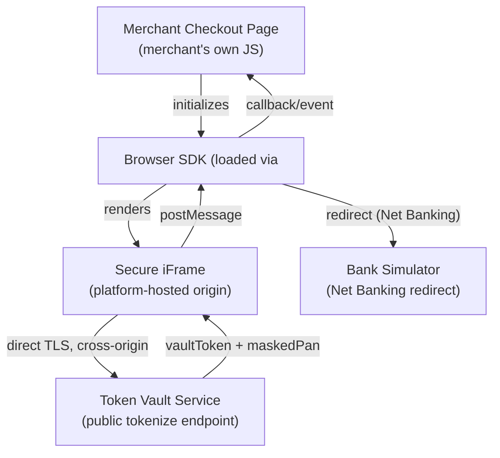
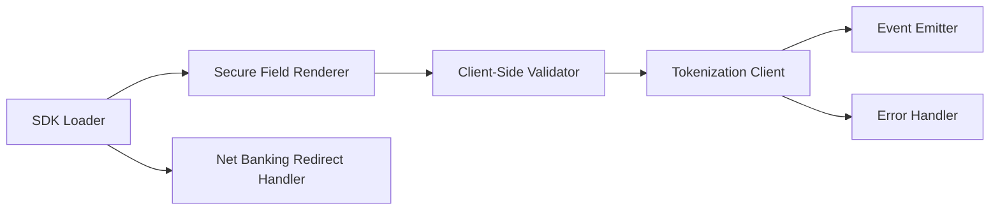
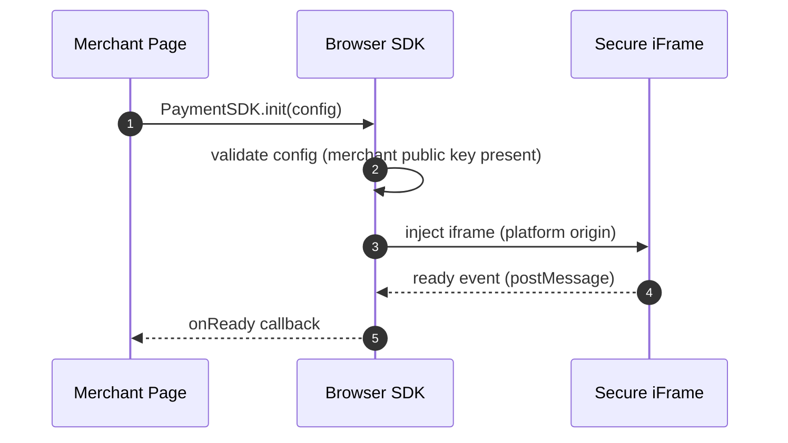
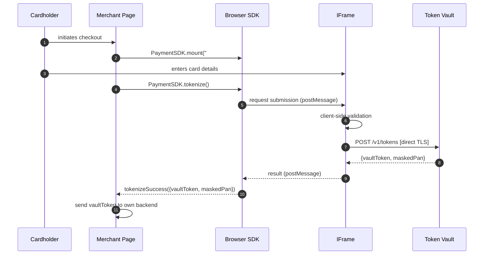
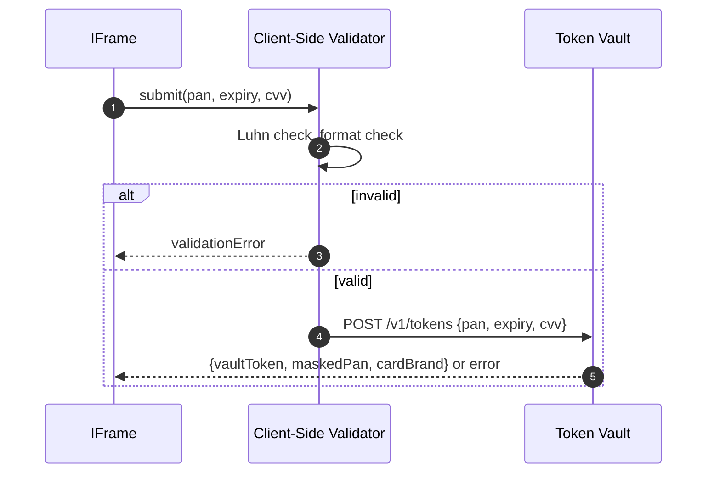
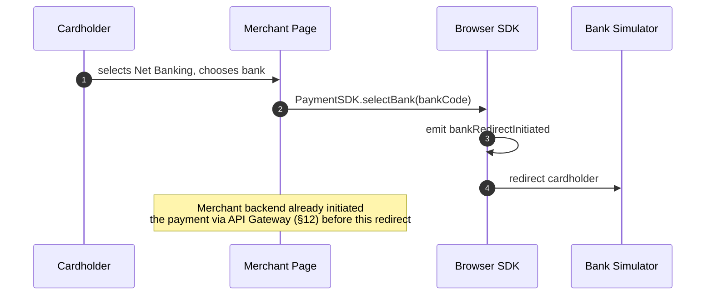

# Browser SDK — Software Architecture Specification

Platform: Distributed Payment Gateway (Stripe/Razorpay-class, sandbox/portfolio implementation, PCI-DSS-aligned — not certified)

---

# 1. Executive Summary

The Browser SDK is the client-side JavaScript library merchants embed on their checkout pages to collect card details and tokenize them directly against the Token Vault Service — bypassing the API Gateway and every other platform service entirely (`Token-Vault-Part-01.md` §2.2, `SYSTEM_DESIGN.md` §10). It is the only platform component that ever touches raw cardholder data on the client side, and its entire design exists to get that data off the merchant's page and into the Vault as fast and as safely as possible, returning only an opaque `vaultToken` to the merchant's own code.

---

# 2. Purpose

- Collect card details (PAN, expiry, CVV) inside secure, isolated iframes hosted by the platform — never inside the merchant's own DOM context.
- Tokenize those details directly against the Token Vault's public tokenization endpoint (`Token-Vault-Part-02.md` §18.11, `POST /v1/tokens`).
- Return a `vaultToken` and masked card metadata to the merchant's page, which the merchant then forwards to their own backend for the actual `POST /v1/payments` call through the API Gateway.
- Support both Card and Net Banking checkout flows, consistent with the platform's supported payment methods (`SYSTEM_DESIGN.md` §Core Capabilities).

---

# 3. Responsibilities

- Render secure card-input iframes, isolated from the merchant's own JavaScript execution context.
- Perform client-side structural validation (card number format, expiry, Luhn check) before submission, as a first line of defense ahead of the Vault's own server-side validation (`Token-Vault-Part-02.md` §21.1).
- Call the Token Vault's public tokenization endpoint directly over TLS.
- Surface tokenization success/failure and card metadata (masked PAN, brand) back to the merchant's page via a well-defined event/callback API.
- Support a Net Banking bank-selection UI, redirecting the cardholder to the (simulated) bank's authentication page per the platform's Net Banking flow (`SYSTEM_DESIGN.md` §4).

---

# 4. Non-Responsibilities

- **Never sends card data to the merchant's own server or JavaScript context.** The merchant's page never has DOM access to the raw PAN/CVV fields — they exist only inside the SDK's own cross-origin iframes.
- **Never calls the API Gateway or Payment Orchestrator directly.** The SDK's only network call for tokenization is to the Token Vault's public endpoint; the actual `POST /v1/payments` call is the merchant's own backend's responsibility, using the `vaultToken` this SDK returns.
- **Never persists card data anywhere** — not in `localStorage`, not in `sessionStorage`, not in any client-side cache, consistent with the platform's zero-persistence-of-cardholder-data principle applied here at the browser layer.
- **Never makes an authorization/business decision.** It has no concept of amount approval, merchant eligibility, or payment state — those remain entirely server-side concerns.

---

# 5. Key Definitions

| Term | Definition |
|---|---|
| Vault Token | The opaque token returned by the Token Vault in place of a raw PAN (`Token-Vault-Part-01.md` §11) |
| Secure iFrame | A cross-origin `<iframe>` hosting card-input fields, isolated from the merchant page's own JavaScript |
| Checkout Session | The SDK's client-side lifecycle instance covering initialization through tokenization/redirect |
| Tokenization Flow | The card-details-to-vault-token round trip |
| Payment Confirmation Flow | The merchant-backend-driven step (outside this SDK) that uses the vault token to create and authorize a payment |
| CSP | Content Security Policy — browser-enforced restriction on what a page is allowed to load/execute |

---

# 6. SDK Architecture



- The iframe is served from a platform-controlled origin distinct from the merchant's own — this is the architectural mechanism that keeps raw card data out of the merchant's DOM/JS context even though the merchant's page visually hosts the checkout form.
- Communication between the iframe and the parent SDK script uses `postMessage`, never direct DOM access, preserving the cross-origin isolation boundary.

---

# 7. Components

| Component | Purpose |
|---|---|
| SDK Loader | The small bootstrap script the merchant includes via `<script>` tag; initializes the SDK and injects the secure iframe |
| Secure Field Renderer | Renders card-number/expiry/CVV inputs inside the isolated iframe |
| Client-Side Validator | Structural validation (Luhn, expiry, format) before submission |
| Tokenization Client | Performs the direct HTTPS call to the Token Vault's public endpoint |
| Event Emitter | Surfaces success/failure/validation events to the merchant's page via a documented callback API |
| Net Banking Redirect Handler | Manages the bank-selection UI and redirect flow |
| Error Handler | Normalizes Vault-returned and network-level errors into a consistent SDK-level error shape for the merchant |



---

# 8. Public APIs

| Method | Purpose |
|---|---|
| `PaymentSDK.init(config)` | Initializes the SDK with the merchant's public key/config and mounts the secure iframe |
| `PaymentSDK.mount(elementSelector)` | Renders the secure card-input fields into a specified DOM container |
| `PaymentSDK.tokenize()` | Triggers validation + tokenization against the Token Vault, returning a Promise resolving to `{vaultToken, maskedPan, cardBrand}` |
| `PaymentSDK.on(event, callback)` | Subscribes to SDK lifecycle events (`validationError`, `tokenizeSuccess`, `tokenizeError`) |
| `PaymentSDK.selectBank(bankCode)` | Initiates the Net Banking redirect flow for a selected bank |
| `PaymentSDK.destroy()` | Tears down the iframe and releases SDK resources |

The SDK never exposes a method returning raw PAN/CVV — every success path returns only `vaultToken` and display-safe metadata, by design.

---

# 9. Initialization Flow



---

# 10. Checkout Flow



---

# 11. Tokenization Flow



Client-side validation exists purely as a fast, friendly first check (`Token-Vault-Part-02.md` §21.1's server-side validation remains the authoritative check) — a client-side pass never substitutes for the Vault's own structural validation.

---

# 12. Payment Confirmation Flow

- Explicitly **outside this SDK's scope** — once `tokenizeSuccess` fires, the merchant's own backend is responsible for calling `POST /v1/payments` through the API Gateway using the returned `vaultToken` (`Payment-Orchestrator-Part-02.md` §13.1).
- This SDK has no visibility into payment authorization outcome, capture, or settlement — its lifecycle ends at tokenization (or at redirect initiation, for Net Banking).

---

# 13. Event Handling

| Event | Trigger |
|---|---|
| `ready` | Iframe successfully mounted and ready for input |
| `validationError` | Client-side validation failed |
| `tokenizeSuccess` | Vault tokenization succeeded |
| `tokenizeError` | Vault tokenization failed (network or Vault-returned error) |
| `bankRedirectInitiated` | Net Banking redirect flow started |

Events are delivered via the documented `PaymentSDK.on(event, callback)` API (§8) — never via global variables or DOM mutation the merchant's page would need to poll.

---

# 14. Error Handling

| Source | Handling |
|---|---|
| Client-side validation failure | `validationError` event, field-level detail (e.g. "invalid expiry"), never a raw provider/Vault error code |
| Vault-returned error (§18.8, `Token-Vault-Part-02.md`) | Mapped to a normalized SDK error shape (`code`, `message`) — the SDK's own error taxonomy, decoupled from the Vault's internal error codes |
| Network failure (Vault unreachable) | `tokenizeError` with a retryable-vs-non-retryable classification, letting the merchant's page decide whether to prompt the cardholder to retry |

No error path ever surfaces raw PAN/CVV or any Vault-internal detail beyond what's safe for a merchant-facing error message.

---

# 15. Validation

| Validation | Layer |
|---|---|
| Card number Luhn check | Client-side (iframe), first pass |
| Expiry not in the past | Client-side |
| CVV length (3–4 digits) | Client-side |
| Full structural + business validation | Server-side, Token Vault (`Token-Vault-Part-02.md` §21.1) — authoritative |

Client-side validation is a UX optimization (immediate feedback), never a security boundary — the Vault's own validation is the only one this platform's security model relies on.

---

# 16. Security

## 16.1 CSP (Content Security Policy)
- The merchant's page is expected to permit loading the SDK script and framing the platform's iframe origin via CSP directives — documented as an integration requirement, since an overly restrictive merchant CSP would otherwise silently block the secure iframe from rendering.

## 16.2 XSS
- Card-input fields exist only inside the platform-controlled iframe origin — even if the merchant's own page were compromised by an XSS vulnerability, the attacker's script cannot read the card-input fields' values, since they live in a separate origin's DOM entirely.

## 16.3 CSRF
- The tokenization call carries no merchant-authenticated session/cookie — it is a direct, unauthenticated (rate-limited, per `Token-Vault-Part-01.md` §18.13) call to the Vault's public endpoint, so classic cookie-based CSRF does not apply to this flow.

## 16.4 Token Handling
- The `vaultToken` returned to the merchant's page is treated as sensitive-but-not-cardholder-data — it is safe to transmit to the merchant's own backend but is never persisted client-side (§4) beyond the immediate in-memory handoff to the merchant's own submission logic.

## 16.5 Secure iFrames
- `sandbox` attributes and a strict `Content-Security-Policy` on the iframe's own platform-hosted page further restrict what the iframe's content can do, defense-in-depth beyond the origin-isolation property alone.

---

# 17. Browser Compatibility

- Supports current major evergreen browsers (Chrome, Firefox, Safari, Edge); no support target for legacy browsers lacking modern `postMessage`/`iframe sandbox` support, since those same browsers typically lack the TLS/security baseline this platform requires.
- Graceful degradation: an unsupported browser surfaces a clear `tokenizeError`/initialization failure rather than a silent malfunction.

---

# 18. Performance

- SDK bundle kept minimal (no heavy framework dependency) to minimize checkout-page load impact.
- Iframe rendering and tokenization are both asynchronous, non-blocking relative to the merchant page's own script execution.
- Client-side validation runs synchronously and immediately (sub-millisecond), so validation feedback never waits on a network round trip.

---

# 19. Logging

- The SDK emits minimal, non-sensitive client-side console diagnostics (initialization success/failure, network-error classification) — never logs card data, `vaultToken`, or any field derived from cardholder data, consistent with the platform-wide never-log-cardholder-data principle applied here at the browser layer.
- Any deeper diagnostic logging is opt-in and merchant-controlled, explicitly excluding sensitive fields by the SDK's own internal design (there is no code path capable of accessing raw PAN outside the iframe's own isolated context to begin with).

---

# 20. Metrics

| Metric | Purpose |
|---|---|
| `sdk_init_success_rate` | Initialization reliability across merchant integrations |
| `sdk_tokenize_success_rate` | Client-side tokenization success rate |
| `sdk_validation_error_rate` | Frequency of client-side validation failures, informing UX improvements |
| `sdk_load_time_ms` | Bundle load/initialization performance |

Metrics are aggregated platform-side (via a lightweight, non-blocking beacon call), never blocking the checkout flow itself.

---

# 21. Sequence Diagrams

See §9 (Initialization), §10 (Checkout), §11 (Tokenization). Net Banking redirect:



---

# 22. Mermaid Diagrams

All diagrams for this specification are embedded inline within their relevant sections above (§6–§11, §21) rather than collected separately, consistent with this document's section-by-section presentation style.

---

# 23. Folder Structure

```
browser-sdk/
├── src/
│   ├── core/
│   │   ├── PaymentSDK.js         # public API surface (§8)
│   │   ├── init.js
│   │   └── eventEmitter.js
│   ├── iframe/
│   │   ├── secureFieldRenderer.js
│   │   └── postMessageBridge.js
│   ├── validation/
│   │   └── clientSideValidator.js
│   ├── tokenization/
│   │   └── tokenizationClient.js
│   ├── netbanking/
│   │   └── redirectHandler.js
│   ├── errors/
│   │   └── errorTranslator.js
│   └── metrics/
│       └── beacon.js
├── iframe-host/                  # the platform-hosted secure iframe page itself
│   ├── index.html
│   └── iframeApp.js
└── dist/                         # bundled SDK output
```

---

# 24. Testing Strategy

| Type | Scope | Success Criteria |
|---|---|---|
| Unit | Client-side validator, error translator | Every validation rule and error mapping covered |
| Integration | Full mount → tokenize round trip against a mocked Vault endpoint | Correct event sequence, correct payload shape |
| Cross-browser Testing | Supported browser matrix (§17) | Consistent rendering and tokenization behavior across all supported browsers |
| Security Testing | XSS/CSRF/iframe-isolation verification | Confirms merchant-page script cannot access card-input field values under any tested attack scenario |
| End-to-End | Full checkout flow against a staging Token Vault, synthetic test cards | Correct `vaultToken` issuance, correct merchant-facing event sequence |

---

# 25. Future Enhancements

| Enhancement | Description |
|---|---|
| Additional payment method UI | Wallet-style or additional local payment method rendering, beyond current Card/Net Banking scope |
| Adaptive/dynamic field validation | Card-brand-aware formatting (e.g. spacing) as the cardholder types |
| Localization | Multi-language field labels/error messages |
| Accessibility enhancements | Expanded ARIA support for the secure iframe's input fields |

---

# 26. Glossary

| Term | Definition |
|---|---|
| Secure iFrame | Cross-origin, platform-hosted iframe isolating card-input fields from the merchant's page |
| Vault Token | Opaque card reference returned by the Token Vault |
| Checkout Session | The SDK's client-side lifecycle instance for one checkout attempt |
| Beacon | A lightweight, non-blocking metrics-reporting call |

---

# 27. Final Summary

The Browser SDK is the platform's client-side gateway to the Token Vault — a small, security-focused JavaScript library whose entire architecture exists to keep raw cardholder data out of the merchant's own execution context while still letting the merchant build their own checkout UI around it.

It renders card-input fields inside cross-origin, platform-hosted secure iframes, performs lightweight client-side validation for UX purposes only, and tokenizes directly against the Token Vault's public endpoint — returning nothing more sensitive than an opaque `vaultToken` and masked display metadata to the merchant's page. It has no visibility into payment authorization, capture, or settlement, and it never persists, logs, or exposes cardholder data at any point in its lifecycle — the same zero-cardholder-data-outside-the-Vault principle that governs the rest of this platform's architecture, enforced here at the very first hop where a cardholder's card details exist at all.

This concludes the Browser SDK architecture specification.