# Merchant Service — Software Architecture Specification
## Part 1 of 4: Vision, Domain Model, Lifecycle Workflows, Architecture

Document status: Draft for architecture review
Service: Merchant Service
Platform: Distributed Payment Gateway (Stripe/Razorpay-class, sandbox/portfolio implementation, PCI-DSS-aligned — not certified)

---

# 1. Executive Summary

The Merchant Service is the system of record for merchant identity on the
platform. Every other service — Payment Orchestrator, Token Vault,
Acquiring Adapter, Webhook Service, Settlement Service, and the API
Gateway itself — depends on this service having already established
*who a merchant is, what state they are in, and what they are permitted
to do*, before any payment activity is allowed to occur.

Unlike the API Gateway (a stateless routing layer) or the Payment
Orchestrator (a high-throughput transactional core), the Merchant
Service is a comparatively low-throughput, high-integrity identity and
lifecycle service. Its correctness bar is not measured in requests/sec
but in **never allowing a merchant to transact who has not been
verified, never losing an audit trail of a lifecycle transition, and
never leaking one merchant's credentials or configuration to another**.

This document (Part 1 of 4) establishes the domain model — using
Domain-Driven Design — the merchant lifecycle state machine and its
supporting workflows (onboarding, KYC, verification, activation,
suspension, deactivation), and the architectural shape the remaining
three parts build implementation guidance on top of.

---

# 2. Service Purpose

The Merchant Service exists to answer, authoritatively, three questions
that every other service needs answered correctly and consistently:

1. **Identity** — does this merchant exist, and what is their current
   lifecycle state?
2. **Credentials** — is this API key / OAuth2 client valid, and which
   merchant and scope set does it resolve to?
3. **Configuration** — what are this merchant's webhook endpoints,
   settlement bank details, and business profile, so downstream
   services (Webhook Service, Settlement Service) can act on their
   behalf correctly?

It is the platform's **identity and configuration boundary** — it does
not process payments, does not touch money movement, and does not make
authorization decisions about individual transactions. It answers "who"
and "what state," never "should this specific payment be approved."

---

# 3. Responsibilities

## 3.1 Merchant Identity Management
- Merchant registration and profile management (legal name, business
  category, contact information, tax identifiers).
- Merchant lifecycle state ownership (`PENDING_VERIFICATION`,
  `UNDER_REVIEW`, `ACTIVE`, `SUSPENDED`, `DEACTIVATED` — detailed in §17).
- Issuance and lifecycle management of API credentials (API keys,
  OAuth2 client registrations) scoped to a merchant.

## 3.2 KYC / Verification Orchestration
- Collecting KYC documentation references (identity documents, business
  registration proof, bank account ownership proof).
- Orchestrating the verification workflow, including manual review
  queues for cases that cannot be auto-verified.
- Recording verification decisions and their audit trail immutably.

## 3.3 Webhook Configuration
- Storing merchant-configured webhook endpoint URLs and their
  associated signing secrets (the secret itself is generated here but
  used by Webhook Service to sign outbound deliveries — Merchant
  Service owns the configuration, Webhook Service owns delivery).

## 3.4 Merchant-Facing Configuration
- Storing settlement bank account details (tokenized/encrypted, never
  raw account numbers in plaintext at rest).
- Storing merchant rate-limit tier assignment, consumed by the API
  Gateway's rate limiting filter.
- Storing merchant scope grants (`payments:read`, `payments:write`,
  etc.) consumed by the API Gateway's coarse authorization filter.

## 3.5 Event Publication
- Publishing domain events (`MerchantActivated`, `MerchantSuspended`,
  `MerchantDeactivated`, `MerchantCredentialRevoked`) via Transactional
  Outbox, consumed by API Gateway (credential cache invalidation),
  Payment Orchestrator (merchant-eligibility-to-transact checks), and
  Settlement Service (payout account changes).

---

# 4. Non-Responsibilities

- **Does not process, authorize, capture, or refund payments.** All
  payment state belongs to the Payment Orchestrator.
- **Does not store or process cardholder data.** No PAN, CVV, or vault
  tokens ever reside in the Merchant Service's schema.
- **Does not deliver webhooks.** It owns configuration only; delivery,
  signing-at-send-time, and retry belong to the Webhook Service. (The
  signing *secret* is generated and stored here since it is merchant
  configuration, but the Merchant Service never itself calls a
  merchant's webhook endpoint.)
- **Does not compute settlements.** It stores the bank account
  destination; the Settlement Service computes and owns payout amounts
  and the settlement ledger.
- **Does not perform per-transaction authorization decisions.** "Is
  this merchant allowed to transact at all right now" (their lifecycle
  state) is this service's concern; "should this specific payment for
  this amount be approved" is the Payment Orchestrator's.
- **Does not validate business rules belonging to other domains** (e.g.
  it does not know what a valid refund window is — that's a Payment
  Orchestrator concern).
- **Does not cache or duplicate Token Vault data.** Card vault tokens
  are never referenced or stored by merchant ID lookups here.

---

# 5. Business Goals

| Goal | Why it matters | How the Merchant Service serves it |
|---|---|---|
| Fast, low-friction onboarding | Growth depends on merchants going live quickly | Automated verification path for low-risk merchant categories, manual review reserved for higher-risk profiles |
| Regulatory and fraud risk control | KYC failures expose the platform to compliance and fraud liability | Mandatory KYC workflow gate before `ACTIVE` state is reachable, with a full immutable audit trail |
| Platform-wide trust in merchant state | Every service's decisions (rate limit, transacting eligibility, payout) depend on this service being correct | Single source of truth for lifecycle state, published via reliable Outbox events, never inferred by downstream services independently |
| Operational ability to respond to risk signals | Fraud/chargebacks/compliance issues must be actionable quickly | Suspension workflow that takes effect platform-wide within one event-propagation cycle, without requiring a code deploy |
| Credential security | Leaked merchant credentials are a direct platform liability | Centralized, auditable credential issuance/revocation, hashed storage, no plaintext secrets at rest |

---

# 6. Functional Requirements

## FR-1 Registration
FR-1.1 The service shall allow creation of a new merchant profile with
mandatory legal name, business category, contact email, and country of
registration.

FR-1.2 The service shall assign a new merchant the initial lifecycle
state `PENDING_VERIFICATION` upon successful registration.

FR-1.3 The service shall reject duplicate registration attempts using
the same verified tax identifier.

## FR-2 KYC & Verification
FR-2.1 The service shall accept references to KYC documents (stored in
an external document store; the Merchant Service holds metadata and
references, not raw document binaries, keeping large binary handling
out of its transactional database).

FR-2.2 The service shall support both automated verification (for
low-risk merchant categories meeting defined criteria) and manual
review (routed to an operator queue) as parallel verification paths.

FR-2.3 The service shall record every verification decision with the
deciding actor (automated rule ID or reviewer identity), timestamp, and
rationale, immutably.

FR-2.4 The service shall transition a merchant to `ACTIVE` only after
verification is recorded as `APPROVED`.

## FR-3 Credential Management
FR-3.1 The service shall issue API keys and/or OAuth2 client
credentials only to merchants in the `ACTIVE` state.

FR-3.2 The service shall support immediate revocation of any issued
credential, publishing a `MerchantCredentialRevoked` event upon
revocation.

FR-3.3 The service shall store credential secrets as salted hashes
only; raw secrets are returned to the merchant exactly once at issuance
time and never persisted or retrievable thereafter.

## FR-4 Lifecycle Management
FR-4.1 The service shall support transitioning a merchant to
`SUSPENDED` from `ACTIVE`, triggered by risk/compliance signals,
without requiring merchant consent.

FR-4.2 The service shall support reactivation from `SUSPENDED` back to
`ACTIVE` following resolution of the triggering issue.

FR-4.3 The service shall support `DEACTIVATED` as a terminal state,
reachable from `ACTIVE` or `SUSPENDED`, either merchant-initiated
(account closure) or platform-initiated (permanent risk decision).

FR-4.4 The service shall publish a domain event for every lifecycle
transition.

## FR-5 Configuration Management
FR-5.1 The service shall allow an `ACTIVE` merchant to configure one or
more webhook endpoint URLs and receive a generated signing secret per
endpoint.

FR-5.2 The service shall allow an `ACTIVE` merchant to configure
settlement bank account details, storing them encrypted at rest.

FR-5.3 The service shall validate webhook endpoint URLs are well-formed
HTTPS URLs before accepting them (structural validation only — it does
not verify reachability synchronously, since that is the Webhook
Service's delivery concern).

## FR-6 Query
FR-6.1 The service shall expose merchant profile, lifecycle state, and
scope information to the API Gateway for authentication/authorization
resolution.

FR-6.2 The service shall expose merchant configuration (webhook config,
payout account reference) to the Webhook Service and Settlement Service
respectively, via API or event-sourced read models — not shared direct
database access.

---

# 7. Non-Functional Requirements

## NFR-1 Performance
- Read-path (credential/scope resolution, consumed indirectly by the
  Gateway via caching) shall respond within **p99 ≤ 50ms**, since it
  sits behind a cache layer and is not itself on the 10,000 TPS payment
  hot path.
- Write-path (registration, KYC decision, lifecycle transition) is
  optimized for correctness and auditability over raw throughput; target
  **p99 ≤ 300ms**, reflecting its lower-frequency, higher-integrity
  nature relative to payment processing.

## NFR-2 Availability
- Target **99.9%** monthly availability — slightly below the Gateway's
  99.95%, since a brief Merchant Service read-path degradation is
  survivable via the Gateway's credential cache (§32.2 of the API
  Gateway spec), whereas a Gateway outage is not survivable at all.

## NFR-3 Consistency & Auditability
- Every lifecycle transition and verification decision shall be
  recorded immutably (append-only audit log), never updated or deleted.
- Lifecycle state transitions shall be strongly consistent within the
  Merchant Service's own database (no eventual consistency for the
  state itself); propagation to other services is eventually consistent
  via Kafka, with the Merchant Service's own database always the
  authoritative source of truth.

## NFR-4 Security
- Credential secrets: salted hash storage only (Argon2id or BCrypt),
  never reversible encryption, never plaintext.
- Bank account details: AES-256 encrypted at rest, decrypted only
  transiently when Settlement Service needs to initiate a payout, and
  never logged.
- All KYC document references access-controlled and audit-logged on
  every read, not just writes.

## NFR-5 Scalability
- Horizontally scalable read replicas for the query path; write path
  scales primarily via connection pool tuning rather than horizontal
  write scaling, since merchant lifecycle writes are inherently
  low-frequency relative to payment volume.

## NFR-6 Compliance
- KYC workflow design aligned with standard AML/KYC principles
  (identity verification, business legitimacy verification, sanctions
  screening) as an architectural pattern; this document does not
  constitute legal/compliance sign-off and assumes real regulatory
  requirements would be layered in per jurisdiction in a production
  deployment.

---

# 8. Service Boundaries

**Owned exclusively by Merchant Service:**
- Merchant profile, lifecycle state, KYC decision records.
- API credentials (hashed) and OAuth2 client registrations.
- Webhook endpoint configuration (URL + signing secret).
- Settlement bank account configuration (encrypted).
- Merchant rate-limit tier and scope grants.

**Consumed by other services, never directly queried from their DB:**
- API Gateway: credential validation, scope resolution, rate-limit tier
  — via a synchronous query API (cached aggressively, per API Gateway
  spec §32) since this sits adjacent to the request hot path.
- Payment Orchestrator: merchant transacting-eligibility check (is this
  merchant `ACTIVE`) — via synchronous query at payment-initiation time
  plus event-driven state cache for efficiency.
- Webhook Service: webhook endpoint URL + signing secret — via
  synchronous query or event-sourced local read model.
- Settlement Service: payout account reference — via synchronous query
  or event-sourced local read model.

**Explicitly NOT crossing into Merchant Service:**
- No payment, ledger, or transaction data ever enters this service's
  schema.
- No cardholder or vault-token data ever enters this service's schema.

---

# 9. Domain-Driven Design

## 9.1 Ubiquitous Language
| Term | Meaning |
|---|---|
| Merchant | A registered business entity permitted (once verified) to accept payments on the platform |
| Onboarding | The end-to-end process from registration to `ACTIVE` state |
| KYC | Know Your Customer — identity and business legitimacy verification |
| Verification Decision | An immutable record of approval/rejection for a KYC review |
| Credential | An API key or OAuth2 client registration granting API access on behalf of a merchant |
| Scope | A permission grant (e.g. `payments:write`) attached to a credential |
| Webhook Configuration | A merchant-registered endpoint + signing secret for event delivery |
| Payout Account | The bank account destination configured for settlement payouts |

## 9.2 Why DDD Here Specifically
The Merchant Service is chosen as a DDD-modeled service (versus, say, the
API Gateway's simpler policy-object model) because it has genuine
business complexity in its own right: a multi-step lifecycle with
business-rule-gated transitions, invariants that must hold regardless of
which technical layer touches them (e.g. "a credential can never be
issued to a non-`ACTIVE` merchant" must be true whether triggered via
API, admin tool, or batch job). DDD's aggregate/invariant modeling
directly maps to this need; a purely CRUD/anemic model would allow that
invariant to be violated by any code path that forgets to check it.

---

# 10. Bounded Context

The Merchant Service represents the **Merchant Identity & Lifecycle**
bounded context. Its context boundary is deliberately narrow:

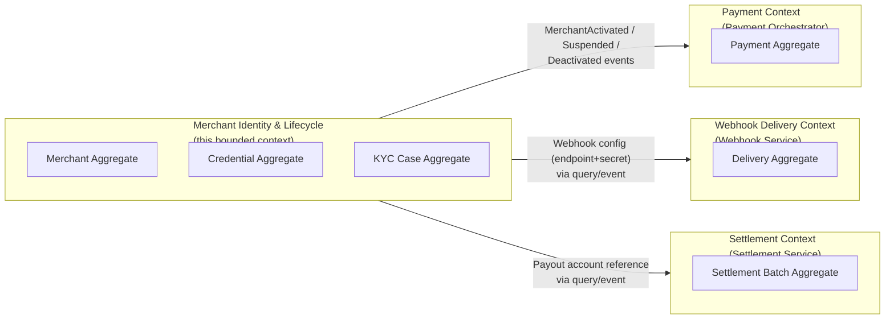

Context mapping relationship: **Customer-Supplier**, with Merchant
Service as the upstream supplier for identity/config data to Payment
Orchestrator, Webhook Service, and Settlement Service (all downstream
consumers). Merchant Service defines the contract (event schema, query
API shape); consumers adapt to it, not the reverse — this is deliberate,
since merchant identity is the more stable, foundational concept
relative to the consuming services' own evolution.

---

# 11. Domain Model

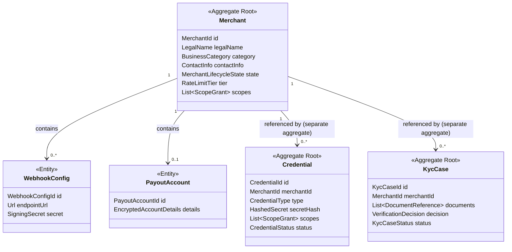

Credential and KycCase are modeled as **separate aggregates** from
Merchant, not entities within it, because they have independent
lifecycle and concurrency needs (issuing a new credential should never
require locking the entire Merchant aggregate, and a KYC review workflow
can be long-running and involve a different actor — a compliance
reviewer — than merchant self-service actions). WebhookConfig and
PayoutAccount remain entities within the Merchant aggregate since they
are small, tightly coupled to merchant configuration, and changed
infrequently enough that aggregate-level locking is not a contention
concern.

---

# 12. Aggregates

## 12.1 Merchant Aggregate
- **Aggregate Root:** `Merchant`
- **Invariants enforced within the aggregate boundary:**
  - Lifecycle state transitions must follow the defined state machine
    (§17) — no direct state field mutation is exposed; only named
    transition methods (`activate()`, `suspend(reason)`,
    `deactivate(reason)`) that internally validate the current state
    permits the transition.
  - A `WebhookConfig` can only be added while the merchant is `ACTIVE`.
  - A `PayoutAccount` can only be set/updated while the merchant is
    `ACTIVE`.
- **Concurrency control:** optimistic locking via a `version` column,
  since lifecycle transitions are infrequent but must never be lost to
  a race (e.g. simultaneous suspend-for-fraud and merchant-initiated
  deactivate).

## 12.2 Credential Aggregate
- **Aggregate Root:** `Credential`
- **Invariants:**
  - A credential can only be created referencing a merchant that is
    `ACTIVE` at creation time (checked via a domain service that queries
    Merchant state — cross-aggregate invariant, enforced at the
    application layer since a single aggregate cannot enforce a rule
    depending on another aggregate's state directly).
  - Once `REVOKED`, a credential can never transition back to `ACTIVE`
    — revocation is terminal, by design, to keep audit trails
    unambiguous (a "new" credential is issued instead of "un-revoking").

## 12.3 KycCase Aggregate
- **Aggregate Root:** `KycCase`
- **Invariants:**
  - A `VerificationDecision` once recorded is immutable; a changed
    outcome requires opening a new `KycCase`, never editing history —
    this directly supports the immutable-audit-trail business goal
    (§5).
  - A `KycCase` cannot reach `APPROVED` status without at least one
    `DocumentReference` of each mandatory document type configured for
    the merchant's jurisdiction/category.

---

# 13. Entities

| Entity | Belongs To | Notes |
|---|---|---|
| `WebhookConfig` | Merchant aggregate | Has local identity (`WebhookConfigId`) distinct from its values; a merchant can have several, each independently disabled without affecting others |
| `PayoutAccount` | Merchant aggregate | Local identity retained to support an audit history of account changes over time (a merchant may change bank accounts; prior `PayoutAccount` entities are retained, marked inactive, not deleted) |
| `DocumentReference` | KycCase aggregate | References an external document store entry; identity matters because the same case tracks multiple documents with independent verification status |

---

# 14. Value Objects

| Value Object | Fields (conceptual) | Why it's a Value Object (immutable, no identity) |
|---|---|---|
| `MerchantId` | UUID | Identity-bearing but immutable and equality-by-value once assigned |
| `LegalName` | normalized string | No identity of its own; two merchants can share a legal name string without being the same concept |
| `ContactInfo` | email, phone | Replaced wholesale on update, never mutated field-by-field, avoiding partial-update inconsistency |
| `RateLimitTier` | enum: STANDARD, GROWTH, ENTERPRISE | Pure classification, no identity |
| `ScopeGrant` | scope string, grantedAt | Equality by value; a set of scopes is compared, not tracked individually over time |
| `HashedSecret` | algorithm, hash, salt | Immutable once computed; never "updated," only replaced by issuing a new Credential |
| `Url` (for webhook endpoints) | validated HTTPS URL string | Immutable, structurally validated at construction — an invalid URL literally cannot be represented |
| `EncryptedAccountDetails` | ciphertext, key version | Immutable; a "changed" bank account is a new `PayoutAccount` entity, not a mutated value object |
| `VerificationDecision` | outcome, decidedBy, decidedAt, rationale | Immutable record of a point-in-time decision |

Value objects are used deliberately wherever a concept's *equality is
defined by its data*, not by continuity of identity over time — this
keeps the aggregates honest about what actually needs identity-based
tracking (entities) versus what is just a well-typed piece of data
(value objects), directly supporting the Java 21 "Records where
appropriate" standard from the platform engineering standards.

---

# 15. Domain Events

| Event | Published When | Consumed By |
|---|---|---|
| `MerchantRegistered` | Merchant profile created, state → `PENDING_VERIFICATION` | Internal audit; KYC workflow trigger |
| `MerchantVerificationApproved` | KYC decision recorded as approved | Merchant aggregate (triggers `activate()`) |
| `MerchantVerificationRejected` | KYC decision recorded as rejected | Merchant aggregate (remains non-active), notification path |
| `MerchantActivated` | State transition to `ACTIVE` | API Gateway (credential cache warm), Payment Orchestrator, Settlement Service |
| `MerchantSuspended` | State transition to `SUSPENDED` | API Gateway (immediate credential/scope invalidation), Payment Orchestrator (block new payment initiation for this merchant) |
| `MerchantDeactivated` | State transition to `DEACTIVATED` (terminal) | API Gateway, Payment Orchestrator, Settlement Service (final payout trigger) |
| `MerchantCredentialIssued` | New API key/OAuth2 client created | API Gateway (cache warm) |
| `MerchantCredentialRevoked` | Credential revoked | API Gateway (immediate cache invalidation) |
| `WebhookConfigUpdated` | Webhook endpoint/secret added or changed | Webhook Service (local read-model refresh) |
| `PayoutAccountUpdated` | Settlement bank details changed | Settlement Service (local read-model refresh) |

All events follow the platform-standard envelope (Event ID, Event Type,
Aggregate ID, Version, Correlation ID, Causation ID, Timestamp, Payload)
defined in `SYSTEM_DESIGN.md` §5, published via Transactional Outbox in
the same local transaction as the state change, never as a
best-effort post-commit side call.

---

# 16. Merchant Lifecycle

The lifecycle is the domain's central concept — nearly every other
requirement in this document exists to correctly gate transitions
through it.

---

# 17. Merchant State Machine

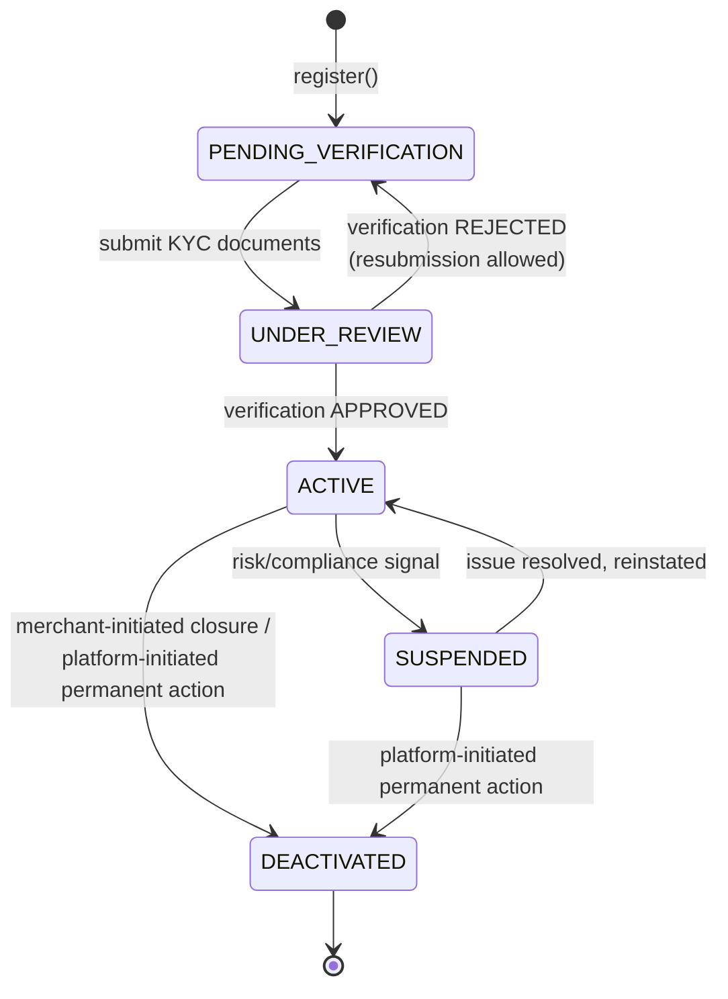

**Design rationale:**
- `PENDING_VERIFICATION` and `UNDER_REVIEW` are kept distinct
  (rather than a single "pending" state) because they have different
  meanings for operational dashboards: the former means "waiting on the
  merchant," the latter means "waiting on us" — this distinction alone
  has resolved real onboarding-funnel confusion in comparable platforms.
- `REJECTED` is modeled as a **transition back to
  `PENDING_VERIFICATION`**, not a separate terminal state, because
  rejection in KYC is very frequently about missing/incorrect
  documentation, not a permanent decision — allowing resubmission
  without a new merchant registration keeps the audit trail continuous
  under one `MerchantId`.
- `SUSPENDED` is always reversible back to `ACTIVE` by design — it
  represents a temporary hold, never a permanent decision. A permanent
  decision is modeled explicitly as `DEACTIVATED`, which is terminal.
  Conflating the two (as many simpler systems do with a single
  "disabled" flag) would make it ambiguous whether reinstatement is
  ever appropriate — this platform makes that distinction structural,
  not a comment or a convention.
- `DEACTIVATED` is terminal (no outgoing transitions) because
  reactivating a closed merchant account raises identity/compliance
  questions (is this really the same legal entity, does prior KYC still
  hold) that are better handled as a fresh registration under a
  business decision, not a state machine transition.

---

# 18. Merchant Onboarding Workflow

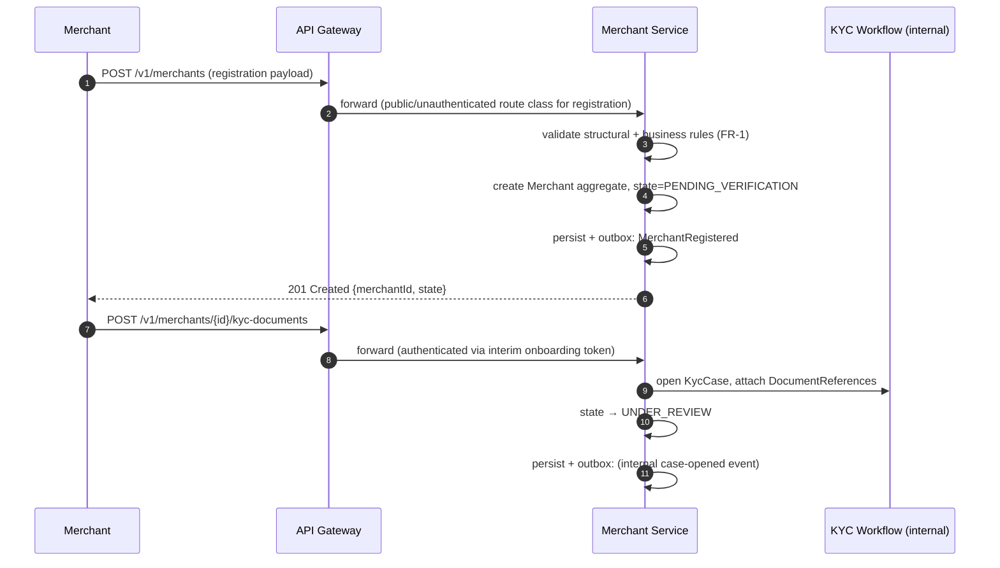

Registration itself is intentionally reachable without a full merchant
credential (which does not exist yet) — it uses a lightweight,
heavily-rate-limited public route class at the Gateway, distinct from
the authenticated merchant-API route classes used for everything after.

---

# 19. Merchant Verification Workflow

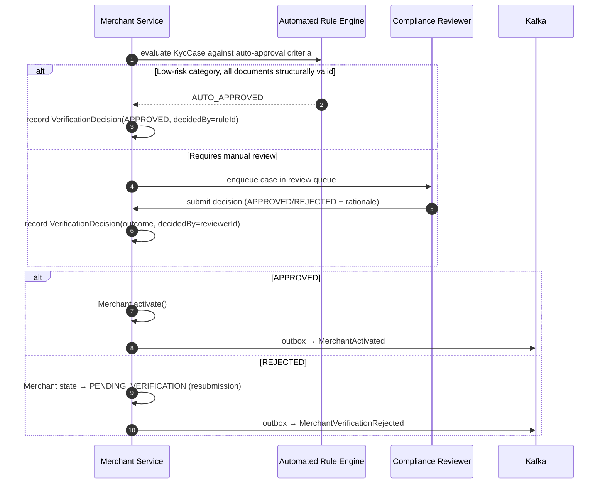

Automated and manual paths converge on the same `VerificationDecision`
recording step, so downstream logic (activation, audit) never needs to
know which path produced the decision — this uniformity is a deliberate
simplification that keeps the aggregate's invariants path-independent.

---

# 20. Merchant Activation Workflow

- Triggered exclusively by a recorded `VerificationDecision(APPROVED)`
  — there is no code path that activates a merchant without a decision
  record existing first; this is enforced inside the `Merchant`
  aggregate's `activate()` method, which requires the decision reference
  as a parameter, making it structurally impossible to call otherwise.
- On activation: `MerchantActivated` event published; this is the
  trigger for the Merchant Service to allow credential issuance (FR-3.1)
  for the first time.
- Activation does not itself issue a credential — credential issuance
  remains a separate, explicit merchant action (or admin action for
  first-key issuance), keeping "verified" and "has active credentials"
  as independently auditable facts.

---

# 21. Merchant Suspension Workflow

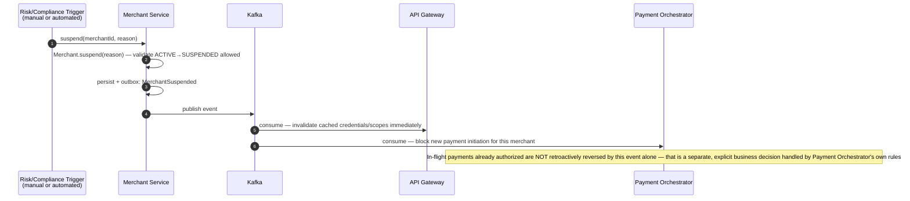

Suspension is designed to take effect platform-wide within one
event-propagation cycle without requiring any downstream service to
poll — this directly serves the "operational ability to respond to risk
signals quickly" business goal (§5). The explicit note about in-flight
payments is included because it is a common and dangerous ambiguity:
suspension stops *new* activity; it does not silently rewrite the state
of payments already in flight, which would violate the append-only
ledger principle owned by the Payment Orchestrator.

---

# 22. Merchant Deactivation Workflow

- Reachable from `ACTIVE` or `SUSPENDED`.
- Two initiation paths, both converging on the same aggregate method
  (`deactivate(reason, initiatedBy)`):
  - **Merchant-initiated:** self-service account closure request.
  - **Platform-initiated:** permanent risk/compliance decision following
    an escalation that suspension alone does not resolve.
- On deactivation: all active credentials are revoked as part of the
  same use case (not left dangling), each producing its own
  `MerchantCredentialRevoked` event, and `MerchantDeactivated` is
  published, which triggers Settlement Service to process any final
  pending payout before closing the merchant's settlement account.
- Deactivation is terminal by design (§17 rationale).

---

# 23. KYC Workflow

The KYC workflow is modeled as its own aggregate (`KycCase`, §12.3)
rather than fields on `Merchant`, specifically so that:
- Multiple historical KYC cases can exist per merchant (e.g. an initial
  rejection followed by a successful resubmission) without overwriting
  history.
- The review queue and reviewer-assignment concerns can evolve
  independently of the Merchant aggregate's own concurrency profile.

**Workflow steps:**
1. `KycCase` opened when documents are first submitted (§18).
2. Structural validation of document references (correct type present,
   not expired per any provided metadata) — content validation
   (verifying the document is authentic) is explicitly out of scope for
   this service's own logic; it is either delegated to the automated
   rule engine's own external verification integrations or a human
   reviewer, both of which report back a decision this service simply
   records.
3. Automated or manual decision recorded (§19).
4. On approval: `KycCase.status = APPROVED`, feeds `Merchant.activate()`.
5. On rejection: `KycCase.status = REJECTED`, case remains as a
   permanent historical record; a *new* `KycCase` is opened if the
   merchant resubmits, rather than reopening the rejected one — this
   is what makes "how many times has this merchant been rejected before
   approval" an answerable audit question.

---

# 24. Business Rules

- A merchant cannot receive a `Credential` unless `Merchant.state ==
  ACTIVE` at issuance time (checked, not merely documented).
- A merchant cannot configure a `WebhookConfig` or `PayoutAccount`
  unless `Merchant.state == ACTIVE`.
- A `SUSPENDED` merchant retains its existing `WebhookConfig` and
  `PayoutAccount` data (not deleted) but all `Credential`s are treated
  as unusable for new requests (enforced at the API Gateway via the
  `MerchantSuspended` event's cache invalidation, and re-checked at
  Payment Orchestrator as defense-in-depth).
- A `KycCase` cannot be approved without at least one document
  reference per mandatory document type for the merchant's declared
  jurisdiction and business category.
- Duplicate registration using the same verified tax identifier is
  rejected at the domain service level (application layer), since
  uniqueness is a cross-aggregate-instance concern the database's unique
  constraint enforces as the ultimate guarantee, with the domain layer
  providing an earlier, friendlier rejection path.
- Every lifecycle transition must reference a `reason` (free-text or
  coded) for `SUSPENDED` and `DEACTIVATED` transitions specifically —
  `ACTIVE`-reaching transitions reference a `VerificationDecision`
  instead, since "why" is inherent to that decision record.

---

# 25. Validation Rules

| Field | Rule |
|---|---|
| `legalName` | Non-empty, max 255 chars, no control characters |
| `contactInfo.email` | RFC 5322 structurally valid |
| `taxIdentifier` | Format-validated per declared country; uniqueness enforced across all non-`DEACTIVATED` merchants |
| `webhookConfig.endpointUrl` | Must be `https://`, well-formed URL, not a private/loopback address (SSRF-prevention check) |
| `payoutAccount` details | Format-validated per declared country's banking identifier scheme before encryption |
| `document reference type` | Must match one of the mandatory-document-type enum values configured for the merchant's category/jurisdiction |
| `scope grant` | Must be one of the platform's defined scope enum values; unknown scopes rejected outright, never silently ignored |

---

# 26. High-Level Architecture

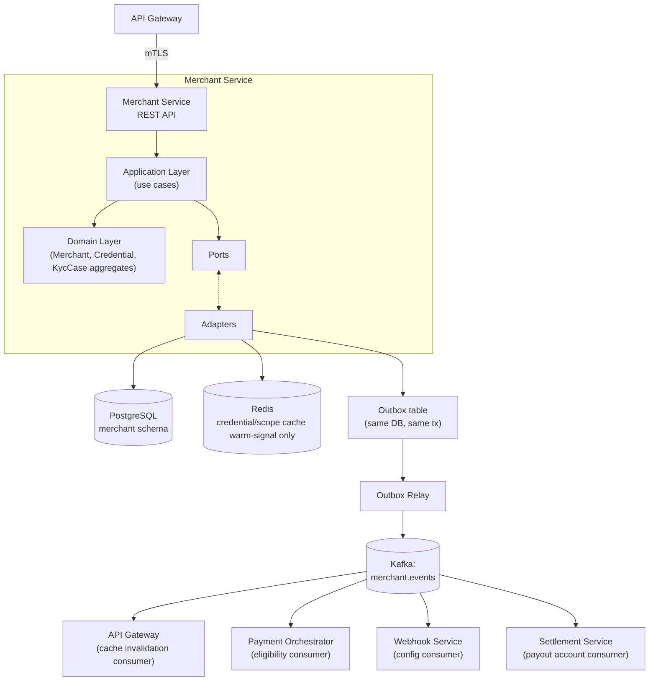

The Merchant Service does **not** itself hold a Redis-backed cache for
serving reads at scale — that cache lives at the API Gateway (per the
API Gateway spec §32), populated via the query API and refreshed via
these events. This avoids duplicating cache-invalidation logic across
two services for the same underlying data.

---

# 27. Low-Level Architecture

Request handling follows a straightforward layered flow (simpler than
the API Gateway's filter chain, since this service has genuine business
logic rather than pure cross-cutting concerns):

1. **Controller** receives the REST request, maps to a command/query DTO.
2. **Application Use Case** (e.g. `RegisterMerchantUseCase`,
   `SuspendMerchantUseCase`) orchestrates: loads the aggregate via a
   repository port, invokes the aggregate's domain method, persists via
   the repository port (which internally writes both the aggregate
   state and the outbox event row in one local transaction).
3. **Domain layer** aggregates enforce invariants and raise domain
   events internally (collected by the use case, then handed to the
   outbox-writing repository call).
4. **Response mapping** converts the persisted aggregate's public state
   into a Response DTO — never exposing the aggregate or entity objects
   directly, per the platform's DTO Rules.

This is intentionally **not** CQRS-split for writes — the Merchant
Service's write volume is low enough that a unified read/write model
per aggregate is simpler and sufficient. CQRS is reserved (per the
platform's "CQRS only where necessary" principle) for the query-heavy
read side described next.

## 27.1 Where CQRS Applies
- The **query side** for API Gateway credential/scope resolution is
  modeled as a separate, denormalized read path (a `MerchantAuthView`
  projection table, updated via the same outbox events this service
  already publishes to itself as an internal consumer) — this is the
  one place CQRS earns its complexity, because the read shape needed
  (flat: credential hash → merchant ID + scopes + tier) is meaningfully
  different from the normalized aggregate structure, and this read path
  is hit far more often (every Gateway request, cache-miss path) than
  the write side.

---

# 28. Clean Architecture Layers

**Domain Layer (innermost):** `Merchant`, `Credential`, `KycCase`
aggregates, their entities and value objects, domain events, and
domain services for cross-aggregate invariants (e.g.
`CredentialIssuancePolicy` which checks Merchant state before allowing
`Credential` creation). Pure Java 21 (records, sealed classes for
lifecycle states), no Spring/framework dependency.

**Application Layer:** Use cases (`RegisterMerchantUseCase`,
`SubmitKycDocumentsUseCase`, `RecordVerificationDecisionUseCase`,
`SuspendMerchantUseCase`, `DeactivateMerchantUseCase`,
`IssueCredentialUseCase`, `RevokeCredentialUseCase`,
`ConfigureWebhookUseCase`, `ConfigurePayoutAccountUseCase`). Depends
only on domain layer and port interfaces.

**Adapter Layer:** Repository implementations (Spring Data JPA or
R2DBC-backed, per the platform's JDBC-vs-R2DBC ADR), the Outbox writer
adapter, the Kafka producer adapter (via the Outbox Relay), the KYC
document-store client adapter, the encryption adapter (AES-256 for
payout account details) backed by the Secret Manager abstraction.

**Framework/Infrastructure Layer (outermost):** Spring Boot
controllers, Spring Security configuration (mTLS from Gateway,
internal-service-token validation), Flyway migrations, Actuator health
endpoints.

---

# 29. Package Structure

```
merchant-service/
└── src/main/java/.../merchant/
    ├── config/
    ├── controller/
    │   ├── MerchantController.java
    │   ├── CredentialController.java
    │   ├── KycController.java
    │   └── WebhookConfigController.java
    ├── application/
    │   ├── command/
    │   │   ├── RegisterMerchantUseCase.java
    │   │   ├── SuspendMerchantUseCase.java
    │   │   ├── DeactivateMerchantUseCase.java
    │   │   ├── IssueCredentialUseCase.java
    │   │   ├── RevokeCredentialUseCase.java
    │   │   ├── SubmitKycDocumentsUseCase.java
    │   │   └── RecordVerificationDecisionUseCase.java
    │   └── query/
    │       ├── GetMerchantAuthViewUseCase.java
    │       └── GetMerchantProfileUseCase.java
    ├── domain/
    │   ├── merchant/
    │   │   ├── Merchant.java
    │   │   ├── MerchantLifecycleState.java   # sealed
    │   │   ├── WebhookConfig.java
    │   │   └── PayoutAccount.java
    │   ├── credential/
    │   │   ├── Credential.java
    │   │   ├── CredentialType.java
    │   │   └── CredentialIssuancePolicy.java  # domain service
    │   ├── kyc/
    │   │   ├── KycCase.java
    │   │   ├── DocumentReference.java
    │   │   └── VerificationDecision.java
    │   ├── event/
    │   │   ├── MerchantRegistered.java
    │   │   ├── MerchantActivated.java
    │   │   ├── MerchantSuspended.java
    │   │   ├── MerchantDeactivated.java
    │   │   ├── MerchantCredentialIssued.java
    │   │   └── MerchantCredentialRevoked.java
    │   └── vo/
    │       ├── MerchantId.java
    │       ├── LegalName.java
    │       ├── ContactInfo.java
    │       ├── ScopeGrant.java
    │       ├── HashedSecret.java
    │       └── EncryptedAccountDetails.java
    ├── port/
    │   ├── MerchantRepositoryPort.java
    │   ├── CredentialRepositoryPort.java
    │   ├── KycCaseRepositoryPort.java
    │   ├── OutboxWriterPort.java
    │   ├── DocumentStoreClientPort.java
    │   └── EncryptionPort.java
    ├── adapter/
    │   ├── persistence/
    │   │   ├── MerchantJpaRepositoryAdapter.java
    │   │   ├── CredentialJpaRepositoryAdapter.java
    │   │   └── KycCaseJpaRepositoryAdapter.java
    │   ├── outbox/
    │   │   └── OutboxWriterAdapter.java
    │   ├── documentstore/
    │   │   └── DocumentStoreClientAdapter.java
    │   └── encryption/
    │       └── Aes256EncryptionAdapter.java
    ├── entity/           # JPA/R2DBC persistence entities (distinct from domain model)
    ├── dto/
    │   ├── request/
    │   └── response/
    ├── mapper/
    ├── exception/
    ├── security/
    ├── validation/
    ├── event/
    │   ├── producer/
    │   └── consumer/     # self-consumes own events to build MerchantAuthView projection
    ├── scheduler/
    ├── client/
    └── constant/
```

Note the explicit separation between `domain/merchant/Merchant.java`
(the pure domain aggregate) and `entity/` (the persistence-mapped JPA
entity) — this is a deliberate Clean Architecture boundary preventing
persistence-framework annotations from leaking into domain logic,
consistent with the platform's Entity Rules ("persistence concerns
only, no business logic").

---

# 30. Component Diagram

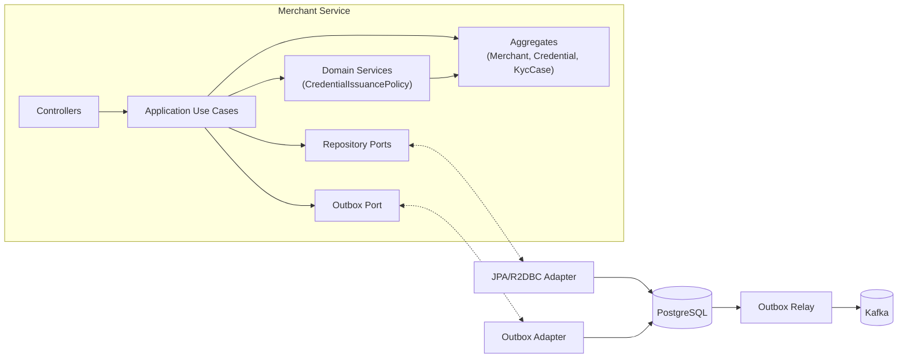

---

# 31. Sequence Diagrams

## 31.1 Credential Issuance (cross-aggregate invariant in action)

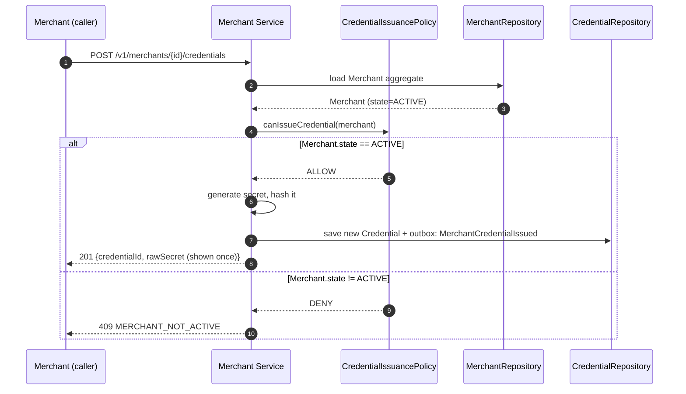

## 31.2 Query Path Used by API Gateway (CQRS read side)

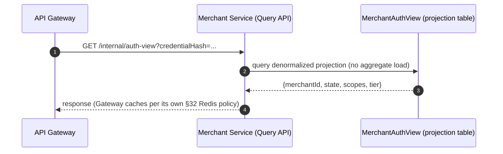

The projection table (`MerchantAuthView`) is kept up to date by the
Merchant Service's own internal consumer of its own outbox
events — the same event stream external services consume from — so
there is exactly one code path that produces state changes, and the
fast read-projection is just another (internal) subscriber to it, not a
special-cased shortcut that could drift out of sync with the aggregate's
true state.

# Merchant Service — Software Architecture Specification
## Part 2 of 4: API Contracts, Configuration, Security

---

# 32. REST API Specification

The Merchant Service exposes two distinct API surfaces, deliberately
separated because their callers, trust levels, and change cadence
differ:

| Surface | Callers | Trust Level | Examples |
|---|---|---|---|
| **External Merchant API** | Merchant servers, merchant dashboard, via API Gateway | Authenticated per-merchant (JWT/OAuth2/API Key) | Registration, KYC submission, webhook config, payout config, credential self-service |
| **Internal Service API** | API Gateway, Payment Orchestrator, Webhook Service, Settlement Service | mTLS + internal service identity only, never merchant-credentialed | `MerchantAuthView` query, eligibility check, config lookups |

The internal surface is never reachable through the public Gateway
route table — it is only resolvable via internal service discovery,
consistent with the Service Boundaries defined in Part 1 §8.

---

# 33. API Versioning

- URI-based versioning (`/v1/...`), identical strategy to the platform
  standard established in the API Gateway spec, for consistency of
  merchant integration experience across all services.
- The Merchant Service's version lifecycle is independent of other
  services' versions — a `/v2/merchants` change does not imply any
  other service changes version simultaneously.
- Internal Service API is versioned separately (`/internal/v1/...`)
  from the external surface, since internal consumers are deployed
  in lockstep with this team and can tolerate a faster, less
  ceremony-heavy versioning cadence than external merchant-facing
  contracts.

---

# 34. URI Standards

```
/v1/merchants
/v1/merchants/{merchantId}
/v1/merchants/{merchantId}/kyc-documents
/v1/merchants/{merchantId}/kyc-cases/{kycCaseId}
/v1/merchants/{merchantId}/credentials
/v1/merchants/{merchantId}/credentials/{credentialId}
/v1/merchants/{merchantId}/credentials/{credentialId}/rotate
/v1/merchants/{merchantId}/webhook-configs
/v1/merchants/{merchantId}/webhook-configs/{webhookConfigId}
/v1/merchants/{merchantId}/payout-account
/v1/merchants/{merchantId}/payment-methods

/internal/v1/auth-view
/internal/v1/merchants/{merchantId}/eligibility
/internal/v1/merchants/{merchantId}/webhook-config
/internal/v1/merchants/{merchantId}/payout-account
```

- Resource nesting under `{merchantId}` reflects true aggregate
  ownership (webhook configs, credentials, payout account all belong to
  exactly one merchant) — never a flat top-level collection requiring a
  separate merchant-scoping query parameter.
- Lifecycle transitions (`suspend`, `deactivate`, `reactivate`) are
  modeled as `POST /v1/merchants/{id}/suspend` etc. — resource-state
  transition endpoints, mirroring the Payment Orchestrator's
  capture/cancel pattern from the API Gateway spec, for platform-wide
  URI consistency.
- `rotate` on a credential is a transition endpoint, not a `PUT`,
  because rotation has side effects (old secret invalidated, new one
  issued) beyond a simple field replacement — see §41.

---

# 35. DTO Standards

Following the platform's DTO Rules (never expose entities, separate
Request/Response DTOs, validate all incoming requests, prefer immutable
DTOs):

- All DTOs are Java 21 `record` types — immutable by construction,
  concise, and free of setter-based partial-construction bugs.
- Request DTOs never contain a `state` or `id`-mutation field for
  fields the domain layer must control (e.g. `MerchantLifecycleState` is
  never a settable field on any request DTO — it is only ever changed
  via named transition endpoints).
- Response DTOs never expose internal identifiers unrelated to the
  public contract (e.g. internal `version` optimistic-lock counters are
  omitted from response bodies).
- Sensitive fields (`rawSecret`, KYC document binary content) are never
  included in any Response DTO except the single one-time credential-
  issuance response (§41).

---

# 36. Request Models

| DTO | Used By | Key Fields (conceptual) |
|---|---|---|
| `RegisterMerchantRequest` | `POST /v1/merchants` | legalName, businessCategory, contactInfo, countryOfRegistration, taxIdentifier |
| `SubmitKycDocumentsRequest` | `POST /v1/merchants/{id}/kyc-documents` | list of {documentType, documentStoreReference} |
| `RecordVerificationDecisionRequest` | Internal/admin only | outcome, rationale, reviewerId |
| `SuspendMerchantRequest` | `POST /v1/merchants/{id}/suspend` | reason, triggeredBy |
| `DeactivateMerchantRequest` | `POST /v1/merchants/{id}/deactivate` | reason, initiatedBy (MERCHANT/PLATFORM) |
| `IssueCredentialRequest` | `POST /v1/merchants/{id}/credentials` | credentialType (API_KEY/OAUTH2_CLIENT), requestedScopes |
| `ConfigureWebhookRequest` | `POST /v1/merchants/{id}/webhook-configs` | endpointUrl, eventTypesSubscribed |
| `ConfigurePayoutAccountRequest` | `PUT /v1/merchants/{id}/payout-account` | bankAccountNumber, routingDetails, accountHolderName |
| `ConfigurePaymentMethodsRequest` | `PUT /v1/merchants/{id}/payment-methods` | enabledMethods (CARD, NET_BANKING), perMethodLimits |

All request DTOs are validated via Bean Validation annotations at the
controller boundary (structural: non-null, format, length) before
reaching the application layer; business-rule validation (§24 of Part
1) happens inside use cases/domain aggregates, never in the controller.

---

# 37. Response Models

| DTO | Returned By | Notes |
|---|---|---|
| `MerchantResponse` | Registration, profile GET | id, legalName, category, state, tier, createdAt — never taxIdentifier in full (masked) |
| `KycCaseResponse` | KYC submission, case GET | id, status, submittedDocuments (metadata only), decision (if resolved) |
| `CredentialIssuedResponse` | Credential issuance only | id, credentialType, scopes, **rawSecret (present exactly once, this response only)** |
| `CredentialResponse` | Credential GET/list | id, credentialType, scopes, status, createdAt, lastRotatedAt — never secretHash or rawSecret |
| `WebhookConfigResponse` | Webhook config GET/list | id, endpointUrl, eventTypesSubscribed, createdAt — never the signing secret after initial creation |
| `PayoutAccountResponse` | Payout account GET | id, maskedAccountNumber (last 4 digits only), accountHolderName, status |
| `MerchantAuthViewResponse` | Internal API only | merchantId, state, scopes, tier — the CQRS projection response from Part 1 §31.2 |

---

# 38. Error Models

Reuses the platform-standard error envelope defined in the API Gateway
spec §17.5, with Merchant-Service-specific error codes:

```json
{
  "error": {
    "code": "MERCHANT_NOT_ACTIVE",
    "message": "Credential issuance requires an ACTIVE merchant.",
    "correlationId": "c7e1...-uuid",
    "timestamp": "2026-07-22T10:15:30Z",
    "details": []
  }
}
```

| Code | HTTP Status | Trigger |
|---|---|---|
| `MERCHANT_NOT_FOUND` | 404 | Referenced merchantId does not exist |
| `DUPLICATE_TAX_IDENTIFIER` | 409 | Registration with an already-verified tax ID |
| `INVALID_LIFECYCLE_TRANSITION` | 409 | Requested transition not permitted from current state (§17, Part 1) |
| `MERCHANT_NOT_ACTIVE` | 409 | Credential/webhook/payout config action attempted on non-`ACTIVE` merchant |
| `KYC_DOCUMENTS_INCOMPLETE` | 400 | Mandatory document type missing at case-approval attempt |
| `INVALID_WEBHOOK_URL` | 400 | Endpoint URL fails HTTPS/SSRF-prevention validation (§25, Part 1) |
| `CREDENTIAL_ALREADY_REVOKED` | 409 | Attempt to revoke/rotate an already-`REVOKED` credential |
| `SCOPE_NOT_RECOGNIZED` | 400 | Requested scope not in the platform's defined enum |

Errors originating from other services (e.g. a downstream call failing)
are never reformatted or relabeled as Merchant Service error codes —
that pass-through discipline mirrors the API Gateway's exception mapping
rule.

---

# 39. Validation Strategy

Three-tier validation, mirroring the layered architecture:

1. **Structural (Controller/DTO layer):** Bean Validation annotations —
   non-null, string length, format (email, URL). Fails fast, cheapest to
   run, never touches the database.
2. **Business rule (Application layer):** cross-field and cross-
   aggregate rules — e.g. duplicate tax identifier check (requires a DB
   query), scope-enum recognition, mandatory-document-type-per-
   jurisdiction check.
3. **Invariant (Domain layer):** rules the aggregate itself refuses to
   violate regardless of caller — e.g. `Merchant.activate()` throws if
   no approved `VerificationDecision` reference is provided; this is
   the last line of defense and is what makes the aggregate safe to
   call from any future code path (admin tool, batch job, migration
   script) without re-deriving the same checks elsewhere.

---

# 40. Authentication

## 40.1 OAuth2
- Client-credentials grant for merchant server-to-server integrations
  choosing OAuth2 over static API keys — identical trust model to the
  API Gateway spec §25.3, since the Gateway is what actually performs
  token validation; the Merchant Service's role here is solely **issuing
  and managing the OAuth2 client registration** (client ID, hashed
  client secret, allowed scopes) that the platform's Identity Provider
  uses to mint tokens.

## 40.2 JWT
- The Merchant Service does not itself validate merchant-facing JWTs on
  the external surface — that is the Gateway's job (per the API Gateway
  spec). The Merchant Service does validate **internal service JWTs/mTLS
  identity** for calls arriving on `/internal/v1/**`, ensuring only
  recognized platform services (not even an internal developer's ad hoc
  script) can reach the eligibility/config query endpoints.

## 40.3 API Keys
- Static, high-entropy (≥256-bit) keys, generated at issuance time,
  returned to the merchant exactly once (§37), and stored here only as
  a salted hash (Argon2id) — identical non-reversibility guarantee as
  the Gateway spec's API key validation section (§25.12) describes
  consuming.
- Each key carries an explicit scope set assigned at issuance,
  independently revocable from other keys the same merchant holds.

---

# 41. Secret Rotation

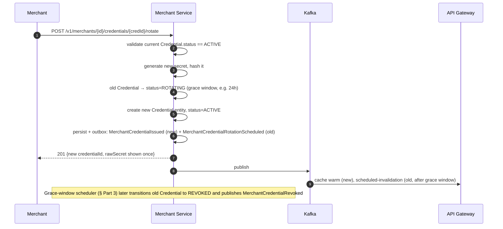

- Rotation issues a **new** credential alongside the old one, valid for
  a configurable grace window, rather than an atomic swap — this
  prevents a hard cutover from breaking a merchant's in-flight deploy of
  their new key.
- The old credential is never simply "kept alive indefinitely" — a
  scheduled job (detailed in Part 3, Scheduler section) enforces the
  grace window expiry, guaranteeing rotation actually completes rather
  than becoming a permanent two-keys-forever state by neglect.

---

# 42. Merchant Credentials

Already modeled in Part 1 (§12.2 Credential Aggregate); this section
covers the API-facing lifecycle:

| Status | Meaning | Reachable Transitions |
|---|---|---|
| `ACTIVE` | Usable for authentication | → `ROTATING`, → `REVOKED` |
| `ROTATING` | Superseded by a newer credential, usable only during grace window | → `REVOKED` (automatic, on grace window expiry) |
| `REVOKED` | Terminal, permanently unusable | none |

Credential status is distinct from, and orthogonal to, `Merchant`
lifecycle state — a `SUSPENDED` merchant's credentials remain
technically `ACTIVE` at the Credential-aggregate level (their data isn't
touched), but are treated as unusable platform-wide via the
`MerchantSuspended` event's cache-invalidation effect at the Gateway —
this separation keeps "is this specific key valid" and "is this
merchant currently allowed to transact" as independently auditable
facts, consistent with the layered defense-in-depth philosophy also
used in the API Gateway spec.

---

# 43. Webhook Configuration

- A merchant may register multiple `WebhookConfig` entries, each scoped
  to a subset of event types (`eventTypesSubscribed`) — e.g. a merchant
  may want `payment.captured` events on one endpoint and
  `settlement.completed` events on another.
- The signing secret is generated at config-creation time, shown once
  in the creation response (identical one-time-disclosure pattern to
  credential issuance, §37), and never retrievable again — only
  rotatable (same rotation shape as §41, scoped to `WebhookConfig`
  instead of `Credential`).
- Endpoint URL structural validation (§25, Part 1) runs at creation and
  at every update — this service never performs a synchronous
  reachability check (e.g. an HTTP HEAD request to the merchant's URL)
  as part of the request/response cycle, since that would make this
  service's write latency dependent on an arbitrary external endpoint's
  responsiveness; delivery-time reachability is entirely the Webhook
  Service's concern.

---

# 44. Payment Method Configuration

- Merchant-level configuration of which payment methods are enabled
  (`CARD`, `NET_BANKING`) and any per-method limits (e.g. a
  merchant-specific maximum transaction amount for net banking).
- This is **configuration only** — the Merchant Service does not
  enforce these limits itself; it publishes them (via the same
  query/event mechanism as webhook config) for the Payment Orchestrator
  to enforce at authorization time, keeping the actual enforcement
  colocated with the rest of payment business logic rather than split
  across two services.

---

# 45. Settlement Configuration

- Consists of the `PayoutAccount` entity (Part 1 §12.1) plus
  merchant-level settlement preferences (payout frequency, e.g. daily
  vs weekly, if the platform's settlement design supports merchant
  choice — otherwise a fixed nightly cadence per `SYSTEM_DESIGN.md`).
- `PayoutAccount` updates create a **new** entity record rather than
  mutating the existing one (Part 1 §13), preserving a full audit
  history of every bank account a merchant has ever used for payouts —
  directly relevant to fraud investigation (a common fraud pattern is
  redirecting payouts to a new account shortly before requesting a large
  transaction volume).
- Settlement Service consumes `PayoutAccountUpdated` events to refresh
  its own local read model; it never queries this service's database
  directly, preserving the database-per-service boundary from
  `SYSTEM_DESIGN.md`.

---

# 46. Merchant Configuration

Consolidated summary of all configuration this service owns (cross-
referencing the detailed sections above), presented once here as the
canonical checklist for what "merchant configuration" means on this
platform:

- Profile (legal name, category, contact info, country)
- Lifecycle state and its audit trail
- Credentials (API keys / OAuth2 clients) and their scopes
- Webhook endpoints and signing secrets
- Payout account (settlement destination)
- Enabled payment methods and per-method limits
- Rate-limit tier assignment

---

# 47. Idempotency

- Mutating endpoints that create a resource with real-world side
  effects the merchant would not want duplicated — `POST
  /v1/merchants` (registration), `POST .../credentials` (issuance),
  `POST .../webhook-configs` (creation) — require an `Idempotency-Key`
  header, enforced structurally at the Gateway (per its spec §17.3/
  FR-4) and deduplicated here via a unique constraint on `(merchantId,
  idempotencyKey, endpoint)` combined with a short-lived idempotency
  record table, mirroring the platform-standard idempotency pattern
  from `SYSTEM_DESIGN.md`.
- Lifecycle transition endpoints (`suspend`, `deactivate`) are naturally
  idempotent by design (calling `suspend` twice on an already-`SUSPENDED`
  merchant is a no-op returning the current state, not an error) — this
  is a deliberate simplification versus requiring an Idempotency-Key on
  every single mutating route, since these specific operations have no
  meaningful "duplicate side effect" to prevent beyond what the state
  machine already guarantees.

---

# 48. Rate Limiting

- Primary rate limiting for external merchant traffic is enforced at
  the API Gateway (per its spec §22), using the `RateLimitTier` this
  service assigns and exposes via the `MerchantAuthView` projection.
- The Merchant Service additionally enforces a **stricter, separate
  limit on registration and KYC-submission endpoints specifically**,
  since these are reachable without a merchant credential yet existing
  and are consequently a higher-value target for automated abuse
  (fake-merchant registration spam) — this limit is IP-based and
  configured independently of the Gateway's per-merchant tiers.

---

# 49. CORS

- The merchant dashboard (browser-based) origin is the only CORS-
  allow-listed origin for any Merchant Service route reachable via
  browser session — identical allow-list discipline to the API Gateway
  spec §25.8, enforced primarily at the Gateway layer; the Merchant
  Service's own CORS configuration exists as defense-in-depth in case a
  route is ever reachable through a path that bypasses the Gateway
  (which should never happen by design, but is not assumed to never
  happen by omission).

---

# 50. mTLS

- Every call arriving at the Merchant Service — whether from the
  Gateway (external traffic) or from another internal service
  (internal API) — arrives over mTLS, terminated at the service mesh
  sidecar/layer, consistent with the platform-wide mTLS mandate in
  `SYSTEM_DESIGN.md` and the API Gateway spec §25.4.
- The Merchant Service additionally checks the mTLS client identity
  (SPIFFE ID or equivalent workload identity) against an allow-list for
  `/internal/v1/**` routes specifically — only the API Gateway, Payment
  Orchestrator, Webhook Service, and Settlement Service identities are
  permitted; no other service, however trusted generally, is
  allow-listed onto this specific internal surface without an explicit
  change to this specification.

---

# 51. Security Architecture

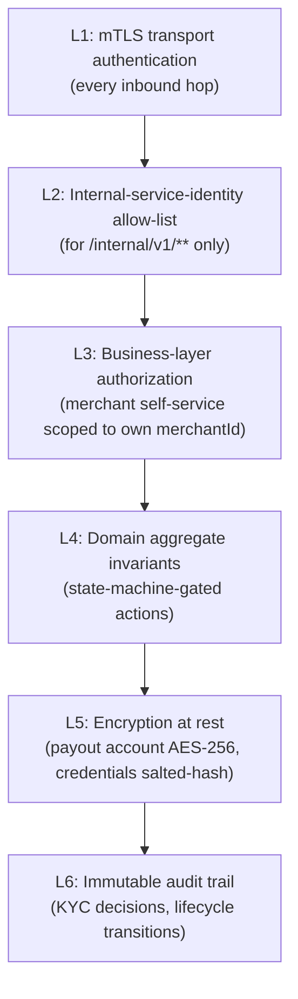

A defining security property of this service: **a merchant credential
that successfully authenticates at the Gateway can still be rejected
here** if the resource path's `{merchantId}` does not match the
credential's resolved merchant identity (attached by the Gateway as a
signed internal header, per its spec §19) — this is the fine-grained,
resource-ownership authorization explicitly delegated by the Gateway
(its spec §3.2/FR-3.3) to this owning service.

---

# 52. Threat Model

| Threat | Mitigation |
|---|---|
| Fake-merchant registration spam / fraud-testing at scale | IP-based strict rate limit on registration (§48), automated risk-scoring feeding into the KYC auto-approval criteria (Part 1 §19) rather than blind auto-approval |
| Credential leakage (leaked API key) | Salted-hash storage (never reversible), immediate revocation capability, rotation-with-grace-window (§41), Gateway-side cache invalidation within one event cycle |
| Cross-merchant data access (credential resolves merchant A, request targets merchant B's resource) | `{merchantId}` path parameter checked against the Gateway-attested principal identity on every request (§51) |
| SSRF via webhook endpoint URL | Structural validation rejecting private/loopback/link-local addresses at config time (Part 1 §25) |
| Insider threat on KYC decisioning (a compromised/rogue reviewer approving illegitimate merchants) | Every decision recorded with reviewer identity, immutable, subject to periodic audit review; no decision can be silently altered after recording |
| Bank account redirection fraud (attacker changes payout destination just before a large settlement) | New `PayoutAccount` entities preserve full history (Part 1 §13); a config-change-triggered review/notification window is a recommended operational control layered on top of this architecture |
| Internal service impersonation on `/internal/v1/**` | mTLS + workload-identity allow-list (§50), not bearer-token-based, since bearer tokens are more easily exfiltrated/replayed than a mutually-authenticated transport identity |

---

# 53. PCI DSS Considerations

- The Merchant Service holds **no cardholder data** (no PAN, no CVV) —
  it is out of PCI-DSS cardholder-data-environment (CDE) scope entirely
  for that reason, consistent with the platform-wide design principle
  that only the Token Vault Service touches cardholder data.
- It is, however, in scope for PCI-DSS's broader **access control and
  network segmentation** requirements as a system that manages
  credentials granting access to the payment platform — reinforcing why
  mTLS, salted-hash credential storage, and audit-logged KYC decisions
  are treated as mandatory architectural properties here, not optional
  hardening.
- Payout bank account details, while not cardholder data under PCI-DSS,
  are still treated with equivalent encryption-at-rest rigor (AES-256)
  because they represent comparable financial-fraud risk if leaked.
- This document describes PCI-DSS-**aligned** architectural principles;
  it does not constitute and should not be represented as a PCI-DSS
  certification, which requires a formal QSA audit outside this
  document's scope.

---

# 54. Request Flow

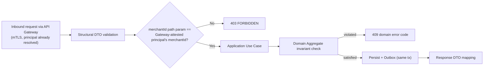

---

# 55. Authentication Flow

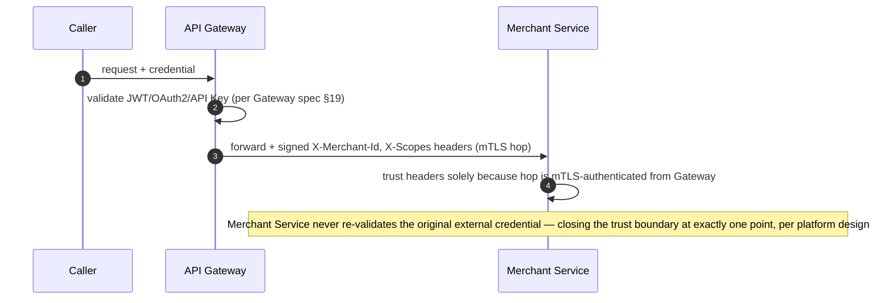

---

# 56. Authorization Flow

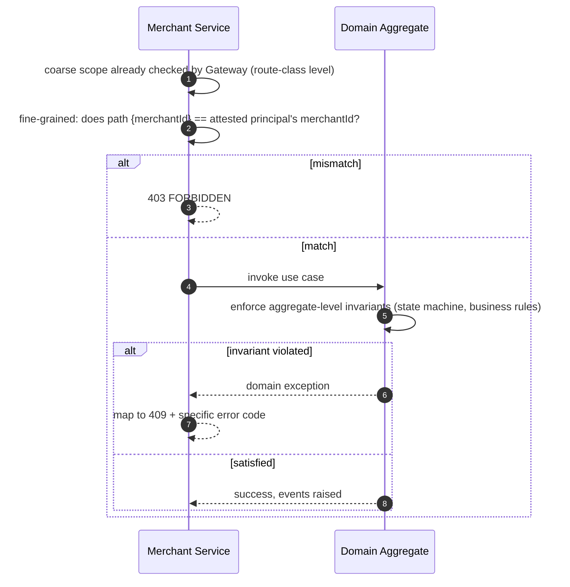

---

# 57. Webhook Flow

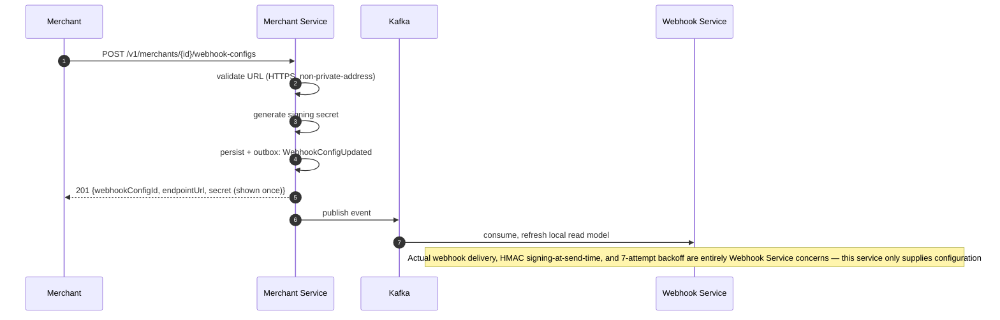

---

# 58. API Key Rotation Flow

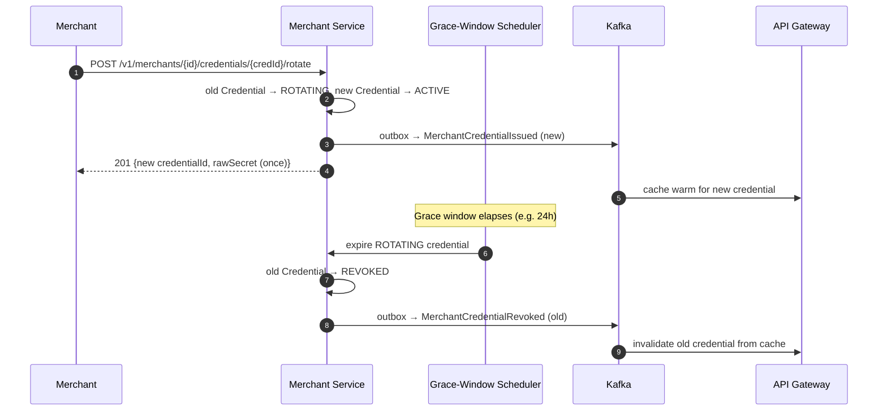

# Merchant Service — Software Architecture Specification
## Part 3 of 4: Data, Messaging, Scaling, Observability

---

# 59. Database Design

PostgreSQL, one schema owned exclusively by Merchant Service, no
cross-service joins, Flyway-migrated only, consistent with
`SYSTEM_DESIGN.md` §11. Tables are organized around the three
aggregates (`Merchant`, `Credential`, `KycCase`) plus their contained
entities and the outbox/idempotency support tables.

---

# 60. ER Diagram

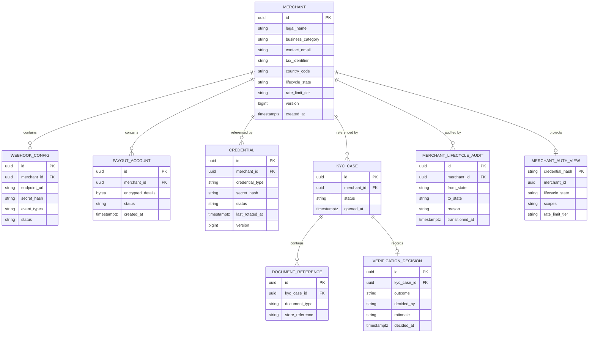

---

# 61. PostgreSQL Tables

| Table | Purpose | Notes |
|---|---|---|
| `merchant` | Merchant aggregate root state | One row per merchant; `lifecycle_state` constrained to the enum from Part 1 §17 |
| `credential` | Credential aggregate root state | `secret_hash` only, never a reversible ciphertext |
| `kyc_case` | KYC case aggregate root | One or more per merchant over time, never overwritten |
| `document_reference` | KYC document metadata | References external document store; no binary content stored here |
| `verification_decision` | Immutable decision record | Append-only; one-to-one or one-to-zero per `kyc_case` |
| `webhook_config` | Webhook Entity rows | `secret_hash`, not the raw secret, stored after initial disclosure |
| `payout_account` | Payout Entity rows | `encrypted_details` via AES-256, new row per change (Part 1 §13) |
| `merchant_lifecycle_audit` | Immutable transition audit trail | Append-only, one row per transition, independent of the aggregate's current-state row |
| `merchant_auth_view` | CQRS read projection (Part 1 §31.2) | Rebuilt from outbox events, disposable/rebuildable, not a source of truth |
| `outbox_event` | Transactional Outbox | Per platform standard, written in same tx as aggregate state |
| `idempotency_record` | Idempotency-Key deduplication | `(merchant_id, idempotency_key, endpoint)` unique, short TTL-bounded cleanup |

---

# 62. Index Strategy

- `merchant(tax_identifier)` — unique index, enforces FR-1.3 duplicate-
  registration rejection at the database level as the ultimate guarantee
  behind the application-layer check (Part 1 §24).
- `merchant(lifecycle_state)` — non-unique index supporting operational
  dashboards/queries (e.g. "all merchants currently `UNDER_REVIEW`").
- `credential(merchant_id, status)` — composite index; the dominant
  query shape is "active credentials for merchant X."
- `credential(secret_hash)` — unique index; this is the exact lookup
  path used by the `merchant_auth_view` rebuild and by direct
  credential-hash resolution if the projection is ever stale/rebuilding.
- `kyc_case(merchant_id, opened_at DESC)` — supports "most recent case
  for this merchant" without a full table scan.
- `merchant_lifecycle_audit(merchant_id, transitioned_at DESC)` —
  supports audit-trail retrieval ordered newest-first.
- `outbox_event(published, created_at)` — partial index on
  `published = false` specifically, since the Outbox Relay's poll query
  only ever needs unpublished rows, and this keeps that index small
  regardless of total historical outbox volume.
- `idempotency_record(merchant_id, idempotency_key, endpoint)` — unique
  composite index, the sole mechanism enforcing FR-level deduplication.

---

# 63. Constraints

- `merchant.lifecycle_state` — CHECK constraint against the fixed enum
  set; the database rejects any value the application's sealed-type
  domain model would also reject, as defense-in-depth against a bug or
  direct data-layer access bypassing the domain layer.
- `merchant.version`, `credential.version` — optimistic-lock columns,
  application enforces `WHERE version = :expected` on every update,
  incrementing atomically; a version mismatch surfaces as a
  concurrency-conflict error to the use case layer, never silently
  overwritten.
- `credential.status` transition constraint — no database trigger
  enforcing the state machine itself (that logic lives in the domain
  aggregate per Clean Architecture separation), but a CHECK constraint
  still restricts the column to the valid enum values as a baseline
  guard.
- Foreign keys (`credential.merchant_id`, `kyc_case.merchant_id`, etc.)
  — `ON DELETE RESTRICT`, since no aggregate in this schema is ever
  hard-deleted; deactivation and revocation are always modeled as state
  transitions, never row deletion, preserving the audit trail this
  service exists partly to guarantee.
- `payout_account.encrypted_details` — `NOT NULL`, application-layer
  guarantees encryption occurs before persistence; the column type
  itself (`bytea`) makes storing plaintext structurally awkward as an
  additional soft guard.

---

# 64. Partitioning Strategy

- `merchant_lifecycle_audit` and `outbox_event` are the two tables
  expected to grow unbounded over the service's lifetime (every
  transition, every published event, forever) — both are range-
  partitioned by month on their timestamp column, allowing older
  partitions to be moved to cheaper storage or archived without
  affecting the hot, recent-data query path.
- Core aggregate tables (`merchant`, `credential`, `kyc_case`) are
  **not** partitioned — their row counts scale with merchant count, not
  transaction volume, and remain small enough (relative to the
  Orchestrator's payment/ledger tables) that partitioning would add
  operational complexity without a corresponding performance need.
- `merchant_auth_view` is unpartitioned and kept as small/flat as
  possible by design, since it is rebuilt from the event stream and
  optimized purely for point lookups by `credential_hash`.

---

# 65. Redis Usage

Redis is used here far more narrowly than at the API Gateway (whose
Redis usage is central to its rate-limiting/circuit-breaker function)
— the Merchant Service treats Redis purely as an optional read-through
accelerator, never a source of truth.

## 65.1 Redis Key Design
| Key Pattern | Purpose | TTL |
|---|---|---|
| `merchant:profile:{merchantId}` | Cached profile response for repeated GETs | 5 min |
| `merchant:authview:{credentialHash}` | Secondary cache in front of the `merchant_auth_view` table, for services that query directly rather than via the Gateway's own cache | 60s (short, since this is a second cache layer behind an already-cached Gateway) |
| `kyc:reviewqueue:count` | Operational dashboard counter, cheap to serve without hitting Postgres on every dashboard refresh | 30s |

## 65.2 Cache Strategy
- Read-through, cache-aside pattern for profile and auth-view lookups.
- No write-through caching — writes always go to Postgres first
  (source of truth), with cache entries simply invalidated (not
  updated in place) to avoid any risk of a cache entry silently
  diverging from the database.

## 65.3 Cache Invalidation
- Event-driven: this service's own outbox-event consumer (the same
  internal consumer that rebuilds `merchant_auth_view`, Part 1 §31.2)
  also issues the corresponding Redis key invalidation as part of the
  same event-handling routine — one code path, two invalidation targets
  (DB projection + cache), eliminating the risk of the two drifting out
  of sync with each other.

---

# 66. Kafka Topics

| Topic | Producer | Primary Consumers | Partition Key |
|---|---|---|---|
| `merchant.events` | Merchant Service | API Gateway, Payment Orchestrator, Webhook Service, Settlement Service, (self, for `merchant_auth_view` rebuild) | `merchantId` |

A single topic is used (rather than splitting by event type) because
strict per-merchant ordering across *all* merchant-related events
matters — e.g. a `MerchantSuspended` event must never be processed
out-of-order relative to a preceding `MerchantCredentialIssued` event for
the same merchant, which a single topic partitioned by `merchantId`
guarantees, while multiple topics would not without additional
coordination.

---

# 67. Published Events

Identical set to Part 1 §15, restated here only as the authoritative
Kafka-facing contract list (not re-explained):
`MerchantRegistered`, `MerchantVerificationApproved`,
`MerchantVerificationRejected`, `MerchantActivated`,
`MerchantSuspended`, `MerchantDeactivated`, `MerchantCredentialIssued`,
`MerchantCredentialRevoked`, `WebhookConfigUpdated`,
`PayoutAccountUpdated`.

---

# 68. Consumed Events

The Merchant Service is predominantly a **producer**; it consumes only
its own published events, internally, to build the CQRS read
projection and manage cache invalidation (Part 1 §31.2, §65.3) — it
does not consume events from any other service's topic, since it has no
data dependency on Payment, Webhook Delivery, or Settlement domain
state. This asymmetry (many consumers, one internal self-consumer) is
intentional and reflects its position as the platform's upstream
identity supplier (Part 1 §10 context mapping).

---

# 69. Event Contracts

All events use the platform-standard envelope from `SYSTEM_DESIGN.md`
§5 (Event ID, Event Type, Aggregate ID, Version, Correlation ID,
Causation ID, Timestamp, Payload). Merchant-Service-specific payload
shape example:

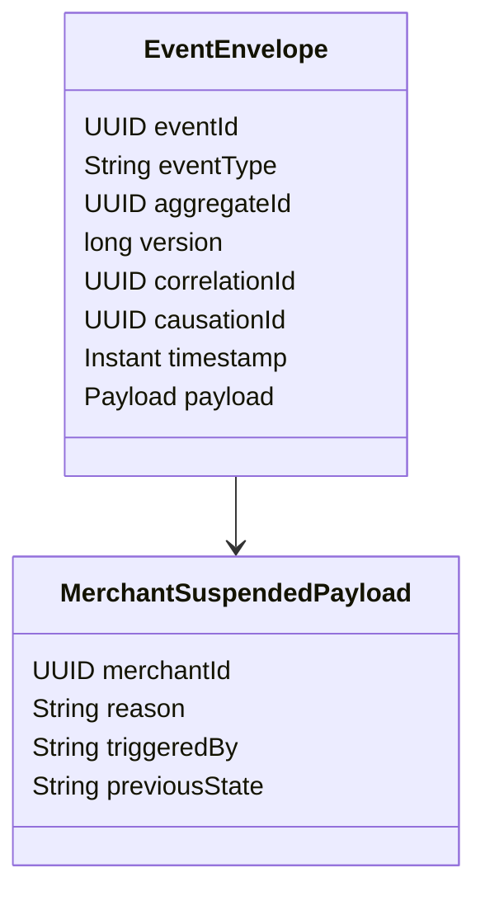

No event payload ever contains a raw credential secret, a raw payout
account number, or KYC document binary content — only references,
hashes (never the hash of a secret either, since even a hash on an
event bus is an unnecessary exposure surface for something that should
only ever be compared server-side), and structural metadata.

---

# 70. Saga Participation

The Merchant Service does not orchestrate any SAGA itself (it has no
multi-step, multi-service transactional workflow of its own comparable
to payment authorization/capture) but it **participates as a
compensating step provider** in sagas owned by other services:

```mermaid
sequenceDiagram
    autonumber
    participant POS as Payment Orchestrator (SAGA owner)
    participant MS as Merchant Service

    POS->>MS: (event-driven) MerchantSuspended consumed
    POS->>POS: mark merchant ineligible for NEW payment initiation
    Note over POS,MS: This is a read-only reaction, not a two-way SAGA step;<br/>Merchant Service never receives a compensating call back from POS
```

Because the Merchant Service publishes facts about identity/eligibility
rather than participating in money movement, it structurally cannot be
a SAGA compensation target — there is no "undo" of a merchant
suspension that a payment saga would ever need to trigger, which keeps
this service outside the payment SAGA's compensation graph entirely
by design, not by omission.

---

# 71. Outbox Pattern

Identical mechanism to `SYSTEM_DESIGN.md` §7: every state-changing use
case writes its aggregate update and its `outbox_event` row in one
local transaction; a polling Outbox Relay (or CDC-based relay, per the
platform's pending ADR) publishes to `merchant.events` and marks rows
published. The Merchant Service's own internal consumer (§68) reads
from Kafka like any other consumer — it does not read the outbox table
directly — ensuring the projection-rebuild path is tested by, and
behaves identically to, the path every external consumer relies on.

```mermaid
flowchart LR
    UC["Use Case commits<br/>aggregate + outbox_event"] --> RELAY["Outbox Relay"]
    RELAY --> KAFKA[("merchant.events")]
    KAFKA --> SELF["Self-consumer:<br/>rebuild merchant_auth_view,<br/>invalidate Redis"]
    KAFKA --> EXT["External consumers:<br/>Gateway, Orchestrator,<br/>Webhook Svc, Settlement Svc"]
```

---

# 72. Retry Strategy

- Outbox Relay publish retries: bounded exponential backoff against
  transient Kafka unavailability; the outbox row remains `published =
  false` and is safely re-attempted on the next poll cycle — at-least-
  once delivery is the accepted guarantee, with consumers' own Inbox
  pattern (owned by each consuming service) providing dedupe.
- Internal self-consumer retries: a transient Postgres write failure
  while rebuilding `merchant_auth_view` is retried with backoff; the
  consumer does not advance its Kafka offset until the write succeeds,
  guaranteeing the projection eventually catches up rather than silently
  skipping an event.
- No retry is ever applied to a **rejected domain operation** (e.g. a
  `MERCHANT_NOT_ACTIVE` 409) — retries apply only to infrastructure-
  level transient failures, never to business-rule rejections, which
  are deterministic and would simply fail identically on retry.

---

# 73. Dead Letter Queue

- The self-consumer routes an event to a `merchant.events.dlq` topic
  after a bounded number of processing retries (e.g. 5) fail due to a
  persistent, non-transient error (e.g. a payload schema mismatch from
  an unexpected upstream bug) — this prevents one malformed event from
  permanently blocking the consumer's offset progression for all
  subsequent events.
- DLQ entries trigger an alert (§79) for manual investigation; they are
  never silently dropped, since a stuck projection rebuild directly
  risks the `merchant_auth_view`/cache drifting from the true aggregate
  state, which this service's entire design exists to prevent.

---

# 74. Connection Pooling

- Separate, sized connection pools for: the primary Postgres write
  path, a read-replica pool (if used) for `merchant_auth_view` GET-heavy
  internal traffic, and Redis.
- Pool sizing reflects this service's NFR-1 latency targets (Part 1
  §7) — considerably smaller pools than the Payment Orchestrator or
  Acquiring Adapter would require, since this service's write volume is
  low relative to payment throughput; over-provisioning a large pool
  here would waste database connection budget better allocated to
  higher-throughput services.

---

# 75. Thread Pools

- If deployed on a traditional Spring MVC (blocking/JDBC) stack per the
  platform's ADR-gated JDBC-vs-R2DBC decision for lower-throughput
  services (`SYSTEM_DESIGN.md` §14 open decisions), the thread pool is
  sized conservatively (e.g. 50–100 platform threads) reflecting
  expected concurrency, not the Orchestrator's reactive event-loop
  model — this is an explicit, documented divergence, not an oversight.
- If instead built reactively (WebFlux/R2DBC) for platform consistency,
  the same non-blocking event-loop sizing principles from the API
  Gateway spec (§36) apply, with no dedicated large blocking pool at
  all.

---

# 76. Horizontal Scaling

- Stateless application tier (all state in Postgres/Redis); horizontally
  scalable read replicas of the application layer scale the query
  surface (profile GETs, internal auth-view lookups) independently of
  the write surface, which scales primarily via database connection
  and lock-contention tuning rather than adding more writer instances
  (Postgres remains single-writer per its standard model).
- Given comparatively low write volume (Part 1 NFR-1), horizontal
  scaling need is modest relative to Payment Orchestrator/Acquiring
  Adapter — provisioning here optimizes for availability/redundancy
  (multiple replicas across zones) more than for raw throughput scaling.

---

# 77. Performance Optimization

- `merchant_auth_view` exists specifically as a performance
  optimization — it converts what would otherwise be a multi-table join
  (`credential` → `merchant` → scope resolution) into a single flat-row
  lookup by `credential_hash`, on the exact path the API Gateway hits on
  every cache-miss.
- Payout account encryption/decryption (AES-256) only ever occurs on
  the narrow, infrequent path of Settlement Service payout initiation —
  it is never performed speculatively or on read paths that don't need
  the plaintext, minimizing cryptographic operation overhead on the
  service's hot paths.

---

# 78. Capacity Planning

- Capacity is planned primarily around merchant *count* and KYC/
  onboarding *rate*, not transaction throughput — the relevant scaling
  variable for this service is "how many merchants onboard per day
  platform-wide," not "TPS," which sharply differs from every other
  service in this platform.
- The `merchant_auth_view`/Redis read path is planned against the
  Gateway's request volume indirectly (as a cache-miss fallback), so its
  capacity is sized as a fraction of Gateway traffic, informed by the
  Gateway's own cache hit-rate metrics once measured (API Gateway spec
  §39).

---

# 79. Dependency Matrix

| Dependency | Type | Criticality | Failure Behavior |
|---|---|---|---|
| PostgreSQL (merchant schema) | Internal, owned | Critical | Readiness fails if unreachable; no in-memory fallback exists for aggregate writes |
| Redis | External, shared | Non-critical (accelerator only) | Cache-miss simply falls through to Postgres; readiness is unaffected by Redis unavailability, unlike the API Gateway's Redis dependency |
| Kafka | External, platform | Critical for downstream propagation, non-critical for synchronous request serving | A Kafka outage delays event propagation (Gateway/Orchestrator/etc. see stale data) but does not block accepting and persisting new merchant writes, since Outbox guarantees eventual publish once Kafka recovers |
| External Document Store (KYC references) | External | Critical for KYC submission specifically | Document submission fails gracefully with a retryable error; does not affect unrelated endpoints (profile GET, credential management) |
| Secret Manager | External, platform | Critical for encryption/credential operations | Startup dependency; a mid-runtime outage blocks new encryption/hashing operations but does not corrupt already-encrypted data at rest |

---

# 80. External Systems

- **KYC Document Store** — external (or platform-shared) blob storage
  holding actual document binaries; Merchant Service stores only
  references, keeping large binary handling and its own scaling
  concerns out of this transactional service entirely.
- **Automated Rule Engine** (Part 1 §19) — may be an external
  fraud/identity-verification vendor integration or an internal rules
  service; treated as a pluggable adapter behind a port, so vendor
  changes do not ripple into the domain layer.
- **Secret Manager** — supplies AES-256 keys and hashing peppers, as
  used platform-wide.
- **Identity Provider** — consumes OAuth2 client registrations this
  service creates; the Merchant Service is the registration authority,
  the Identity Provider is the token-issuing authority — a clean split
  of responsibility mirroring the platform's broader auth architecture.

---

# 81. Logging

- Structured JSON logs, identical baseline standard to the API Gateway
  spec §28 (`timestamp UTC`, `level`, `correlationId`, `traceId`,
  `merchantId`, `route`, `status`, `latencyMs`).
- Additional Merchant-Service-specific fields: `lifecycleTransition`
  (from→to, when applicable), `kycCaseId` (when applicable).
- Never logged: raw credential secrets, raw payout account numbers,
  KYC document binary content or any field derived from it, webhook
  signing secrets.
- Every lifecycle transition and KYC decision is logged at `INFO` level
  unconditionally (not just on error), since these are exactly the
  events an operator or auditor will need to reconstruct after the
  fact — unlike routine request access logs, these are never subject to
  sampling or verbosity reduction.

---

# 82. Metrics

| Metric | Type | Labels |
|---|---|---|
| `merchant_registrations_total` | Counter | countryCode, businessCategory |
| `merchant_lifecycle_transitions_total` | Counter | fromState, toState |
| `kyc_case_duration_seconds` | Histogram | outcome (approved/rejected), path (auto/manual) |
| `kyc_review_queue_depth` | Gauge | — |
| `credential_issuance_total` | Counter | credentialType |
| `credential_rotation_total` | Counter | — |
| `auth_view_cache_hit_ratio` | Gauge | — |
| `outbox_publish_lag_seconds` | Histogram | — (time between event creation and successful Kafka publish) |

---

# 83. OpenTelemetry

- Same OTLP-based export strategy as the API Gateway spec §27;
  span attributes include `merchantId`, `lifecycleState` (post-
  operation), `kycCaseId` where relevant — never scope/secret values.
- Trace continuation: a `MerchantRegistered` → (async, later)
  `MerchantVerificationApproved` → `MerchantActivated` sequence spans
  multiple independent requests/events over potentially hours or days;
  these are **not** forced into a single continuous trace (that would
  misrepresent latency) — instead, each is its own trace, linked via
  shared `correlationId`/business identifiers for cross-trace narrative
  reconstruction in tooling, rather than via OTel trace-context
  propagation itself.

---

# 84. Distributed Tracing

```mermaid
sequenceDiagram
    autonumber
    participant GW as API Gateway
    participant MS as Merchant Service
    participant PG as PostgreSQL
    participant Kafka

    GW->>MS: traceparent: T1
    MS->>PG: span: persist aggregate (child of T1)
    MS->>Kafka: span: write outbox (child of T1)
    Note over MS: Trace T1 ends here — Outbox Relay publish is a separate,<br/>asynchronous trace, deliberately not force-joined to T1
```

Separating the synchronous request trace from the asynchronous
publish-and-propagate trace keeps each trace's latency numbers
meaningful — a caller's perceived request latency should reflect only
the synchronous work actually gating their response.

---

# 85. Dashboards

- **Onboarding Funnel**: registrations → KYC submitted → under review →
  approved/rejected, as a funnel visualization, with `kyc_case_duration_seconds`
  broken out by auto vs manual path.
- **Lifecycle Health**: current merchant count per `lifecycle_state`,
  transition rate, suspension/deactivation trend over time.
- **Credential Security**: issuance rate, rotation rate, revocation
  rate, and `auth_view_cache_hit_ratio` to monitor Gateway-facing read
  performance.
- **Event Pipeline Health**: `outbox_publish_lag_seconds`, DLQ entry
  count (§73), self-consumer offset lag.

---

# 86. Alerts

| Alert | Condition | Severity |
|---|---|---|
| KYC review queue growing unbounded | `kyc_review_queue_depth` sustained increase over 1 hour | Medium (staffing/capacity signal) |
| Outbox publish lag high | `outbox_publish_lag_seconds` p99 > 60s | High (downstream services seeing stale merchant state) |
| DLQ entries present | Any message in `merchant.events.dlq` | Critical |
| Elevated `MERCHANT_NOT_ACTIVE` rejection rate | Sudden spike vs baseline | Medium (possible integration bug on merchant side, or a suspension incident in progress) |
| Duplicate tax identifier rejection spike | Sudden spike vs baseline | Medium (possible fraud-testing/registration abuse pattern) |
| Auth-view cache hit ratio drop | Below configured threshold sustained | High (Gateway-facing latency risk) |


# Merchant Service — Software Architecture Specification
## Part 4 of 4: Operations, Testing, Production Readiness, Appendix

---

# 87. Failure Scenarios

| Scenario | Impact | Design Response |
|---|---|---|
| PostgreSQL unavailable | Writes and reads fail; readiness fails | No fallback write path exists by design — correctness over availability for identity/lifecycle data; Kubernetes routes traffic away via failed readiness |
| Redis unavailable | Cache-miss fallthrough to Postgres; elevated latency, no correctness impact | Readiness unaffected (§79, Part 3) |
| Kafka unavailable | Outbox rows accumulate unpublished; downstream services see stale merchant state | Writes still succeed locally; Outbox Relay catches up once Kafka recovers, no data loss |
| Document Store unavailable | KYC document submission fails | Isolated to that endpoint; all other operations (profile, credentials, lifecycle) unaffected |
| Secret Manager unavailable at runtime | New encryption/hashing operations blocked | Already-encrypted data unaffected; new credential issuance and payout-account writes fail closed rather than falling back to plaintext |
| Self-consumer falls behind / stuck | `merchant_auth_view`/Redis cache staleness | Gateway's own cache (independent TTL) bounds worst-case staleness further downstream; DLQ (§73) prevents a single bad event from blocking indefinitely |
| Concurrent conflicting lifecycle transitions (e.g. simultaneous suspend + merchant-initiated deactivate) | Optimistic-lock version conflict | One transition succeeds, the other receives a concurrency-conflict error and must be retried against the now-current state — never a silent overwrite |

```mermaid
flowchart TB
    A["Dependency Outage"] --> B{"Which dependency?"}
    B -->|PostgreSQL| C["Fail closed: readiness down,<br/>no writes accepted"]
    B -->|Redis| D["Degrade gracefully:<br/>fall through to PostgreSQL"]
    B -->|Kafka| E["Accept writes locally,<br/>Outbox catches up later"]
    B -->|Document Store| F["Isolated failure:<br/>KYC submission only"]
    B -->|Secret Manager| G["Fail closed:<br/>no new crypto operations"]
```

---

# 88. Disaster Recovery

- **RPO (Recovery Point Objective):** near-zero for the primary
  `merchant`/`credential`/`kyc_case` tables — continuous WAL archiving
  to a durable store enables point-in-time recovery.
- **RTO (Recovery Time Objective):** target restoration within the
  platform's broader DR runbook window, prioritizing this service
  highly (though below the Payment Orchestrator) since Gateway
  authentication depends on it indirectly via its own cache surviving a
  short outage.
- Cross-region standby replica for the primary database, promoted
  manually (or via a tested automated failover procedure) during a
  regional outage, consistent with a standard active-passive DR posture
  for a lower-write-volume, high-integrity service.
- `merchant_auth_view` is explicitly excluded from DR restoration
  priority — it is fully rebuildable by replaying `merchant.events`
  from Kafka (subject to Kafka's own retention policy) or, failing
  that, from the authoritative `credential`/`merchant` tables directly,
  reinforcing that it is a projection, never a backup target in its own
  right.

---

# 89. Backup Strategy

- Full daily logical/physical backups plus continuous WAL archiving for
  point-in-time recovery, retained per the platform's data-retention
  policy.
- KYC decision and lifecycle audit tables (`verification_decision`,
  `merchant_lifecycle_audit`) are backed up with the same rigor as
  primary aggregate tables — these are compliance-relevant historical
  records, not operational data that can be regenerated.
- Backups of `encrypted_details` (payout account) remain encrypted at
  rest in the backup artifact itself — a backup is never a lower-
  security-tier copy of the data.
- Restore procedure tested on a recurring schedule (not just written),
  verifying both data integrity and that restored KYC/audit history
  remains queryable and unaltered.

---

# 90. Production Deployment

## 90.1 Docker Strategy
- Single container image per release; no merchant configuration or
  secret material baked into the image, consistent with the platform's
  no-hardcoded-credentials standard.
- Minimal base image, non-root process user, read-only root filesystem
  where the runtime permits, reducing container escape blast radius.

## 90.2 Kubernetes Deployment
- Stateless Deployment, multiple replicas across availability zones,
  `PodDisruptionBudget` guaranteeing minimum availability during
  voluntary disruption (node drains, rolling upgrades).
- `topologySpreadConstraints` prevent zone concentration, mirroring the
  API Gateway spec's approach (its §35) applied here for the same
  availability reasoning, scaled to this service's lower replica count.

## 90.3 Helm
- Chart parameterizes replica bounds, resource requests/limits,
  database/Redis/Kafka connection configuration references, and
  feature-flag defaults — no environment-specific values hardcoded into
  the chart templates themselves.

```mermaid
flowchart TB
    ELB["Load Balancer / API Gateway mesh entry"] --> SVC["Kubernetes Service:<br/>merchant-service"]
    SVC --> P1["Pod 1"]
    SVC --> P2["Pod 2"]
    SVC --> P3["Pod N"]
    P1 & P2 & P3 --> PG[("PostgreSQL<br/>(primary + standby)")]
    P1 & P2 & P3 --> REDIS[("Redis")]
    P1 & P2 & P3 --> KAFKA[("Kafka")]
```

---

# 91. Configuration Management

- Externalized configuration (ConfigMap or config-server) for rate-
  limit tier defaults, KYC mandatory-document-type mappings per
  jurisdiction/category, and grace-window durations (credential
  rotation, webhook secret rotation).
- Secrets (database credentials, AES-256 keys, hashing pepper, Kafka/
  Redis auth) sourced exclusively from the platform Secret Manager
  abstraction at startup and on rotation, never plaintext ConfigMaps or
  environment variables.

## 91.1 Feature Flags
- `feature.kyc.auto-approval.enabled` — allows disabling the automated
  path platform-wide (fail-safe to manual-review-only) without a
  redeploy, e.g. during a suspected fraud pattern under investigation.
- `feature.credential-rotation.grace-window-enforcement.enabled` —
  allows temporarily disabling the scheduler's automatic old-credential
  expiry during an incident, without disabling rotation issuance
  itself.

---

# 92. Health Checks, Readiness, Liveness

- **Liveness:** process responsive, no deadlock in the request-handling
  layer; independent of PostgreSQL/Redis/Kafka reachability — mirrors
  the API Gateway's liveness philosophy (its §30) of never restarting a
  healthy process over a dependency blip.
- **Readiness:** liveness conditions **and** PostgreSQL reachable
  (hard requirement, per §87) — Redis and Kafka reachability do **not**
  gate readiness, since both degrade gracefully (§87) rather than
  blocking core functionality.

---

# 93. Graceful Shutdown

- On `SIGTERM`: readiness flips to `false` immediately; in-flight
  requests (including their outbox-write transaction) are allowed to
  complete within a bounded grace period before the process exits,
  identical ordering discipline to the API Gateway spec §31, ensuring
  no in-flight aggregate write is ever abandoned mid-transaction by a
  deployment event.

---

# 94. SLA / SLO / SLI

| Tier | Metric | Target |
|---|---|---|
| SLA | Monthly availability | 99.9% |
| SLO | Write-path p99 latency | ≤ 300ms (Part 1 NFR-1) |
| SLO | Read-path (auth-view) p99 latency | ≤ 50ms (Part 1 NFR-1) |
| SLO | Outbox publish lag p99 | ≤ 60s |
| SLI | `merchant_lifecycle_transitions_total` error ratio (failed/attempted) | Continuously measured |
| SLI | `auth_view_cache_hit_ratio` | Continuously measured, informs Gateway-facing latency risk |

---

# 95. Monitoring & Observability

Consolidated cross-reference to Part 3 §81–86 (Logging, Metrics,
OpenTelemetry, Distributed Tracing, Dashboards, Alerts) — this section
exists here only to confirm those observability mechanisms are
production-readiness gating items, not optional additions: no release
is considered production-ready without live dashboards and tested
(synthetically triggered) alerts, identical discipline to the API
Gateway spec's Production Readiness Checklist philosophy (its §43).

---

# 96. Testing Strategy

## 96.1 Unit Testing
- Domain layer (aggregates, value objects, `CredentialIssuancePolicy`)
  tested with plain Java, no Spring context — covering every state-
  machine transition (valid and invalid) and every invariant listed in
  Part 1 §12 and §24.
- Target: 100% branch coverage on lifecycle-transition logic
  specifically, since an untested invalid-transition path is a direct
  business-integrity risk.

## 96.2 Integration Testing
- Testcontainers-backed PostgreSQL, Redis, and Kafka; verifies the full
  use-case-to-outbox-to-Kafka path, including the self-consumer
  rebuilding `merchant_auth_view` correctly from a real event stream.
- Verifies optimistic-locking behavior under simulated concurrent
  updates (§87 concurrent-transition scenario).

## 96.3 Contract Testing
- Consumer-driven contracts against every downstream consumer of
  `merchant.events` (API Gateway, Payment Orchestrator, Webhook
  Service, Settlement Service) — pins the event payload shape (§69) so
  a schema change is caught before it silently breaks a consumer.
- Contract test against the API Gateway's expectation of the internal
  `MerchantAuthView` response shape specifically, since this is the
  most latency-sensitive integration point in the service.

## 96.4 Load Testing
- Executed against the read path (`/internal/v1/auth-view`) at a
  volume representative of Gateway cache-miss rate at platform target
  throughput — this is the only path in this service with a meaningful
  relationship to the platform's 10,000+ TPS goal, since write-path
  volume (registrations, KYC, lifecycle changes) is orders of magnitude
  lower by nature.

## 96.5 Performance Testing
- Write-path latency benchmarked independently (registration, KYC
  submission, lifecycle transitions) against the NFR-1 budget, under
  realistic KYC-document-count and concurrent-reviewer-queue conditions.

## 96.6 Chaos Testing
- Inject: PostgreSQL failover, Redis unavailability, Kafka
  unavailability, Document Store unavailability — assert the failure
  behaviors specified in §87 hold exactly as documented (e.g. readiness
  genuinely stays up during a Redis outage, genuinely goes down during a
  PostgreSQL outage).

## 96.7 Security Testing
- Cross-merchant authorization bypass attempts (§51, Part 2) — verifying
  a valid credential for merchant A is rejected against merchant B's
  resource path under every endpoint, not just a sampled subset.
- Credential/webhook-secret one-time-disclosure verified — confirming
  no code path (including error-handling/retry paths) ever re-returns a
  previously-issued secret.

## 96.8 Penetration Testing
- Scoped explicitly to include: KYC document-reference handling
  (ensuring no path-traversal or injection via document-store
  reference fields), payout-account encryption implementation review,
  and cross-merchant IDOR (Insecure Direct Object Reference) testing
  across every `{merchantId}`-scoped endpoint.
- Same severity-based remediation SLA discipline as the API Gateway
  spec §42.7 (Critical: 7 days, High: 30 days).

---

# 97. Production Readiness Checklist

- [ ] All Functional and Non-Functional Requirements (Part 1 §6–7)
      verified by automated tests.
- [ ] Every lifecycle state-machine transition (valid and invalid)
      covered by unit tests (§96.1).
- [ ] Cross-merchant authorization boundary (§51) verified across every
      `{merchantId}`-scoped endpoint, not a sample.
- [ ] Optimistic-locking concurrency behavior verified under simulated
      concurrent conflicting transitions.
- [ ] Outbox → Kafka → self-consumer → `merchant_auth_view`/cache path
      verified end-to-end with real infrastructure (Testcontainers).
- [ ] DLQ routing and alerting (§73, §86) verified to actually trigger
      on a synthetic malformed event, not assumed from configuration.
- [ ] Readiness/liveness behavior verified independently for each
      dependency outage scenario in §87.
- [ ] Graceful shutdown rehearsed against a real in-flight write during
      a simulated rolling deployment.
- [ ] Backup restore (§89) rehearsed at least once, including
      verification that KYC/audit history remains intact and queryable.
- [ ] All secrets confirmed sourced from Secret Manager; zero plaintext
      secrets in images/ConfigMaps, verified by CI scan.
- [ ] Dashboards (§85, Part 3) live with real traffic in staging before
      go-live.
- [ ] Alerts (§86, Part 3) verified to fire via synthetic threshold
      breach, not just configured.
- [ ] Load test report for the `/internal/v1/auth-view` path committed
      to `docs/` before any platform-level throughput claim references
      this service's contribution.
- [ ] Penetration test findings at Critical/High severity resolved or
      explicitly risk-accepted by security sign-off.
- [ ] Operational runbooks (§98) reviewed by on-call rotation.

---

# 98. Operational Runbooks

## 98.1 KYC Review Queue Backing Up
1. Check `kyc_review_queue_depth` dashboard trend and reviewer
   throughput.
2. Confirm whether the automated-approval path (`feature.kyc.auto-
   approval.enabled`) is functioning correctly — a silent failure here
   pushes all volume into manual review unexpectedly.
3. If a genuine capacity issue: escalate for reviewer staffing; this is
   an operational, not architectural, response.

## 98.2 Outbox Publish Lag Alert
1. Confirm whether Kafka itself is degraded (check platform-wide Kafka
   dashboards) versus an issue isolated to this service's Outbox Relay
   instance.
2. If Relay-isolated: check Relay pod health/logs; restart is generally
   safe since the relay is idempotent by construction (unpublished rows
   simply get re-attempted).
3. Confirm downstream consumers' staleness impact is within tolerable
   bounds (e.g. Gateway's own cache TTL) while remediation is in
   progress — this is rarely a page-immediately situation unless
   sustained well beyond the SLO.

## 98.3 DLQ Entry Investigation
1. Inspect the DLQ message's payload and the recorded processing error.
2. Determine if this is a schema-contract violation (requires a code
   fix and redeploy of the self-consumer) or a transient issue that was
   incorrectly classified as terminal (requires a retry-policy tuning
   fix).
3. Manually replay the corrected event from the DLQ back into the
   consumer path only after the root cause is fixed — never replay
   blindly, since a persistent bug will simply produce the same DLQ
   entry again.

## 98.4 Suspected Cross-Merchant Data Exposure
1. Immediately audit access logs (correlation-ID keyed) for the
   affected `{merchantId}` path across all endpoints.
2. Confirm whether the Gateway-attested principal header (§55) was
   correctly validated against the path parameter for the affected
   requests, or whether a code-path bypassed that check (§51) — this is
   treated as a Critical-severity incident regardless of whether actual
   data exposure is confirmed, given the severity of the failure mode.

## 98.5 Credential Rotation Grace-Window Scheduler Failure
1. Check whether `ROTATING`-status credentials are aging past their
   configured grace window without being expired.
2. If the scheduler itself is down: manually trigger the expiry job
   once restored; verify no `ROTATING` credential silently remained
   valid indefinitely during the outage window (an audit query against
   `last_rotated_at` vs current time resolves this).

---

# 99. Future Enhancements

- Merchant-configurable settlement payout frequency (currently assumed
  platform-fixed cadence per `SYSTEM_DESIGN.md`), pending a Settlement
  Service capability to support per-merchant scheduling.
- Explicit webhook-endpoint-reachability pre-check as an optional,
  asynchronous (non-blocking-to-the-request) validation step, surfaced
  to the merchant as a configuration-health indicator rather than a
  synchronous gate (preserving the write-latency independence
  established in Part 2 §43).
- Risk-based dynamic KYC document requirements (beyond the current
  static per-jurisdiction/category mapping), informed by accumulated
  fraud-signal data once sufficient platform history exists.
- Self-service merchant dashboard visibility into their own
  `merchant_lifecycle_audit` and `verification_decision` history,
  currently assumed to be an internal/operator-facing capability only.

---

# 100. Architecture Decisions

Formal ADRs for this service (to be authored under `docs/adr/`,
referencing this specification):

- **ADR:** Separate `Credential` and `KycCase` as independent
  aggregates from `Merchant`, rather than entities within it (Part 1
  §11).
- **ADR:** CQRS applied only to the Gateway-facing read path
  (`merchant_auth_view`), not platform-wide within this service (Part 1
  §27.1).
- **ADR:** `SUSPENDED` modeled as reversible, `DEACTIVATED` as terminal
  — no single "disabled" flag (Part 1 §17).
- **ADR:** Credential/webhook-secret rotation uses a grace-window
  overlap model rather than an atomic swap (Part 2 §41).
- **ADR:** `PayoutAccount` changes create new entity rows rather than
  mutating in place, preserving full audit history (Part 1 §13, Part 2
  §45).
- **ADR (pending, cross-referenced from `SYSTEM_DESIGN.md`):** JDBC vs
  R2DBC final selection for this service specifically, given its lower
  throughput profile relative to the Payment Orchestrator.

---

# 101. Appendix

## 101.1 Cross-References
- Platform-wide architecture: `SYSTEM_DESIGN.md`
- Platform engineering standards: `02_ENGINEERING_STANDARDS.md`
- API Gateway specification: `API-Gateway-Part-01.md` through
  `API-Gateway-Part-04.md` (this service's primary upstream/downstream
  integration partner)

## 101.2 Full Merchant Lifecycle State Diagram (Consolidated Reference)

```mermaid
stateDiagram-v2
    [*] --> PENDING_VERIFICATION : register()
    PENDING_VERIFICATION --> UNDER_REVIEW : submit KYC documents
    UNDER_REVIEW --> ACTIVE : verification APPROVED
    UNDER_REVIEW --> PENDING_VERIFICATION : verification REJECTED
    ACTIVE --> SUSPENDED : risk/compliance signal
    SUSPENDED --> ACTIVE : reinstated
    ACTIVE --> DEACTIVATED : closure
    SUSPENDED --> DEACTIVATED : permanent action
    DEACTIVATED --> [*]
```

---

# 102. Glossary

| Term | Definition |
|---|---|
| Aggregate | A cluster of domain objects treated as a single unit for data changes, with one Aggregate Root enforcing invariants |
| Bounded Context | A explicit boundary within which a domain model is defined and applicable |
| CQRS | Command Query Responsibility Segregation — separating read and write models where their shapes/performance needs genuinely diverge |
| Idempotency Key | A caller-supplied unique token ensuring a mutating request's side effects occur at most once, even if retried |
| KYC | Know Your Customer — verification of identity and business legitimacy before permitting platform access |
| Outbox Pattern | Writing an event to a local table in the same transaction as a state change, to guarantee reliable eventual publication |
| SAGA | A pattern for managing consistency across multiple services via a sequence of local transactions and compensating actions, without distributed transactions |
| Value Object | An immutable domain object defined entirely by its data, with no identity of its own |

---

# 103. References

- `SYSTEM_DESIGN.md` — platform single source of truth for
  cross-service architecture, event envelope standard, and outbox/
  inbox pattern definition.
- `02_ENGINEERING_STANDARDS.md` — Java/Spring Boot coding conventions,
  package structure baseline, naming standards.
- `API-Gateway-Part-01.md`–`Part-04.md` — the platform's edge service
  specification, referenced throughout this document for consistent
  authentication, error-model, and observability conventions.

*End of Merchant Service specification (Parts 1–4).*