# Payment Orchestrator — Software Architecture Specification
## Part 1 of 4: Vision, Domain Model, Lifecycle, Architecture

---

# 1. Executive Summary

The Payment Orchestrator is the transactional core of the platform — it owns the payment state machine, the ledger, and the SAGA that coordinates Token Vault, Acquiring Adapter, and Settlement Service without distributed transactions.

Every payment request the API Gateway forwards ends up here. Every ledger entry, every authorization/capture/refund decision, and every Kafka `payment.events` publication originates from this service. Unlike Merchant Service (identity) or Token Vault (custody), the Orchestrator's job is **consistency under partial failure** at 10,000+ TPS.

---

# 2. Service Purpose

- **Primary objective**: drive a payment through its full lifecycle (create → authorize → capture → settle) while guaranteeing exactly-once financial effect, even under retries, timeouts, and downstream failure.
- **Scope**: orchestration and ledger only — it never talks to a bank directly (Acquiring Adapter's job) and never stores cardholder data (Token Vault's job).
- **Why orchestration is separated from execution**: the Acquiring Adapter's job is "call this one bank simulator correctly"; the Orchestrator's job is "decide what should happen next across the whole payment, regardless of which bank." Coupling the two would mean every new acquirer integration also has to reimplement SAGA/ledger/idempotency logic.
- **Responsibilities within the lifecycle**: state-machine ownership, SAGA step sequencing, compensation on failure, ledger writes, idempotency enforcement, event publication.

---

# 3. Responsibilities / Non-Responsibilities

| Responsibilities | Non-Responsibilities | Why |
|---|---|---|
| Own the payment state machine (§9) | Store cardholder data (PAN/CVV) | Token Vault's exclusive domain (`Token-Vault-Part-01.md` §4) |
| Own the append-only ledger | Call an acquirer/bank directly | Acquiring Adapter's job — Orchestrator never holds provider-specific integration code |
| Coordinate the payment SAGA (auth → capture) | Compute settlement payouts | Settlement Service owns payout math |
| Enforce Idempotency-Key semantics for payment mutations | Validate merchant identity/KYC | Merchant Service's domain |
| Publish `payment.events` via Outbox | Deliver webhooks | Webhook Service's job |
| Call Token Vault to detokenize (single-use, <50ms) | Cache or persist a detokenized PAN reference | Would violate the platform's PAN-lifetime invariant |
| Retry/compensate on partial failure | Retry a caller's HTTP request | That's the API Gateway's/caller's concern |

---

# 4. Key Definitions

| Term | Definition |
|---|---|
| Payment Intent | The merchant's declared intent to charge an amount via a specific method, before any authorization occurs |
| Payment Session | The bounded interaction window covering intent creation through terminal state |
| Payment State | The current node in the payment state machine (§9) |
| Payment Route | The selected acquirer/method path a payment takes (e.g. Card via Acquirer A vs Net Banking via Bank Simulator B) |
| Acquirer | The (simulated) bank/processor the Acquiring Adapter integrates with on the Orchestrator's behalf |
| Retry | A bounded, backoff-governed re-attempt of a single SAGA step after a transient failure |
| Compensation | An explicit corrective action (a new ledger entry, a state transition) undoing the effect of a prior SAGA step — never a deletion of history |
| Saga | The orchestrated sequence of local transactions + compensations that replaces a distributed transaction across services |
| Orchestration | This service's core function: sequencing SAGA steps and driving state transitions |
| Authorization | The step confirming funds are available/reserved, without yet moving money |
| Capture | The step that finalizes the fund movement following a prior authorization |
| Settlement | The downstream, nightly process (owned by Settlement Service) computing merchant payouts from captured/refunded ledger entries |
| Idempotency Key | Caller-supplied token ensuring a payment mutation occurs at most once, platform-standard (`SYSTEM_DESIGN.md` §6) |
| Correlation ID | Cross-service request identifier propagated from the API Gateway through every downstream call and event |

---

# 5. High-Level Architecture

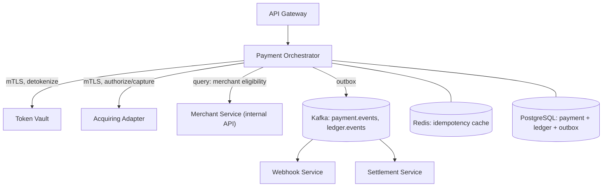
```mermaid
flowchart TB
    GW["API Gateway"] --> POS["Payment Orchestrator"]
    POS -->|"mTLS, detokenize"| TV["Token Vault"]
    POS -->|"mTLS, authorize/capture"| AA["Acquiring Adapter"]
    POS -->|"query: merchant eligibility"| MS["Merchant Service (internal API)"]
    POS -->|"outbox"| KAFKA[("Kafka: payment.events, ledger.events")]
    KAFKA --> WH["Webhook Service"]
    KAFKA --> SS["Settlement Service"]
    POS --- REDIS[("Redis: idempotency cache")]
    POS --- PG[("PostgreSQL: payment + ledger + outbox")]
```

| Integration | Direction | Notes |
|---|---|---|
| API Gateway → Orchestrator | Sync, mTLS | Only entry point for external payment requests |
| Orchestrator → Token Vault | Sync, mTLS, internal-only | Detokenize only; Orchestrator is the sole allow-listed caller (`Token-Vault-Part-02.md` §19.4) |
| Orchestrator → Acquiring Adapter | Sync, mTLS | Authorize/capture/refund calls |
| Orchestrator → Merchant Service | Sync, internal API | Eligibility check (is merchant `ACTIVE`) |
| Orchestrator → Kafka | Async, Outbox | `payment.events`, `ledger.events` |
| Orchestrator ↔ Redis | Sync | Idempotency-key cache, ahead of DB constraint |
| Orchestrator ↔ PostgreSQL | Sync | Payment/ledger/outbox tables, single schema owned by this service |

---

# 6. Component Diagram

| Component | Purpose | Dependencies |
|---|---|---|
| Payment Controller | REST entry point; maps requests to commands | Application layer |
| Orchestration Engine | Drives the payment state machine, sequences SAGA steps | Saga Coordinator, Routing Engine |
| Saga Coordinator | Executes SAGA steps and triggers compensation on failure | Retry Manager, Compensation Manager |
| Routing Engine | Selects the acquirer/route for a given payment method | Merchant Service (config), Acquiring Adapter |
| Retry Manager | Applies bounded, backoff-governed retries per SAGA step | Resilience4j |
| Compensation Manager | Executes corrective ledger entries/state transitions on failure | Persistence Layer |
| Event Publisher | Writes Outbox rows within the same local transaction | Persistence Layer |
| Event Consumer | Consumes any upstream events this service needs (e.g. `MerchantSuspended`) | Kafka |
| Persistence Layer | Payment/ledger/outbox repositories | PostgreSQL |
| Observability Layer | Metrics, tracing, structured logging | OpenTelemetry, Micrometer |

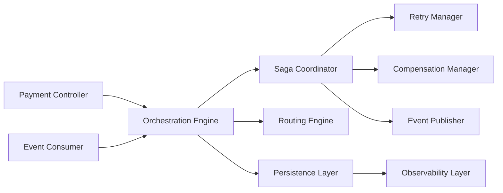
```mermaid
flowchart LR
    CTRL["Payment Controller"] --> ENGINE["Orchestration Engine"]
    ENGINE --> SAGA["Saga Coordinator"]
    ENGINE --> ROUTE["Routing Engine"]
    SAGA --> RETRY["Retry Manager"]
    SAGA --> COMP["Compensation Manager"]
    SAGA --> PUB["Event Publisher"]
    ENGINE --> PERSIST["Persistence Layer"]
    CONSUMER["Event Consumer"] --> ENGINE
    PERSIST --> OBS["Observability Layer"]
```

---

# 7. Domain Model

| Entity | Purpose | Relationships | Lifecycle |
|---|---|---|---|
| Payment | Aggregate root; the single payment being orchestrated | Contains LedgerEntries; references MerchantId, VaultToken | Follows the state machine (§9) |
| LedgerEntry | Append-only financial movement record | Belongs to one Payment | Insert-only, never updated |
| SagaExecution | Tracks in-progress SAGA step state for a Payment | Belongs to one Payment | Created at orchestration start, closed at terminal state |
| PaymentRoute (value object) | The selected method/acquirer combination | Owned by Payment | Set once at routing decision, immutable thereafter |
| IdempotencyRecord | Deduplication record for a mutating request | Keyed by (merchantId, idempotencyKey, endpoint) | Short-TTL, platform-standard |

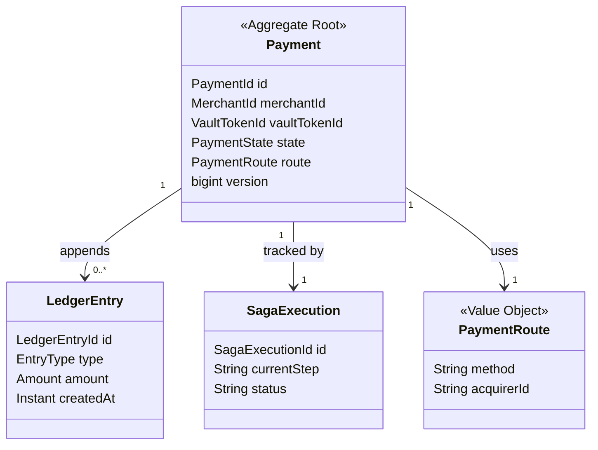
```mermaid
classDiagram
    class Payment {
        <<Aggregate Root>>
        PaymentId id
        MerchantId merchantId
        VaultTokenId vaultTokenId
        PaymentState state
        PaymentRoute route
        bigint version
    }
    class LedgerEntry {
        LedgerEntryId id
        EntryType type
        Amount amount
        Instant createdAt
    }
    class SagaExecution {
        SagaExecutionId id
        String currentStep
        String status
    }
    class PaymentRoute {
        <<Value Object>>
        String method
        String acquirerId
    }
    Payment "1" --> "0..*" LedgerEntry : appends
    Payment "1" --> "1" SagaExecution : tracked by
    Payment "1" --> "1" PaymentRoute : uses
```

---

# 8. Payment Lifecycle

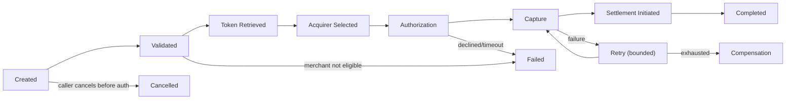
```mermaid
flowchart LR
    A["Created"] --> B["Validated"]
    B --> C["Token Retrieved"]
    C --> D["Acquirer Selected"]
    D --> E["Authorization"]
    E --> F["Capture"]
    F --> G["Settlement Initiated"]
    G --> H["Completed"]
    E -->|"declined/timeout"| FAIL["Failed"]
    F -->|"failure"| RETRY["Retry (bounded)"]
    RETRY --> F
    RETRY -->|"exhausted"| COMP["Compensation"]
    B -->|"merchant not eligible"| FAIL
    A -->|"caller cancels before auth"| CANCEL["Cancelled"]
```

- **Failure**: any step failing terminally (not just transiently) moves the payment to `Failed`, with a ledger entry recording the failure.
- **Retry**: transient failures (network timeout to Acquiring Adapter) are retried per Retry Manager policy, bounded, before escalating to compensation.
- **Compensation**: a failed capture after successful authorization appends a corrective ledger entry — never deletes the authorization record.
- **Cancellation**: only valid before authorization; after authorization, a "cancel" is modeled as a refund, not a cancellation.
- **Timeout**: treated identically to a declined/failed response from the timed-out step, triggering the same retry/compensation path.

---

# 9. Payment State Machine

| State | Description | Allowed Transitions | Trigger |
|---|---|---|---|
| `CREATED` | Payment intent recorded, not yet validated | → `VALIDATED`, → `FAILED`, → `CANCELLED` | Payment creation request |
| `VALIDATED` | Merchant eligibility + request structure confirmed | → `AUTHORIZED`, → `FAILED` | Merchant Service eligibility check passes |
| `AUTHORIZED` | Funds reserved via Acquiring Adapter | → `CAPTURED`, → `CANCELLED`, → `FAILED` | Successful authorization response |
| `CAPTURED` | Funds finalized | → `REFUND_PARTIAL`, → `REFUND_FULL`, → `SETTLED` | Successful capture response |
| `REFUND_PARTIAL` / `REFUND_FULL` | Partial/full reversal recorded | → `SETTLED` | Merchant-initiated refund |
| `SETTLED` | Included in a completed settlement batch | Terminal | Settlement Service confirmation event |
| `CANCELLED` | Terminated before authorization | Terminal | Caller cancellation, pre-auth only |
| `FAILED` | Terminal failure at any step | Terminal | Declined authorization, exhausted retries, ineligible merchant |

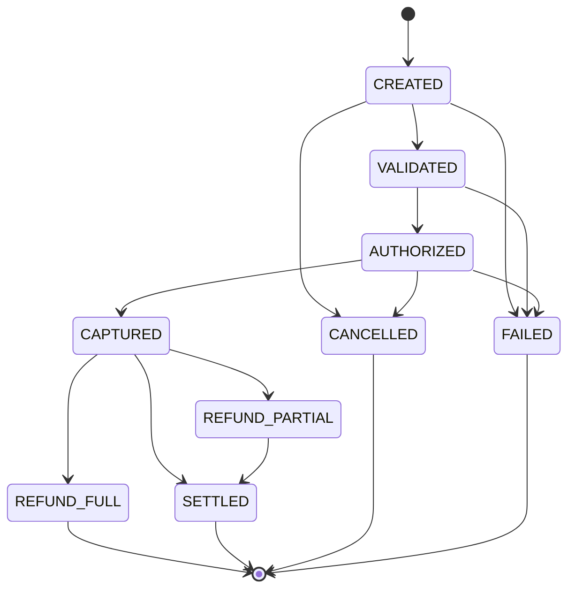
```mermaid
stateDiagram-v2
    [*] --> CREATED
    CREATED --> VALIDATED
    CREATED --> FAILED
    CREATED --> CANCELLED
    VALIDATED --> AUTHORIZED
    VALIDATED --> FAILED
    AUTHORIZED --> CAPTURED
    AUTHORIZED --> CANCELLED
    AUTHORIZED --> FAILED
    CAPTURED --> REFUND_PARTIAL
    CAPTURED --> REFUND_FULL
    CAPTURED --> SETTLED
    REFUND_PARTIAL --> SETTLED
    REFUND_FULL --> [*]
    SETTLED --> [*]
    CANCELLED --> [*]
    FAILED --> [*]
```

---

# 10. Core Workflows

## 10.1 Payment Creation
| Aspect | Detail |
|---|---|
| Purpose | Record intent, validate merchant eligibility |
| Trigger | `POST /v1/payments` via API Gateway |
| Steps | Idempotency check → create `Payment` (`CREATED`) → query Merchant Service eligibility → `VALIDATED` or `FAILED` |
| Outcome | Payment ready for authorization, or rejected with a clear error |

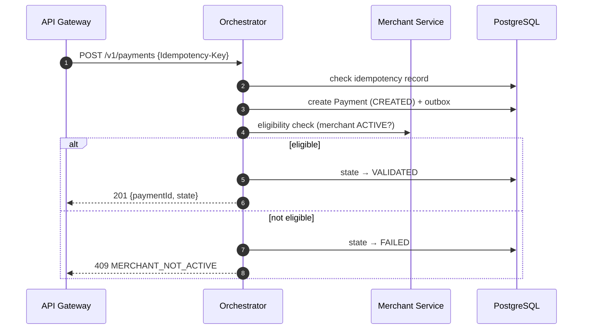
```mermaid
sequenceDiagram
    autonumber
    participant GW as API Gateway
    participant POS as Orchestrator
    participant MS as Merchant Service
    participant DB as PostgreSQL

    GW->>POS: POST /v1/payments {Idempotency-Key}
    POS->>DB: check idempotency record
    POS->>DB: create Payment (CREATED) + outbox
    POS->>MS: eligibility check (merchant ACTIVE?)
    alt eligible
        POS->>DB: state → VALIDATED
        POS-->>GW: 201 {paymentId, state}
    else not eligible
        POS->>DB: state → FAILED
        POS-->>GW: 409 MERCHANT_NOT_ACTIVE
    end
```

## 10.2 Payment Authorization
| Aspect | Detail |
|---|---|
| Purpose | Detokenize + call Acquiring Adapter to reserve funds |
| Trigger | Payment reaches `VALIDATED` |
| Steps | Detokenize (Token Vault, <50ms) → route selection → authorize call → ledger entry → state transition |
| Outcome | `AUTHORIZED` or `FAILED` |

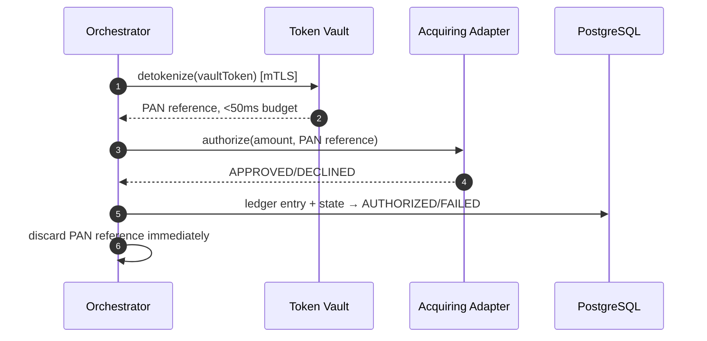
```mermaid
sequenceDiagram
    autonumber
    participant POS as Orchestrator
    participant TV as Token Vault
    participant AA as Acquiring Adapter
    participant DB as PostgreSQL

    POS->>TV: detokenize(vaultToken) [mTLS]
    TV-->>POS: PAN reference, <50ms budget
    POS->>AA: authorize(amount, PAN reference)
    AA-->>POS: APPROVED/DECLINED
    POS->>DB: ledger entry + state → AUTHORIZED/FAILED
    POS->>POS: discard PAN reference immediately
```

## 10.3 Payment Capture
| Aspect | Detail |
|---|---|
| Purpose | Finalize an authorized payment |
| Trigger | Merchant capture request |
| Steps | Validate state = `AUTHORIZED` → call Acquiring Adapter capture → ledger entry → state → `CAPTURED` |
| Outcome | `CAPTURED` or retry/compensation on failure |

## 10.4 Payment Failure
| Aspect | Detail |
|---|---|
| Purpose | Record a terminal failure with full traceability |
| Trigger | Declined authorization, ineligible merchant, exhausted retries |
| Steps | Ledger entry (failure record) → state → `FAILED` → publish `PaymentFailed` |
| Outcome | Caller receives a clear error; no partial financial effect remains |

## 10.5 Retry
| Aspect | Detail |
|---|---|
| Purpose | Recover from transient failures without manual intervention |
| Trigger | Timeout/transient error from Acquiring Adapter |
| Steps | Retry Manager applies bounded backoff → re-attempt the same SAGA step |
| Outcome | Step succeeds, or exhausts retries and triggers compensation |

## 10.6 Compensation
| Aspect | Detail |
|---|---|
| Purpose | Correct a partially-completed SAGA without violating the append-only ledger |
| Trigger | Retry exhaustion after a prior step already succeeded (e.g. authorized but capture repeatedly fails) |
| Steps | Compensation Manager appends a corrective ledger entry → state transition reflecting the corrected outcome |
| Outcome | Financial consistency preserved; full audit trail retained |

## 10.7 Cancellation
| Aspect | Detail |
|---|---|
| Purpose | Stop a payment before it has any external financial effect |
| Trigger | Merchant/caller cancellation request while `CREATED`/`VALIDATED`/`AUTHORIZED` (pre-capture) |
| Steps | Validate state permits cancellation → state → `CANCELLED` → ledger entry |
| Outcome | No capture occurs; a post-capture "cancel" request is rejected and must instead use refund |

---

# 11. Clean Architecture

| Layer | Contents |
|---|---|
| Presentation | Payment Controller, request/response DTOs |
| Application | Use cases: `CreatePaymentUseCase`, `AuthorizePaymentUseCase`, `CapturePaymentUseCase`, `CompensatePaymentUseCase` |
| Domain | `Payment`, `LedgerEntry`, `SagaExecution` aggregates; state-machine rules; domain events |
| Infrastructure | Repositories, Kafka Outbox adapter, Token Vault/Acquiring Adapter/Merchant Service clients |

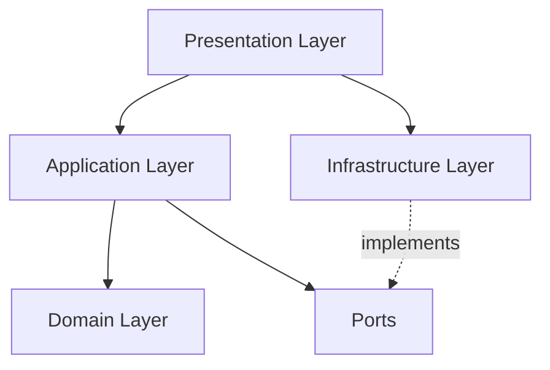
```mermaid
flowchart TB
    PRES["Presentation Layer"] --> APP["Application Layer"]
    APP --> DOM["Domain Layer"]
    APP --> PORTS["Ports"]
    INFRA["Infrastructure Layer"] -.implements.-> PORTS
    PRES --> INFRA
```

Dependency Rule: identical to every prior service spec — dependencies point inward only; Domain has zero framework/infrastructure dependency.

Folder structure: follows the platform-standard package shape (`02_ENGINEERING_STANDARDS.md`) — `controller/`, `application/`, `domain/`, `port/`, `adapter/`, plus service-specific `saga/`, `outbox/`, `ledger/` packages per `SYSTEM_DESIGN.md` §13.

---

# 12. Dependencies

| Dependency | Purpose | Communication Type | Criticality | Failure Impact |
|---|---|---|---|---|
| API Gateway | Sole external entry point | Sync, mTLS (inbound) | Critical | No new payments can be initiated |
| Merchant Service | Merchant eligibility check | Sync, internal API | Critical | Cannot validate new payments; existing in-flight payments unaffected |
| Token Vault | Detokenization | Sync, mTLS | Critical | Cannot authorize new payments |
| Acquiring Adapter | Authorize/capture/refund | Sync, mTLS | Critical | No new authorizations/captures |
| Settlement Service | Consumes ledger events for payout | Async, Kafka | Non-critical (foreground) | Delayed settlement, no impact to payment processing |
| Webhook Service | Consumes payment events for merchant notification | Async, Kafka | Non-critical | Delayed merchant notification only |
| Redis | Idempotency cache | Sync | Non-critical | Falls through to DB constraint check |
| Kafka | Event propagation (Outbox) | Async | Non-critical (foreground) | Delays downstream event consumption; no data loss (Outbox guarantee) |
| PostgreSQL | Payment/ledger/outbox system of record | Sync | Critical | No payment processing possible |


# Payment Orchestrator — Software Architecture Specification
## Part 2 of 4: API Specification, Routing, Saga, Resilience

---

# 13. REST API Specification

| Endpoint | Purpose | Auth | Idempotency | Status Codes |
|---|---|---|---|---|
| `POST /v1/payments` | Create + validate a payment intent | JWT/API Key (via Gateway) | Required (`Idempotency-Key`) | `201`, `400`, `409`, `429` |
| `GET /v1/payments/{id}` | Retrieve payment status | JWT/API Key | N/A (read) | `200`, `404` |
| `POST /v1/payments/{id}/capture` | Capture an authorized payment | JWT/API Key | Required | `200`, `409`, `404` |
| `POST /v1/payments/{id}/cancel` | Cancel a pre-capture payment | JWT/API Key | Required | `200`, `409`, `404` |
| `POST /v1/payments/{id}/refunds` | Full or partial refund | JWT/API Key | Required | `201`, `409`, `404` |

## 13.1 `POST /v1/payments`
| Aspect | Detail |
|---|---|
| Request | `amount`, `currency`, `merchantId`, `paymentMethod` (`CARD`/`NET_BANKING`), `vaultToken` or `bankCode` |
| Response | `paymentId`, `state`, `createdAt` |
| Validation | Structural (Gateway) + merchant eligibility (this service, §10.1 Part 1) |
| Error codes | `MERCHANT_NOT_ACTIVE`, `INVALID_VAULT_TOKEN`, `MISSING_IDEMPOTENCY_KEY` |

## 13.2 `POST /v1/payments/{id}/capture`
| Aspect | Detail |
|---|---|
| Request | Optional partial `amount` (defaults to full authorized amount) |
| Response | `paymentId`, `state=CAPTURED`, `capturedAmount` |
| Validation | State must be `AUTHORIZED` |
| Error codes | `INVALID_STATE_TRANSITION`, `CAPTURE_AMOUNT_EXCEEDS_AUTHORIZED` |

## 13.3 `POST /v1/payments/{id}/cancel`
| Aspect | Detail |
|---|---|
| Request | `reason` |
| Response | `paymentId`, `state=CANCELLED` |
| Validation | State must be pre-capture (`CREATED`/`VALIDATED`/`AUTHORIZED`) |
| Error codes | `PAYMENT_ALREADY_CAPTURED` (use refund instead) |

## 13.4 `POST /v1/payments/{id}/refunds`
| Aspect | Detail |
|---|---|
| Request | `amount` (optional, defaults to full), `reason` |
| Response | `refundId`, `paymentId`, `state` (`REFUND_PARTIAL`/`REFUND_FULL`) |
| Validation | State must be `CAPTURED` or already `REFUND_PARTIAL`; amount must not exceed remaining captured balance |
| Error codes | `REFUND_EXCEEDS_CAPTURED_AMOUNT`, `PAYMENT_NOT_CAPTURED` |

All endpoints reuse the platform-standard error envelope (`API-Gateway-Part-02.md` §17.5) and header set (`Idempotency-Key`, `X-Correlation-Id`, `traceparent`).

---

# 14. Request Flow

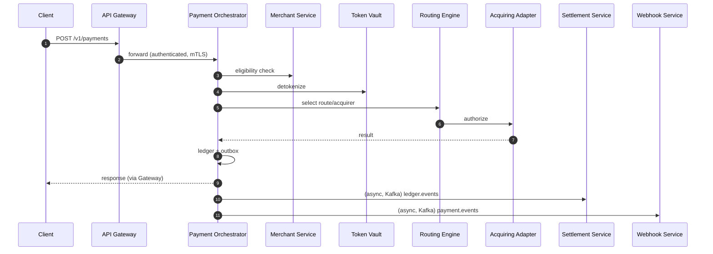
```mermaid
sequenceDiagram
    autonumber
    participant Client
    participant GW as API Gateway
    participant POS as Payment Orchestrator
    participant MS as Merchant Service
    participant TV as Token Vault
    participant RE as Routing Engine
    participant AA as Acquiring Adapter
    participant SS as Settlement Service
    participant WH as Webhook Service

    Client->>GW: POST /v1/payments
    GW->>POS: forward (authenticated, mTLS)
    POS->>MS: eligibility check
    POS->>TV: detokenize
    POS->>RE: select route/acquirer
    RE->>AA: authorize
    AA-->>POS: result
    POS->>POS: ledger + outbox
    POS-->>Client: response (via Gateway)
    POS->>SS: (async, Kafka) ledger.events
    POS->>WH: (async, Kafka) payment.events
```

---

# 15. Payment Routing Logic

## 15.1 Selection Factors
| Factor | Description |
|---|---|
| Payment method | `CARD` → card acquirer pool; `NET_BANKING` → bank-specific simulator |
| Merchant preference | Merchant-configured preferred acquirer (from Merchant Service config, `Merchant-Service-Part-02.md` §44) |
| Acquirer health | Circuit-breaker state per acquirer (Resilience4j) |
| Currency | Acquirer must support the payment's currency |
| Geography | Acquirer must support the merchant's/cardholder's region where applicable |

## 15.2 Decision Table
| Condition | Route Decision |
|---|---|
| Merchant has preferred acquirer AND it's healthy | Use preferred acquirer |
| Merchant has preferred acquirer AND it's unhealthy (circuit open) | Failover to next-priority healthy acquirer |
| No preference configured | Use platform default priority list, filtered by currency/geography support |
| No healthy acquirer supports currency/geography | Reject with `NO_ELIGIBLE_ACQUIRER` |

## 15.3 Smart / Priority / Failover Routing
- **Smart routing**: considers acquirer health + currency/geography fit before falling back to static priority.
- **Priority routing**: an ordered list per payment method, merchant-configurable, platform-default otherwise.
- **Failover routing**: on acquirer circuit-open or authorization failure classified as acquirer-side (not decline), automatically retries against the next-priority acquirer — **only** for authorization, never for capture (capture must stay with the acquirer that authorized it).

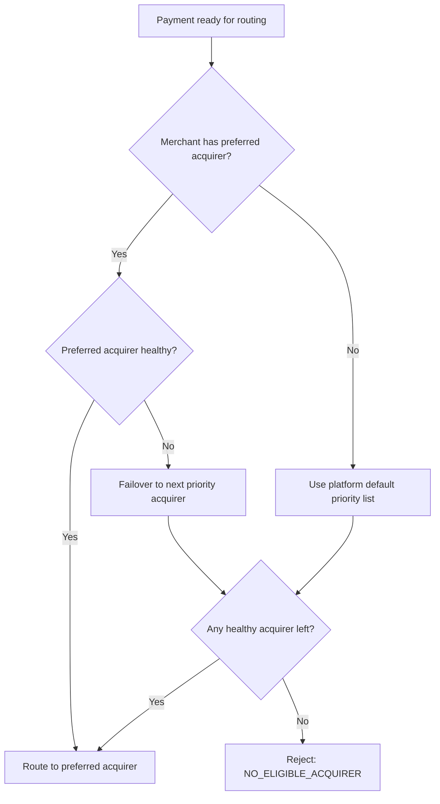
```mermaid
flowchart TD
    A["Payment ready for routing"] --> B{"Merchant has preferred acquirer?"}
    B -->|Yes| C{"Preferred acquirer healthy?"}
    C -->|Yes| D["Route to preferred acquirer"]
    C -->|No| E["Failover to next priority acquirer"]
    B -->|No| F["Use platform default priority list"]
    E --> G{"Any healthy acquirer left?"}
    F --> G
    G -->|Yes| D
    G -->|No| H["Reject: NO_ELIGIBLE_ACQUIRER"]
```

---

# 16. Orchestration Engine

| Component | Responsibility |
|---|---|
| State Manager | Enforces valid state-machine transitions (§9, Part 1) |
| Step Sequencer | Determines the next SAGA step given current state |
| Decision Evaluator | Applies routing/eligibility decisions before invoking a step |
| Transaction Coordinator | Ensures each step's local DB write (state + ledger + outbox) is atomic |

- **Internal workflow**: incoming command → State Manager validates transition legality → Step Sequencer dispatches to the relevant SAGA step → Transaction Coordinator commits atomically.
- **Decision making**: every branch (route selection, retry-vs-fail, compensate-vs-retry) is evaluated by a dedicated component — no inline conditional logic scattered across use cases.
- **State management**: state lives only in PostgreSQL (`payment.state`), never cached or duplicated elsewhere, avoiding any dual-source-of-truth risk on the most safety-critical field in the platform.

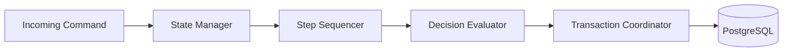
```mermaid
flowchart LR
    CMD["Incoming Command"] --> SM["State Manager"]
    SM --> SEQ["Step Sequencer"]
    SEQ --> DE["Decision Evaluator"]
    DE --> TC["Transaction Coordinator"]
    TC --> DB[("PostgreSQL")]
```

---

# 17. Saga Coordination

- **Why Saga**: no distributed transactions across Token Vault / Acquiring Adapter / Settlement Service (`SYSTEM_DESIGN.md` §6); each step is a local transaction with an explicit compensating action.
- **Participants**: Payment Orchestrator (coordinator), Token Vault (detokenize — no compensation needed, side-effect-free), Acquiring Adapter (authorize/capture — compensable via reversal/refund).

| Path | Behavior |
|---|---|
| Success | Each step completes → state advances → terminal `SETTLED` |
| Failure (pre-authorization) | No external effect occurred → mark `FAILED` directly, no compensation needed |
| Failure (post-authorization) | Compensation Manager issues a reversal/refund against the Acquiring Adapter, append-only ledger reflects the correction |

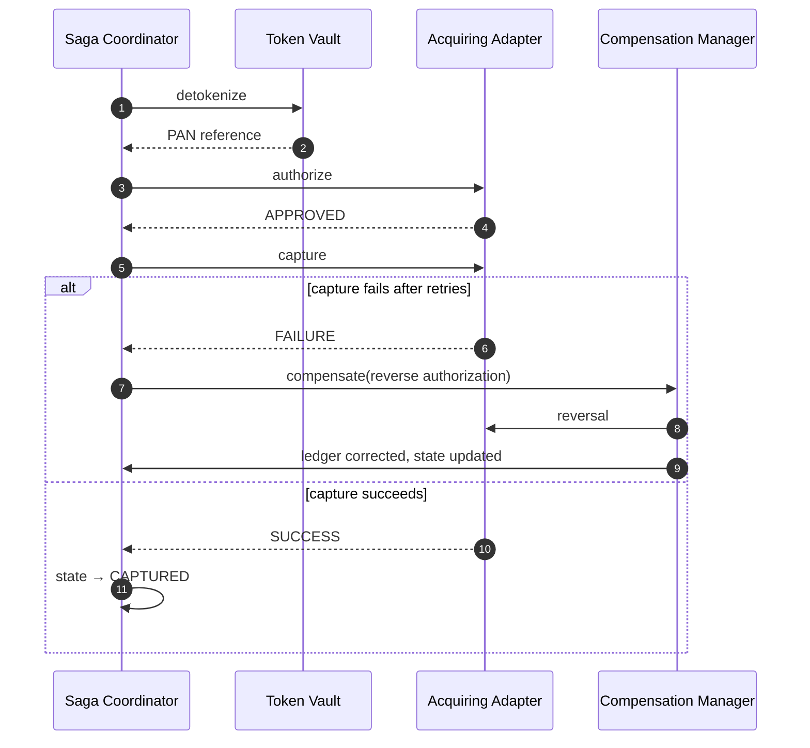
```mermaid
sequenceDiagram
    autonumber
    participant SC as Saga Coordinator
    participant TV as Token Vault
    participant AA as Acquiring Adapter
    participant CM as Compensation Manager

    SC->>TV: detokenize
    TV-->>SC: PAN reference
    SC->>AA: authorize
    AA-->>SC: APPROVED
    SC->>AA: capture
    alt capture fails after retries
        AA-->>SC: FAILURE
        SC->>CM: compensate(reverse authorization)
        CM->>AA: reversal
        CM->>SC: ledger corrected, state updated
    else capture succeeds
        AA-->>SC: SUCCESS
        SC->>SC: state → CAPTURED
    end
```

---

# 18. Retry Strategy

| Failure Type | Retry? | Max Attempts | Backoff |
|---|---|---|---|
| Network timeout to Acquiring Adapter | Yes | 3 | Exponential + jitter (100ms base, 2s cap) |
| Acquirer 5xx | Yes | 3 | Exponential + jitter |
| Acquirer decline (business response) | No | — | Terminal — never retried |
| Token Vault detokenize failure | Yes (bounded) | 2 | Fixed short backoff (given the 50ms PAN-lifetime budget) |
| Database transient error | Yes | 3 | Exponential + jitter |

- **Manual retry**: exposed as an operator action for a payment stuck in a retryable-failed intermediate state past automatic exhaustion — never for a business decline.
- **Dead-letter handling**: a payment whose retries are exhausted moves to `FAILED` (pre-auth) or triggers compensation (post-auth) — never left in an ambiguous retrying-forever state.
- **Timeout handling**: identical to a transient failure — retried per policy, then compensated/failed on exhaustion.

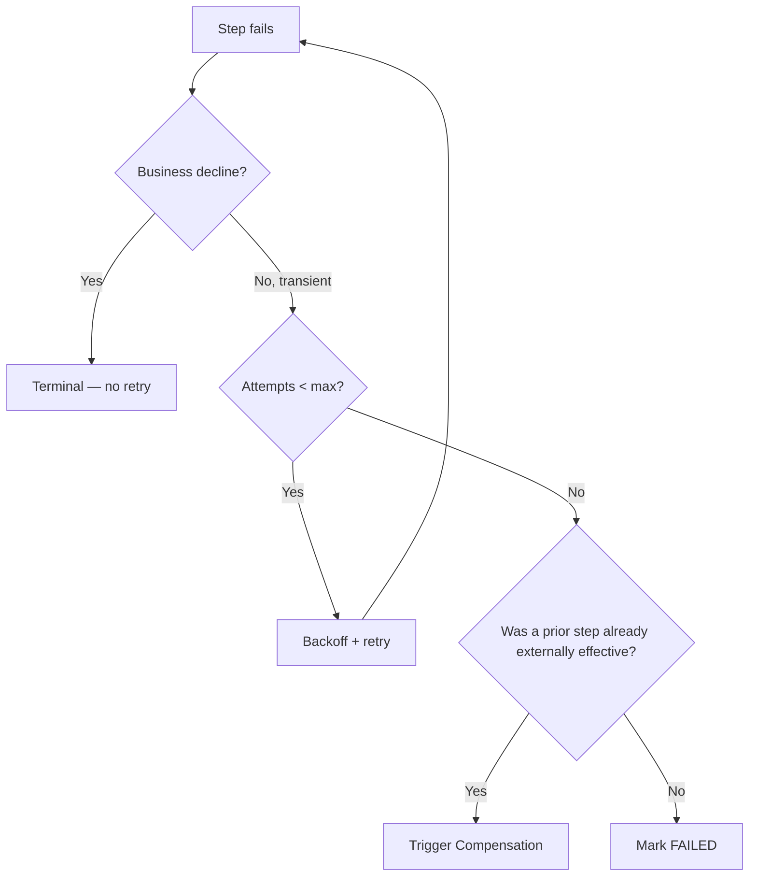
```mermaid
flowchart TD
    A["Step fails"] --> B{"Business decline?"}
    B -->|Yes| C["Terminal — no retry"]
    B -->|No, transient| D{"Attempts < max?"}
    D -->|Yes| E["Backoff + retry"]
    E --> A
    D -->|No| F{"Was a prior step already externally effective?"}
    F -->|Yes| G["Trigger Compensation"]
    F -->|No| H["Mark FAILED"]
```

---

# 19. Compensation Strategy

- **Triggers**: retry exhaustion after a prior externally-effective step (e.g. authorized, then capture repeatedly fails); merchant-initiated refund after capture.
- **Reverse operations**: an authorization reversal (releases reserved funds) or a refund (returns captured funds) — never a deletion of the original ledger entry.
- **Rollback workflow**: always additive — a new ledger entry records the correction; `Payment.state` transitions to reflect the corrected outcome (e.g. `FAILED` with a reversal note, or `REFUND_FULL`).
- **Partial failure handling**: if the compensating call itself fails, it is retried under the same policy as §18; a payment cannot be considered "resolved" until either the original step or its compensation is confirmed.

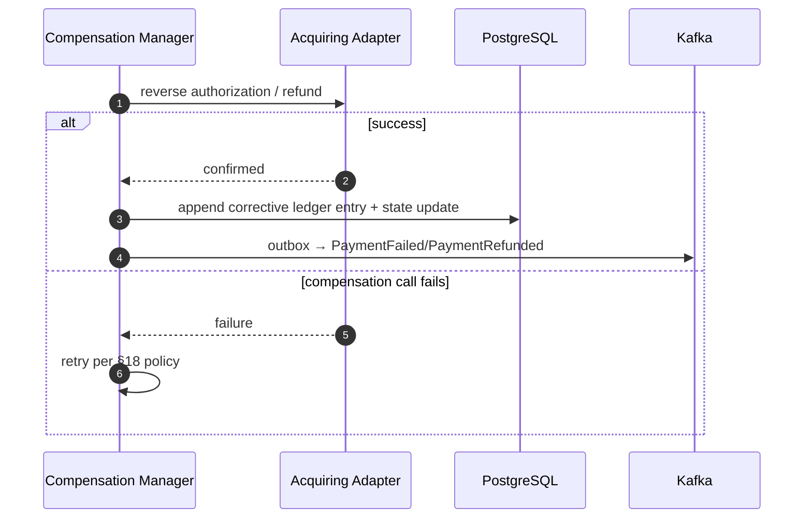
```mermaid
sequenceDiagram
    autonumber
    participant CM as Compensation Manager
    participant AA as Acquiring Adapter
    participant DB as PostgreSQL
    participant Kafka

    CM->>AA: reverse authorization / refund
    alt success
        AA-->>CM: confirmed
        CM->>DB: append corrective ledger entry + state update
        CM->>Kafka: outbox → PaymentFailed/PaymentRefunded
    else compensation call fails
        AA-->>CM: failure
        CM->>CM: retry per §18 policy
    end
```

---

# 20. Idempotency

- **Why required**: prevents duplicate charges from network retries, caller-side retries, or Gateway-level retries hitting a mutating endpoint (`SYSTEM_DESIGN.md` §6).
- **Idempotency Key**: caller-supplied UUID, required on every mutating endpoint (§13); enforced identically to the platform-standard pattern already used by Merchant Service and Token Vault.
- **Request deduplication**: Redis fast-path check → PostgreSQL unique constraint on `(merchantId, idempotencyKey, endpoint)` as the ultimate guarantee.
- **Duplicate payment prevention**: a duplicate request within the TTL window returns the **original** payment's result, never creates a second payment or re-executes a SAGA step.
- **Storage strategy**: `idempotency_record` table, short-TTL, cleaned up on a schedule — identical pattern to Merchant Service (`Merchant-Service-Part-02.md` §47).
- **Expiration strategy**: TTL bounded to a window comfortably longer than any plausible caller-retry window, short enough to keep the table small.

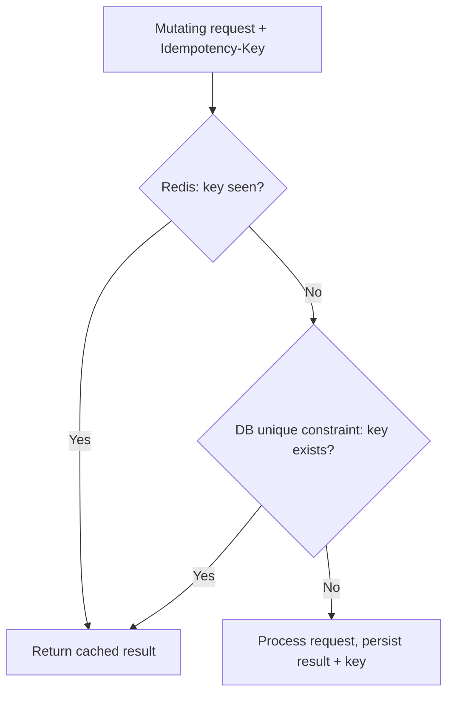
```mermaid
flowchart TD
    A["Mutating request + Idempotency-Key"] --> B{"Redis: key seen?"}
    B -->|Yes| C["Return cached result"]
    B -->|No| D{"DB unique constraint: key exists?"}
    D -->|Yes| C
    D -->|No| E["Process request, persist result + key"]
```

---

# 21. Failure Handling

| Failure | Detection | Retry | Recovery | Client Response |
|---|---|---|---|---|
| Acquirer unavailable | Circuit breaker opens | No (circuit open — fail fast) | Failover to next acquirer (§15.3) if pre-authorization; else compensate | `503` or failover-routed success |
| Network timeout | Client-side timeout on outbound call | Yes, bounded (§18) | Retry, then compensate/fail | `202`/`200` on eventual success, `409`/`500` on exhaustion |
| Duplicate request | Idempotency-Key match (§20) | N/A | Return original result | Original response, replayed |
| Internal service failure (Merchant Service, Token Vault down) | Health-check/circuit breaker | Yes, bounded | Fail the specific step; payment marked `FAILED` if pre-auth | `503` |
| Kafka unavailable | Outbox publish lag metric | N/A (Outbox Relay retries) | Events catch up once Kafka recovers; no impact to synchronous flow | No visible impact to caller |
| Redis unavailable | Connection failure | N/A | Fall through to PostgreSQL constraint for idempotency | No visible impact to caller (slight latency increase) |
| Database unavailable | Readiness probe fails | N/A | Failover to synchronous standby | `503` until failover completes |

---

# 22. Authentication & Authorization

- **OAuth2/JWT**: validated at the API Gateway before any request reaches this service (`API-Gateway-Part-02.md` §19–20) — the Orchestrator trusts the Gateway-attested principal via signed internal headers, never re-validates the original credential.
- **Internal service authentication**: mTLS on every outbound call (Token Vault, Acquiring Adapter, Merchant Service) — identical platform-standard workload-identity model (`Token-Vault-Part-02.md` §19.3–19.4).
- **mTLS**: mandatory for all internal calls; the Orchestrator is itself the sole allow-listed caller for Token Vault's detokenize endpoint (`Token-Vault-Part-01.md` §8.5).
- **Service authorization**: coarse route-class checks already performed at the Gateway (`payments:write` scope required for mutating endpoints); this service additionally enforces resource-ownership — a merchant's credential may only act on its own `paymentId`, mirroring Merchant Service's fine-grained authorization pattern (`Merchant-Service-Part-02.md` §51).

---

# 23. Sequence Diagrams

## 23.1 Payment Creation
See §10.1, Part 1.

## 23.2 Payment Authorization
See §10.2, Part 1.

## 23.3 Payment Capture
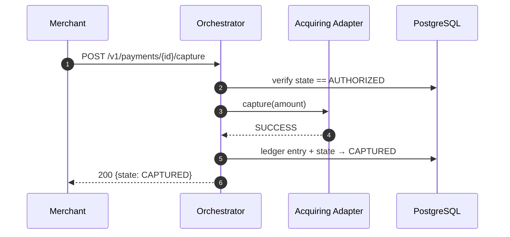
```mermaid
sequenceDiagram
    autonumber
    participant Merchant
    participant POS as Orchestrator
    participant AA as Acquiring Adapter
    participant DB as PostgreSQL

    Merchant->>POS: POST /v1/payments/{id}/capture
    POS->>DB: verify state == AUTHORIZED
    POS->>AA: capture(amount)
    AA-->>POS: SUCCESS
    POS->>DB: ledger entry + state → CAPTURED
    POS-->>Merchant: 200 {state: CAPTURED}
```

## 23.4 Payment Cancellation
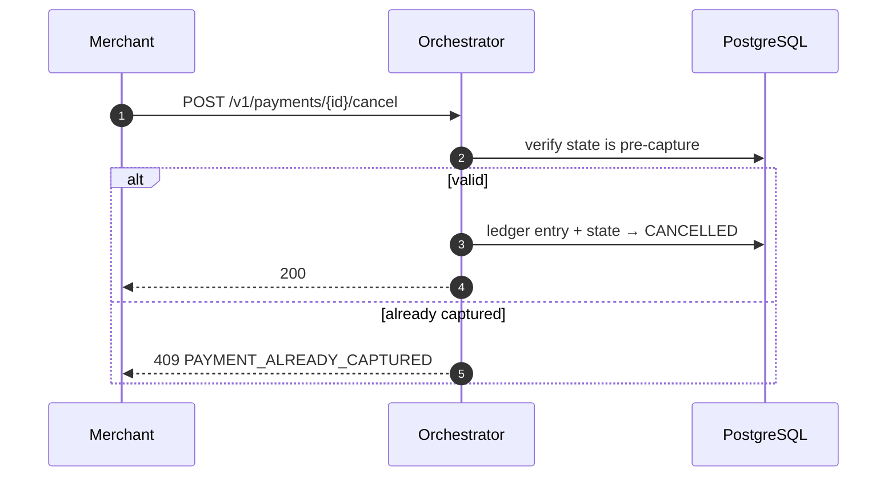
```mermaid
sequenceDiagram
    autonumber
    participant Merchant
    participant POS as Orchestrator
    participant DB as PostgreSQL

    Merchant->>POS: POST /v1/payments/{id}/cancel
    POS->>DB: verify state is pre-capture
    alt valid
        POS->>DB: ledger entry + state → CANCELLED
        POS-->>Merchant: 200
    else already captured
        POS-->>Merchant: 409 PAYMENT_ALREADY_CAPTURED
    end
```

## 23.5 Retry Flow
See §18 flowchart.

## 23.6 Compensation Flow
See §19 sequence diagram.

## 23.7 Acquirer Failover
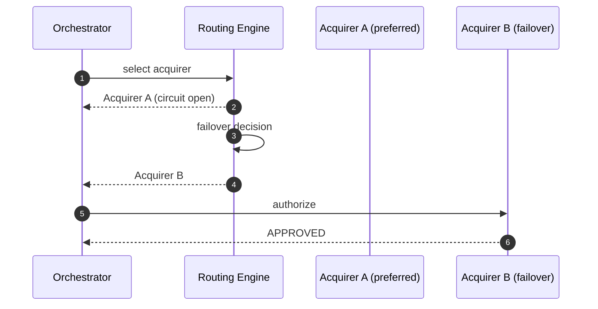
```mermaid
sequenceDiagram
    autonumber
    participant POS as Orchestrator
    participant RE as Routing Engine
    participant AA1 as Acquirer A (preferred)
    participant AA2 as Acquirer B (failover)

    POS->>RE: select acquirer
    RE-->>POS: Acquirer A (circuit open)
    RE->>RE: failover decision
    RE-->>POS: Acquirer B
    POS->>AA2: authorize
    AA2-->>POS: APPROVED
```

## 23.8 Timeout Handling
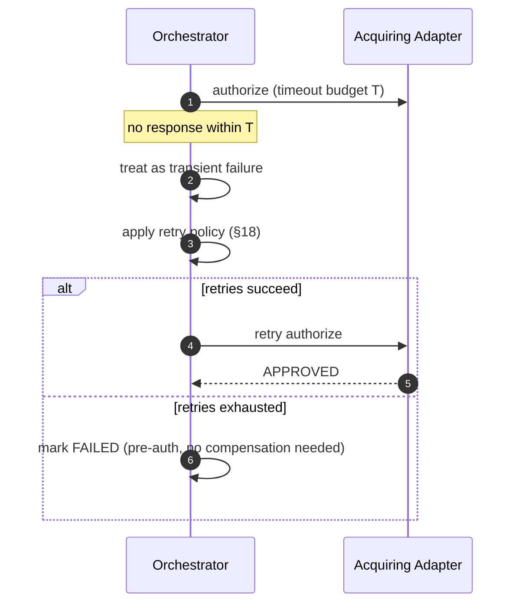
```mermaid
sequenceDiagram
    autonumber
    participant POS as Orchestrator
    participant AA as Acquiring Adapter

    POS->>AA: authorize (timeout budget T)
    Note over POS: no response within T
    POS->>POS: treat as transient failure
    POS->>POS: apply retry policy (§18)
    alt retries succeed
        POS->>AA: retry authorize
        AA-->>POS: APPROVED
    else retries exhausted
        POS->>POS: mark FAILED (pre-auth, no compensation needed)
    end
```

## 23.9 Duplicate Request Handling
See §20 flowchart.

## 23.10 Successful Payment Completion
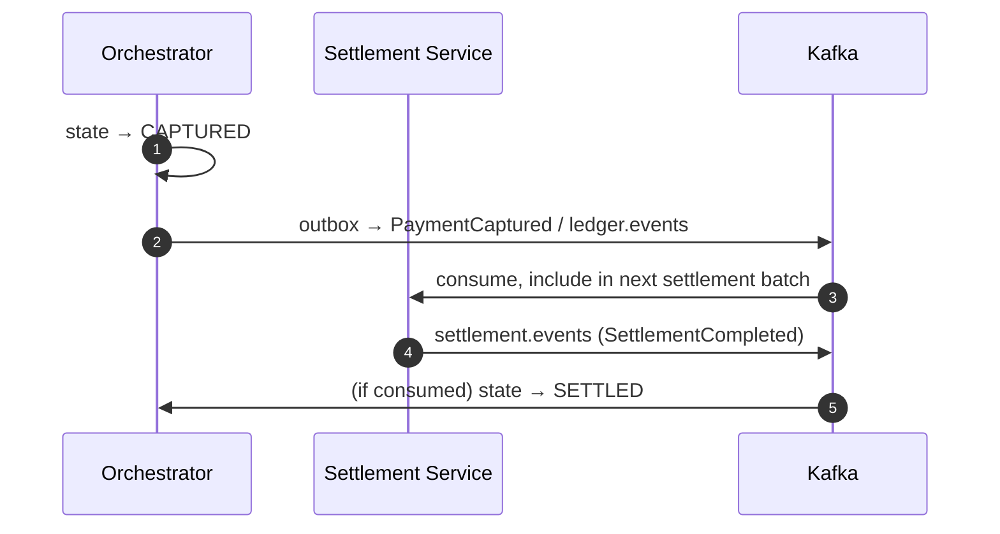
```mermaid
sequenceDiagram
    autonumber
    participant POS as Orchestrator
    participant SS as Settlement Service
    participant Kafka

    POS->>POS: state → CAPTURED
    POS->>Kafka: outbox → PaymentCaptured / ledger.events
    Kafka->>SS: consume, include in next settlement batch
    SS->>Kafka: settlement.events (SettlementCompleted)
    Kafka->>POS: (if consumed) state → SETTLED
```

# Payment Orchestrator — Software Architecture Specification
## Part 3 of 4: Data, Messaging, Performance, Observability, Disaster Recovery

---

# 24. Database Design

- **Purpose**: system of record for payment state, the append-only ledger, SAGA execution tracking, and the platform-standard Outbox/idempotency tables — one PostgreSQL schema, owned exclusively by this service (`SYSTEM_DESIGN.md` §11).
- **Transaction boundaries**: every state transition writes `payment` + `ledger_entry` + `outbox_event` in a single local ACID transaction — never split across calls.
- **Persistence strategy**: optimistic locking (`version` column) on `payment`; ledger is insert-only, never updated.

| Entity | Purpose | Relationships | Lifecycle |
|---|---|---|---|
| `payment` | Aggregate root, current state + route | Has many `ledger_entry`, one `saga_execution` | Created once, transitions per state machine (§9, Part 1) |
| `ledger_entry` | Append-only financial movement | Belongs to one `payment` | Insert-only, never updated/deleted |
| `saga_execution` | Tracks current SAGA step + retry count | Belongs to one `payment` | Created at orchestration start, closed at terminal state |
| `outbox_event` | Reliable event publication | References `payment.id` as aggregate | Platform-standard, partitioned by month |
| `idempotency_record` | Deduplication for mutating requests | Keyed by `(merchantId, idempotencyKey, endpoint)` | Short-TTL, cleaned up on schedule |

```mermaid
erDiagram
    PAYMENT ||--o{ LEDGER_ENTRY : appends
    PAYMENT ||--o| SAGA_EXECUTION : tracked_by
    PAYMENT ||--o{ OUTBOX_EVENT : produces

    PAYMENT {
        uuid id PK
        uuid merchant_id
        uuid vault_token_id
        string state
        string payment_method
        string acquirer_id
        bigint version
        timestamptz created_at
    }
    LEDGER_ENTRY {
        uuid id PK
        uuid payment_id FK
        string entry_type
        bigint amount_minor
        string currency
        timestamptz created_at
    }
    SAGA_EXECUTION {
        uuid id PK
        uuid payment_id FK
        string current_step
        string status
        int retry_count
    }
    OUTBOX_EVENT {
        uuid id PK
        string event_type
        uuid aggregate_id
        boolean published
        timestamptz created_at
    }
    IDEMPOTENCY_RECORD {
        uuid id PK
        string idempotency_key
        string endpoint
        uuid result_payment_id
    }
```

---

# 25. Redis

| Usage | Description |
|---|---|
| Idempotency cache | Fast-path check ahead of the DB unique constraint (§20, Part 2) |
| Payment session cache | Short-lived state snapshot for the routing/authorization window, avoiding repeat DB reads mid-SAGA |
| Retry metadata | Current attempt count + next-eligible-retry timestamp per SAGA step |
| Distributed locks | Single-execution guarantee per `paymentId` during concurrent capture/refund requests |

## Redis Key Design
| Key Pattern | TTL | Purpose |
|---|---|---|
| `idempotency:{merchantId}:{key}:{endpoint}` | Matches platform-standard idempotency TTL | Fast-path dedup |
| `payment:session:{paymentId}` | Bounded to SAGA execution window | Avoids repeat DB reads mid-orchestration |
| `retry:meta:{paymentId}:{step}` | Matches retry policy window (§18, Part 2) | Backoff scheduling state |
| `lock:payment:{paymentId}` | Short, single-operation duration | Prevents concurrent capture/refund race |

- PostgreSQL is always the correctness authority; Redis unavailability degrades to DB fallthrough (§21, Part 2), never gates readiness.

```mermaid
flowchart TB
    APP["Orchestrator Application"] --> R1["Redis: idempotency"]
    APP --> R2["Redis: session cache"]
    APP --> R3["Redis: retry metadata"]
    APP --> R4["Redis: distributed lock"]
    APP -->|"fallback on miss/unavailability"| PG[("PostgreSQL")]
```

---

# 26. Kafka

## Topic Catalog
| Topic | Producers | Consumers | Partition Key |
|---|---|---|---|
| `payment.events` | Payment Orchestrator | Webhook Service, Settlement Service | `paymentId` |
| `ledger.events` | Payment Orchestrator | Settlement Service | `paymentId` |
| `merchant.events` (consumed) | Merchant Service | Payment Orchestrator (eligibility cache invalidation) | `merchantId` |

- **Ordering**: strict per-`paymentId` ordering via partition key — identical rationale used across every prior service spec.
- **Delivery guarantees**: at-least-once via platform-standard Outbox (`SYSTEM_DESIGN.md` §7); consumers apply their own Inbox dedupe.
- **Retry topics / DLQ**: the Orchestrator's own consumer (of `merchant.events`) routes to a DLQ after bounded retries on a persistent processing error, identical pattern to Merchant Service's self-consumer DLQ (`Merchant-Service-Part-03.md` §73).

```mermaid
flowchart LR
    POS["Payment Orchestrator"] -->|"outbox"| PE[("payment.events")]
    POS -->|"outbox"| LE[("ledger.events")]
    PE --> WH["Webhook Service"]
    PE --> SS["Settlement Service"]
    LE --> SS
    ME[("merchant.events")] --> POS
```

---

# 27. Event Catalog

| Event | Producer | Consumer(s) | Purpose | Trigger | Reliability |
|---|---|---|---|---|---|
| `PaymentCreated` | Orchestrator | Analytics | Record intent | Payment creation | At-least-once |
| `PaymentValidated` | Orchestrator | Analytics | Eligibility confirmed | Merchant check passes | At-least-once |
| `PaymentAuthorized` | Orchestrator | Webhook Service, Analytics | Funds reserved | Successful authorization | At-least-once |
| `PaymentCaptured` | Orchestrator | Webhook Service, Settlement Service | Funds finalized | Successful capture | At-least-once |
| `PaymentFailed` | Orchestrator | Webhook Service, Analytics | Terminal failure | Decline / retry exhaustion | At-least-once |
| `PaymentCancelled` | Orchestrator | Webhook Service | Pre-capture termination | Cancellation request | At-least-once |
| `PaymentRefunded` (partial/full) | Orchestrator | Webhook Service, Settlement Service | Refund recorded | Refund request | At-least-once |
| `LedgerEntryAppended` | Orchestrator | Settlement Service | Ledger fact for reconciliation | Every ledger write | At-least-once |
| `MerchantSuspended` (consumed) | Merchant Service | Orchestrator | Block new payment initiation | Merchant suspension | At-least-once, Inbox-deduped |

---

# 28. Performance

| Technique | Application |
|---|---|
| Non-blocking I/O (WebFlux/R2DBC) | End-to-end reactive stack on the authorization hot path, per `SYSTEM_DESIGN.md` Mandatory Architecture Rules |
| Isolated connection pools (bulkhead) | Separate pools per downstream (Token Vault, Acquiring Adapter, Merchant Service) so one slow dependency never starves another |
| Redis fast-path idempotency | Avoids a DB round-trip on the common non-duplicate path |
| Kafka Outbox batching | Relay batches unpublished rows rather than publishing per-row synchronously |
| Partial index on `outbox_event(published=false)` | Keeps the Relay's poll query cheap regardless of historical volume |
| Async settlement/webhook propagation | Never blocks the synchronous authorization/capture response |
| Circuit breakers per downstream | Fail fast rather than exhausting threads on a degraded dependency |

Target: p99 authorization latency budget aligned with the platform's 10,000+ TPS aggregate target, with per-downstream latency (Token Vault ≤20ms, Acquiring Adapter per its own SLA) as the dominant contributors to the Orchestrator's own end-to-end budget.

---

# 29. Scaling Strategy

- **Stateless architecture**: all state in PostgreSQL/Redis; any replica handles any request.
- **Horizontal scaling**: primary scaling lever, identical philosophy to every other platform service.
- **Load balancing**: client-side load balancing at the API Gateway's outbound call to the Orchestrator, informed by service discovery.
- **Auto scaling**: HPA driven by request-rate + CPU, tuned for the authorization path's throughput profile.
- **High availability**: multi-replica, multi-AZ, `PodDisruptionBudget`-protected — this service is the platform's highest-traffic critical path, so its HA posture matches the API Gateway's own 99.95% SLO tier.

```mermaid
flowchart TB
    GW["API Gateway"] --> P1["Orchestrator Pod 1"]
    GW --> P2["Orchestrator Pod 2"]
    GW --> P3["Orchestrator Pod N"]
    P1 & P2 & P3 --> PG[("PostgreSQL Primary + Standby")]
    P1 & P2 & P3 --> REDIS[("Redis Cluster")]
    P1 & P2 & P3 --> KAFKA[("Kafka")]
```

---

# 30. Caching Strategy

| What | Why | Invalidation | Expiration | Consistency |
|---|---|---|---|---|
| Idempotency records | Avoid duplicate charges on retry | N/A (immutable once written) | TTL matches platform standard | PostgreSQL constraint is authoritative |
| Payment session snapshot | Avoid repeat DB reads mid-SAGA | Explicit on step completion | Bounded to SAGA window | PostgreSQL remains source of truth |
| Merchant eligibility cache | Avoid a Merchant Service call on every payment | Event-driven, invalidated on `MerchantSuspended`/`MerchantActivated` | Short TTL as safety net | Event-driven invalidation is primary mechanism, mirroring Merchant Service's own cache-invalidation pattern (`Merchant-Service-Part-03.md` §65.3) |

---

# 31. Logging

- Structured JSON, platform-standard baseline (`API-Gateway-Part-03.md` §28, `Merchant-Service-Part-03.md` §81).
- Never logged: PAN, CVV, vault token detokenized reference, raw acquirer credentials.

## Log Fields
| Field | Description |
|---|---|
| `timestamp` | UTC |
| `level` | INFO/WARN/ERROR |
| `correlationId` | Propagated from API Gateway |
| `traceId` | OpenTelemetry trace |
| `paymentId` | This service's primary entity identifier |
| `merchantId` | Resolved principal |
| `state` | Current payment state at log time |
| `sagaStep` | Current SAGA step, when applicable |
| `latencyMs` | Per-operation latency |

- Every state transition and SAGA step outcome logged at `INFO`; retries at `WARN`; terminal failures and compensation events at `ERROR`.

---

# 32. Metrics

| Metric | Type | Purpose |
|---|---|---|
| `payments_started_total` | Counter | Volume trend |
| `payments_completed_total` | Counter | Success-rate input |
| `payments_failed_total` | Counter | Labeled by failure reason |
| `payment_retry_count` | Histogram | Retry-policy effectiveness |
| `saga_success_rate` | Gauge | Consistency-under-failure health signal |
| `payment_authorization_latency_seconds` | Histogram | Core hot-path latency |
| `kafka_publish_lag_seconds` | Histogram | Outbox-to-Kafka delay |
| `redis_cache_hit_ratio` | Gauge | Eligibility/session cache effectiveness |
| `db_query_latency_seconds` | Histogram | Persistence-layer latency |
| `error_rate` | Gauge | Overall service health |
| `acquirer_circuit_breaker_state{acquirer}` | Gauge | Per-acquirer routing health (§15, Part 2) |

---

# 33. Distributed Tracing

- OpenTelemetry, platform-standard OTLP export (`API-Gateway-Part-03.md` §27).
- The Orchestrator's authorization span is the **root** of the platform's longest cross-service trace — Gateway → Orchestrator → Merchant Service / Token Vault / Acquiring Adapter, all joined into one trace since each call is synchronous and latency-critical to the caller's perceived response (mirroring Token Vault's own reasoning for joining the detokenize span, `Token-Vault-Part-03.md` §40.3).
- Async propagation to Settlement Service/Webhook Service starts its own separate trace, consistent with the platform-wide convention of not force-joining event-driven spans.

```mermaid
sequenceDiagram
    autonumber
    participant GW as API Gateway
    participant POS as Payment Orchestrator
    participant MS as Merchant Service
    participant TV as Token Vault
    participant AA as Acquiring Adapter
    participant SS as Settlement Service

    GW->>POS: traceparent: T1
    POS->>MS: child span (eligibility)
    POS->>TV: child span (detokenize)
    POS->>AA: child span (authorize)
    Note over POS: Trace T1 ends at synchronous response
    POS->>SS: (async, new trace T2) ledger.events consumption
```

---

# 34. Disaster Recovery

| Aspect | Strategy |
|---|---|
| Backup | Continuous WAL archiving on `payment`/`ledger_entry` schema, point-in-time recovery |
| Failover | Synchronous same-region standby (zero RPO), asynchronous cross-region standby (bounded RPO) — identical pattern to Token Vault's DB DR design (`Token-Vault-Part-03.md` §41) |
| Recovery | Automated failover to standby; readiness gates on PostgreSQL reachability |
| Replay Kafka events | `payment.events`/`ledger.events` retained per platform-standard retention, replayable for downstream reconciliation after an incident |
| Database recovery | Point-in-time restore against WAL archive if failover itself is insufficient (e.g. corruption) |
| Redis recovery | Non-gating — session/idempotency cache repopulates via fallthrough, no manual action required |
| Service restart | Stateless replicas restart cleanly; in-flight SAGA executions resume from `saga_execution.current_step` on the next scheduled reconciliation pass |
| Business continuity | A region-loss event is survivable with bounded (tested) data loss on ledger/payment data — the ledger's append-only design means recovery never requires reconstructing "what should the balance be," only replaying what was already recorded |

```mermaid
flowchart TD
    A["Region A outage detected"] --> B["Promote Region B standby to primary"]
    B --> C["Redirect Orchestrator traffic to Region B"]
    C --> D["Verify readiness: PostgreSQL + Kafka + Redis reachable"]
    D --> E{"Any in-flight SAGA executions stuck?"}
    E -->|Yes| F["Reconciliation job resumes from saga_execution.current_step"]
    E -->|No| G["Resume normal operation"]
    F --> G
```

# Package Structure

```
payment-orchestrator-service/
└── src/main/java/.../orchestrator/
    ├── config/
    │   ├── SecurityConfig.java
    │   ├── ResilienceConfig.java
    │   └── RoutingConfig.java
    ├── controller/
    │   └── PaymentController.java
    ├── application/
    │   ├── CreatePaymentUseCase.java
    │   ├── AuthorizePaymentUseCase.java
    │   ├── CapturePaymentUseCase.java
    │   ├── CancelPaymentUseCase.java
    │   ├── RefundPaymentUseCase.java
    │   └── CompensatePaymentUseCase.java
    ├── domain/
    │   ├── payment/
    │   │   ├── Payment.java
    │   │   ├── PaymentState.java          # sealed
    │   │   └── PaymentRoute.java          # value object
    │   ├── ledger/
    │   │   └── LedgerEntry.java
    │   ├── saga/
    │   │   ├── SagaExecution.java
    │   │   └── SagaStep.java              # sealed
    │   ├── event/
    │   │   ├── PaymentCreated.java
    │   │   ├── PaymentValidated.java
    │   │   ├── PaymentAuthorized.java
    │   │   ├── PaymentCaptured.java
    │   │   ├── PaymentFailed.java
    │   │   ├── PaymentCancelled.java
    │   │   ├── PaymentRefunded.java
    │   │   └── LedgerEntryAppended.java
    │   └── vo/
    │       ├── PaymentId.java
    │       ├── IdempotencyKey.java
    │       └── Amount.java
    ├── port/
    │   ├── PaymentRepositoryPort.java
    │   ├── LedgerRepositoryPort.java
    │   ├── SagaExecutionRepositoryPort.java
    │   ├── OutboxWriterPort.java
    │   ├── MerchantServiceClientPort.java
    │   ├── TokenVaultClientPort.java
    │   └── AcquiringAdapterClientPort.java
    ├── saga/
    │   ├── SagaCoordinator.java
    │   ├── RetryManager.java
    │   └── CompensationManager.java
    ├── routing/
    │   └── RoutingEngine.java
    ├── adapter/
    │   ├── persistence/
    │   │   ├── PaymentRepositoryAdapter.java
    │   │   ├── LedgerRepositoryAdapter.java
    │   │   └── SagaExecutionRepositoryAdapter.java
    │   ├── outbox/
    │   │   └── OutboxWriterAdapter.java
    │   └── client/
    │       ├── MerchantServiceClientAdapter.java
    │       ├── TokenVaultClientAdapter.java
    │       └── AcquiringAdapterClientAdapter.java
    ├── entity/            # persistence entities, distinct from domain aggregates
    ├── dto/
    │   ├── request/
    │   └── response/
    ├── mapper/
    ├── exception/
    ├── security/
    ├── validation/
    ├── event/
    │   ├── producer/
    │   └── consumer/      # consumes merchant.events (e.g. MerchantSuspended)
    ├── scheduler/         # idempotency-record cleanup, stuck-saga reconciliation
    ├── client/
    └── constant/
```

Note the `saga/` and `routing/` packages sitting alongside — not nested under — `application/`: the Saga Coordinator, Retry Manager, Compensation Manager, and Routing Engine are cross-cutting orchestration concerns invoked by multiple use cases, not scoped to a single use case's own logic, so they're kept as their own top-level packages rather than duplicated inside each use case class. This mirrors the deviation the API Gateway spec made for its own cross-cutting `filter/` package (`API-Gateway-Part-01.md` §12).