# Settlement Service — Software Architecture Specification
## Part 1: Vision, Architecture, Components, Lifecycle

---

# 1. Executive Summary

The Settlement Service is the platform's financial settlement engine — it computes what each merchant is owed, batches those computations into nightly settlement runs, and generates payout instructions, consuming `ledger.events` from the Payment Orchestrator's append-only ledger (`SYSTEM_DESIGN.md` §8, §9) rather than performing any payment authorization or capture itself.

It owns no payment state and no cardholder data — its entire domain is "given the ledger facts that already happened, what does each merchant owe/get paid, and when."

---

# 2. Service Purpose

- **Primary objective**: aggregate captured payments minus refunds minus fees into a per-merchant net payout, on a scheduled (nightly, per `SYSTEM_DESIGN.md`) cadence, with a full reconciliation trail back to the Payment Orchestrator's ledger.
- **Scope**: settlement calculation, batching, scheduling, payout-instruction generation, and reconciliation reporting. It never authorizes, captures, or refunds a payment — it only reads the resulting ledger facts.
- **Note on "Ledger Service"**: this platform has no standalone Ledger Service — the append-only ledger is owned by the Payment Orchestrator (`Payment-Orchestrator-Part-01.md` §7, `SYSTEM_DESIGN.md` §8). Wherever this document or a diagram references "the ledger," it refers to `ledger.events` consumed from the Payment Orchestrator, not a separate service.
- **Why separated from the Orchestrator**: settlement math (fees, reserves, payout scheduling) is a distinct domain with its own cadence (batch/nightly) and its own business rules (fee schedules, rolling reserves) — coupling it into the Orchestrator's synchronous, high-throughput authorization path would slow the payment hot path down for a concern that is inherently asynchronous and batch-oriented.

---

# 3. Responsibilities / Non-Responsibilities

| Responsibilities | Non-Responsibilities | Why |
|---|---|---|
| Consume `ledger.events`/`payment.events` and build a local settlement-ready read model | Own the payment ledger itself | Payment Orchestrator is the ledger's authoritative owner |
| Calculate fees, commissions, and net payout amounts per merchant | Authorize, capture, or refund payments | Payment Orchestrator's domain entirely |
| Schedule and batch settlements on the platform's settlement cadence | Store cardholder data | Never received or needed |
| Generate payout instructions for the banking system | Execute the actual bank transfer | Delegated to an external/simulated banking system; this service produces instructions, not funds movement |
| Track settlement status and produce reconciliation reports | Deliver merchant notifications | Webhook Service's domain — this service only publishes `settlement.events` |
| Maintain rolling reserve balances per merchant | Validate merchant identity/eligibility | Merchant Service's domain |

---

# 4. Key Definitions

| Term | Definition |
|---|---|
| Settlement | The process of computing and paying out a merchant's net earned amount for a given period |
| Settlement Batch | A grouped set of settlement calculations processed together, typically one per merchant per cycle |
| Settlement Cycle | The recurring time window (e.g. nightly) over which captured/refunded ledger activity is aggregated |
| Settlement Schedule | The configured cadence and cutoff time defining when a cycle closes and processing begins |
| Payout | The resulting instruction (and eventual bank transfer) reflecting a merchant's net settlement amount |
| Settlement Status | The current lifecycle state of a settlement batch (§8) |
| Merchant Balance | The running total a merchant is owed, inclusive of any held reserve |
| Net Amount | Gross captured amount minus fees, commissions, refunds, and reserve holdback |
| Gross Amount | The total captured amount before any deductions |
| Fee | A per-transaction charge deducted from the gross amount |
| Commission | A platform-level revenue share deducted alongside fees |
| Reserve Amount | A portion of a merchant's settlement withheld temporarily against future risk (chargebacks/refunds) |
| Rolling Reserve | A reserve policy withholding a percentage of every settlement on a rolling basis, released after a defined holdback period |

---

# 5. High-Level Architecture

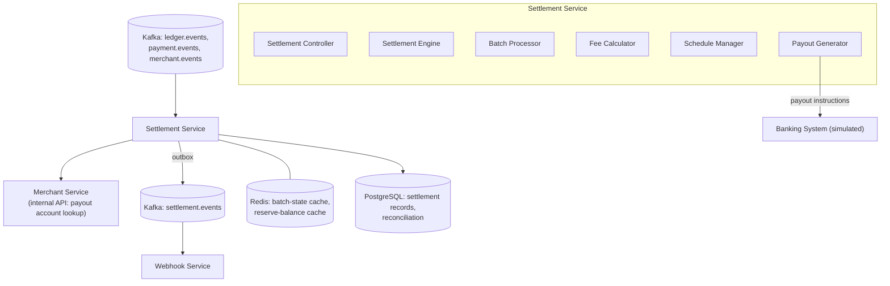

| Integration | Direction | Notes |
|---|---|---|
| Kafka (ledger/payment events) → Settlement Service | Async, consume | Sole source of financial facts — never queries the Orchestrator's DB directly |
| Settlement Service → Merchant Service | Sync, internal API | Payout account reference lookup (`Merchant-Service-Part-02.md` §45) |
| Settlement Service → Kafka (`settlement.events`) | Async, Outbox | Consumed by Webhook Service for merchant notification |
| Settlement Service → Banking System | Sync/async, simulated | Payout instruction submission — this platform uses mock banks per `SYSTEM_DESIGN.md`'s sandbox scope |
| Settlement Service ↔ Redis | Sync | Batch-state and reserve-balance caching |
| Settlement Service ↔ PostgreSQL | Sync | Settlement/reconciliation system of record |

---

# 6. Internal Components

| Component | Purpose |
|---|---|
| Settlement Controller | Internal-only surface for operator actions (manual batch trigger, reconciliation report retrieval) |
| Settlement Engine | Orchestrates the full settlement workflow per merchant per cycle |
| Batch Processor | Groups eligible ledger activity into a settlement batch per merchant |
| Fee Calculator | Applies fee/commission schedules to compute deductions |
| Schedule Manager | Determines cycle boundaries and triggers batch creation on cadence |
| Payout Generator | Produces the payout instruction from a finalized net amount |
| Event Publisher | Publishes `settlement.events` via Outbox |
| Settlement Status Manager | Tracks and exposes settlement-batch lifecycle state |

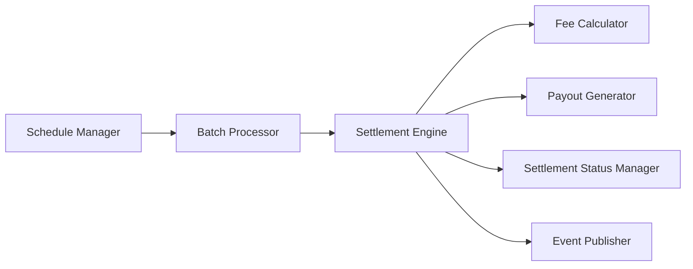

---

# 7. Settlement Lifecycle

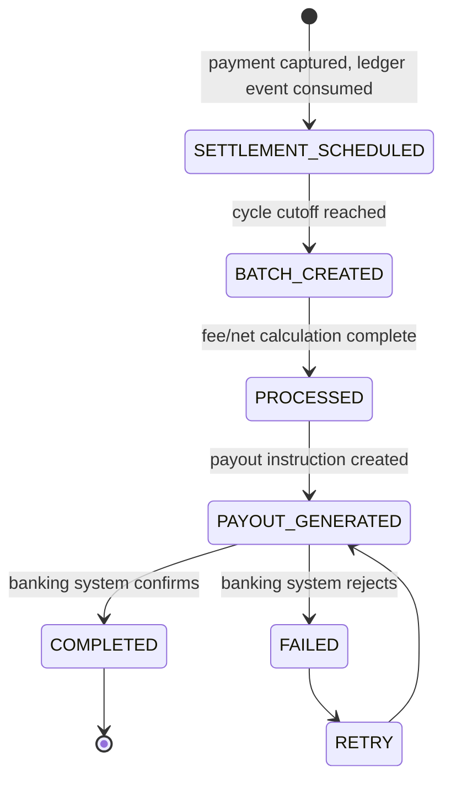

- `SETTLEMENT_SCHEDULED` is an intermediate, per-ledger-entry state before batching — many scheduled entries roll up into one `BATCH_CREATED` per merchant per cycle.
- `FAILED` → `RETRY` is bounded (§Part 2); an exhausted retry escalates to operator review rather than looping indefinitely.

---

# 8. Settlement Workflow

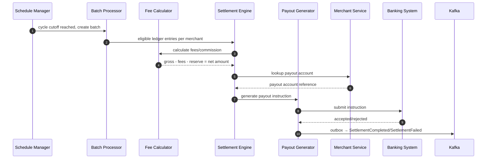

---

# 9. Clean Architecture

| Layer | Contents |
|---|---|
| Presentation | Settlement Controller, operator-facing DTOs |
| Application | Use cases: `ScheduleSettlementUseCase`, `CreateBatchUseCase`, `CalculateFeesUseCase`, `GeneratePayoutUseCase` |
| Domain | `SettlementBatch` aggregate, fee-schedule/reserve-policy domain services, settlement-status state machine |
| Infrastructure | Kafka consumer adapter, Merchant Service client, Banking System client, Outbox adapter |

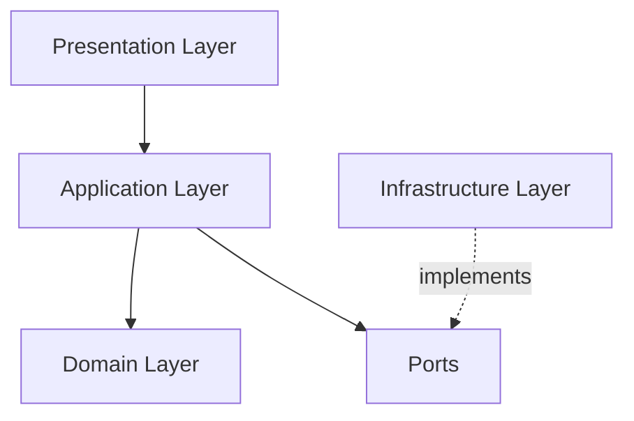

Dependency Rule: identical to every prior service — fee/reserve calculation logic (domain layer) has zero dependency on the Kafka client or banking-system integration specifics, so a banking-provider change touches only the infrastructure layer.

---

# 10. Dependencies

| Dependency | Purpose | Communication | Criticality |
|---|---|---|---|
| Kafka (`ledger.events`, `payment.events`) | Sole source of financial facts to settle | Async, consume | Critical — no settlement possible without it |
| Merchant Service | Payout account lookup | Sync, internal API | Critical — cannot generate a payout instruction without it |
| Banking System (simulated) | Payout execution | Sync/async | Critical for payout completion; non-critical to settlement calculation itself |
| Kafka (`settlement.events`) | Notify Webhook Service | Async, Outbox | Non-critical (foreground) |
| Redis | Batch-state, reserve-balance cache | Sync | Non-critical — degrades to DB-driven lookups |
| PostgreSQL | Settlement/reconciliation system of record | Sync | Critical — no settlement tracking possible without it |

# Settlement Service — Software Architecture Specification
## Part 2: API Specification, Scheduling, Fee Calculation, Payout, Resilience

---

# 11. REST APIs

Internal-only surface — merchants view settlement results via their own reporting flow (outside this service's direct exposure, per Merchant Service's settlement-configuration ownership, `Merchant-Service-Part-02.md` §45); these endpoints support operator tooling and cross-service reconciliation queries.

| Endpoint | Purpose | Auth | Status Codes |
|---|---|---|---|
| `GET /internal/v1/settlements/{batchId}` | Retrieve a settlement batch's status/detail | mTLS, internal | `200`, `404` |
| `GET /internal/v1/settlements?merchantId=...&cycle=...` | List settlements for a merchant/cycle | mTLS, internal | `200` |
| `POST /internal/v1/settlements/manual` | Trigger a manual/ad hoc settlement (operator-role only) | mTLS, internal, operator-role only | `202`, `409` |
| `GET /internal/v1/reconciliation/{cycle}` | Retrieve the reconciliation report for a cycle | mTLS, internal | `200`, `404` |

All responses use the platform-standard error envelope (`API-Gateway-Part-02.md` §17.5).

---

# 12. Settlement Scheduling

| Mode | Description | Trigger |
|---|---|---|
| Daily settlement | Default cadence — one cycle per calendar day, cutoff at a configured time (`SYSTEM_DESIGN.md` nightly settlement principle) | Schedule Manager, time-based |
| Weekly settlement | Merchant-tier or contractual alternative cadence, configured per merchant (via Merchant Service settlement configuration, `Merchant-Service-Part-02.md` §45) | Schedule Manager, time-based, filtered by merchant cadence preference |
| Manual settlement | Operator-triggered ad hoc settlement outside the normal cadence (e.g. urgent payout correction) | `POST /internal/v1/settlements/manual` |
| Instant settlement (optional) | Same-day/near-real-time payout for eligible merchant tiers, bypassing the standard batch cutoff | Configurable per merchant tier; processed as its own single-merchant batch rather than waiting for the next scheduled cycle |

The Schedule Manager evaluates merchant cadence preference at cycle-cutoff time — a merchant on a weekly cadence simply isn't included in a given day's batch creation unless that day is their scheduled cutoff.

---

# 13. Batch Processing

| Phase | Description |
|---|---|
| Batch Creation | Schedule Manager identifies all merchants eligible for settlement at cutoff; Batch Processor groups their eligible `ledger.events`-derived entries into one `SettlementBatch` per merchant |
| Batch Execution | Settlement Engine runs fee calculation (§14) and net-amount calculation (§15) against the batch |
| Batch Completion | Payout Generator produces and submits the payout instruction; batch status → `COMPLETED` on bank confirmation |
| Batch Failure | Any step failing (calculation error, payout rejection) moves the batch to `FAILED`, entering the retry/manual-review path (§17) |

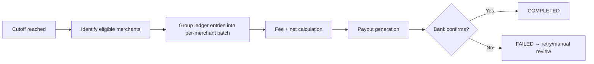

---

# 14. Fee Calculation

| Component | Description |
|---|---|
| Merchant Fee | Per-transaction fee charged to the merchant, per their configured fee schedule |
| Platform Fee | Platform's own revenue-share deduction, applied alongside the merchant fee |
| Taxes | Jurisdiction-applicable tax withholding, computed per the merchant's registered country (`Merchant-Service-Part-01.md` merchant profile) |
| Reserve Amount | A percentage withheld per the merchant's rolling-reserve policy (§4, Part 1), held for a configured holdback period before release |
| Currency Handling | All calculations performed in the transaction's settlement currency; cross-currency conversion (where applicable) uses a platform-configured rate source, applied consistently across a batch to avoid intra-batch rate drift |

Each deduction is computed as an independent, auditable line item — never a single opaque "fees" lump sum — so a merchant-facing reconciliation report (§Part 3) can itemize exactly what was deducted and why.

---

# 15. Net Settlement Calculation

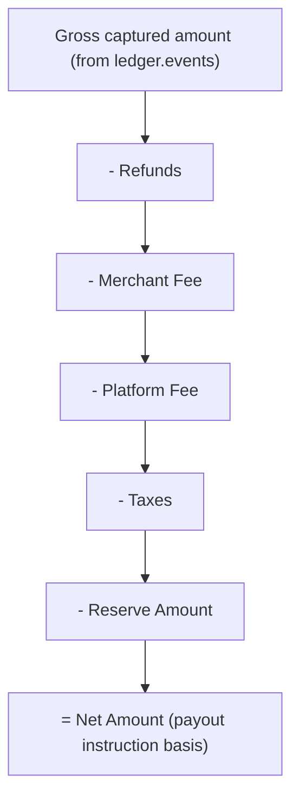

- Every deduction is computed against the same batch's gross figure, in a fixed, documented order — this ordering is itself part of the platform's settlement contract, since fee-on-fee compounding ambiguity would otherwise make reconciliation disputes hard to resolve.
- The resulting `Net Amount` is what the Payout Generator (§16) uses to construct the payout instruction; the full breakdown (gross, each deduction, net) is persisted for reconciliation regardless of the final net figure.

---

# 16. Payout Generation

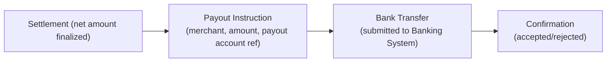

- The payout instruction references the merchant's payout account by the reference Merchant Service provides (`Merchant-Service-Part-02.md` §45) — this service never handles raw bank account numbers directly; it receives a reference resolvable by the banking system integration, consistent with the platform's general "never hold more sensitive data than a component actually needs" principle applied here to banking details as it is to cardholder data at the Token Vault.
- Confirmation is asynchronous in the general case (banking systems typically don't confirm a transfer synchronously) — `PAYOUT_GENERATED` is an intermediate status pending that confirmation, not equivalent to `COMPLETED`.

---

# 17. Retry Strategy

| Failure Type | Retry? | Max Attempts | Escalation |
|---|---|---|---|
| Transient banking-system call failure (timeout, 5xx) | Yes | 3, exponential backoff | Manual review on exhaustion |
| Payout rejected (invalid account, insufficient platform float, etc.) | No | — | Directly to manual review — a business-level rejection is not a transient condition to retry blindly |
| Fee-calculation error (e.g. missing fee-schedule config) | No | — | Directly to manual review — indicates a configuration gap requiring correction, not a timing issue |

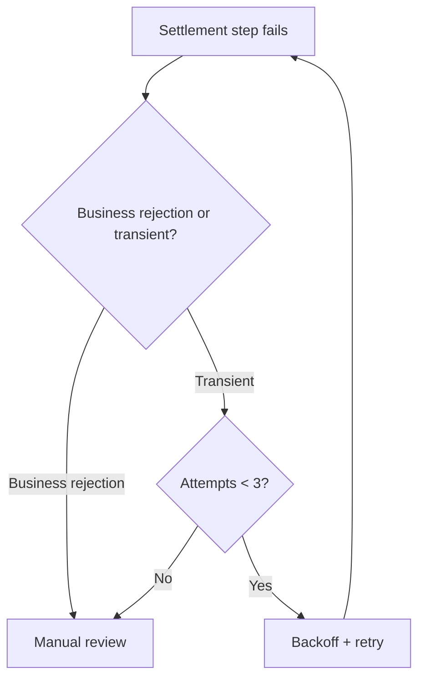

---

# 18. Failure Handling

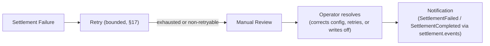

- Manual review is a first-class, tracked state (`settlement_batch.status = MANUAL_REVIEW`), not an undocumented fallback — an operator resolves it through the Settlement Controller (§11), never through direct database manipulation.
- Every failure and its eventual resolution is recorded, feeding the same reconciliation report used for routine (non-failed) settlements — a failed-then-resolved settlement is never treated as a data gap in reconciliation history.

---

# 19. Validation

| Validation | When | Rule |
|---|---|---|
| Merchant validation | Before batch inclusion | Merchant must be in a state eligible for payout (not `DEACTIVATED` without a final-payout exception, per `Merchant-Service-Part-01.md` §22's deactivation-triggers-final-payout workflow) |
| Settlement validation | Before batch finalization | Batch must reference only ledger entries not already included in a prior batch (prevents double-settlement of the same captured amount) |
| Amount validation | At net-amount calculation | Net amount must be non-negative after all deductions; a batch computing a negative net amount is flagged for manual review rather than generating a negative payout instruction |
| Bank account validation | Before payout instruction submission | Payout account reference must resolve to an active, valid account per Merchant Service's current record — a stale/deactivated payout account halts that merchant's payout specifically, not the whole batch |

---

# 20. Sequence Diagrams

## 20.1 Settlement Processing
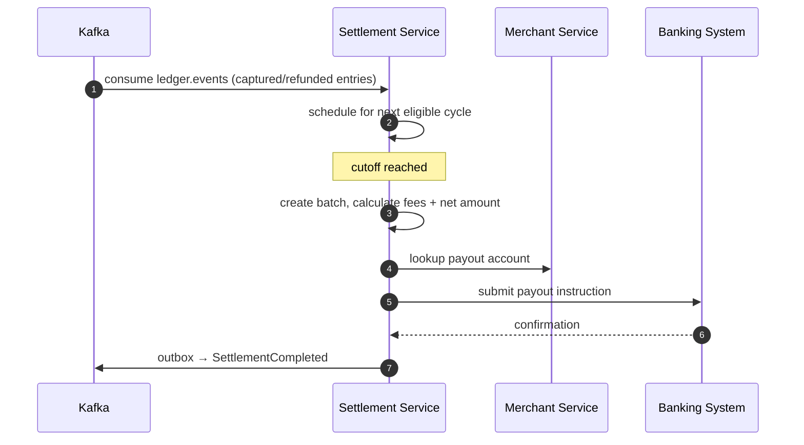

## 20.2 Batch Settlement
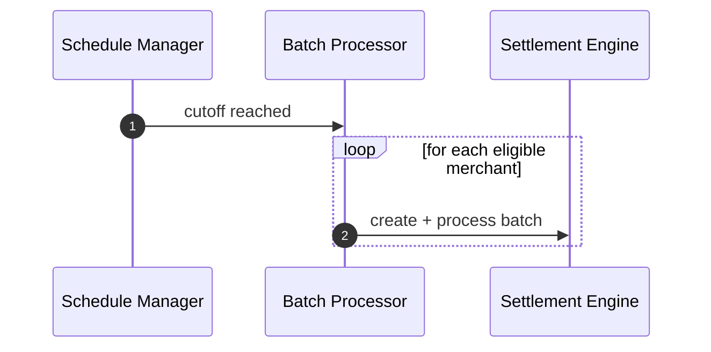

## 20.3 Fee Calculation
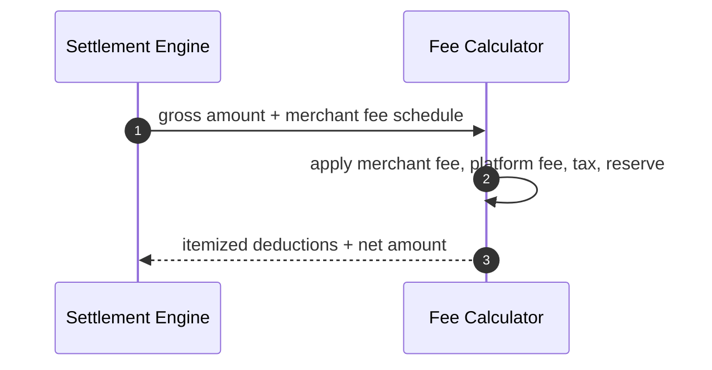

## 20.4 Payout
See §16.

## 20.5 Settlement Retry
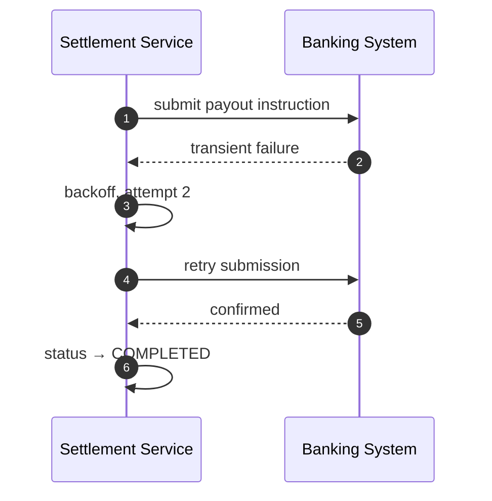

## 20.6 Settlement Failure
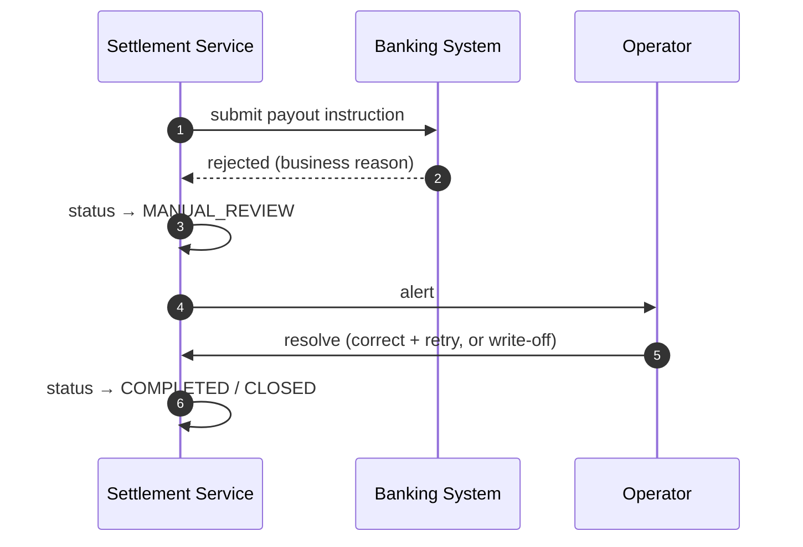


# Settlement Service — Software Architecture Specification
## Part 3: Data, Messaging, Performance, Observability

---

# 21. Database Design

- **Settlement Records**: `settlement_entry` — the individual per-transaction line items (gross amount, fees, reserve) that roll up into a batch, derived from consumed `ledger.events`.
- **Settlement Batches**: `settlement_batch` — the aggregate root, one per merchant per cycle, tracking overall status and final net amount.
- **Payout Records**: `payout` — the instruction submitted to the banking system and its confirmation outcome.
- **Settlement History**: the append-only nature of `settlement_entry` plus retained (never deleted) `settlement_batch`/`payout` rows together constitute the full settlement history, directly supporting reconciliation.

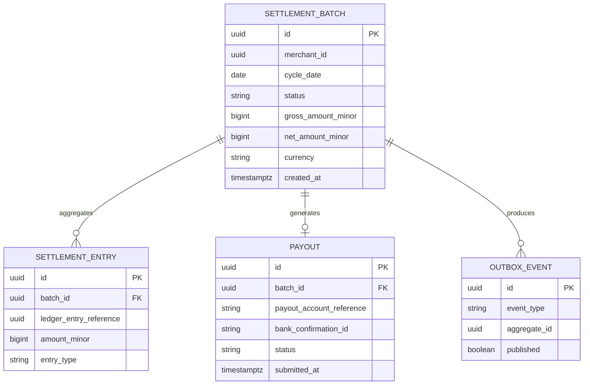

- `settlement_entry.ledger_entry_reference` is a value reference to the originating Payment Orchestrator ledger entry (not a foreign key, since it lives in a separate service's database, per the platform's database-per-service boundary, `SYSTEM_DESIGN.md` §11) — this is what makes reconciliation against the Orchestrator's own ledger possible without a cross-database join.

---

# 22. Redis

| Usage | Description |
|---|---|
| Settlement cache | Recently-computed batch results, avoiding repeat DB reads for the immediate post-computation notification/API-read window |
| Batch metadata | In-progress batch state (which merchants processed so far in the current cycle run) for operational visibility mid-run |
| Settlement locks | Per-merchant-per-cycle lock preventing two Batch Processor instances from creating a duplicate batch concurrently |

## Redis Key Design
| Key Pattern | TTL | Purpose |
|---|---|---|
| `settlement:cache:{batchId}` | Short, post-computation window | Avoids repeat DB reads immediately after computation |
| `settlement:batch-progress:{cycleDate}` | Bounded to the cycle-run duration | Mid-run operational visibility |
| `settlement:lock:{merchantId}:{cycleDate}` | Short, single-batch-creation duration | Prevents duplicate batch creation |

PostgreSQL remains authoritative; Redis unavailability degrades to direct DB reads/locks (via DB-level constraint as the ultimate duplicate-batch guard), never blocks settlement processing entirely.

---

# 23. Kafka

## Topics
| Topic | Publishers | Consumers |
|---|---|---|
| `ledger.events` (consumed) | Payment Orchestrator | Settlement Service |
| `payment.events` (consumed) | Payment Orchestrator | Settlement Service |
| `merchant.events` (consumed) | Merchant Service | Settlement Service (payout account, eligibility) |
| `settlement.events` (published) | Settlement Service | Webhook Service, Merchant Service (audit) |

- **Settlement events**: `SettlementScheduled`, `SettlementBatchCreated`, `SettlementCompleted`, `SettlementFailed`.
- **Batch events**: modeled as the same `settlement.events` topic, partitioned by `merchantId` for consistency with the platform's per-entity-ordering convention (`SYSTEM_DESIGN.md` §5) — no separate "batch" topic, since batch-level and settlement-level events share the same consumers and ordering needs.

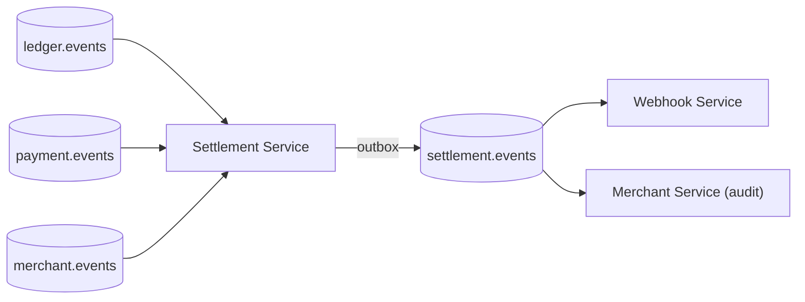

---

# 24. Event Catalog

| Event | Producer | Consumer | Purpose |
|---|---|---|---|
| `ledger.events` (consumed) | Payment Orchestrator | Settlement Service | Source financial facts for settlement calculation |
| `payment.events` (consumed) | Payment Orchestrator | Settlement Service | Payment-level context supporting settlement eligibility |
| `merchant.events` (consumed) | Merchant Service | Settlement Service | Payout account and merchant-eligibility updates |
| `SettlementScheduled` (published) | Settlement Service | Analytics | A ledger entry has been queued for the next cycle |
| `SettlementBatchCreated` (published) | Settlement Service | Analytics | A per-merchant batch has been created at cutoff |
| `SettlementCompleted` (published) | Settlement Service | Webhook Service, Merchant Service (audit) | Payout confirmed by banking system |
| `SettlementFailed` (published) | Settlement Service | Webhook Service, operational alerting | Payout rejected or exhausted retries, entering manual review |

---

# 25. Performance

| Technique | Application |
|---|---|
| Batch processing | Per-merchant batches processed independently, allowing partial-cycle progress even if one merchant's batch encounters an error |
| Parallel settlement | Multiple merchants' batches computed concurrently within a cycle run, bounded by a worker pool sized to avoid overwhelming the Banking System integration |
| Async processing | Kafka consumption and cycle-triggered batch processing are both non-blocking relative to each other — ledger-event consumption never waits on a batch-processing run in progress |
| Database optimization | Indexes on `settlement_batch(merchant_id, cycle_date)` and `settlement_entry(batch_id)` support the dominant query shapes (per-merchant-per-cycle lookup, per-batch entry retrieval) |

---

# 26. Scaling

- **Stateless design**: batch-processing workers hold no in-memory state beyond a single batch's computation; any replica can process any merchant's batch.
- **Horizontal scaling**: HPA driven by batch-queue depth during a cycle run rather than steady-state CPU, since this service's load is inherently bursty (concentrated around cutoff times) rather than continuous.
- **Batch workers**: a dedicated worker pool per replica processes queued batches in parallel, sized independently from the Kafka-consumption thread pool.
- **Load balancing**: not applicable to inbound traffic (no external synchronous caller) — relevant only to Kafka consumer-group partition assignment.

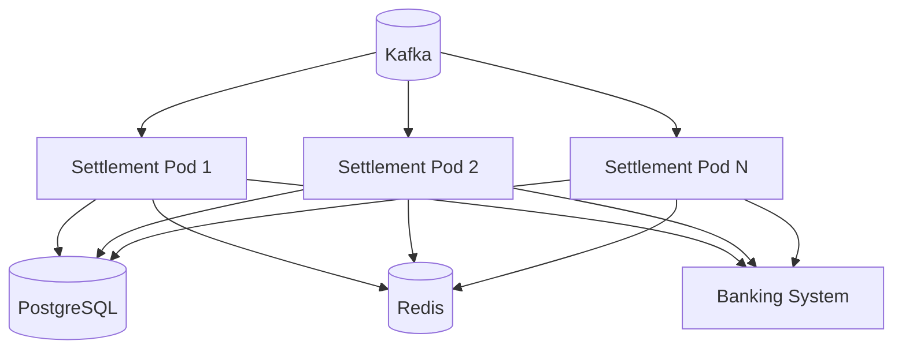

---

# 27. Caching

- **Settlement configuration caching**: fee schedules, reserve-policy parameters, and per-merchant cadence preference (sourced from Merchant Service) are cached locally, refreshed via `merchant.events` consumption — identical event-driven-invalidation rationale used by Webhook Service's config projection (`Webhook-Service-Part-03.md` §26), avoiding a Merchant Service call for every single settlement entry processed within a batch.

---

# 28. Logging

Structured JSON, platform-standard baseline.

| Field | Description |
|---|---|
| `correlationId` | Propagated from the originating ledger/payment event |
| `traceId` | OpenTelemetry trace |
| `settlementId` | This service's `settlement_entry`/batch reference |
| `batchId` | The settlement batch a log line pertains to |
| `merchantId` | Target merchant |
| `cycleDate` | Which settlement cycle |

---

# 29. Metrics

| Metric | Type | Purpose |
|---|---|---|
| `settlement_success_rate` | Gauge | Overall batch-completion health |
| `settlement_latency_seconds` | Histogram | Time from cutoff to `COMPLETED` |
| `batch_processing_time_seconds` | Histogram | Per-batch computation duration |
| `failed_settlements_total` | Counter | Volume entering manual review |
| `payout_success_rate` | Gauge | Banking-system confirmation health |
| `settlement_retry_count` | Counter | Retry-policy load |

---

# 30. Distributed Tracing

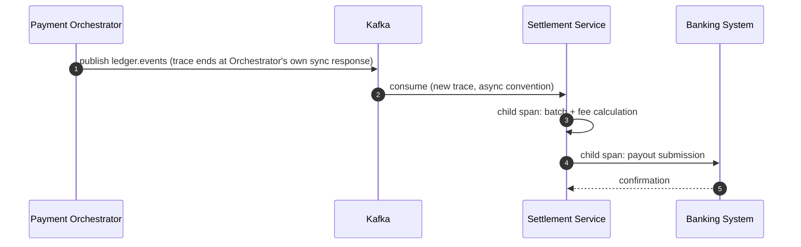

Note: this platform has no standalone "Ledger Service" (§2, Part 1) — the ledger is owned by the Payment Orchestrator, so the trace above reflects `ledger.events` consumption from the Orchestrator directly, not a separate hop.

---

# 31. Disaster Recovery

- **Backup**: continuous WAL archiving on the `settlement_batch`/`settlement_entry`/`payout` schema.
- **Failover**: synchronous same-region standby, asynchronous cross-region standby — platform-standard pattern.
- **Recovery**: readiness gates on PostgreSQL reachability; Redis degrades gracefully.
- **Reconciliation on recovery**: after a regional failover, any `payout` row in an ambiguous status is reconciled against the Banking System's own record before being considered resolved — mirroring the Acquiring Adapter's provider-side reconciliation approach (`Acquiring-Adapter-Part-03.md` §35) applied here to banking confirmations.

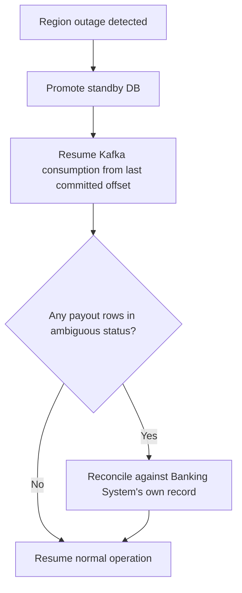

# Settlement Service — Software Architecture Specification
## Part 4 (Final): Operations, Testing, Risk, Appendix

---

# 32. Production Readiness

## Checklist
- [ ] Fee/net-amount calculation verified against manually-computed expected values for a range of scenarios (refunds, reserves, multi-currency)
- [ ] Duplicate-batch prevention verified under concurrent Batch Processor instances (§22 lock + DB constraint)
- [ ] Payout instruction generation verified to never submit a negative net amount (§19, Part 2)
- [ ] Manual-review workflow verified operator-actionable end-to-end
- [ ] Reconciliation report verified to itemize every deduction against the originating ledger entries
- [ ] No cardholder or raw bank-account data ever appears in logs/traces
- [ ] Load test report committed for a representative full-cycle batch run
- [ ] Chaos test suite executed against Kafka, Redis, DB, and Banking System failure scenarios
- [ ] Dashboards/alerts live with real staging traffic
- [ ] Runbooks (§34) reviewed by on-call rotation

---

# 33. Health Checks

| Check | Gates Readiness? | Basis |
|---|---|---|
| Settlement queue (pending batch depth) | No | Backlog degrades cycle-completion latency, not correctness — surfaced via alerting |
| Batch Processor | No (liveness only) | A stuck worker is a liveness concern; readiness reflects the service's ability to accept new work, not current queue depth |
| Kafka | Yes | Sole source of ledger/payment facts; consumption cannot proceed without it |
| Redis | No | Degrades to DB-driven locking/lookups |
| Database | Yes | Settlement/payout system of record; no processing possible without it |

---

# 34. Operational Runbooks

## 34.1 Settlement Queue Backlog
- **Symptoms**: growing count of batches not yet `COMPLETED` well past expected cycle-completion time.
- **Investigation**: check batch-worker pool saturation vs Banking System response latency.
- **Resolution**: if worker-saturation-driven, verify HPA scaling engaged (§26, Part 3); if Banking-System-latency-driven, no adapter-level fix beyond existing retry policy.

## 34.2 Batch Failure
- **Symptoms**: a specific merchant's batch in `FAILED`/`MANUAL_REVIEW`.
- **Investigation**: check whether the failure is calculation-level (config gap) or payout-level (bank rejection).
- **Resolution**: calculation-level — correct the underlying fee/reserve configuration and re-trigger via manual settlement (§12, Part 2); payout-level — verify payout account validity with Merchant Service, correct, and retry.

## 34.3 High Settlement Failure Rate
- **Symptoms**: `failed_settlements_total` spike across many merchants simultaneously.
- **Investigation**: check for a Banking System-wide outage vs a platform-wide fee-calculation regression (recent deployment correlation).
- **Resolution**: Banking-System-wide — no action beyond retry/wait; regression — rollback candidate.

## 34.4 Database Failure
- **Symptoms**: readiness failing platform-wide for this service.
- **Investigation**: confirm primary vs standby status.
- **Resolution**: automated/manual failover to synchronous standby (§31, Part 3).

## 34.5 Kafka Failure
- **Symptoms**: consumption halted; readiness failing.
- **Investigation**: confirm Kafka cluster health platform-wide.
- **Resolution**: consumption resumes from last committed offset once Kafka recovers — no ledger facts are lost, since the Orchestrator's Outbox already guarantees eventual publish independent of this service's own availability.

## 34.6 Bank Integration Failure
- **Symptoms**: payout submissions failing/timing out for all merchants, not just one.
- **Investigation**: confirm via the Banking System's own status signals; distinguish from a single merchant's invalid-account rejection (§34.2).
- **Resolution**: platform-wide retry per §17 (Part 2) policy; sustained failure escalates to manual review across the affected batches, with merchant notification delayed accordingly rather than silently failing.

## 34.7 Retry Queue Growth
- **Symptoms**: `settlement_retry_count` trending upward.
- **Investigation**: identify whether retries concentrate on the Banking System integration specifically or are spread across calculation errors.
- **Resolution**: Banking-System-concentrated — treat as §34.6; calculation-error-concentrated — treat as a configuration-data-quality investigation (e.g. a newly onboarded merchant missing a fee-schedule entry).

---

# 35. Testing Strategy

| Type | Scope | Success Criteria |
|---|---|---|
| Unit | Fee Calculator, Net Amount calculation, settlement-status state machine | 100% branch coverage on deduction-order logic and state transitions |
| Integration | Full consume → batch → calculate → payout path against Testcontainers Kafka/PostgreSQL/Redis + mocked Banking System | Duplicate-batch prevention and reconciliation-reference integrity verified |
| Contract | Pin the payout-instruction contract against the Banking System integration's expectations | Schema changes caught before breaking payout submission |
| Batch Testing | Full-cycle batch runs against representative multi-merchant, multi-currency ledger data | Correct per-merchant net amounts, correct itemized deductions |
| Load Testing | Full-cycle batch run at representative merchant-count and transaction-volume scale | Cycle completes within expected window; committed report |
| Chaos Testing | Kafka/Redis/DB/Banking-System failure injection mid-cycle | Documented degradation and reconciliation-on-recovery behavior (§31, Part 3) holds |

---

# 36. Risk Analysis

| Risk | Impact | Mitigation |
|---|---|---|
| Duplicate settlement | Critical — a merchant paid twice for the same captured amount | Settlement validation (§19, Part 2) ensures each ledger entry is included in exactly one batch; DB constraint as ultimate guard alongside the Redis lock |
| Settlement delay | Medium — merchant payout later than expected | Retry policy + manual-review escalation bounds the delay rather than allowing indefinite silent stalling |
| Partial batch failure | Medium — one merchant's batch fails while others in the same cycle succeed | Per-merchant batch independence (§13, Part 2) ensures one failure never blocks the rest of the cycle |
| Bank failure | High — payouts cannot complete platform-wide | Retry policy + reconciliation-on-recovery (§31, Part 3); no adapter-level mitigation beyond this for a genuine Banking-System-wide outage |
| Data inconsistency (settlement total vs Orchestrator ledger truth) | Critical | Reconciliation report cross-references every `settlement_entry.ledger_entry_reference` against the Orchestrator's own ledger, flagging mismatches rather than silently reporting a number |

---

# 37. Architecture Decisions

| Decision | Reason | Benefit | Trade-off |
|---|---|---|---|
| Batch processing | Settlement is inherently a periodic, aggregate computation, not a per-request operation | Efficient bulk computation; natural alignment with nightly/weekly business cadence | Introduces cutoff-boundary edge cases (a payment captured right at cutoff) requiring careful scheduling logic |
| Async settlement (event-driven from ledger) | Settlement must never block the Orchestrator's synchronous authorization/capture path | Full decoupling from the payment hot path | Settlement is only as fresh as Kafka consumption lag allows |
| Kafka as the event source | Reliable, replayable ledger-fact propagation | Reconciliation and replay possible after incidents | Consumption/offset-management complexity |
| Redis for locks/cache, never source of truth | Avoid dual-source-of-truth risk on financial computation | Fast duplicate-batch prevention, cheap mid-run visibility | DB constraint remains required as the ultimate guarantee |
| Explicit settlement scheduling (cadence-configurable per merchant) | Different merchant tiers/contracts require different payout cadences | Business flexibility without code changes per merchant | Schedule Manager complexity in evaluating per-merchant eligibility at every potential cutoff |

---

# 38. Future Enhancements

| Enhancement | Description |
|---|---|
| Real-time settlement | Moving beyond nightly/weekly batch cadence toward continuous, near-real-time payout for eligible merchant tiers, building on the existing "instant settlement" option (§12, Part 2) |
| Multi-currency settlement | Native multi-currency batch computation without a single-currency-per-batch simplification, for merchants operating across multiple settlement currencies simultaneously |
| Cross-border settlement | Handling jurisdiction-specific regulatory/tax withholding rules for international payouts |
| AI-based settlement optimization | Predictive reserve-policy tuning based on historical chargeback/refund patterns per merchant, rather than a fixed rolling-reserve percentage |
| Settlement dashboard | Merchant-facing, self-service settlement/reconciliation visibility, reducing reliance on support-ticket-driven inquiries |

---

# 39. Glossary

| Term | Definition |
|---|---|
| Settlement Batch | Aggregate root grouping one merchant's settlement computation for one cycle |
| Settlement Entry | An individual line item within a batch, tracing back to one Orchestrator ledger entry |
| Payout | The instruction (and eventual confirmed transfer) reflecting a batch's net amount |
| Rolling Reserve | A percentage withheld from every settlement, released after a holdback period |
| Manual Review | A tracked, operator-actionable status for a settlement that failed non-retryably |
| Reconciliation | Cross-referencing settlement totals against the Orchestrator's own ledger truth |

---

# 40. Final Service Summary

The Settlement Service is the platform's financial settlement engine — it turns the Payment Orchestrator's append-only ledger facts into scheduled, itemized, reconciled merchant payouts, without ever touching payment authorization or cardholder data itself.

**Purpose**: aggregate captured payments minus refunds, fees, and reserves into a net per-merchant payout, on a configurable (nightly-default) cadence.

**Key components**: Schedule Manager, Batch Processor, Fee Calculator, Payout Generator — each independently testable, with fee/reserve logic isolated in the domain layer per Clean Architecture.

**Reliability**: per-merchant batch independence, bounded retry with manual-review escalation, and reconciliation-on-recovery together ensure no settlement is silently duplicated, lost, or left in an unresolved ambiguous state.

**Scalability**: stateless, horizontally scaled batch workers, HPA-driven by cycle-run queue depth rather than steady-state load, reflecting this service's inherently bursty, cutoff-triggered workload profile.

**Integration**: consumes `ledger.events`/`payment.events`/`merchant.events` from Kafka; reads payout account references from Merchant Service; submits payout instructions to the (simulated) Banking System; publishes `settlement.events` for Webhook Service and Merchant Service audit.

```mermaid
flowchart LR
    LEDGER["Ledger events<br/>(Payment Orchestrator)"] --> SCHED["Schedule Manager"]
    SCHED --> BATCH["Batch Processor"]
    BATCH --> FEE["Fee Calculator"]
    FEE --> PAYOUT["Payout Generator"]
    PAYOUT --> BANK["Banking System"]
    BANK --> CONFIRM["Confirmation"]
    CONFIRM --> EVENTS["settlement.events"]
```

```mermaid
flowchart TD
    A["Failure detected (calculation or payout)"] --> B{"Retryable?"}
    B -->|Yes| C["Bounded retry"]
    C -->|success| D["COMPLETED"]
    C -->|exhausted| E["MANUAL_REVIEW"]
    B -->|No, business rejection| E
    E --> F["Operator resolves"]
    F --> D
```

This concludes the Settlement Service architecture specification.

# Package Structure

```
settlement-service/
└── src/main/java/.../settlement/
    ├── config/
    │   ├── SecurityConfig.java
    │   ├── ResilienceConfig.java
    │   └── ScheduleConfig.java
    ├── controller/
    │   └── SettlementController.java      # internal-only: status lookup, manual trigger, reconciliation
    ├── application/
    │   ├── ScheduleSettlementUseCase.java
    │   ├── CreateBatchUseCase.java
    │   ├── CalculateFeesUseCase.java
    │   ├── GeneratePayoutUseCase.java
    │   └── GenerateReconciliationReportUseCase.java
    ├── domain/
    │   ├── batch/
    │   │   ├── SettlementBatch.java
    │   │   ├── SettlementStatus.java       # sealed: SETTLEMENT_SCHEDULED, BATCH_CREATED,
    │   │   │                               #   PROCESSED, PAYOUT_GENERATED, COMPLETED,
    │   │   │                               #   FAILED, MANUAL_REVIEW
    │   │   └── SettlementEntry.java
    │   ├── payout/
    │   │   ├── Payout.java
    │   │   └── PayoutStatus.java           # sealed
    │   ├── fee/
    │   │   ├── FeeSchedule.java
    │   │   ├── ReservePolicy.java
    │   │   └── FeeCalculationResult.java   # itemized deductions + net amount
    │   ├── event/
    │   │   ├── SettlementScheduled.java
    │   │   ├── SettlementBatchCreated.java
    │   │   ├── SettlementCompleted.java
    │   │   └── SettlementFailed.java
    │   └── vo/
    │       ├── BatchId.java
    │       ├── CycleDate.java
    │       ├── LedgerEntryReference.java   # value reference, not a cross-DB FK
    │       └── Amount.java
    ├── port/
    │   ├── SettlementBatchRepositoryPort.java
    │   ├── PayoutRepositoryPort.java
    │   ├── OutboxWriterPort.java
    │   ├── MerchantServiceClientPort.java
    │   └── BankingSystemClientPort.java
    ├── scheduling/
    │   └── ScheduleManager.java
    ├── batching/
    │   └── BatchProcessor.java
    ├── calculation/
    │   └── FeeCalculator.java
    ├── payout/
    │   └── PayoutGenerator.java
    ├── reconciliation/
    │   └── ReconciliationReportBuilder.java
    ├── status/
    │   └── SettlementStatusManager.java
    ├── adapter/
    │   ├── persistence/
    │   │   ├── SettlementBatchRepositoryAdapter.java
    │   │   └── PayoutRepositoryAdapter.java
    │   ├── outbox/
    │   │   └── OutboxWriterAdapter.java
    │   └── client/
    │       ├── MerchantServiceClientAdapter.java
    │       └── BankingSystemClientAdapter.java
    ├── entity/            # persistence entities, distinct from domain aggregates
    ├── dto/
    │   ├── request/
    │   └── response/
    ├── mapper/
    ├── exception/
    ├── security/
    ├── validation/
    ├── event/
    │   ├── producer/
    │   └── consumer/      # ledger.events, payment.events, merchant.events
    ├── scheduler/         # cycle-cutoff trigger, retry-window polling
    ├── client/
    └── constant/
```

Note the `scheduling/`, `batching/`, `calculation/`, `payout/`, and `reconciliation/` packages sitting alongside — not nested under — `application/`: these mirror the Settlement Engine's internal components (`Settlement-Service-Part-01.md` §6) as cross-cutting orchestration/calculation logic invoked by multiple use cases, rather than being duplicated inside each one. `domain/vo/LedgerEntryReference.java` is deliberately a value object holding a reference string, not a JPA-mapped foreign key — since the actual ledger entry lives in the Payment Orchestrator's own database, this keeps the database-per-service boundary (`SYSTEM_DESIGN.md` §11) intact while still supporting reconciliation (`Settlement-Service-Part-02.md` §19).