# Webhook Service — Software Architecture Specification
## Part 1: Vision, Architecture, Components, Lifecycle

---

# 1. Executive Summary

The Webhook Service is the platform's reliable outbound event-notification system — it delivers payment, settlement, and merchant lifecycle events to merchant-configured HTTPS endpoints, with HMAC-signed authenticity and a seven-attempt exponential-backoff retry policy (`SYSTEM_DESIGN.md` §Core Capabilities).

It consumes events from Kafka (`payment.events`, `settlement.events`, `merchant.events`) and turns them into signed, retried, tracked outbound HTTP calls — a purely one-directional, consume-and-deliver service with no payment or merchant business logic of its own.

---

# 2. Service Purpose

- **Primary objective**: reliably notify merchants of platform events (payment authorized/captured/failed, settlement completed, merchant lifecycle changes) via their own registered callback URL, even under merchant-endpoint downtime or transient network failure.
- **Why a dedicated service**: delivery reliability (retry/backoff, DLQ, signature generation) is a distinct concern from the business logic that produces the event — Payment Orchestrator, Settlement Service, and Merchant Service each simply publish domain events; none of them implement HTTP delivery, retry, or signing logic themselves.
- **Scope**: event consumption, signing, delivery attempt orchestration, delivery-status tracking. It owns no payment state, no settlement calculation, and no merchant identity data — it only reads merchant webhook **configuration** (endpoint URL + signing secret) that Merchant Service owns (`Merchant-Service-Part-02.md` §43).

---

# 3. Responsibilities / Non-Responsibilities

| Responsibilities | Non-Responsibilities | Why |
|---|---|---|
| Consume `payment.events`, `settlement.events`, `merchant.events` from Kafka | Produce or decide the business content of these events | Each originating service (Orchestrator, Settlement, Merchant Service) owns its own event contract |
| Sign every outbound delivery with HMAC-SHA256 | Generate or store the signing secret | Merchant Service generates and owns the secret at webhook-config time (`Merchant-Service-Part-02.md` §43); this service only uses it to sign |
| Retry failed deliveries with exponential backoff (7 attempts) | Retry the *originating* Kafka event consumption indefinitely | Kafka consumption retry/DLQ (this service's own Inbox-adjacent concern) is distinct from HTTP-delivery retry |
| Track delivery status per attempt | Validate merchant business eligibility | Merchant Service's domain |
| Route to the correct endpoint(s) per merchant's event-type subscription | Store cardholder data | Never receives or needs it — event payloads are already PAN-free per every originating service's own event-catalog guarantee |
| Move exhausted deliveries to a Dead Letter Queue | Modify or retry a payment/settlement decision | Strictly outbound notification, never feeds back into payment state |

---

# 4. Key Definitions

| Term | Definition |
|---|---|
| Webhook | An HTTP callback the platform sends to a merchant-registered endpoint when an event occurs |
| Callback URL | The merchant-configured HTTPS endpoint (`WebhookConfig.endpointUrl`, `Merchant-Service-Part-01.md` §12.1) |
| Event | A domain event consumed from Kafka, originating from another platform service |
| Event Delivery | One complete attempt-through-outcome cycle of sending an event to a merchant endpoint |
| Delivery Attempt | A single HTTP call to the merchant's endpoint, one of up to seven per delivery |
| Retry | A subsequent delivery attempt after a failed one, governed by exponential backoff |
| Dead Letter Queue (DLQ) | Where a delivery lands after exhausting all retry attempts without success |
| Signature | The HMAC-SHA256 value proving the webhook payload originated from this platform |
| HMAC | Hash-based Message Authentication Code — the signing algorithm used for every outbound payload |
| Idempotency | The property that a merchant receiving the same event twice (e.g. after a retry that actually succeeded) can safely process it once, via a stable event ID |
| Acknowledgement | A 2xx HTTP response from the merchant endpoint confirming receipt |
| Delivery Status | The current state of a delivery: `PENDING`, `QUEUED`, `DELIVERED`, `ACKNOWLEDGED`, `RETRYING`, `FAILED`, `DEAD_LETTERED` |

---

# 5. High-Level Architecture

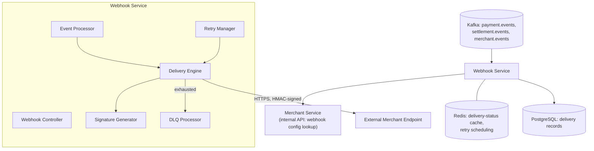

| Integration | Direction | Notes |
|---|---|---|
| Kafka → Webhook Service | Async, consume | Sole trigger for any delivery — this service has no synchronous inbound API from other platform services |
| Webhook Service → Merchant Service | Sync, internal API | Reads `WebhookConfig` (endpoint URL + secret) — never writes it |
| Webhook Service → External Merchant Endpoint | Sync, outbound HTTPS | HMAC-signed, retried per policy |
| Webhook Service ↔ Redis | Sync | Delivery-status cache, retry-schedule bookkeeping |
| Webhook Service ↔ PostgreSQL | Sync | Delivery-attempt system of record |

---

# 6. Internal Components

| Component | Purpose |
|---|---|
| Webhook Controller | Internal-only surface for operator/admin actions (e.g. manual redelivery trigger) — not a business-event entry point |
| Event Processor | Consumes Kafka events (Inbox-deduped), determines which merchant(s)/endpoint(s) are subscribed, creates a delivery record |
| Delivery Engine | Executes the actual outbound HTTP call |
| Retry Manager | Schedules and triggers retry attempts per the backoff policy |
| Signature Generator | Computes the HMAC-SHA256 signature per outbound payload using the merchant's webhook secret |
| Endpoint Validator | Confirms the configured endpoint URL is still well-formed/HTTPS before dispatch (defense-in-depth, alongside Merchant Service's own structural validation at config time) |
| Event Publisher | Publishes this service's own delivery-outcome events (for platform observability) via Outbox |
| DLQ Processor | Moves exhausted deliveries to the Dead Letter Queue and supports operator-triggered manual redelivery |
| Delivery Status Manager | Tracks and exposes the current status of every delivery |

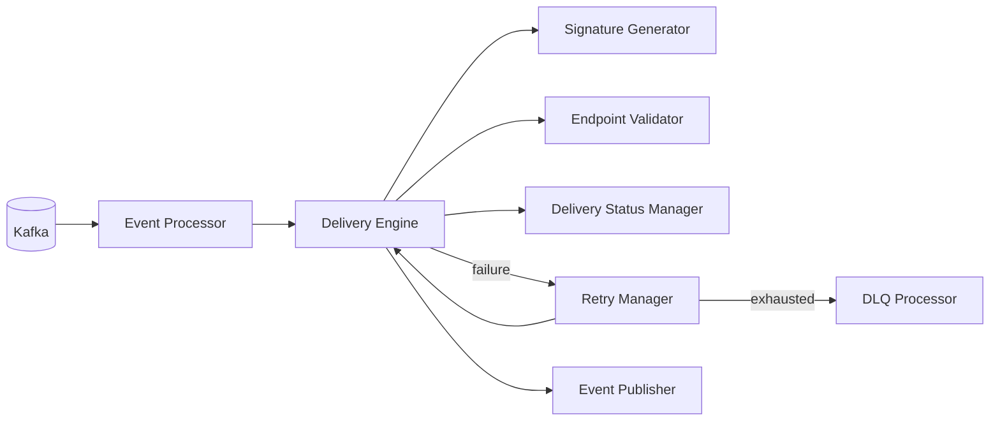

---

# 7. Event Delivery Flow

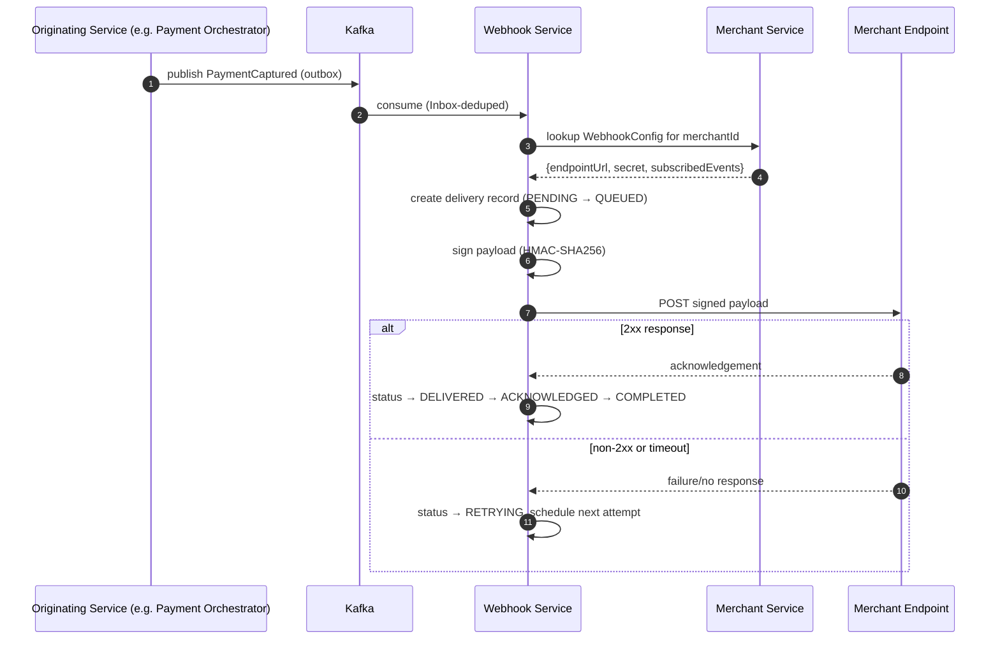

---

# 8. Webhook Lifecycle

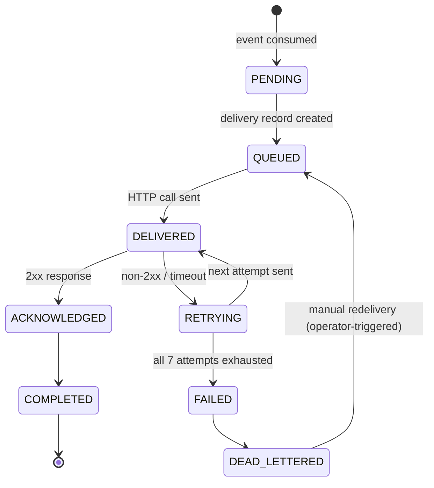

- `RETRYING` and `DELIVERED` cycle up to seven times before `FAILED` (`SYSTEM_DESIGN.md` §Core Capabilities' seven-attempt exponential-backoff requirement, detailed further in Part 2).
- `DEAD_LETTERED` is not terminal in the strict sense — it supports operator-triggered manual redelivery, re-entering `QUEUED`, but never automatically retries again on its own.

---

# 9. Clean Architecture

| Layer | Contents |
|---|---|
| Presentation | Webhook Controller (operator/admin actions only) |
| Application | Use cases: `ProcessEventUseCase`, `DeliverWebhookUseCase`, `RetryDeliveryUseCase`, `MoveToDeadLetterUseCase` |
| Domain | `Delivery` aggregate, delivery-status state machine, signature-generation domain service |
| Infrastructure | Kafka consumer adapter, HTTP delivery client adapter, Merchant Service client, Outbox adapter |

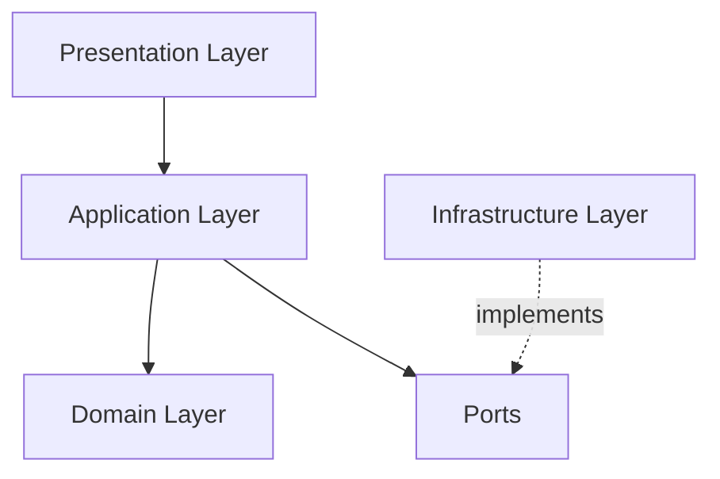

Dependency Rule: identical to every prior service — domain logic (delivery-status transitions, retry-eligibility rules) has zero dependency on the Kafka client or HTTP client implementation, consistent with the platform's Clean Architecture standard.

---

# 10. Dependencies

| Dependency | Purpose | Communication | Criticality |
|---|---|---|---|
| Kafka | Sole event source triggering deliveries | Async, consume | Critical — no events, no deliveries |
| Merchant Service | Webhook endpoint/secret lookup | Sync, internal API | Critical — cannot sign/route without it |
| External Merchant Endpoints | Delivery target | Sync, outbound HTTPS | Per-merchant — one merchant's endpoint downtime never affects another's deliveries |
| Redis | Delivery-status cache, retry scheduling | Sync | Non-critical — degrades to DB-driven scheduling |
| PostgreSQL | Delivery-attempt system of record | Sync | Critical — no delivery tracking possible without it |

# Webhook Service — Software Architecture Specification
## Part 2: API Specification, Registration, Signing, Delivery, Resilience

---

# 11. REST APIs

Internal-only surface — this service exposes no merchant-facing API directly (webhook *configuration* is a Merchant Service endpoint, `Merchant-Service-Part-02.md` §43); these endpoints support operator tooling and internal observability.

| Endpoint | Purpose | Auth | Status Codes |
|---|---|---|---|
| `GET /internal/v1/deliveries/{deliveryId}` | Retrieve a delivery's current status/attempt history | mTLS, internal | `200`, `404` |
| `GET /internal/v1/deliveries?merchantId=...&status=...` | List deliveries for operator troubleshooting | mTLS, internal | `200` |
| `POST /internal/v1/deliveries/{deliveryId}/redeliver` | Manually trigger redelivery from `DEAD_LETTERED` | mTLS, internal, operator-role only | `200`, `409` |
| `GET /internal/v1/deliveries/{deliveryId}/attempts` | Full attempt history for a delivery | mTLS, internal | `200`, `404` |

- `redeliver` is the only mutating endpoint and is restricted to an operator-tooling workload identity, distinct from any merchant-facing credential — this mirrors the Token Vault's narrow, role-scoped internal-endpoint model (`Token-Vault-Part-02.md` §20.3).
- All responses use the platform-standard error envelope (`API-Gateway-Part-02.md` §17.5).

---

# 12. Webhook Registration

Ownership clarification: **Merchant Service owns webhook configuration storage** (`Merchant-Service-Part-02.md` §43) — endpoint URL, signing secret, and event-type subscriptions are created, updated, and deleted exclusively through Merchant Service's API. The Webhook Service **never writes** this configuration; it only reads it at delivery time and performs its own pre-delivery checks.

| Step | Owner | This Service's Role |
|---|---|---|
| Endpoint registration | Merchant Service | None — reads the resulting config at delivery time |
| Secret generation | Merchant Service (`Merchant-Service-Part-02.md` §43) | None — uses the secret to sign, never generates or stores its own copy beyond a short-lived read |
| Endpoint verification | Webhook Service | Performs a lightweight reachability/structural re-check immediately before first delivery to a newly-configured endpoint (defense-in-depth, since Merchant Service's own validation, `Merchant-Service-Part-01.md` §25, is structural-only and synchronous-reachability is deliberately not checked there to avoid coupling Merchant Service's write latency to an external endpoint) |
| Activation | Merchant Service | Consumes `WebhookConfigUpdated` (`Merchant-Service-Part-03.md` §67) to refresh its own local read model of active configs |
| Update | Merchant Service | Same consumption path — local read model refreshed on every `WebhookConfigUpdated` event |
| Deletion/deactivation | Merchant Service | Local read model marks the config inactive; in-flight deliveries to a just-deactivated endpoint are allowed to complete their current attempt cycle, never abruptly cancelled mid-retry |

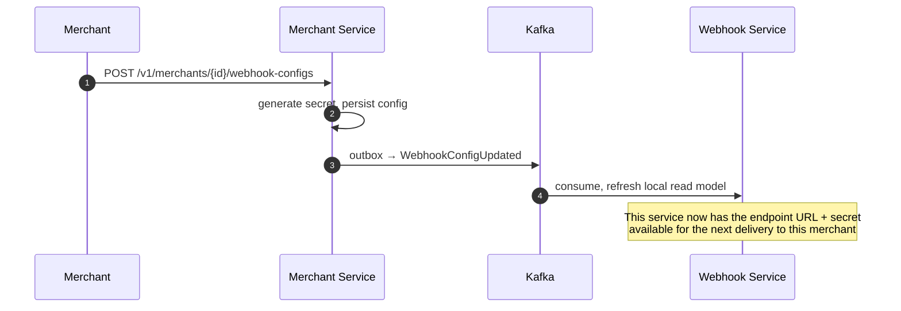

---

# 13. Signature Generation

- **HMAC Signature**: every outbound payload is signed with HMAC-SHA256, keyed by the merchant's webhook secret (read from the Merchant Service-owned config, §12) — identical algorithm choice to the platform's cryptographic standard (`Token-Vault-Part-02.md` §25.5's HMAC usage).
- **Timestamp**: a signing timestamp is included in the signed payload/header, allowing the merchant's verification logic to reject stale deliveries.
- **Replay protection**: the signature covers the timestamp and a unique delivery/event ID together — a captured, replayed request is rejected by a correctly-implemented merchant verifier because the timestamp falls outside their acceptance window, and the event ID allows the merchant to independently deduplicate even within that window (§16).
- **Verification** (merchant-side, documented here for completeness of the contract this service produces): the merchant recomputes the HMAC over the received payload + timestamp using their own copy of the secret and compares it to the received signature header — this service publishes the signing contract; verification itself is the merchant's implementation responsibility.

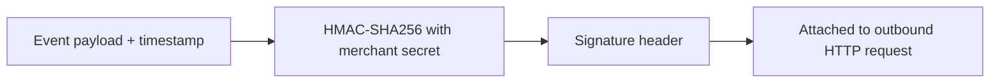

---

# 14. Event Processing

- **Event Reception**: Kafka consumer, Inbox-deduped on `eventId` (platform-standard pattern, `SYSTEM_DESIGN.md` §7) — a redelivered Kafka message never produces a duplicate delivery record.
- **Event Validation**: confirms the event's `merchantId` has at least one active, subscribed `WebhookConfig` for that event type before proceeding — an event with no subscribed endpoint is acknowledged and discarded (not an error condition, simply "no delivery needed").
- **Event Transformation**: maps the platform's internal event envelope (`SYSTEM_DESIGN.md` §5) into the merchant-facing webhook payload shape — a deliberately stable, versioned external contract, decoupled from the internal event envelope's own evolution.
- **Event Dispatch**: creates one delivery record per (event, subscribed endpoint) pair — a merchant with multiple endpoints subscribed to the same event type receives independent, independently-tracked deliveries to each.

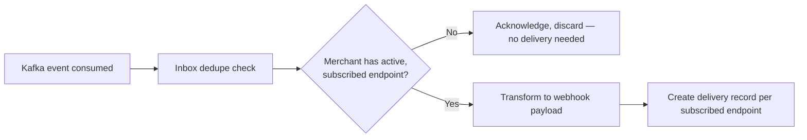

---

# 15. Delivery Strategy

- **Immediate delivery**: the default and only mode for a healthy endpoint — the first attempt is dispatched as soon as the delivery record is created, no artificial queueing delay.
- **Asynchronous delivery**: dispatch never blocks the Kafka consumer's offset progression — the consumer commits its offset once the delivery record is durably created (Outbox-equivalent guarantee), with the actual HTTP call happening asynchronously relative to event consumption.
- **Batch delivery**: not supported — every event is delivered as its own individual HTTP call, since merchants integrate against a per-event webhook contract; batching would be a breaking contract change and is explicitly out of scope for this architecture.

---

# 16. Retry Strategy

| Aspect | Policy |
|---|---|
| Retry conditions | Non-2xx response, connection failure, or timeout — never retried on a 4xx indicating a permanent client-side rejection pattern the merchant's own logic returns intentionally (e.g. explicit `410 Gone` signaling "stop sending to this endpoint") |
| Maximum retry count | 7 attempts total (`SYSTEM_DESIGN.md` §Core Capabilities) |
| Backoff | Exponential, e.g. 1m, 5m, 15m, 30m, 1h, 3h, 6h — increasing delay reflects the decreasing likelihood of a rapid-fix on a struggling merchant endpoint |
| Retry queue | Redis-backed scheduling (next-eligible-attempt timestamp per delivery), PostgreSQL as the durable record of attempt history |

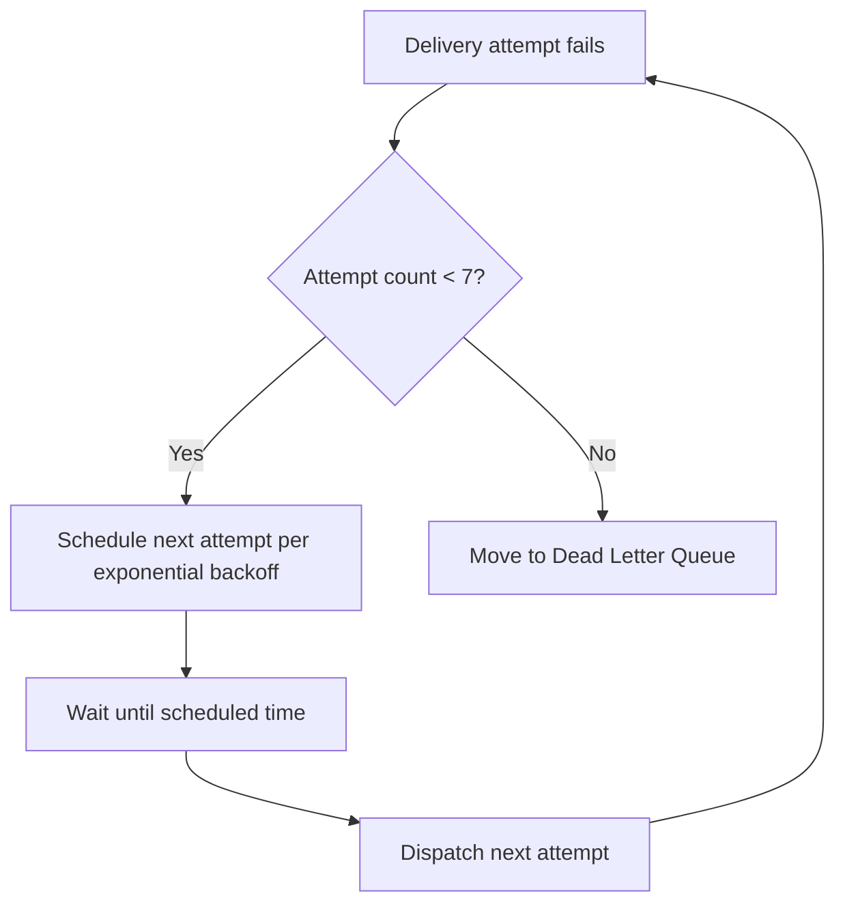

---

# 17. Idempotency

- Every delivery payload includes a stable `eventId` (from the platform-standard event envelope, `SYSTEM_DESIGN.md` §5) — a merchant receiving the same `eventId` twice (e.g. their endpoint returned a 2xx but the response was lost in transit, triggering an unnecessary retry) can safely deduplicate on their side using this ID.
- This service's own Inbox dedupe (§14) prevents a redelivered Kafka message from creating a second delivery record — duplicate prevention exists at both the event-consumption layer and, via the stable `eventId`, at the merchant-consumption layer.

---

# 18. Validation

| Validation | When | Rule |
|---|---|---|
| Endpoint validation | Before first delivery to a newly-configured endpoint (§12) | HTTPS, not a private/loopback address (mirrors Merchant Service's own SSRF-prevention check, `Merchant-Service-Part-01.md` §25, applied here as a second, delivery-time check) |
| Payload validation | At event transformation (§14) | Transformed payload conforms to the versioned external webhook schema before signing/dispatch |
| Signature validation | Not applicable outbound (this service signs, it does not verify incoming signatures — it has no inbound merchant-originated traffic) | N/A |

---

# 19. Sequence Diagrams

## 19.1 Webhook Registration
See §12.

## 19.2 Successful Delivery
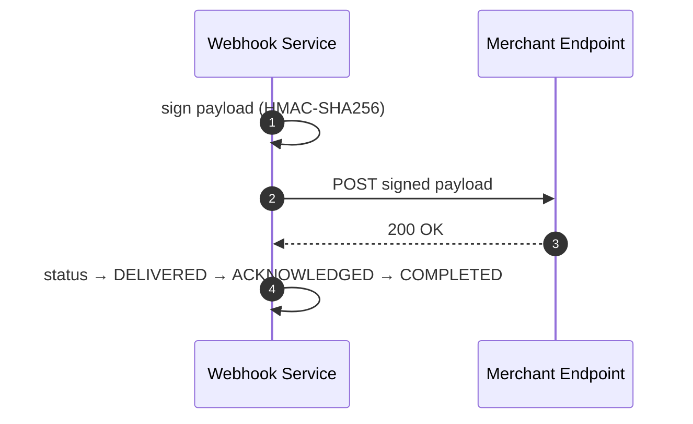

## 19.3 Retry
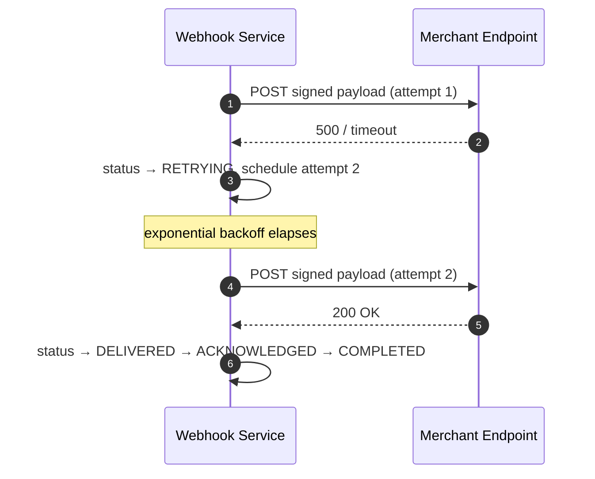

## 19.4 Signature Verification (Merchant-Side Contract Illustration)
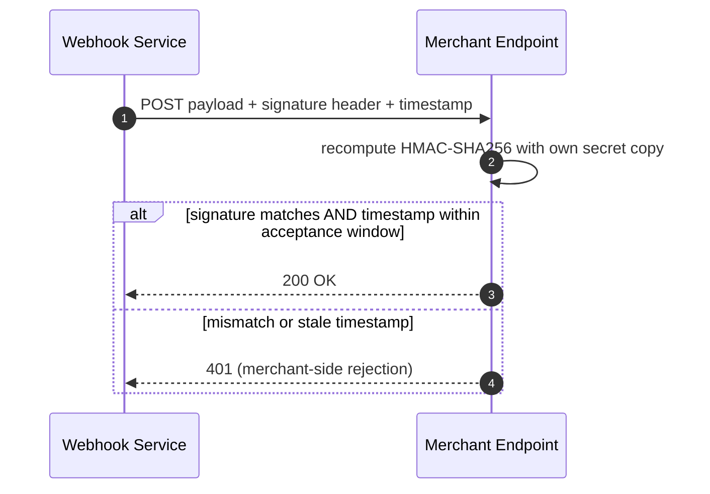

## 19.5 Failed Delivery
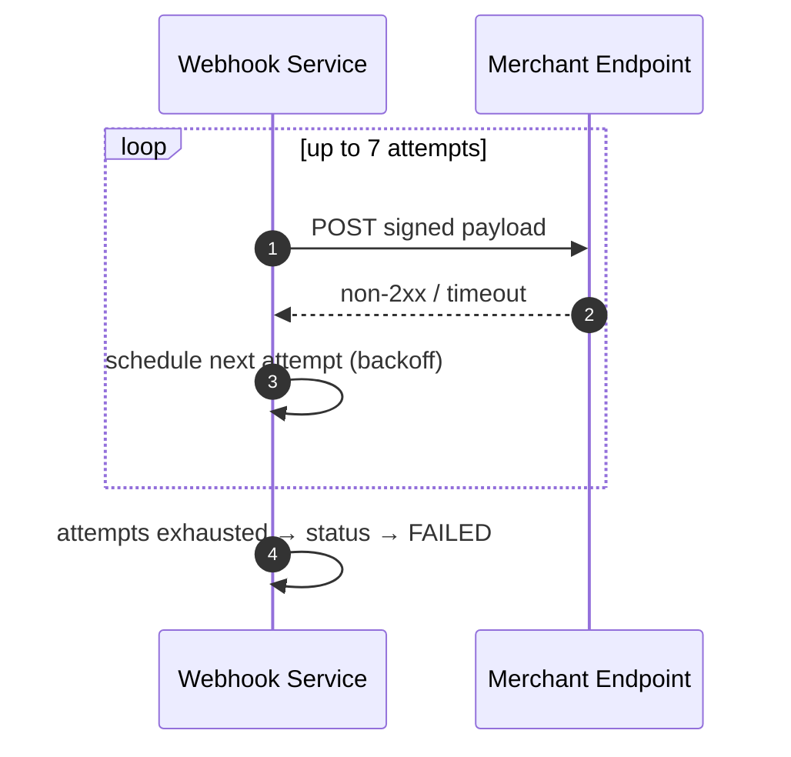

## 19.6 Dead Letter Queue Flow
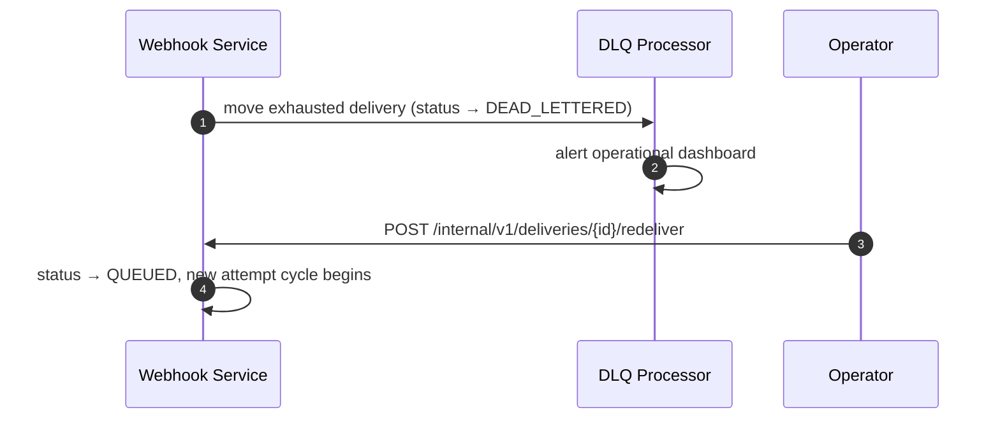

# Webhook Service — Software Architecture Specification
## Part 3: Data, Messaging, Performance, Observability

---

# 20. Database Design

- **Webhook Configurations**: not owned here — this service maintains only a **local, read-only projection** of Merchant Service's `WebhookConfig` (`webhook_config_projection`), refreshed via `WebhookConfigUpdated` consumption (§12), never written to directly by any use case in this service.
- **Delivery History**: `delivery` (one row per event-endpoint pair) + `delivery_attempt` (one row per HTTP attempt) — the core system of record this service does own.
- **Retry Metadata**: `next_attempt_at`, `attempt_count` live on `delivery` itself rather than a separate table, since they're updated in lockstep with every attempt and have no independent lifecycle.

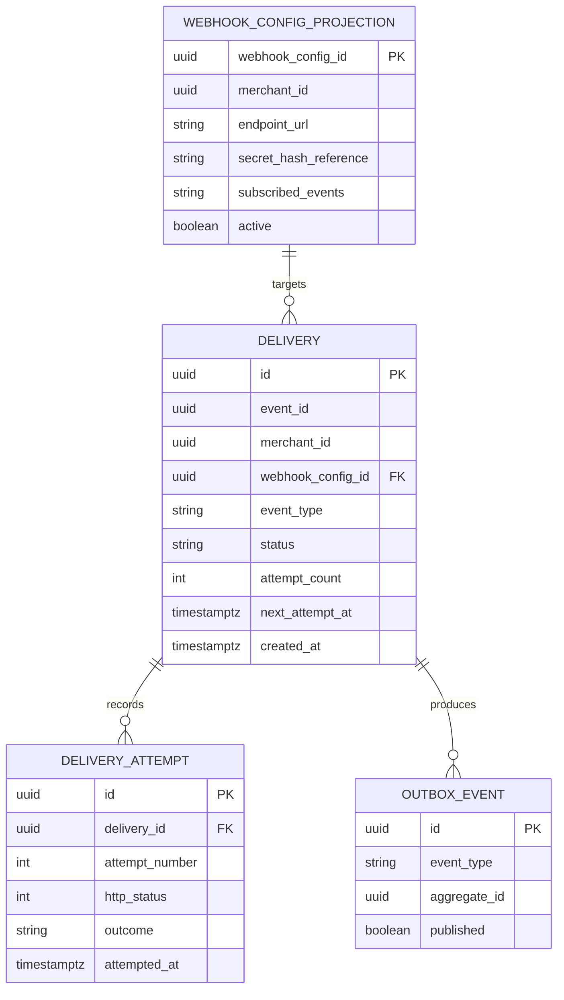

- `delivery_attempt` is append-only — never updated, mirroring the ledger-style append-only pattern used platform-wide for any audit-relevant history.
- The signing secret itself is never stored in `webhook_config_projection` in plaintext-retrievable form beyond what's needed to sign — sourced fresh from Merchant Service's event/config data and handled with the same never-logged discipline as any other platform secret.

---

# 21. Redis

| Usage | Description |
|---|---|
| Retry counters | Mirrors `delivery.attempt_count` for fast scheduling checks without a DB round-trip on every scheduler tick |
| Delivery locks | Per-`deliveryId` lock preventing two Retry Manager instances from dispatching the same scheduled attempt concurrently |
| Rate limiting | Per-merchant-endpoint outbound rate limit, protecting a single merchant's endpoint from being overwhelmed by a burst of events |
| Temporary event cache | Short-lived cache of the transformed webhook payload between event consumption and dispatch, avoiding re-transformation on retry |

## Redis Key Design
| Key Pattern | TTL | Purpose |
|---|---|---|
| `delivery:retry:{deliveryId}` | Matches backoff window | Next-eligible-attempt scheduling |
| `delivery:lock:{deliveryId}` | Short, single-dispatch duration | Prevents concurrent duplicate dispatch |
| `ratelimit:endpoint:{webhookConfigId}` | Sliding window | Per-endpoint outbound rate limit |
| `payload:cache:{deliveryId}` | Bounded to the delivery's full retry lifetime | Avoids re-transformation per retry attempt |

PostgreSQL remains authoritative for `attempt_count`/status; Redis unavailability degrades to DB-driven scheduling, never blocks delivery entirely.

---

# 22. Kafka

## Topics
| Topic | Publishers | Consumers |
|---|---|---|
| `payment.events` (consumed) | Payment Orchestrator | Webhook Service |
| `settlement.events` (consumed) | Settlement Service | Webhook Service |
| `merchant.events` (consumed) | Merchant Service | Webhook Service |
| `webhook.events` (published) | Webhook Service | Merchant Service (audit), Analytics |

- **Retry topics**: not used at the Kafka level — retry here means HTTP-delivery retry (§16, Part 2), fully modeled in PostgreSQL/Redis, not a Kafka retry-topic pattern; the Kafka **consumption** side uses standard Inbox dedupe, not a retry topic.
- **Dead Letter Queue**: this service's DLQ (§8, Part 1) is an application-level concept (`delivery.status = DEAD_LETTERED`), distinct from a Kafka-level DLQ topic — a delivery reaching this state has already been successfully consumed from Kafka; it failed at the HTTP-delivery layer, not the event-consumption layer.

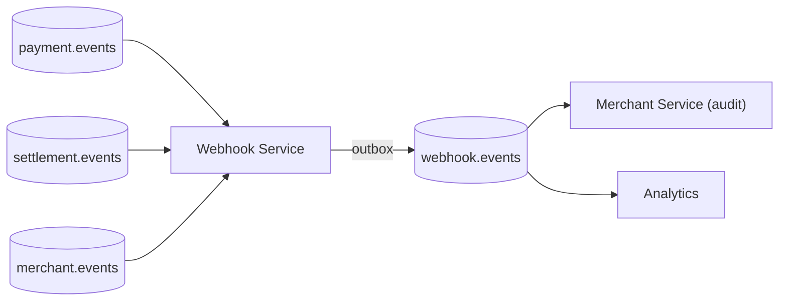

---

# 23. Event Catalog

| Event | Producer | Consumer | Purpose |
|---|---|---|---|
| `PaymentCaptured`/`PaymentFailed`/etc. (consumed) | Payment Orchestrator | Webhook Service | Triggers a delivery for subscribed merchants |
| `SettlementCompleted` (consumed) | Settlement Service | Webhook Service | Triggers a settlement-notification delivery |
| `WebhookConfigUpdated` (consumed) | Merchant Service | Webhook Service | Refreshes local config projection (§12, Part 2) |
| `WebhookDeliverySucceeded` (published) | Webhook Service | Merchant Service (audit), Analytics | Records a successful delivery outcome |
| `WebhookDeliveryFailed` (published) | Webhook Service | Merchant Service (audit), Analytics | Records exhausted-retry failure |
| `WebhookDeadLettered` (published) | Webhook Service | Analytics, operational alerting | Signals DLQ entry for operator visibility |

---

# 24. Performance

| Technique | Application |
|---|---|
| Async delivery | Kafka offset commit decoupled from HTTP dispatch completion (§15, Part 2) — consumption throughput never bound by merchant-endpoint latency |
| Worker threads / non-blocking dispatch | Reactive HTTP client for outbound delivery, consistent with the platform's WebFlux-first standard |
| Connection pooling | Per-endpoint-host pooling, bulkheaded so one slow merchant endpoint never starves delivery threads meant for others |
| HTTP client optimization | Bounded per-attempt timeout, tuned conservatively since merchant endpoints are inherently less predictable than internal platform services |

---

# 25. Scaling

- **Stateless design**: delivery scheduling state lives in PostgreSQL/Redis, never in-process — any replica can pick up any scheduled retry.
- **Horizontal scaling**: primary lever, HPA-driven by Kafka consumer lag and outbound-delivery queue depth (a more relevant signal here than raw CPU, since this service's bottleneck is typically I/O-wait on merchant endpoints, not compute).
- **Queue workers**: a pool of delivery-dispatch workers per replica, sized independently of the Kafka-consumption thread pool, so a backlog of scheduled retries doesn't block new-event consumption.
- **Load balancing**: not applicable to inbound traffic (no external caller reaches this service directly) — relevant only to Kafka consumer-group partition assignment across replicas.

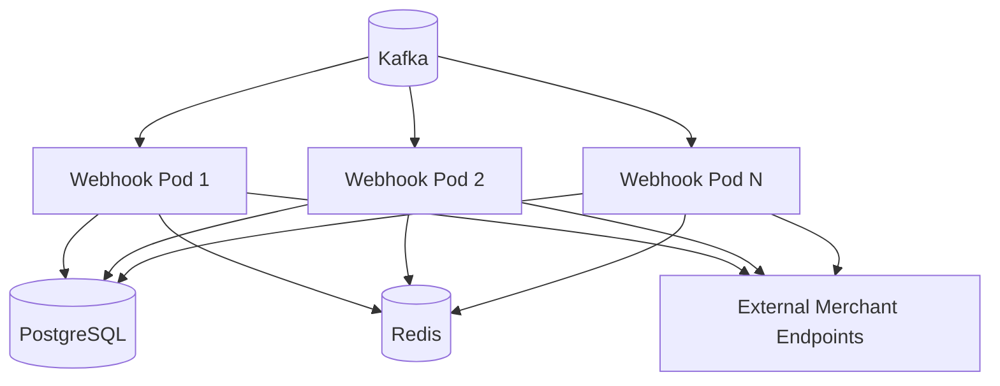

---

# 26. Caching

- **Configuration caching**: `webhook_config_projection` (§20) is itself the cache — a local, event-maintained read model avoiding a Merchant Service call on every single event delivered, mirroring the same CQRS-projection rationale Merchant Service uses for its own Gateway-facing `MerchantAuthView` (`Merchant-Service-Part-01.md` §31.2).
- Kept fresh via event consumption (§12, Part 2), not TTL — a stale webhook endpoint/secret would misdirect or fail to sign deliveries correctly, so event-driven invalidation is the only acceptable staleness model here.

---

# 27. Logging

Structured JSON, platform-standard baseline. Never logged: the webhook signing secret, full merchant payload bodies where they might carry sensitive business data beyond what's already event-catalog-safe.

| Field | Description |
|---|---|
| `correlationId` | Propagated from the originating event's envelope |
| `traceId` | OpenTelemetry trace |
| `webhookEventId` | The stable `eventId` included in the merchant-facing payload (§17, Part 2) |
| `deliveryId` | This service's own delivery record identifier |
| `merchantId` | Target merchant |
| `attemptNumber` | Current attempt within the retry sequence |
| `httpStatus` | Merchant endpoint's response status, if any |

---

# 28. Metrics

| Metric | Type | Purpose |
|---|---|---|
| `webhook_delivery_success_rate` | Gauge | Overall and per-merchant delivery health |
| `webhook_delivery_latency_seconds` | Histogram | Time from event consumption to successful acknowledgement |
| `webhook_retry_count` | Counter | Retry-policy load, per merchant |
| `webhook_failed_deliveries_total` | Counter | Exhausted-retry volume |
| `webhook_dlq_size` | Gauge | Current DLQ backlog, directly actionable for operator attention |
| `webhook_endpoint_response_time_seconds{merchantId}` | Histogram | Per-merchant-endpoint responsiveness, isolates a slow single merchant from the platform aggregate |

---

# 29. Distributed Tracing

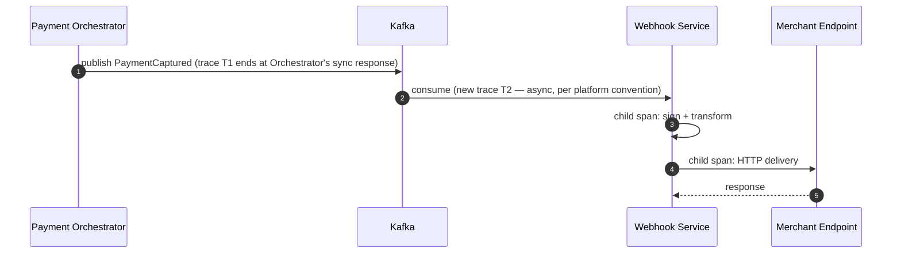

Consistent with the platform-wide convention (established in Merchant Service and Token Vault specs) of never force-joining an asynchronous, event-driven consumption path into the originating service's synchronous trace — the Orchestrator's trace ends at its own response; the Webhook Service's delivery activity is its own, independently-traceable unit of work.

---

# 30. Disaster Recovery

- **Backup**: continuous WAL archiving on the `delivery`/`delivery_attempt`/config-projection schema.
- **Failover**: synchronous same-region standby, asynchronous cross-region standby — identical platform-standard database DR pattern.
- **Recovery**: readiness gates on PostgreSQL reachability; Redis degrades gracefully (retry scheduling falls back to DB-driven polling).
- **Kafka replay**: on recovery, the consumer resumes from its last committed offset — no events are lost; any deliveries already `RETRYING` resume their backoff schedule from `delivery.next_attempt_at` without needing to restart the retry count from zero.

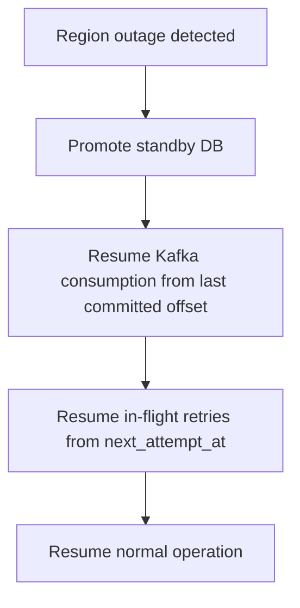

# Package Structure

```
webhook-service/
└── src/main/java/.../webhook/
    ├── config/
    │   ├── SecurityConfig.java
    │   ├── ResilienceConfig.java
    │   └── RetryPolicyConfig.java
    ├── controller/
    │   └── WebhookController.java         # internal-only: status lookup, manual redelivery
    ├── application/
    │   ├── ProcessEventUseCase.java
    │   ├── DeliverWebhookUseCase.java
    │   ├── RetryDeliveryUseCase.java
    │   └── MoveToDeadLetterUseCase.java
    ├── domain/
    │   ├── delivery/
    │   │   ├── Delivery.java
    │   │   ├── DeliveryStatus.java         # sealed: PENDING, QUEUED, DELIVERED,
    │   │   │                               #   ACKNOWLEDGED, RETRYING, FAILED, DEAD_LETTERED
    │   │   └── DeliveryAttempt.java
    │   ├── config/
    │   │   └── WebhookConfigProjection.java   # local read-only projection, never written
    │   ├── event/
    │   │   ├── WebhookDeliverySucceeded.java
    │   │   ├── WebhookDeliveryFailed.java
    │   │   └── WebhookDeadLettered.java
    │   └── vo/
    │       ├── DeliveryId.java
    │       ├── WebhookEventId.java         # stable event ID surfaced to the merchant
    │       └── BackoffSchedule.java
    ├── port/
    │   ├── DeliveryRepositoryPort.java
    │   ├── WebhookConfigProjectionPort.java
    │   ├── OutboxWriterPort.java
    │   ├── MerchantServiceClientPort.java
    │   └── HttpDeliveryClientPort.java
    ├── signing/
    │   └── SignatureGenerator.java         # HMAC-SHA256
    ├── validation/
    │   └── EndpointValidator.java          # HTTPS + SSRF-prevention re-check
    ├── retry/
    │   ├── RetryManager.java
    │   └── DlqProcessor.java
    ├── status/
    │   └── DeliveryStatusManager.java
    ├── adapter/
    │   ├── persistence/
    │   │   └── DeliveryRepositoryAdapter.java
    │   ├── outbox/
    │   │   └── OutboxWriterAdapter.java
    │   ├── client/
    │   │   ├── MerchantServiceClientAdapter.java
    │   │   └── HttpDeliveryClientAdapter.java
    │   └── projection/
    │       └── WebhookConfigProjectionAdapter.java
    ├── entity/            # persistence entities, distinct from domain aggregates
    ├── dto/
    │   ├── request/
    │   └── response/
    ├── mapper/
    ├── exception/
    ├── security/
    ├── event/
    │   ├── producer/
    │   └── consumer/      # payment.events, settlement.events, merchant.events
    ├── scheduler/         # retry-schedule polling, delivery-record cleanup
    ├── client/
    └── constant/
```

Note the `signing/`, `retry/`, and `status/` packages sitting alongside — not nested under — `application/`: HMAC signature generation, retry/backoff scheduling, and delivery-status tracking are cross-cutting concerns invoked from both `DeliverWebhookUseCase` and `RetryDeliveryUseCase`, so they're kept as their own top-level packages rather than duplicated across use cases. `domain/config/WebhookConfigProjection.java` is deliberately placed in `domain/`, not `entity/`, since it's a read model the domain layer's use cases depend on directly (`Webhook-Service-Part-02.md` §12) — but it is populated exclusively by the `event/consumer/` package reacting to `WebhookConfigUpdated`, never by any write path in this service, reinforcing that Merchant Service remains the sole owner of webhook configuration.