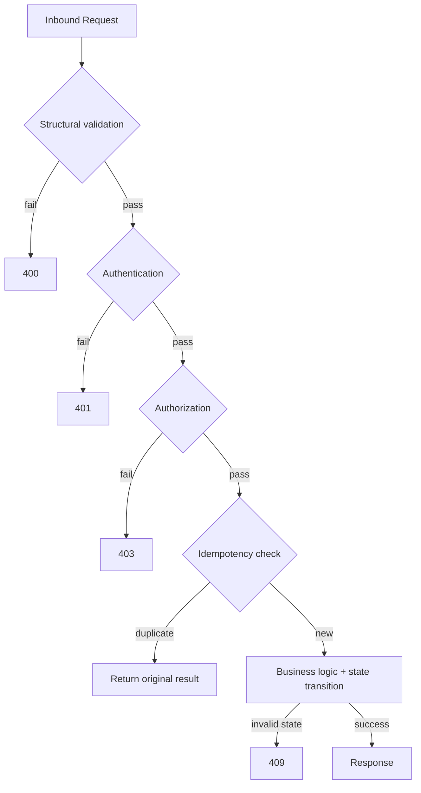

# API-Standards.md — Platform-Wide REST API Standards

Consolidates the REST conventions already established across `API-Gateway.md`, `Merchant-Service.md`, `Token-Vault.md`, `Payment-Orchestrator.md`, `Acquiring-Adapter.md`, `Webhook-Service.md`, and `Settlement-Service.md`. Every service follows these standards without exception; this document does not redefine any endpoint — it is the single reference for the conventions themselves.

---

# 1. REST Principles

| Principle | Rule |
|---|---|
| Resource-oriented | URIs name resources (nouns), never actions, with a small set of documented state-transition exceptions (§2) |
| Statelessness | No server-side session state; every request is self-contained, authenticated independently |
| Uniform error contract | One error envelope shape platform-wide (§7), regardless of which service returns it |
| Idempotent-by-design mutations | Every mutating endpoint that creates a real-world side effect requires an `Idempotency-Key` (§10) |
| Internal vs external surfaces | Public/merchant-facing APIs and internal service-to-service APIs are structurally separated (distinct listeners, distinct auth models) wherever both exist on a service |

---

# 2. URI Naming

| Convention | Example |
|---|---|
| Versioned, resource-based path | `/v1/merchants`, `/v1/payments`, `/v1/tokens` |
| Nested resources reflect true ownership | `/v1/merchants/{merchantId}/webhook-configs` |
| No verbs in the primary path | `/v1/payments/{id}`, not `/v1/getPayment` |
| State-transition endpoints (the one accepted verb exception) | `/v1/payments/{id}/capture`, `/v1/merchants/{id}/suspend`, `/v1/payments/{id}/cancel` |
| Internal-only surface prefix | `/internal/v1/...` (Token Vault, Acquiring Adapter, Webhook Service, Settlement Service) |
| Path parameters are opaque IDs | UUIDs or platform-issued tokens — never sequential integers (enumeration resistance) |

---

# 3. HTTP Methods

| Method | Usage | Idempotent | Retry-Eligible at Gateway |
|---|---|---|---|
| `GET` | Read resource/collection | Yes | Yes (bounded, connection-level failures only) |
| `POST` | Create resource / trigger state transition | No (unless `Idempotency-Key` honored) | No |
| `PUT` | Full replace (rare — merchant config only) | Yes | No |
| `PATCH` | Partial update | No | No |
| `DELETE` | Not used anywhere on this platform | — | — |

No service exposes a `DELETE` endpoint — deactivation/revocation is always a state transition (`POST .../suspend`, `.../revoke`), never a hard-delete API call, preserving every entity's audit trail by construction.

---

# 4. Headers

| Header | Direction | Required | Notes |
|---|---|---|---|
| `Authorization: Bearer {token}` | Inbound | Yes (except public/health/tokenize routes) | JWT or OAuth2 token |
| `X-API-Key` | Inbound | Conditional | Static-credential alternative to Bearer |
| `Idempotency-Key` | Inbound | Yes on mutating routes | UUID, forwarded unmodified across every internal hop |
| `X-Correlation-Id` | Inbound/Outbound | Optional inbound, always set outbound | Generated if absent |
| `traceparent` / `tracestate` | Inbound/Outbound | Always outbound | W3C Trace Context |
| `X-Merchant-Id` (internal, signed) | Outbound only (Gateway→service) | Always | Gateway-attested principal identity |
| `Content-Type: application/json` | Both | Yes on bodies | Rejected otherwise |
| `Retry-After` | Outbound | On `429`/`503` | Seconds until safe retry |

---

# 5. Request Format

| Rule | Detail |
|---|---|
| Content type | `application/json` exclusively |
| Field naming | camelCase, consistent platform-wide |
| Request DTOs | Immutable, never expose entities directly, separate from Response DTOs |
| Structural validation | Non-null/format/length checks at the controller boundary, before any business logic runs |
| Sensitive fields | Never echoed back in any response beyond a masked/display-safe form (e.g. `maskedPan`) |

---

# 6. Response Format

| Rule | Detail |
|---|---|
| Success envelope | Resource-specific JSON body; no generic wrapper object |
| Always included | `correlationId`, resource identifiers, `createdAt`/relevant timestamps |
| Never included | Internal-only fields (optimistic-lock `version` counters, raw secrets beyond one-time disclosure, cardholder data in any form) |
| One-time-disclosure fields | Credential secrets, webhook signing secrets, vault-token raw secrets — present only in the creation response, never retrievable again |

---

# 7. Error Format

Single envelope shape, platform-wide:

```json
{
  "error": {
    "code": "RATE_LIMIT_EXCEEDED",
    "message": "Request rate limit exceeded for this merchant.",
    "correlationId": "c7e1...-uuid",
    "timestamp": "2026-07-22T10:15:30Z",
    "details": []
  }
}
```

| Field | Rule |
|---|---|
| `code` | Stable, machine-readable enum — never a raw HTTP reason phrase |
| `message` | Human-readable, safe to display, never a stack trace or internal identifier |
| `details` | Optional field-level structural issues, populated only for `400`-class validation errors |
| Pass-through discipline | A downstream service's own domain error code is never reformatted or relabeled by a calling service — errors pass through unmodified |

---

# 8. Pagination

| Rule | Detail |
|---|---|
| Default | Cursor-based, not offset-based, wherever a list/history endpoint exists (e.g. Token Vault's key-version history, `Merchant-Service` audit queries) |
| No pagination by design | Token/payment/delivery/settlement resources have no list/search capability at all on the public surface — deliberate, to avoid enumeration risk (`Token-Vault-Part-02.md` §18.9–18.10) |
| Internal operator queries | May support filtering/sorting (e.g. by `status`, by date range) where genuinely needed for operational tooling, never exposed externally |

---

# 9. Versioning

| Rule | Detail |
|---|---|
| Scheme | URI-based (`/v1/...`), never header-based, for cache-ability and debuggability |
| External surface deprecation window | Minimum 180 days: `Active → Deprecated (Sunset header) → Retired (410 Gone)` |
| Internal surface versioning | Independent, faster cadence — internal consumers are deployed by the same platform organization and can coordinate directly |
| Breaking vs additive | New optional fields = no version bump; removed/renamed/retyped fields = new major version, never a silent in-place change |

---

# 10. Idempotency

| Rule | Detail |
|---|---|
| Required on | Every mutating endpoint with a real financial or configuration side effect, platform-wide, no exceptions |
| Mechanism | Redis fast-path cache check → PostgreSQL unique constraint on `(ownerId, idempotencyKey, endpoint)` as the ultimate guarantee |
| Propagation | Forwarded unmodified across every internal hop in a call chain (e.g. Orchestrator → Acquiring Adapter) — never regenerated mid-chain |
| Not required on | Naturally idempotent lifecycle transitions where a duplicate call is already a no-op (e.g. suspending an already-suspended merchant) |
| Gateway-level guarantee | The Gateway itself never retries a mutation automatically — Idempotency-Key correctness is always the receiving service's responsibility, never a Gateway-side safety net |

---

# 11. Status Codes Table

| Code | Meaning | Typical Use |
|---|---|---|
| `200` | OK | Successful read or state transition |
| `201` | Created | Successful resource creation (registration, tokenization, credential issuance) |
| `202` | Accepted | Asynchronous operation queued (e.g. key rotation trigger, manual settlement) |
| `400` | Bad Request | Structural/validation failure |
| `401` | Unauthenticated | Missing/invalid/expired credential |
| `403` | Forbidden | Authenticated but not authorized for this route/resource |
| `404` | Not Found | Resource does not exist |
| `409` | Conflict | Invalid state transition, duplicate resource, idempotency conflict |
| `410` | Gone | Retired API version |
| `413` | Payload Too Large | Request body exceeds configured limit |
| `429` | Too Many Requests | Rate limit exceeded |
| `503` | Service Unavailable | Circuit breaker open / dependency unavailable |
| `504` | Gateway Timeout | Downstream timeout budget exceeded |

---

# 12. Error Codes Table

| Code | Origin | HTTP Status |
|---|---|---|
| `UNAUTHENTICATED` | API Gateway | `401` |
| `FORBIDDEN_ROUTE_CLASS` | API Gateway | `403` |
| `MISSING_IDEMPOTENCY_KEY` | Any mutating endpoint | `400` |
| `RATE_LIMIT_EXCEEDED` | API Gateway, Token Vault (public surface) | `429` |
| `MERCHANT_NOT_ACTIVE` | Merchant Service, Payment Orchestrator | `409` |
| `INVALID_LIFECYCLE_TRANSITION` | Merchant Service, Payment Orchestrator, Settlement Service | `409` |
| `TOKEN_NOT_ACTIVE` | Token Vault | `409` |
| `UNAUTHORIZED_CALLER` | Token Vault | `403` |
| `INVALID_STATE_TRANSITION` | Payment Orchestrator | `409` |
| `NO_ELIGIBLE_ACQUIRER` | Payment Orchestrator, Acquiring Adapter | `400`/`503` |
| `REFUND_EXCEEDS_CAPTURED_AMOUNT` | Payment Orchestrator | `409` |
| `INVALID_WEBHOOK_URL` | Merchant Service, Webhook Service | `400` |
| `PAYOUT_ACCOUNT_INVALID` | Settlement Service | `409` |
| `DOWNSTREAM_UNAVAILABLE` | Any service (circuit open) | `503` |
| `DOWNSTREAM_TIMEOUT` | Any service | `504` |

Every service extends this shared vocabulary with domain-specific codes only where a genuinely new failure condition exists — no service invents a differently-shaped error code for a condition another service has already named.

---

# 13. API Lifecycle Diagram




---

# 14. Summary

Every REST API on this platform — public or internal — follows one shared contract: versioned, noun-based URIs with a small set of documented state-transition exceptions; a single error envelope shape; mandatory Idempotency-Key enforcement on every real side-effecting mutation; and a shared, growing-but-consistent error-code vocabulary that every service extends rather than reinvents. This consistency is what lets an engineer move from working on the API Gateway to the Settlement Service without relearning how errors, versioning, or idempotency work — the conventions are identical; only the resource names change.