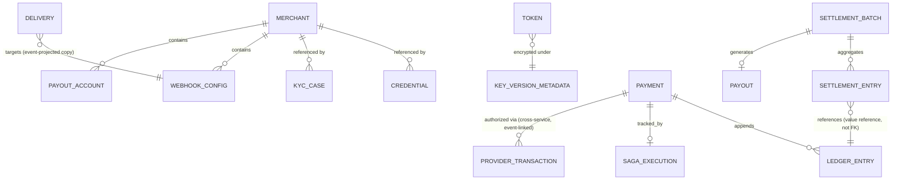
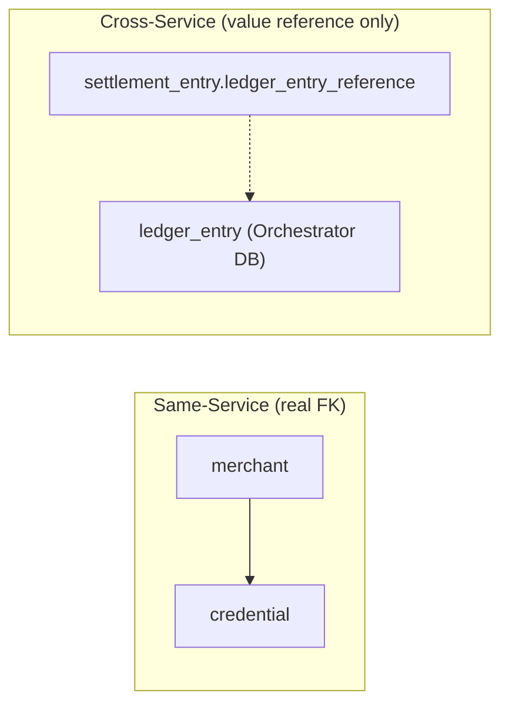

# Database-Architecture.md — Platform-Wide Database Reference

Document status: Cross-service reference — consolidates the database-per-service design already established in `SYSTEM_DESIGN.md` §11 and every per-service specification. This document does not redefine any table or schema — it is the single place an engineer goes to see the platform's *entire* persistence layout at once, rather than piecing it together from six separate service specs.

---

# 1. Overview

The Distributed Payment Gateway follows a strict database-per-service model (`SYSTEM_DESIGN.md` §11, Mandatory Architecture Rules): every service owns exactly one PostgreSQL database (or, for Token Vault specifically, two — an operational database and a physically/logically isolated audit database, `Token-Vault-Part-03.md` §29.2). No service ever queries another service's database directly; all cross-service data needs are satisfied either synchronously via an internal API or asynchronously via Kafka event consumption into a local read model.

This single rule is what makes every other architectural property in this platform possible — independent service scaling, independent schema evolution, and a hard blast-radius boundary around cardholder data (Token Vault's database is the *only* one ever containing encrypted PAN material).

---

# 2. Database Responsibilities

| Responsibility | Description |
|---|---|
| System of record | Each service's database is the sole authoritative source for the data it owns — no service's data is ever "cached" as if authoritative elsewhere |
| Transactional consistency | Every state change + its Outbox event write occurs in one local ACID transaction, per service, never a cross-database transaction |
| Read-model support | Where a service needs fast access to another service's data, it maintains its own local, event-maintained projection — never a live cross-database query |
| Audit/compliance retention | Services with compliance-relevant history (Merchant Service's lifecycle audit, Token Vault's cardholder-data audit) retain that history independently of their operational data's own retention policy |

---

# 3. Service → Database Mapping

| Service | Database(s) | Notes |
|---|---|---|
| Merchant Service | `merchant_db` | Single schema — identity, credentials, KYC, configuration |
| Token Vault Service | `vault_operational_db`, `vault_audit_db` | Two databases, isolated by design (`Token-Vault-Part-03.md` §29.2) |
| Payment Orchestrator | `orchestrator_db` | Payment state, ledger, SAGA tracking |
| Acquiring Adapter | `acquiring_db` | Provider-transaction tracking only — no business/payment state |
| Webhook Service | `webhook_db` | Delivery tracking + read-only webhook-config projection |
| Settlement Service | `settlement_db` | Settlement batches, payouts, reconciliation |
| API Gateway | None | Fully stateless; Redis only, no database (`API-Gateway-Part-03.md` §40) |

---

# 4. Database Ownership Matrix

| Data Domain | Owning Service | Consumers (via API or event projection, never direct query) |
|---|---|---|
| Merchant identity, lifecycle, credentials | Merchant Service | API Gateway (credential/scope), Payment Orchestrator (eligibility), Webhook Service (config projection), Settlement Service (payout account) |
| Cardholder data (encrypted PAN, tokens, keys) | Token Vault Service | Payment Orchestrator (detokenize call only — never reads the Vault's database) |
| Payment state, ledger | Payment Orchestrator | Settlement Service (via `ledger.events`/`payment.events`, never direct query) |
| Provider/acquirer transaction records | Acquiring Adapter | None outside this service — purely operational/reconciliation data |
| Webhook delivery history | Webhook Service | None outside this service — operator/audit visibility only |
| Settlement/payout records | Settlement Service | Merchant Service (audit, via `settlement.events`), Webhook Service (notification trigger, via `settlement.events`) |

No cell in this matrix is ever satisfied by a consumer holding a direct database credential to the owning service's database — every cross-service data need in this row is either a synchronous internal API call or an event-driven local projection, per `SYSTEM_DESIGN.md` §11.

---

# 5. High-Level ER Diagram

Dashed/labeled cross-service relationships above ("cross-service, event-linked", "references... not FK") are the visual reminder that **no line in this diagram is a real foreign-key constraint across a database boundary** — every cross-service reference in this platform is a value-held identifier, resolved via API or event, never a joinable key.

---

# 6. Database per Service

| Service | Database | Tables | Purpose |
|---|---|---|---|
| Merchant Service | `merchant_db` | `merchant` | Merchant profile + lifecycle state (`Merchant-Service-Part-03.md` §61) |
| | | `credential` | API keys / OAuth2 client registrations |
| | | `kyc_case`, `document_reference`, `verification_decision` | KYC workflow and immutable decision history |
| | | `webhook_config`, `payout_account` | Merchant-owned configuration entities |
| | | `merchant_lifecycle_audit` | Immutable lifecycle-transition audit trail |
| | | `merchant_auth_view` | CQRS read projection for Gateway-facing credential/scope resolution |
| | | `outbox_event`, `idempotency_record` | Platform-standard reliability tables |
| Token Vault Service | `vault_operational_db` | `token` | Encrypted PAN + token metadata (`Token-Vault-Part-03.md` §61) |
| | | `key_version_metadata` | KEK version lifecycle metadata (never key bytes) |
| | | `outbox_event`, `idempotency_record` | Platform-standard reliability tables |
| | `vault_audit_db` (isolated) | `audit_entry` | Immutable, tamper-evident cardholder-data access log |
| Payment Orchestrator | `orchestrator_db` | `payment` | Aggregate root — state, route, merchant/vault-token references |
| | | `ledger_entry` | Append-only financial ledger |
| | | `saga_execution` | Current SAGA step + retry tracking |
| | | `outbox_event`, `idempotency_record` | Platform-standard reliability tables |
| Acquiring Adapter | `acquiring_db` | `provider_transaction` | Connector-side interaction tracking per `providerTransactionId` |
| | | `outbox_event`, `idempotency_record` | Platform-standard reliability tables |
| Webhook Service | `webhook_db` | `delivery`, `delivery_attempt` | Delivery tracking system of record |
| | | `webhook_config_projection` | Local, read-only, event-maintained copy of Merchant Service's config |
| | | `outbox_event` | Platform-standard reliability table |
| Settlement Service | `settlement_db` | `settlement_batch`, `settlement_entry` | Per-merchant, per-cycle settlement aggregation |
| | | `payout` | Payout instruction + confirmation tracking |
| | | `outbox_event` | Platform-standard reliability table |

---

# 7. Relationships

- **Within a service**: standard foreign-key relationships apply (e.g. `credential.merchant_id → merchant.id`), enforced by the database, since both sides live in the same schema.
- **Across services**: never a foreign key — always a value-held reference (e.g. Settlement Service's `settlement_entry.ledger_entry_reference`, a plain identifier column pointing at a row in the Payment Orchestrator's own database, resolvable only via that service's own API or event stream, `Settlement-Service-Part-03.md` §21).
- **Event-projected relationships**: Webhook Service's `webhook_config_projection` and Merchant Service's own `merchant_auth_view` are both local copies of data another aggregate (or the same service's own aggregate, in the latter case) owns — kept current via event consumption, never a live join.

---

# 8. Indexing Guidelines

- **Primary key**: every table's aggregate/entity identifier, always a UUID (never a sequential integer, for enumeration-resistance — established first in Token Vault's design, `Token-Vault-Part-03.md` §21.3, and followed platform-wide).
- **Foreign-key columns**: indexed within a service's own schema wherever a dominant query pattern joins across them (e.g. `credential(merchant_id, status)`, `Merchant-Service-Part-03.md` §62).
- **Status columns**: indexed wherever an operational or scheduled-job query filters by lifecycle state (e.g. `token(status)` for the expiration sweep, `payment(state)` for stuck-payment reconciliation).
- **Outbox partial index**: every service's `outbox_event(published, created_at)` carries a partial index on `published = false` — this single guideline appears identically in every service spec (Merchant Service, Token Vault, Payment Orchestrator, etc.) since the Outbox Relay's poll query is otherwise a growing full-table scan regardless of a service's business domain.
- **Never index for enumeration convenience**: no service indexes a field purely to support a "list/search all X" capability if that capability doesn't already exist for a legitimate business reason — Token Vault explicitly declines to index `masked_pan` for this reason (`Token-Vault-Part-03.md` §31.8), and the same discipline applies wherever a similar temptation exists elsewhere.

---

# 9. Transaction Boundaries

- **Standard case**: every service writes its aggregate's state change and its `outbox_event` row in one local ACID transaction — this is the platform's single universal transaction-boundary rule, restated in every service spec's database-design section.
- **Optimistic locking**: every mutable aggregate root carries a `version` column, checked-and-incremented on every update, preventing lost updates under concurrent writers — applied identically to `merchant`, `credential`, `token`, `payment`, and `settlement_batch`.
- **The one documented exception**: Token Vault's audit write occurs in a **separate database and therefore a separate transaction** from the operational write (`Token-Vault-Part-03.md` §29.9) — resolved not by weakening the guarantee but by application-layer sequencing: the audit write must succeed before the operational transaction is considered committed-and-successful, enforced by the Vault Manager component, not by a single database's transaction boundary. This is the platform's only case where "atomic" is an application-enforced invariant rather than a database-enforced one, and it exists solely because of the audit-isolation requirement (`Token-Vault-Part-03.md` §30.5) — no other service has an analogous exception.
- **Cross-service consistency**: never a distributed transaction anywhere on this platform — always SAGA + compensation (`SYSTEM_DESIGN.md` §6, `Payment-Orchestrator-Part-02.md` §17).

---

# 10. Backup Strategy

- **Continuous WAL archiving** for point-in-time recovery, on every service's database without exception — this is the platform-standard baseline established first in `SYSTEM_DESIGN.md`'s deployment architecture and restated identically in every service's Disaster Recovery section.
- **Synchronous same-region standby** (zero RPO for a local failure) + **asynchronous cross-region standby** (small, bounded RPO for a regional disaster) — identical topology across Merchant Service, Token Vault, Payment Orchestrator, Acquiring Adapter, Webhook Service, and Settlement Service.
- **Token Vault's audit database carries the strictest backup-integrity requirement**: a restore is only considered valid once the tamper-evident hash-chain across `audit_entry` rows is verified intact (`Token-Vault-Part-03.md` §29.17) — no other service's backup-restore procedure includes an equivalent cryptographic-integrity verification step, since no other service's data carries the same tamper-evidence design.
- **Retention asymmetry**: operational data (tokens, payments, deliveries) is retained per its own business/regulatory need and eventually hard-deleted where applicable (e.g. Token Vault's crypto-shredding of retired tokens, `Token-Vault-Part-03.md` §29.16); audit/compliance data (Merchant Service's lifecycle audit, Token Vault's `audit_entry`) is retained on a materially longer, compliance-driven horizon and archived rather than deleted.

---

# 11. Partitioning Strategy

| Service | Partitioned Table(s) | Strategy | Rationale |
|---|---|---|---|
| Every service | `outbox_event` | Range-partitioned by month, partial index on `published=false` | Unbounded historical growth; the Relay only ever needs unpublished rows |
| Merchant Service | `merchant_lifecycle_audit` | Range-partitioned by month | Unbounded audit-history growth, separate from the comparatively small `merchant` table |
| Token Vault | None beyond `outbox_event` at current scale | Sharding by `vaultTokenId` hash prefix documented as a future option, not implemented | Avoids overengineering ahead of demonstrated need (`Token-Vault-Part-03.md` §29.14/§29.15) |
| Payment Orchestrator, Settlement Service, Acquiring Adapter, Webhook Service | None beyond `outbox_event` | — | Current projected write volume for their core tables remains within a single well-indexed table's comfortable range |

The platform's consistent stance: **partition the tables that grow unboundedly with time or audit history; don't partition a core aggregate table pre-emptively** just because a service handles high transaction volume — Payment Orchestrator's `payment`/`ledger_entry` tables, despite sitting on the platform's highest-throughput path, are not partitioned in this document's current design, since row count there scales with transaction count over a bounded operational retention window, not unboundedly like an audit or outbox table.

---

# 12. Summary

Every service on this platform owns exactly one database (Token Vault owns two, for audit isolation) — there is no shared database anywhere, no cross-service foreign key anywhere, and no service ever holds a credential to another service's schema. Cross-service data needs are satisfied exclusively through synchronous internal APIs or asynchronous, event-maintained local projections, the same discipline documented individually in every per-service specification and consolidated here for a single, platform-wide view.

The one universal transactional rule — state change + Outbox event in one local ACID transaction — holds everywhere except Token Vault's audit write, which trades a single-database transaction for an application-enforced sequencing guarantee in exchange for true audit-store isolation. Backup, replication, and partitioning strategy follow the same platform-standard pattern across every service, diverging only where a service's own data has a genuinely different retention or integrity requirement — most notably Token Vault's cardholder-data crypto-shredding and tamper-evident audit-restore verification, and Merchant Service's long-horizon compliance-audit retention.