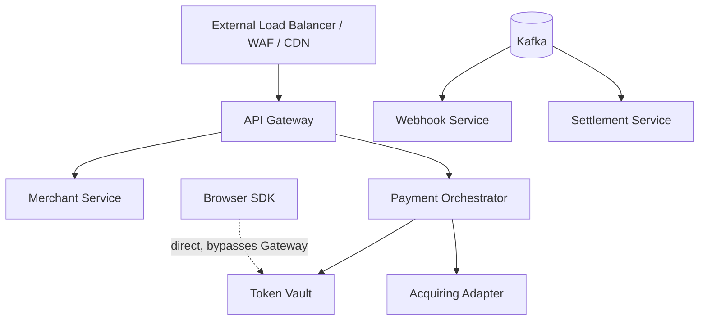
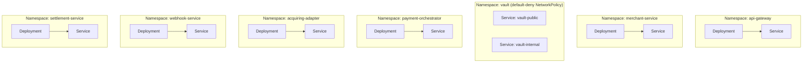
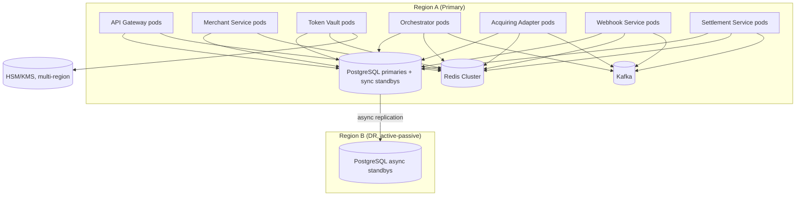
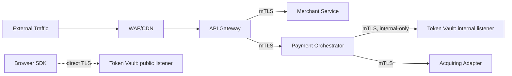
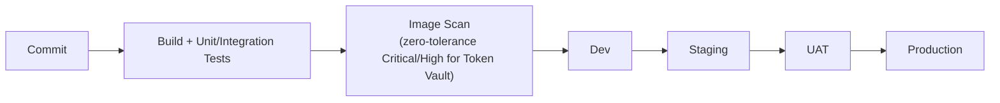
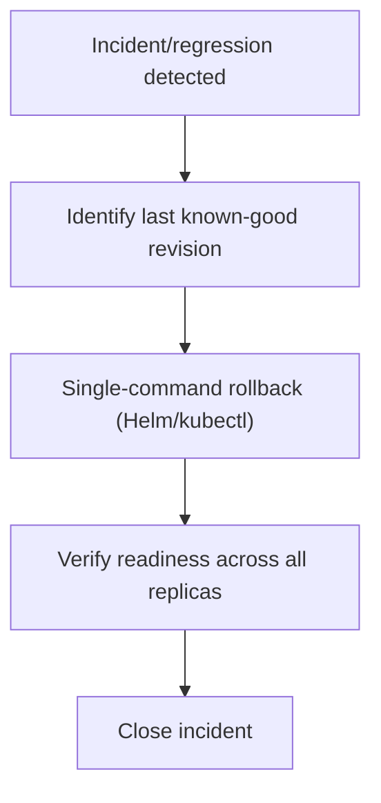

# Deployment-Architecture.md — Platform-Wide Deployment Reference

Consolidates the deployment topology already established across every per-service spec. Mostly diagrams; short explanations only.

---

# 1. Overview

All seven components (API Gateway, Merchant Service, Token Vault, Payment Orchestrator, Acquiring Adapter, Webhook Service, Settlement Service) deploy as independent Kubernetes Deployments, each in its own namespace, each stateless at the application tier, each scaling independently.

---

# 2. Environment Layout

| Environment | Purpose | Key Difference |
|---|---|---|
| Development | Feature development | Simulated KMS/HSM, no real cardholder-adjacent data |
| Staging | Full integration testing | KMS provider sandbox tier, synthetic acquirers |
| UAT | Merchant/partner acceptance | Synthetic test cards only |
| Production | Live | Full HSM/KMS, full DR topology |

---

# 3. Kubernetes Architecture

- Each service: its own namespace, `Deployment`, `Service`, `ConfigMap`, `Secret` (references only), `PodDisruptionBudget`.
- Token Vault's namespace is the platform's only default-deny-by-default `NetworkPolicy` namespace (`Token-Vault-Part-04.md` §42.2) — dual `Service` objects (public/internal), no shared Ingress path between them.
- No service holds a `PersistentVolume` itself — PostgreSQL/Redis/Kafka are separately managed stateful infrastructure.

---

# 4. Deployment Diagram

Active-active across AZs within a region; active-passive across regions (DR only), platform-wide — no service currently implements active-active multi-region writes.

---

# 5. Scaling Strategy

| Service | Primary HPA Signal | Why |
|---|---|---|
| API Gateway | Request rate + CPU | Routing/policy work, low per-request cost |
| Merchant Service | Request rate | Comparatively low write volume |
| Token Vault | CPU + request rate | Genuine cryptographic CPU cost |
| Payment Orchestrator | Request rate + CPU | Platform's highest-throughput hot path |
| Acquiring Adapter | Request rate | I/O-bound on external provider latency |
| Webhook Service | Kafka consumer lag + delivery-queue depth | I/O-wait on external merchant endpoints, not CPU |
| Settlement Service | Batch-queue depth (cycle-triggered) | Bursty, cutoff-driven load, not steady-state |

All services: stateless application tier, horizontal scaling as the primary lever, multi-AZ `PodDisruptionBudget`-protected.

---

# 6. Networking

- mTLS on every internal hop, platform-wide (`Security-Architecture.md` §6).
- Token Vault's dual-listener split is the only case where two `Service` objects exist for one deployment — every other service exposes a single internal `Service`.
- Default-deny `NetworkPolicy` per namespace, explicit allow-list per legitimate caller pair.

---

# 7. Configuration

- Externalized via ConfigMap (non-secret) + Secret Manager abstraction (all secrets) — identical pattern across every service, no exceptions.
- Precedence: Secret Manager > environment-specific ConfigMap > compiled-in default (non-security-relevant settings only).
- Security-relevant config missing at startup → fail readiness, never a silent insecure default (established first in Token Vault, `Token-Vault-Part-04.md` §45.5, applied platform-wide).

---

# 8. Resource Allocation Table

| Service | CPU Profile | Memory Profile | Notes |
|---|---|---|---|
| API Gateway | Low per-request, high concurrency | Low | Routing/policy only |
| Merchant Service | Low | Low | Low write volume |
| Token Vault | High (cryptographic ops) | Moderate, closely monitored | Memory growth treated as a security signal, not just performance |
| Payment Orchestrator | Moderate–high | Moderate | Highest-throughput hot path |
| Acquiring Adapter | Low–moderate | Moderate (per-connector pools) | I/O-bound |
| Webhook Service | Low–moderate | Moderate (delivery backlog) | I/O-wait dominant |
| Settlement Service | Bursty, high during batch runs | Moderate | Idle outside cycle windows |

Requests/limits sized to steady-state observed usage + burst headroom per service; Token Vault additionally sizes for AES-NI-capable node targeting.

---

# 9. Deployment Pipeline

- Rolling updates: default, routine releases (`maxUnavailable=0`, `maxSurge=1`).
- Blue-Green: security-sensitive changes (auth, encryption, KMS integration) — mandatory for Token Vault, recommended for Gateway/Orchestrator equivalents.
- Canary: lower-risk, gradual-rollout-appropriate changes.

---

# 10. Rollback Strategy

- Single-command, pre-rehearsed, identical mechanism platform-wide.
- Token Vault adds one pre-check: confirm the rolled-back version's `KeyWrappingPort` adapter still resolves the current key version before proceeding (`Token-Vault-Part-04.md` §42.8).
- Rollback never requires cross-service coordination unless a release also changed a shared event contract — checked explicitly beforehand in that case.

---

# 11. Summary

Every service deploys identically in shape — stateless, namespaced, horizontally scaled, mTLS-internal, Secret-Manager-configured — with two deliberate deviations: Token Vault's default-deny namespace and dual-listener `Service` split (cardholder-data isolation), and each service's own HPA signal tuned to its actual bottleneck (CPU for Token Vault/Gateway, queue depth for Webhook/Settlement, request rate for the rest). DR posture is active-passive across regions platform-wide, with Token Vault's HSM/KMS multi-region key availability as the one binding constraint that no other service's deployment architecture needs to solve for.