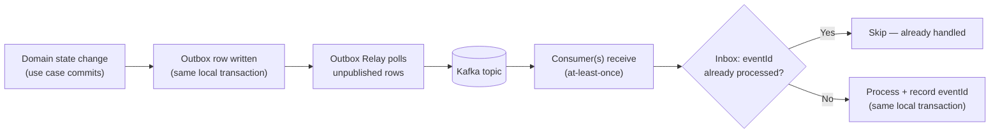
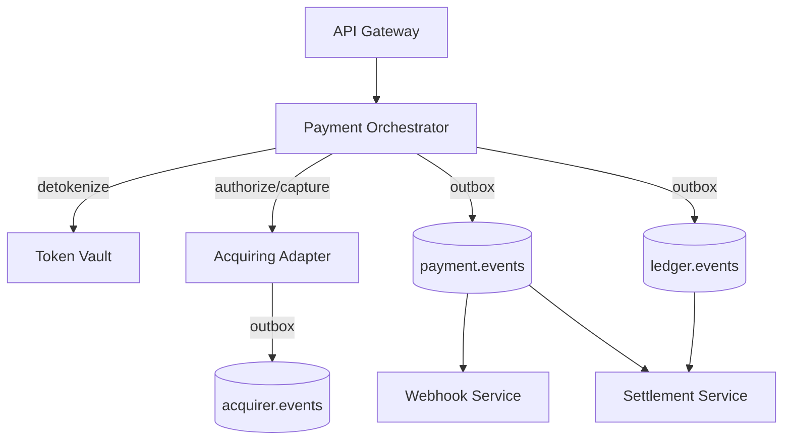
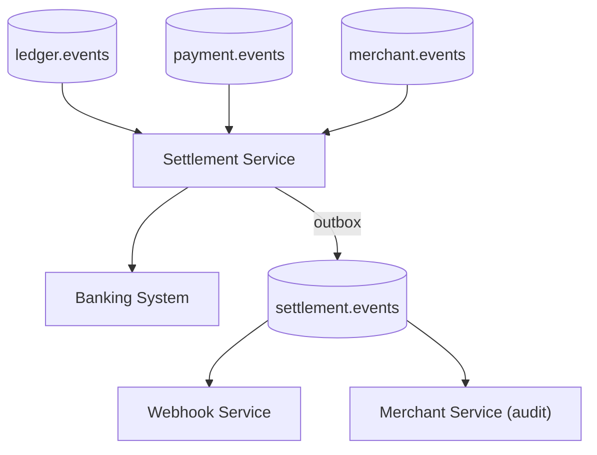
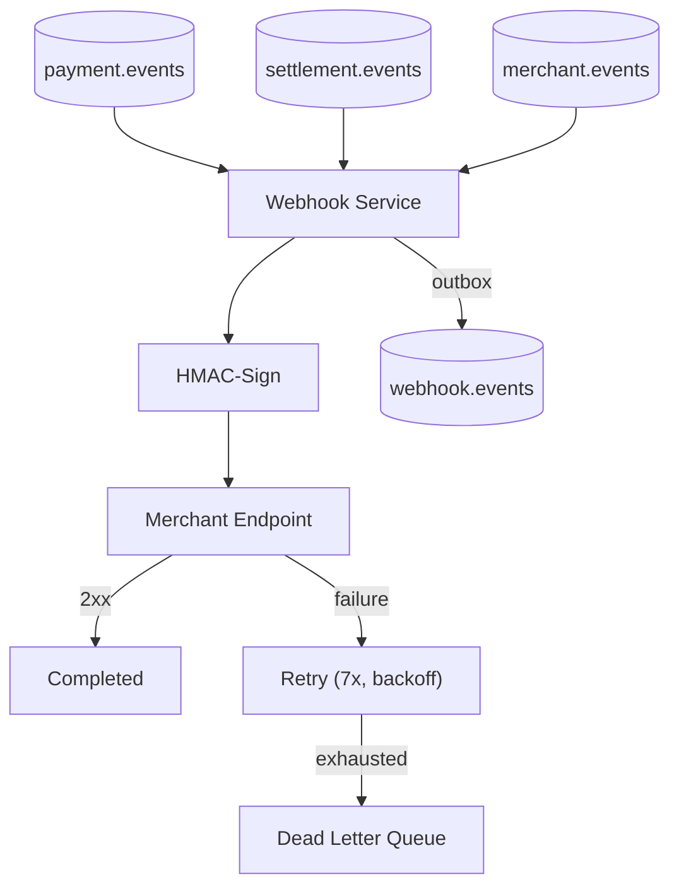

# Event-Catalog.md — Platform-Wide Event & Messaging Reference

Document status: Cross-service reference — consolidates and cross-references the event/Kafka design already established in `SYSTEM_DESIGN.md` and every per-service specification (`Merchant-Service.md`, `Token-Vault.md`, `Payment-Orchestrator.md`, `Acquiring-Adapter.md`, `Webhook-Service.md`, `Settlement-Service.md`). This document does not redefine any event or topic — it is the single place an engineer goes to see the platform's *entire* event-driven surface at once, rather than piecing it together from six separate service specs.

---

# 1. Overview

The Distributed Payment Gateway is event-driven at every service boundary that isn't a synchronous, latency-critical call (`SYSTEM_DESIGN.md` §1, §5). Every service that changes state publishes that change as an event via the platform-standard Transactional Outbox pattern; every service that needs to react to another service's state changes does so by consuming Kafka, never by querying another service's database directly (`SYSTEM_DESIGN.md` §11 database-per-service principle).

This gives the platform three properties every event-catalog entry in this document assumes as a baseline:

- **Reliable publish**: an event is never lost because the originating state change and the outbox write happen in the same local transaction (`SYSTEM_DESIGN.md` §7).
- **At-least-once delivery, Inbox-deduped consumption**: every consumer is expected to dedupe on `eventId`, since Kafka's own delivery guarantee is at-least-once, not exactly-once.
- **Zero cardholder data in any event payload, ever** — enforced structurally at the type level in every service that could conceivably touch cardholder data (most explicitly in Token Vault, `Token-Vault-Part-01.md` §16), and by convention everywhere else.

---

# 2. Event Naming Convention

- **Past-tense, domain-verb naming**: every event name describes something that has already happened — `PaymentCaptured`, not `CapturePayment`. This is a deliberate convention across every service spec, since an event is a fact, never a command.
- **`{Entity}{PastTenseVerb}` shape**: `MerchantSuspended`, `TokenRevoked`, `SettlementCompleted`, `WebhookDeliveryFailed` — the entity comes first, making event names sortable/groupable by the domain concept they describe.
- **No abbreviations, no service-name prefixing**: an event is named for what happened, not for which service produced it — the producer is a separate, explicit field in the event envelope (§4), not encoded into the name.
- **Singular per fact**: a single business occurrence produces exactly one event, never a compound event describing two unrelated state changes at once (e.g. rotation produces two distinct events, `TokenRotated` covering both the new and superseded token in one payload, rather than two separate simultaneous events for what is one atomic domain operation).

---

# 3. Topic Naming Convention

- **`{owning-service-domain}.events`** — one topic per producing service's domain, e.g. `merchant.events`, `payment.events`, `vault.events`. This is the platform-wide default established in `SYSTEM_DESIGN.md` §5 and followed by every service spec without exception.
- **A single service may own more than one topic** where genuinely distinct consumer/ordering concerns justify it — the Payment Orchestrator owns both `payment.events` (state-transition facts) and `ledger.events` (financial-movement facts) as two separate topics, since Settlement Service consumes `ledger.events` far more heavily than `payment.events`, and keeping them separate avoids forcing every consumer to filter out event types they don't need.
- **No event-type-per-topic splitting**: every service's events of a given domain share one topic, partitioned by the relevant entity ID — never split into `payment-created.events`, `payment-authorized.events`, etc. This preserves strict per-entity ordering (§3.1) without requiring cross-topic coordination.

## 3.1 Partition Key Convention
Every topic is partitioned by the ID of the aggregate the event is *about* — `merchantId` for `merchant.events`, `paymentId` for `payment.events`/`ledger.events`/`acquirer.events`, `vaultTokenId` or `keyVersionId` for `vault.events`, `merchantId` for `webhook.events`/`settlement.events`. This guarantees no two events about the same entity are ever processed out of order by a given consumer, while still allowing full horizontal consumer scaling across unrelated entities.

---

# 4. Event Lifecycle Diagram

Every event on this platform follows this exact lifecycle, regardless of which service produces or consumes it — this is the single mechanism (`SYSTEM_DESIGN.md` §7) underpinning every reliability claim in every per-service spec.

---

# 5. Topic Catalog

| Topic | Producer | Consumer(s) | Retention | DLQ | Partitions (Key) |
|---|---|---|---|---|---|
| `merchant.events` | Merchant Service | API Gateway (credential/scope cache invalidation), Payment Orchestrator (eligibility), Webhook Service (config projection), Settlement Service (payout account/eligibility), Merchant Service itself (self-consumer, `MerchantAuthView` rebuild) | Platform-standard | Application-level, self-consumer only (`Merchant-Service-Part-03.md` §73) | `merchantId` |
| `vault.events` | Token Vault Service | Security monitoring, compliance/analytics tooling (no platform service is a functional consumer — Token Vault has no internal self-consumer, `Token-Vault-Part-03.md` §33.6) | Platform-standard | None (no consumer group owned by this service) | `vaultTokenId` / `keyVersionId` |
| `payment.events` | Payment Orchestrator | Webhook Service, Settlement Service | Platform-standard | Consumer-owned (Webhook Service's own DLQ handling, not this topic's) | `paymentId` |
| `ledger.events` | Payment Orchestrator | Settlement Service | Platform-standard | Consumer-owned | `paymentId` |
| `acquirer.events` | Acquiring Adapter | Analytics, Security Monitoring | Platform-standard | None (no consumer group owned by this service) | `paymentId` |
| `webhook.events` | Webhook Service | Merchant Service (audit), Analytics | Platform-standard | None | `merchantId` |
| `settlement.events` | Settlement Service | Webhook Service, Merchant Service (audit) | Platform-standard | Consumer-owned | `merchantId` |

"Platform-standard" retention/replication refers to the shared Kafka cluster configuration established in `SYSTEM_DESIGN.md` §14 — no service overrides this individually, since none of these topics carry a loss-tolerance profile different from the platform's other business events (cardholder data, which *would* warrant a different profile, never appears in any of them).

---

# 6. Event Catalog

| Event | Producer | Consumers | Payload Summary | Trigger |
|---|---|---|---|---|
| `MerchantRegistered` | Merchant Service | Internal audit, KYC workflow trigger | `merchantId`, profile summary | New merchant registration |
| `MerchantVerificationApproved` | Merchant Service | Merchant aggregate (triggers activation) | `merchantId`, `kycCaseId`, decision reference | KYC approved |
| `MerchantVerificationRejected` | Merchant Service | Merchant aggregate, notification path | `merchantId`, `kycCaseId`, rationale | KYC rejected |
| `MerchantActivated` | Merchant Service | API Gateway, Payment Orchestrator, Settlement Service | `merchantId`, `state=ACTIVE` | Lifecycle transition |
| `MerchantSuspended` | Merchant Service | API Gateway, Payment Orchestrator | `merchantId`, `reason`, `triggeredBy` | Risk/compliance signal |
| `MerchantDeactivated` | Merchant Service | API Gateway, Payment Orchestrator, Settlement Service | `merchantId`, `reason`, `initiatedBy` | Terminal lifecycle transition |
| `MerchantCredentialIssued` | Merchant Service | API Gateway | `credentialId`, `merchantId`, scopes | New API key/OAuth2 client |
| `MerchantCredentialRevoked` | Merchant Service | API Gateway | `credentialId`, `merchantId` | Explicit or rotation-triggered revocation |
| `WebhookConfigUpdated` | Merchant Service | Webhook Service | `webhookConfigId`, `merchantId`, `endpointUrl`, `eventTypesSubscribed` | Webhook endpoint created/changed |
| `PayoutAccountUpdated` | Merchant Service | Settlement Service | `payoutAccountId`, `merchantId` | Settlement bank details changed |
| `TokenCreated` | Token Vault | Security monitoring, analytics | `vaultTokenId`, `maskedPan`, `cardBrand`, `keyVersionId` | Successful tokenization |
| `TokenRetrieved` | Token Vault | Security monitoring (anomaly detection) | `vaultTokenId`, caller identity | Successful detokenization |
| `TokenRotated` | Token Vault | Security monitoring, analytics | Old + new `vaultTokenId` | Rotation completes |
| `TokenExpired` | Token Vault | Analytics | `vaultTokenId` | Passive expiry or cleanup sweep |
| `TokenRevoked` | Token Vault | Security monitoring, analytics | `vaultTokenId`, reason | Explicit revocation |
| `KeyRotationInitiated` / `KeyRotationCompleted` | Token Vault | Security monitoring | `keyVersionId` | KEK rotation lifecycle |
| `UnauthorizedAccessDetected` | Token Vault | Security monitoring (real-time alerting) | Caller identity, denied route | Any auth/authz denial on the internal surface |
| `PaymentCreated` | Payment Orchestrator | Analytics | `paymentId`, `merchantId`, `amount` | Payment intent recorded |
| `PaymentValidated` | Payment Orchestrator | Analytics | `paymentId` | Merchant eligibility confirmed |
| `PaymentAuthorized` | Payment Orchestrator | Webhook Service, Analytics | `paymentId`, `acquirerId` | Successful authorization |
| `PaymentCaptured` | Payment Orchestrator | Webhook Service, Settlement Service | `paymentId`, `capturedAmount` | Successful capture |
| `PaymentFailed` | Payment Orchestrator | Webhook Service, Analytics | `paymentId`, failure reason | Decline / retry exhaustion |
| `PaymentCancelled` | Payment Orchestrator | Webhook Service | `paymentId` | Pre-capture cancellation |
| `PaymentRefunded` (partial/full) | Payment Orchestrator | Webhook Service, Settlement Service | `paymentId`, refunded amount | Refund request |
| `LedgerEntryAppended` | Payment Orchestrator | Settlement Service | `paymentId`, entry type, amount | Every ledger write |
| `ProviderAuthorizationRequested` | Acquiring Adapter | Analytics | `paymentId`, `acquirerId` | Routing decision + dispatch |
| `ProviderAuthorizationCompleted` | Acquiring Adapter | Analytics | `paymentId`, normalized outcome | Provider response received |
| `ProviderCaptureCompleted` / `ProviderRefundCompleted` / `ProviderVoidCompleted` | Acquiring Adapter | Analytics | `paymentId`, outcome | Respective provider call completes |
| `ProviderCircuitOpened` | Acquiring Adapter | Security Monitoring | `acquirerId` | Connector circuit breaker opens |
| `ProviderFailoverTriggered` | Acquiring Adapter | Analytics | `paymentId`, from/to `acquirerId` | Routing failover engaged |
| `WebhookDeliverySucceeded` | Webhook Service | Merchant Service (audit), Analytics | `deliveryId`, `webhookEventId` | 2xx acknowledgement received |
| `WebhookDeliveryFailed` | Webhook Service | Merchant Service (audit), Analytics | `deliveryId` | Retry exhaustion |
| `WebhookDeadLettered` | Webhook Service | Analytics, operational alerting | `deliveryId` | Delivery moved to DLQ |
| `SettlementScheduled` | Settlement Service | Analytics | `merchantId`, `ledgerEntryReference` | Ledger entry queued for next cycle |
| `SettlementBatchCreated` | Settlement Service | Analytics | `batchId`, `merchantId`, `cycleDate` | Cutoff reached, batch created |
| `SettlementCompleted` | Settlement Service | Webhook Service, Merchant Service (audit) | `batchId`, `netAmount` | Banking system confirms payout |
| `SettlementFailed` | Settlement Service | Webhook Service, operational alerting | `batchId`, failure reason | Payout rejected or retries exhausted |

Every payload above is a **summary** — the full field-level shape for each event is authoritative only in its originating service's own specification (cross-referenced by the "Producer" column); this table exists for discoverability, not as a replacement for the originating contract.

---

# 7. Event Flow Diagrams

## 7.1 Payment Flow

## 7.2 Settlement Flow

## 7.3 Webhook Flow

---

# 8. Retry Topics

The platform does **not** use a Kafka-level retry-topic pattern anywhere — every service's per-message processing retry is handled at the application layer (bounded retry with backoff before DLQ, per each service's own consumer logic), not by re-publishing a failed message to a `-retry` topic. This is a deliberate, platform-wide consistency choice: introducing Kafka-level retry topics would mean two different retry mechanisms (Kafka-level and HTTP/business-level, e.g. Webhook Service's delivery retries) coexisting for related but distinct concerns, which would make failure-mode reasoning harder, not easier.

The one exception worth naming explicitly: **Webhook Service's delivery retries are not Kafka retries at all** — a webhook delivery has already been successfully consumed from Kafka by the time it enters its seven-attempt backoff cycle (`Webhook-Service-Part-03.md` §22); that retry loop operates entirely against PostgreSQL/Redis state, never against Kafka.

---

# 9. Dead Letter Queue

| Service | DLQ Scope | Trigger |
|---|---|---|
| Merchant Service | Its own self-consumer (rebuilding `MerchantAuthView`) | Persistent, non-transient processing error after bounded retries (`Merchant-Service-Part-03.md` §73) |
| Webhook Service | Application-level delivery DLQ (`delivery.status = DEAD_LETTERED`) | Seven HTTP-delivery attempts exhausted — **not** a Kafka-consumption DLQ (§8) |
| Payment Orchestrator, Acquiring Adapter, Settlement Service | Consumer-owned, per their own `merchant.events`/`payment.events` consumption where applicable | Persistent processing error after bounded retries |
| Token Vault | None | No internal consumer exists to have a DLQ (`Token-Vault-Part-03.md` §33.6) |
| API Gateway | None | No Kafka consumer role at all (`API-Gateway-Part-01.md` §4) |

A message reaching any DLQ triggers an alert (platform-standard, per each service's own alerting section) — never silently dropped, since a stuck consumer offset or an unprocessed event both risk state drift between services.

---

# 10. Event Versioning

- Every event carries a `version` field as part of the platform-standard envelope (`SYSTEM_DESIGN.md` §5) — additive, backward-compatible payload changes increment this informally (new optional fields); a breaking change (removed/renamed/retyped field) requires a new event name or an explicit major-version bump communicated to every consuming service listed in §6, not a silent in-place schema change.
- Consumers are expected to ignore unrecognized fields (forward-compatible deserialization) rather than fail on an unknown field — this is what allows a producer to add a new optional field without coordinating a simultaneous deployment across every consumer.
- Contract tests (established in every per-service Part 4 Testing Strategy section — e.g. `Merchant-Service-Part-04.md` §96.3, `Token-Vault-Part-04.md` §50.4) are the enforcement mechanism catching an accidental breaking change before it reaches production, across every producer-consumer pair in this catalog.

---

# 11. Best Practices

- **Events describe facts, never commands.** If you find yourself naming an event as an imperative (`SendWebhook`, `ProcessPayment`), it's a command, not an event — commands belong in a synchronous API call, not on a topic.
- **Never put cardholder data, secrets, or key material in any event payload**, regardless of how convenient it would be for a consumer — this is a zero-exception rule enforced most strictly by Token Vault but binding on every service.
- **One event per atomic domain occurrence.** Don't batch multiple unrelated facts into a single event just to reduce message count.
- **Partition by the entity the event is about**, never by producer instance or arbitrary hash, to preserve the ordering guarantees every consumer relies on.
- **Consumers always dedupe via Inbox on `eventId`.** Never assume Kafka's at-least-once delivery means at-most-once in practice.
- **A DLQ entry is always alerted, never silently absorbed** — treat every DLQ message as an open incident until resolved.
- **New topics follow the `{service-domain}.events` convention** — don't introduce a differently-shaped topic name without an ADR justifying the deviation.

---

# 12. Summary

This platform's six core services communicate primarily through seven Kafka topics (`merchant.events`, `vault.events`, `payment.events`, `ledger.events`, `acquirer.events`, `webhook.events`, `settlement.events`), each partitioned by its relevant entity ID and delivered via the platform-standard Transactional Outbox + Inbox pattern that guarantees no event is ever lost and no event is ever double-processed by a correctly-implemented consumer.

Every event name is a past-tense fact; every topic belongs to exactly one producing service; every consumer dedupes independently; and cardholder data never appears on any topic, anywhere — the same PCI-scope-reduction discipline that shapes this platform's synchronous architecture (`SYSTEM_DESIGN.md` §10) applies with equal rigor to its asynchronous, event-driven surface.

This document is the platform's single point of reference for "what events exist and who's listening" — but the authoritative field-level contract for any individual event always lives in its producing service's own specification, cross-referenced throughout the tables above.