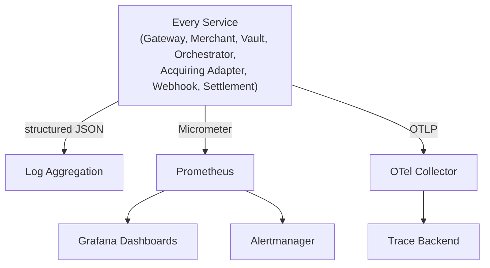
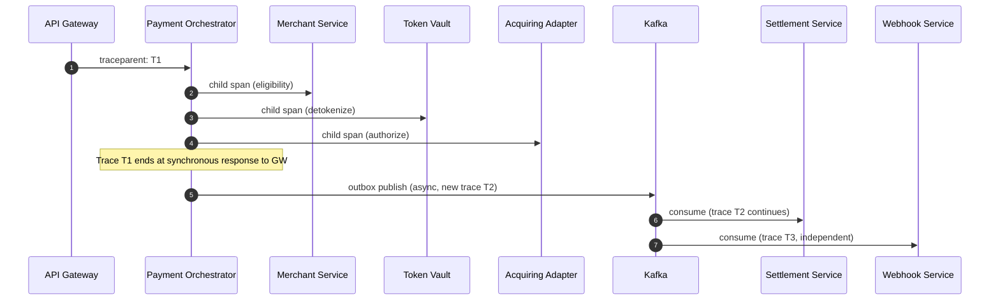
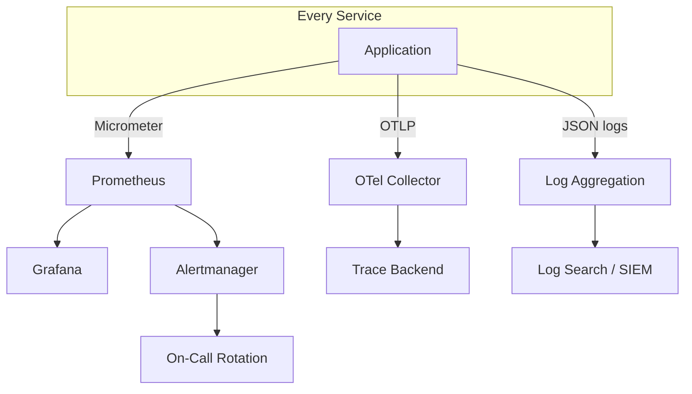

# Observability.md — Platform-Wide Observability Reference

Consolidates the logging, metrics, tracing, dashboard, and alerting design already established across every per-service spec. This document does not redefine any signal — it is the single place an engineer goes to see the platform's *entire* observability surface at once.

---

# 1. Overview

Every service on this platform emits the same three signal types the same way: structured JSON logs, Micrometer/Prometheus metrics, and OpenTelemetry traces — with one universal rule applied without exception: **no cardholder data, secret, or key material ever appears in a log line, metric label, or trace span, anywhere.** Beyond that shared baseline, each service adds its own domain-specific fields (a `paymentId` here, a `vaultTokenId` there) and its own domain-specific metrics, but the underlying pipeline — OTLP export, Prometheus scrape, structured JSON aggregation — is identical platform-wide.

---

# 2. Logging Standards

- Structured JSON only — no plain-text log lines anywhere on the platform.
- Baseline fields (every service): `timestamp` (UTC), `level`, `correlationId`, `traceId`, `route`, `status`, `latencyMs`.
- Severity convention, identical everywhere: `INFO` for routine operations and state transitions; `WARN` for 4xx/business-state rejections and retries; `ERROR` for 5xx, system failures, and security denials.
- Never logged, platform-wide, zero exceptions: `Authorization` header values, API keys, JWTs, request/response bodies containing sensitive fields, raw PAN/CVV, key material, webhook signing secrets.
- Token Vault carries the platform's strictest enforcement — structural, type-level exclusion of cardholder data from anything loggable, plus a log-scrubbing safety net (`Token-Vault-Part-03.md` §38.7) — the pattern every other service follows by convention, Token Vault follows by construction.
- Security-relevant denials are logged in the general application-log stream **in addition to** any dedicated audit-store write (Token Vault, Merchant Service lifecycle audit) — the two are deliberately redundant, since the audit store is compliance-authoritative while the log stream feeds faster real-time alerting.

---

# 3. Metrics

Emitted via Micrometer, scraped by Prometheus, identical 15-second scrape interval platform-wide. Every service's metrics fall into the same four categories:

| Category | Examples (platform-wide pattern) |
|---|---|
| Business | `*_created_total`, `*_completed_total`, `*_failed_total` (per-service entity naming) |
| Operational | `*_latency_seconds` histograms, `*_publish_lag_seconds`, `cache_hit_ratio` |
| Infrastructure | CPU, memory, JVM GC pause, network/disk I/O |
| Security | `*_authentication_failures_total`, `*_authorization_failures_total`, per-service anomaly signals |

---

# 4. Tracing

- OpenTelemetry, OTLP export to a shared collector, platform-wide.
- **Synchronous, latency-critical call chains are joined into one trace**: API Gateway → Payment Orchestrator → Merchant Service / Token Vault / Acquiring Adapter is the platform's longest single trace, since every hop in it is synchronous and directly gates the caller's perceived latency (`Payment-Orchestrator-Part-03.md` §33).
- **Asynchronous, event-driven consumption always starts a new trace** — never force-joined to the originating service's synchronous trace. This applies consistently to Webhook Service and Settlement Service consuming Kafka events, and to Merchant Service's own self-consumer rebuilding its read projection.
- Span attributes may include entity IDs (`paymentId`, `vaultTokenId`, `merchantId`) and route/status metadata — never a cardholder-data-adjacent value, enforced most strictly in Token Vault's span-attribute design (`Token-Vault-Part-03.md` §40.1).
- Sampling: successful (2xx) traces may be sampled at a configured rate; **any span ending in 4xx/5xx is always retained**, platform-wide, no exceptions.

---

# 5. Dashboards

| Dashboard | Owning Service(s) | Focus |
|---|---|---|
| Traffic Overview | API Gateway | Request rate, error rate, latency percentiles, per route |
| Cryptographic Performance | Token Vault | Tokenize/detokenize latency, HSM/KMS call latency isolated separately |
| Onboarding Funnel | Merchant Service | Registration → KYC → activation funnel, review-queue depth |
| Payment Health | Payment Orchestrator | Authorization/capture success rate, SAGA success rate, per-acquirer circuit state |
| Provider Health | Acquiring Adapter | Per-connector latency, error rate, failover rate |
| Delivery Health | Webhook Service | Delivery success rate, DLQ size, per-merchant endpoint responsiveness |
| Settlement Health | Settlement Service | Batch success rate, cycle-completion latency, payout success rate |
| Security Posture | Token Vault, API Gateway, Merchant Service | Auth/authz failure rates, anomaly signals, unauthorized-access attempts |

---

# 6. Alerts

Every service follows the same severity-classification discipline: **Critical** (platform-halting or security-incident-relevant), **High** (SLO-threatening, needs prompt attention), **Medium** (capacity/quality signal, not urgent). SLO burn-rate alerting (fast-burn: significant error budget consumed within an hour; slow-burn: over several hours) drives incident classification platform-wide, not raw threshold breaches alone.

| Alert Class | Example | Typical Severity |
|---|---|---|
| Dependency circuit open | Any per-dependency circuit breaker open > 1–2 min | Critical/High depending on dependency criticality |
| Auth/authz failure spike | Sudden deviation vs baseline, any service | Critical |
| DLQ entries present | Any message reaching a DLQ | Critical (Webhook Service, Merchant Service self-consumer) |
| Latency SLO breach | p99 over budget, sustained | High |
| Key/credential rotation overdue | Token Vault key age, Merchant Service credential rotation | High |
| Cache hit ratio drop | Below threshold, sustained | Medium |
| Settlement/DLQ backlog growth | Batch or delivery queue depth trending up | Medium–High |

---

# 7. Log Fields Table

| Field | Present In | Meaning |
|---|---|---|
| `timestamp` | Every service | UTC |
| `level` | Every service | INFO/WARN/ERROR |
| `correlationId` | Every service | Cross-service request identifier, propagated from the Gateway or originating event |
| `traceId` | Every service | OpenTelemetry trace |
| `route` / `status` / `latencyMs` | Every service | Standard access-log fields |
| `merchantId` | Merchant Service, Payment Orchestrator, Settlement Service, Webhook Service | Resolved principal / target merchant |
| `vaultTokenId` | Token Vault | Never accompanied by `maskedPan` in routine logs — reserved for API responses/audit only |
| `paymentId` | Payment Orchestrator, Acquiring Adapter, Settlement Service | Cross-referenced entity across the payment lifecycle |
| `sagaStep` | Payment Orchestrator | Current SAGA step at log time |
| `acquirerId` / `providerRequestId` | Acquiring Adapter | Connector and provider-side transaction cross-reference |
| `deliveryId` / `webhookEventId` | Webhook Service | Delivery-record and merchant-facing event identifier |
| `batchId` / `cycleDate` | Settlement Service | Settlement batch and cycle cross-reference |

---

# 8. Metrics Table

| Metric | Service | Type |
|---|---|---|
| `gateway_requests_total`, `gateway_request_duration_seconds` | API Gateway | Counter, Histogram |
| `merchant_registrations_total`, `kyc_case_duration_seconds` | Merchant Service | Counter, Histogram |
| `vault_tokenize_latency_seconds`, `vault_detokenize_latency_seconds`, `vault_hsm_kms_call_latency_seconds` | Token Vault | Histogram |
| `payments_started_total`, `payments_completed_total`, `saga_success_rate` | Payment Orchestrator | Counter, Gauge |
| `authorization_success_rate{acquirer}`, `provider_latency_seconds{acquirer}` | Acquiring Adapter | Gauge, Histogram |
| `webhook_delivery_success_rate`, `webhook_dlq_size` | Webhook Service | Gauge |
| `settlement_success_rate`, `payout_success_rate` | Settlement Service | Gauge |

Every service additionally emits a `*_circuit_breaker_state{dependency}` gauge for each of its own downstream dependencies — the one metric shape repeated identically across all seven components.

---

# 9. Trace Flow Diagram

---

# 10. Monitoring Architecture

One shared monitoring stack, one shared alerting pipeline, one shared trace backend — no service operates its own isolated observability tooling, ensuring an incident spanning multiple services (e.g. a Payment Orchestrator SAGA failure caused by a Token Vault circuit opening) is diagnosable from one set of dashboards and one trace, not six.

---

# 11. Summary

Observability on this platform is built once and reused everywhere: structured JSON logs with a shared baseline field set, Micrometer/Prometheus metrics in four consistent categories (business, operational, infrastructure, security), and OpenTelemetry tracing that joins synchronous call chains into one trace while deliberately keeping asynchronous event consumption as its own. The one rule with zero exceptions across every signal type is that cardholder data, secrets, and key material never appear in a log, metric, or span — enforced most strictly (structurally, not just by convention) in Token Vault, and by consistent discipline everywhere else. A single shared monitoring stack means any cross-service incident is diagnosable from one dashboard set and one trace, not a scavenger hunt across six independently-instrumented services.