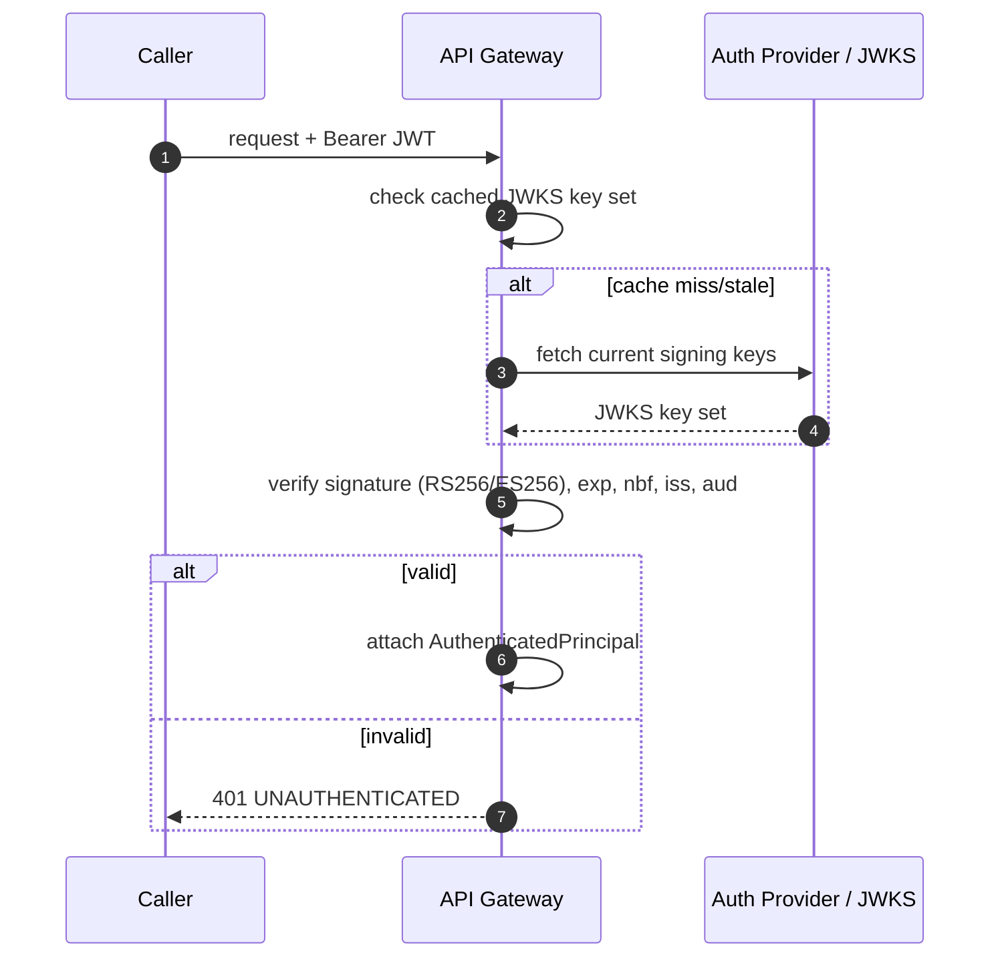
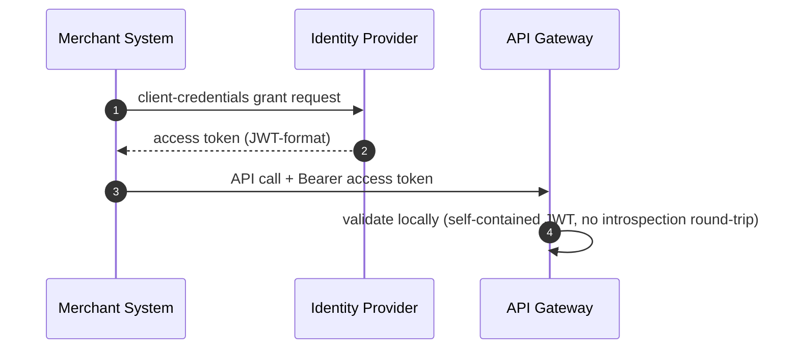
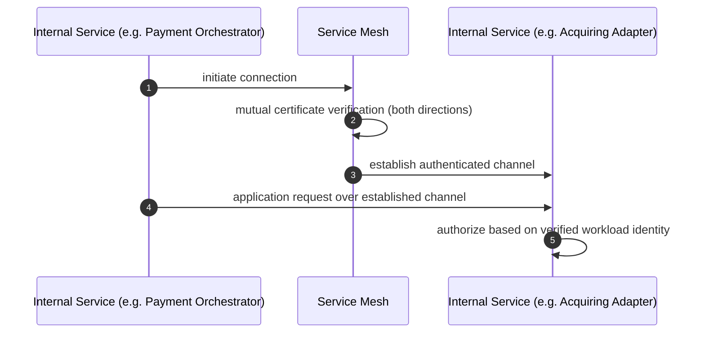
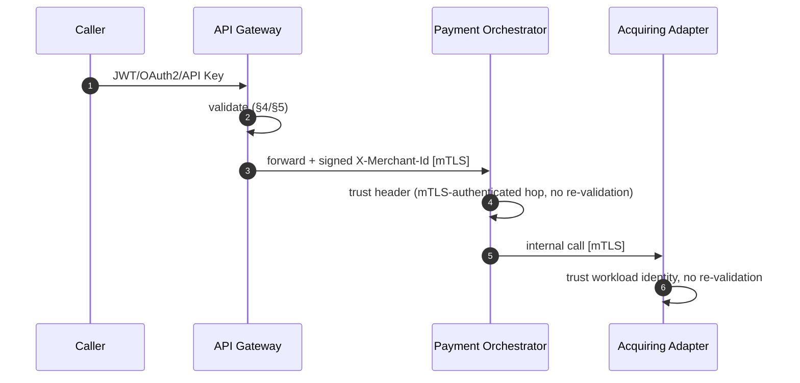
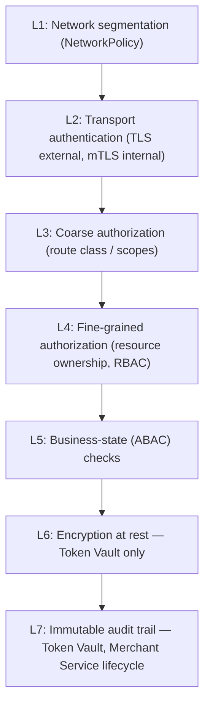
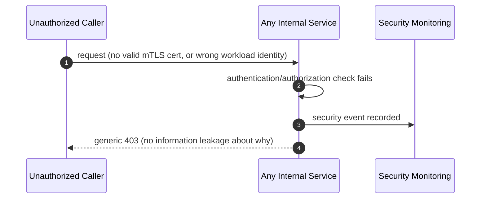

# Security-Architecture.md — Platform-Wide Shared Security Architecture

Document status: Cross-service reference — consolidates the authentication, authorization, encryption, and secret-management design already established across `SYSTEM_DESIGN.md` and every per-service specification. This document does not redefine any control — it is the single place an engineer goes to see how security is applied consistently platform-wide.

**Scope note**: Token Vault Service carries the platform's deepest cardholder-data-specific security architecture (envelope encryption, HSM/KMS integration, PCI-DSS cardholder-data-environment controls) and is treated as fully documented in `Token-Vault-Part-01.md` through `Part-04.md`. This document does not repeat that detail — it references it by pointer wherever relevant and focuses on the security architecture *shared across* every other service.

---

# 1. Overview

This platform applies one consistent security model across all six services and the API Gateway, rather than each service inventing its own: mTLS for every internal hop, OAuth2/JWT for every external caller, workload-identity allow-listing for the platform's most sensitive internal calls, and a single Secret Manager abstraction for every credential and key. The API Gateway is the sole external trust boundary (`API-Gateway-Part-01.md` §8); every service behind it trusts the Gateway's attested principal rather than re-validating an external credential itself.

Security here is layered, not single-point: network segmentation, transport authentication, coarse authorization, fine-grained authorization, and (for Token Vault specifically) encryption at rest — each layer's failure is independently survivable because no single layer is ever the platform's only defense.

---

# 2. Authentication

| Boundary | Mechanism | Owning Document |
|---|---|---|
| External caller → API Gateway | JWT (end-user/merchant-user context), OAuth2 client-credentials (machine-to-machine), or static API Key | `API-Gateway-Part-02.md` §19 |
| API Gateway → every downstream service | mTLS, workload identity | `API-Gateway-Part-02.md` §25.4 |
| Service → service (internal, e.g. Payment Orchestrator → Merchant Service/Acquiring Adapter) | mTLS, workload identity | `Payment-Orchestrator-Part-02.md` §22 |
| Payment Orchestrator → Token Vault (detokenize) | mTLS + workload-identity allow-list, Orchestrator-exclusive | `Token-Vault-Part-02.md` §19 (not repeated here) |
| Browser SDK → Token Vault (tokenize) | None (public, rate-limited, structurally validated) — a deliberate exception, since no merchant-authenticated session necessarily exists on that page | `Token-Vault-Part-02.md` §19.1 |
| Acquiring Adapter → external acquirers | Per-connector: API key, OAuth2 client-credentials, HMAC (webhook verification), or client certificate | `Acquiring-Adapter-Part-02.md` §16 |

**Zero re-validation principle**: once the API Gateway has authenticated an external caller, no downstream service ever re-validates that original credential — each downstream service trusts the Gateway-attested principal solely because the hop arrived over authenticated mTLS (`Payment-Orchestrator-Part-02.md` §22, `Merchant-Service-Part-02.md` §55). This is what keeps credential-validation logic in exactly one place platform-wide.

---

# 3. Authorization

| Layer | Applied Where | Description |
|---|---|---|
| Coarse (route-class) | API Gateway | Read/Mutating/Admin route classification vs the caller's granted scopes (`API-Gateway-Part-02.md` §20) |
| Fine-grained (resource ownership) | Owning service (Merchant Service, Payment Orchestrator) | Does the authenticated principal's `merchantId` match the `{merchantId}`/`{paymentId}`-owning entity in the request path (`Merchant-Service-Part-02.md` §51, `Payment-Orchestrator-Part-02.md` §22) |
| Service-role (RBAC) | Token Vault, Acquiring Adapter, Webhook Service, Settlement Service internal surfaces | A small, deliberately narrow set of workload roles per service (e.g. Token Vault's `PAYMENT_ORCHESTRATOR`/`VAULT_KEY_ADMIN`, `Token-Vault-Part-02.md` §20 — not repeated in full here) |
| Business-state (ABAC) | Every service with a lifecycle state machine | An operation is authorized at the role level but still rejected if the target resource's current state doesn't permit it (e.g. revoking an already-revoked credential, capturing an already-captured payment) |

**Least privilege, applied consistently**: every internal workload identity is scoped to exactly the operations its function requires — the Payment Orchestrator's identity can detokenize but never trigger a Token Vault key rotation; a key-admin identity can rotate keys but never detokenize (`Token-Vault-Part-02.md` §20.4). The same narrow-scoping discipline applies to every other service's internal-role design.

---

# 4. JWT Flow

- Algorithms allow-listed to RS256/ES256 only — no symmetric HS256 accepted from external callers, preventing algorithm-confusion attacks (`API-Gateway-Part-02.md` §25.2).
- No downstream service performs its own JWT validation on the external-caller token — the Gateway is the sole JWT-validating component platform-wide.

---

# 5. OAuth2 Flow

- Client-credentials grant only — no authorization-code/implicit flows, since the platform has no third-party end-user consent screen in its merchant-integration model (`API-Gateway-Part-02.md` §25.3).
- Merchant Service is the **registration authority** for OAuth2 client credentials (issuing client IDs and hashed secrets); the platform's Identity Provider is the **token-issuing authority** — a clean separation of responsibility (`Merchant-Service-Part-02.md` §40.2).
- Token introspection is deliberately avoided on the hot path — the Gateway validates self-contained JWTs locally to preserve its own latency budget.

---

# 6. mTLS Flow

- Mandatory for **every** internal hop, platform-wide, with zero exceptions — API Gateway ↔ every service, and every service ↔ every other service it calls.
- Certificates are short-lived and automatically rotated via the service mesh + platform Secret Manager (§7) — never long-lived static certs anywhere.
- Certificate-chain and revocation-status validation occurs on every request, not just at connection establishment, so a revoked identity's existing connections don't retain trust past revocation propagation.

---

# 7. Secret Management

| Principle | Applied Platform-Wide |
|---|---|
| No plaintext secrets in config/images/environment variables | Every service sources database credentials, mTLS material, and API keys exclusively from the platform Secret Manager abstraction at startup and on rotation |
| No secret ever appears in logs/traces | Enforced structurally where the secret is highest-risk (Token Vault's key material, `Token-Vault-Part-03.md` §38.7 — not repeated here) and by convention/log-scrubbing everywhere else |
| Rotation is automated, not manual | mTLS certificates, database credentials, and Acquiring Adapter provider credentials (`Acquiring-Adapter-Part-02.md` §16) are all rotation-managed via the Secret Manager, never a manual "update the config file" process |
| Merchant-facing secrets are hashed, never reversibly encrypted | API key secrets (Merchant Service, `Merchant-Service-Part-02.md` §40.3) and webhook signing secrets are salted-hashed at rest — shown to the merchant exactly once at issuance, never retrievable again |
| Vendor-neutral abstraction | The Secret Manager and mTLS/service-mesh layers are consumed through a stable internal interface everywhere — no service hardcodes a specific secret-store vendor's SDK into its domain or application layer |

Token Vault's key-hierarchy-specific secret handling (Master Key, KEK, DEK) is a materially deeper application of this same principle and is documented exclusively in `Token-Vault-Part-02.md` §24.

---

# 8. Encryption Standards

| Context | Standard | Where Applied |
|---|---|---|
| Transport (external) | TLS 1.2+ minimum, TLS 1.3 preferred | API Gateway public listener, Browser SDK ↔ Token Vault public endpoint |
| Transport (internal) | mTLS, TLS 1.2+ | Every service-to-service hop |
| Cardholder data at rest | AES-256/GCM via envelope encryption | Token Vault exclusively — see `Token-Vault-Part-02.md` §25 (not repeated here) |
| Non-cardholder secrets at rest (payout account details, credential secrets) | AES-256 (payout account) / salted hash (credentials) | Merchant Service (`Merchant-Service-Part-01.md` §14) |
| Message integrity (webhooks) | HMAC-SHA256 | Webhook Service (`Webhook-Service-Part-02.md` §13) |
| Hashing (general integrity, non-secret) | SHA-256 | Audit-entry hash-chaining (Token Vault), general checksums |

The platform draws a firm line between cardholder-data encryption (Token Vault's domain, HSM/KMS-backed, envelope encryption) and every other service's much lighter-weight secret handling (hashing, standard AES-256, Secret-Manager-sourced keys) — no other service attempts to replicate Token Vault's key hierarchy, since no other service is permitted to hold data warranting it.

---

# 9. Key Management

Platform-wide, key management outside Token Vault is limited to:

- **mTLS certificate keys**: issued and rotated by the service mesh, never manually managed.
- **HMAC signing keys** (webhook secrets): generated by Merchant Service at webhook-config time, stored as a hash reference, used only by Webhook Service to sign — no service holds a "master" HMAC key shared across merchants.
- **JWT signing keys**: owned entirely by the platform's Identity Provider; the API Gateway only ever consumes public keys via JWKS, never holds a private signing key itself.

Token Vault's full key hierarchy — Master Key, KEK, DEK, HSM/KMS integration, rotation/archival/destruction lifecycle — is the platform's only deep key-management architecture and remains fully specified in `Token-Vault-Part-02.md` §24 and `Part-03.md` §31 (not repeated here).

---

# 10. PCI DSS Coverage

| Requirement Area | How the Platform Satisfies It |
|---|---|
| Cardholder Data Environment (CDE) scope | Confined entirely to Token Vault Service — every other service structurally never receives PAN/CVV (`SYSTEM_DESIGN.md` §10, `Token-Vault-Part-02.md` §23.1–23.2, not repeated here) |
| Access control / unique identity per accessing entity | mTLS workload identity for every internal caller platform-wide (§6); no shared credentials anywhere |
| Network segmentation | Kubernetes `NetworkPolicy` default-deny per service namespace; Token Vault's dual-listener isolation is the strictest instance of this same principle |
| Audit logging of cardholder-data access | Token Vault's isolated, tamper-evident audit store (`Token-Vault-Part-03.md` §30.5) — the platform's only PCI-Requirement-10-scoped logging system |
| Encryption of cardholder data at rest/in transit | Token Vault's envelope encryption + TLS/mTLS everywhere |
| Vulnerability management / security testing | Continuous scanning + scheduled penetration testing, applied platform-wide, with the strictest zero-risk-acceptance policy specifically on Token Vault's image/dependencies (`Token-Vault-Part-04.md` §50.13–50.14) |

**Certification honesty**: this document, like every other specification in this platform, describes PCI-DSS-**aligned** architecture. It supports — but does not itself constitute — formal certification, which requires a QSA audit outside any of these documents' scope (`SYSTEM_DESIGN.md`, `Token-Vault-Part-02.md` §23.11).

---

# 11. Threat Model Table

| Threat | Mitigation |
|---|---|
| Leaked merchant API key | Salted-hash storage (never reversible); immediate revocation capability; Gateway-side cache invalidation within one event-propagation cycle (`Merchant-Service-Part-02.md` §41–42) |
| Cross-merchant data access (a valid credential used against another merchant's resource) | Fine-grained authorization checking `{merchantId}`/`{paymentId}` path parameters against the Gateway-attested principal on every request (`Merchant-Service-Part-02.md` §51, `Payment-Orchestrator-Part-02.md` §22) |
| Internal service impersonation | mTLS + workload-identity allow-listing on every internal hop — no bearer-token-only internal authentication exists anywhere on the platform |
| JWT algorithm-confusion / signature bypass | RS256/ES256 allow-list only, explicit algorithm pinning at the Gateway (`API-Gateway-Part-02.md` §25.2) |
| Compromised downstream service credential used to reach an unrelated service | Least-privilege, per-service workload-role scoping (§3) — a compromised Payment Orchestrator identity cannot reach Token Vault's key-rotation endpoint, for example |
| Replay of a captured internal request | mTLS session-bound authentication + short-lived certificates; for webhook deliveries specifically, timestamp + signature binding (`Webhook-Service-Part-02.md` §13) |
| SSRF via a merchant-configured webhook endpoint | Structural validation rejecting private/loopback addresses at config time (Merchant Service) and re-validated at delivery time (Webhook Service) (`Merchant-Service-Part-01.md` §25, `Webhook-Service-Part-02.md` §18) |
| Fraudulent/automated merchant registration at scale | IP-based strict rate limiting on the pre-authentication registration endpoint, distinct from standard per-merchant Gateway limits (`Merchant-Service-Part-02.md` §48) |
| Cardholder data exposure via any non-Vault service | Structurally impossible by design — no other service's schema, logs, traces, or event payloads have a field capable of holding it (`SYSTEM_DESIGN.md` §10, `Token-Vault-Part-01.md` §4) |
| Duplicate/replayed financial mutation | Idempotency-Key enforcement at every mutating endpoint platform-wide, verified under concurrent load testing (`SYSTEM_DESIGN.md` §6, `Payment-Orchestrator-Part-02.md` §20) |

---

# 12. Security Flow Diagrams

## 12.1 End-to-End Authentication Chain (External Request → Internal Service)

## 12.2 Layered Defense-in-Depth (Platform-Wide View)

## 12.3 Unauthorized Access Denial (Generic Pattern, Applied Platform-Wide)

---

# 13. Summary

This platform's security architecture rests on a small number of principles applied with total consistency across every service: mTLS for every internal hop, a single external authentication boundary at the API Gateway that no downstream service ever re-validates, least-privilege workload-role scoping, and a firm structural separation between the one service permitted to hold cardholder data (Token Vault) and every other service, which simply cannot leak what it never receives.

Authorization is layered — coarse at the Gateway, fine-grained at the owning service, business-state-aware everywhere a lifecycle exists — and every secret, everywhere, is sourced from a single Secret Manager abstraction rather than hardcoded or manually rotated. PCI-DSS alignment is achieved by scope reduction rather than by asking every service to independently implement cardholder-data-grade controls it doesn't need.

Token Vault's own deep cryptographic and key-management architecture is the platform's most rigorous security surface and is documented exhaustively in its own four-part specification — this document intentionally does not duplicate it, referencing it instead as the authoritative source for anything encryption- or key-hierarchy-specific.