# Sequence-Diagrams.md

---

## Payment Flow

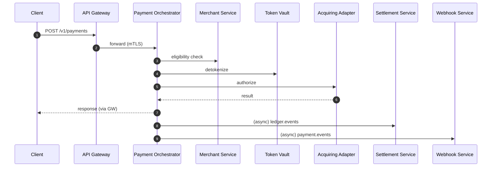

---

## Payment Retry

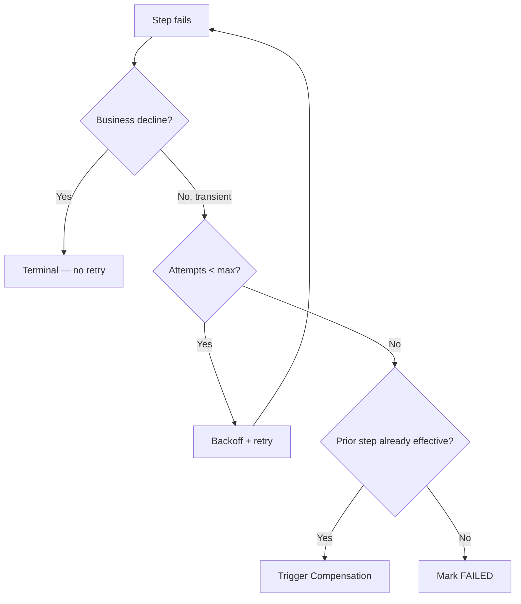

---

## Authorization

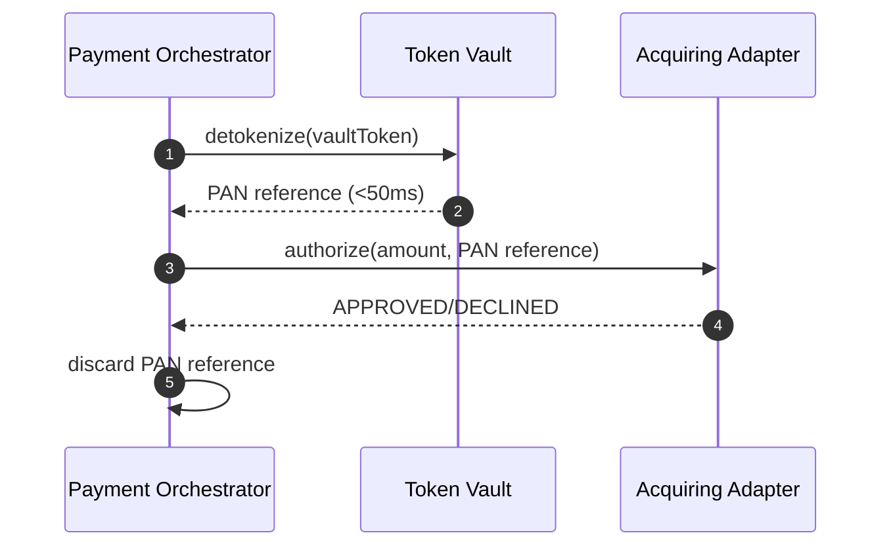

---

## Capture

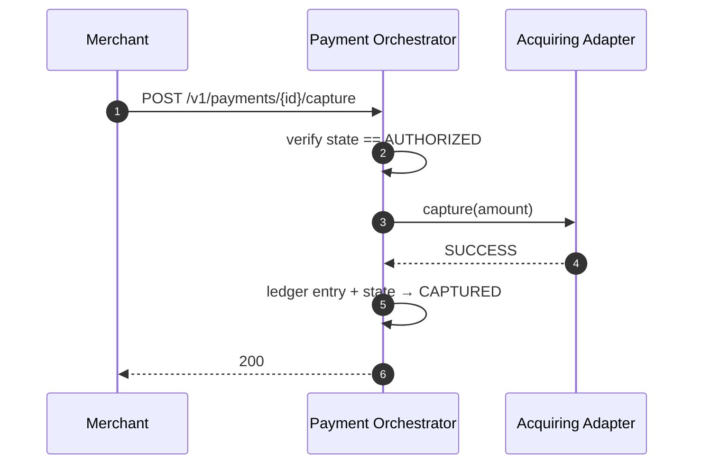

---

## Refund

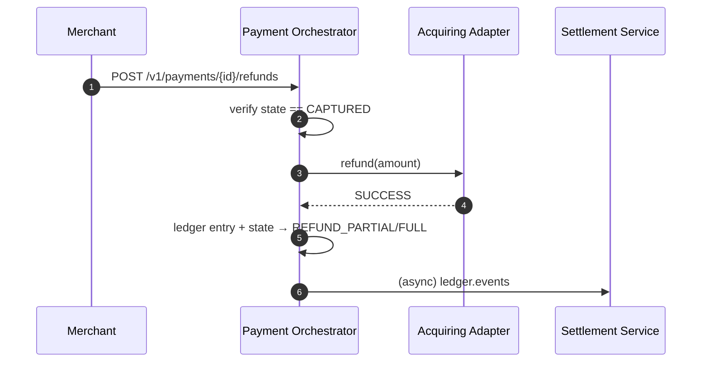

---

## Settlement

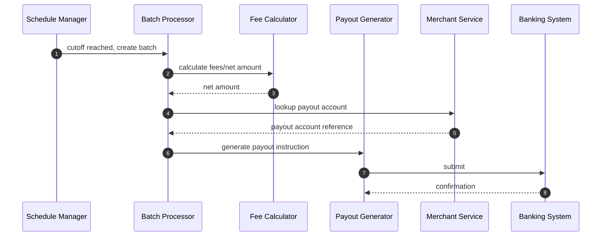

---

## Webhook

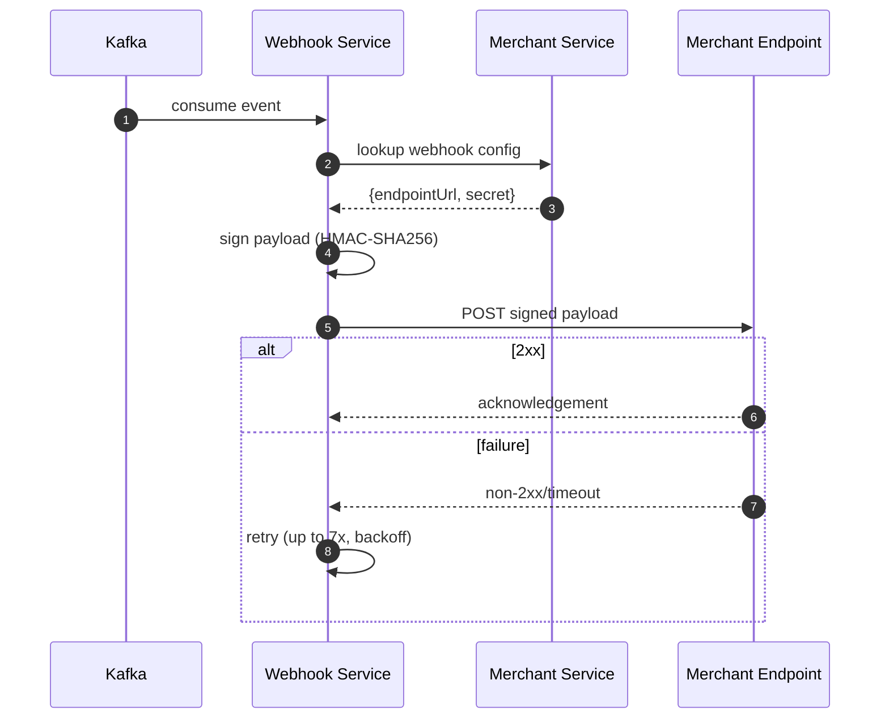

---

## Tokenization

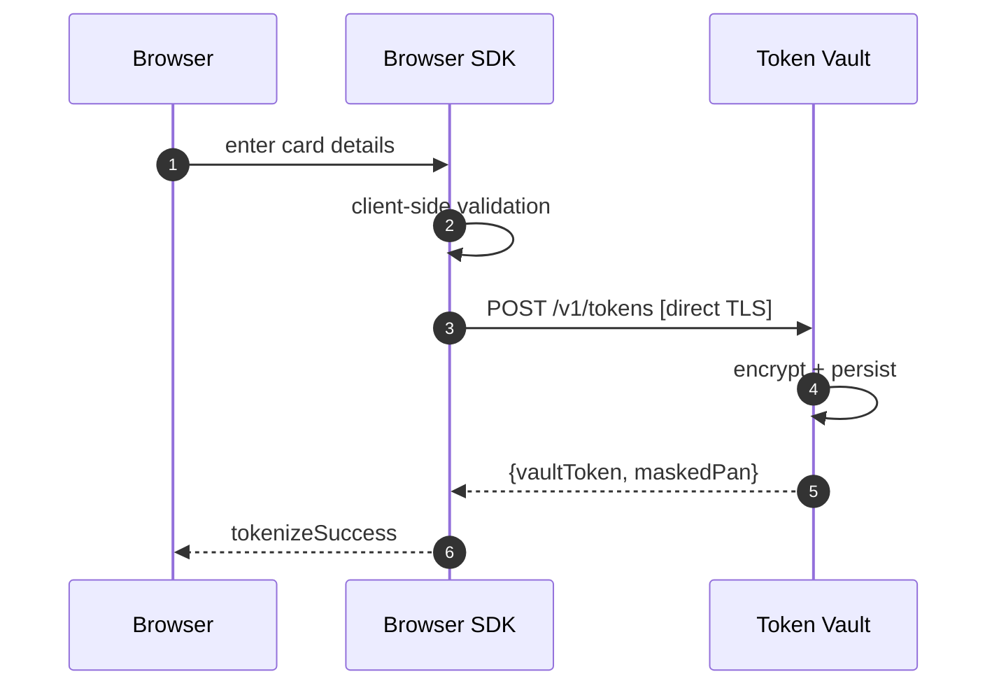

---

## Merchant Onboarding

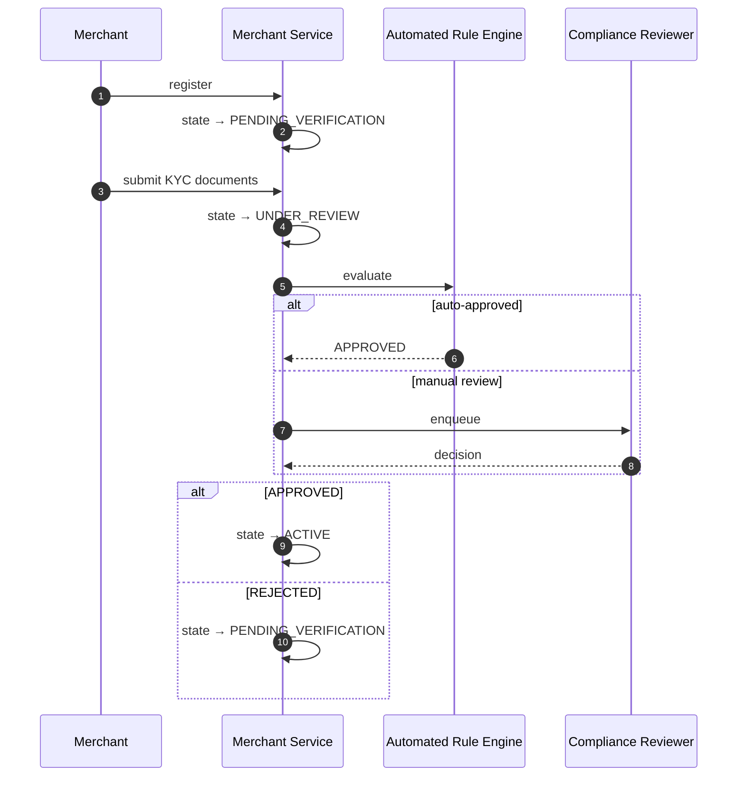

---

## Saga Flow

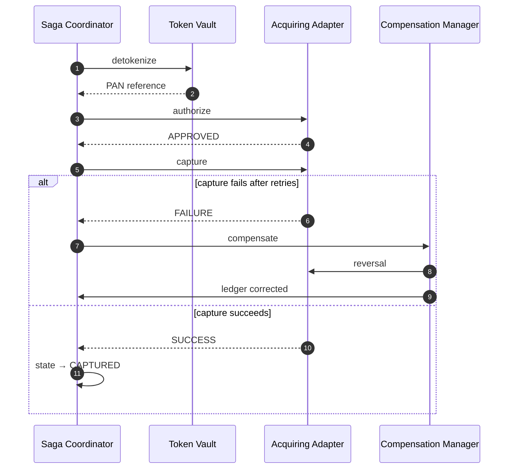

---

## Failure Recovery

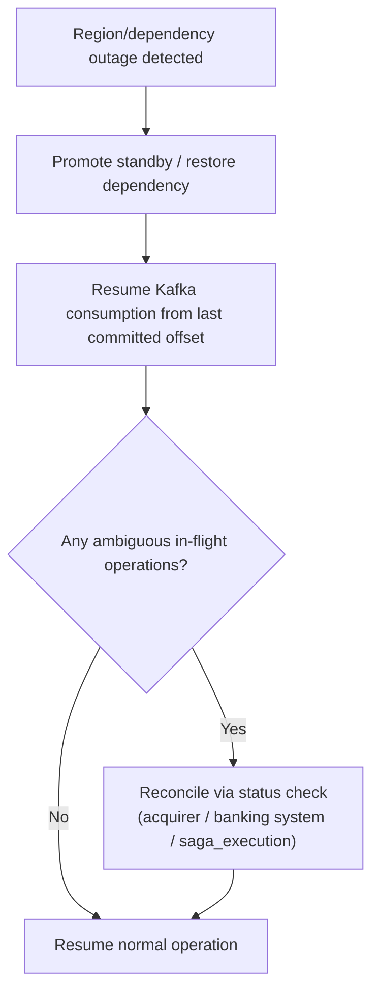

---

## Service Startup

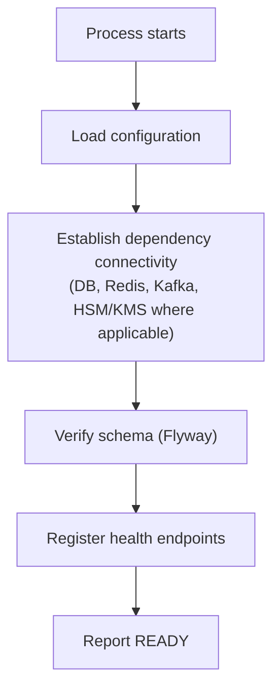

---

## Service Shutdown

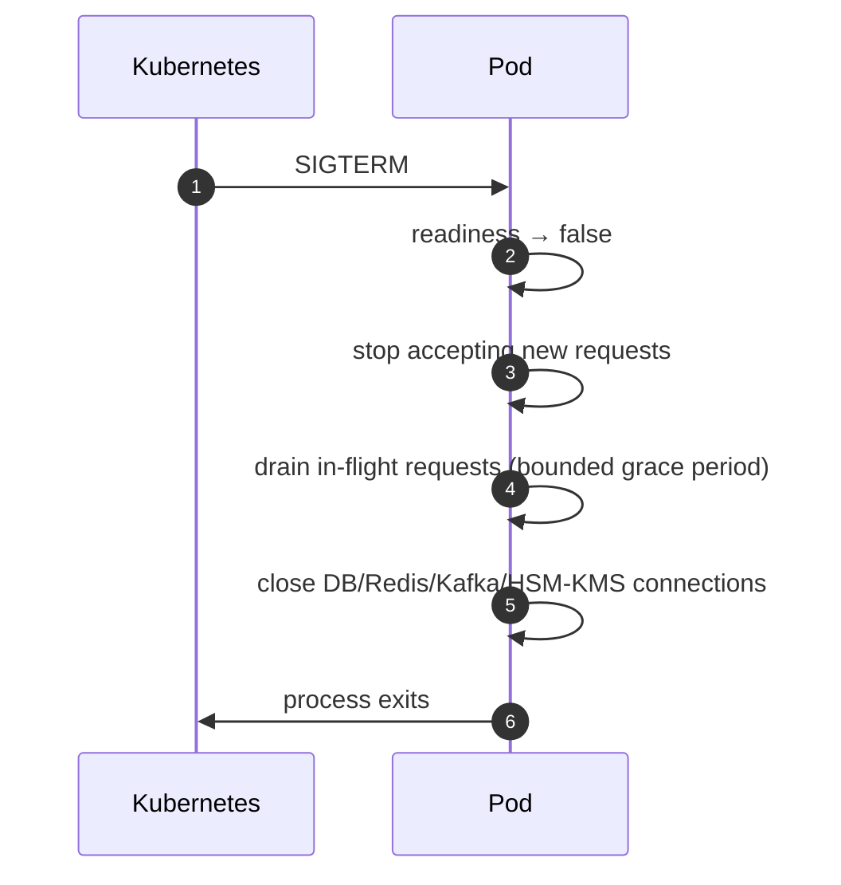