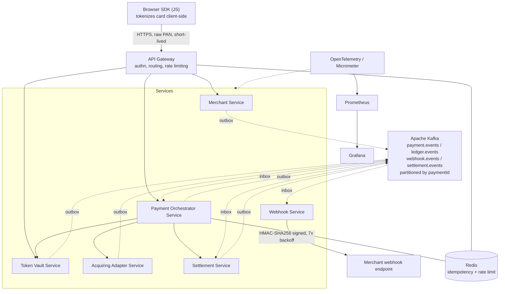
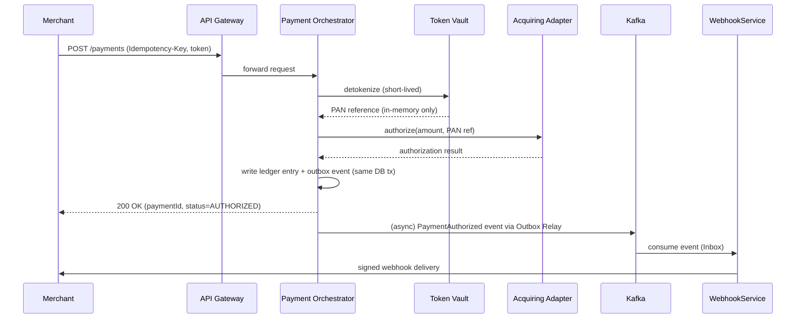
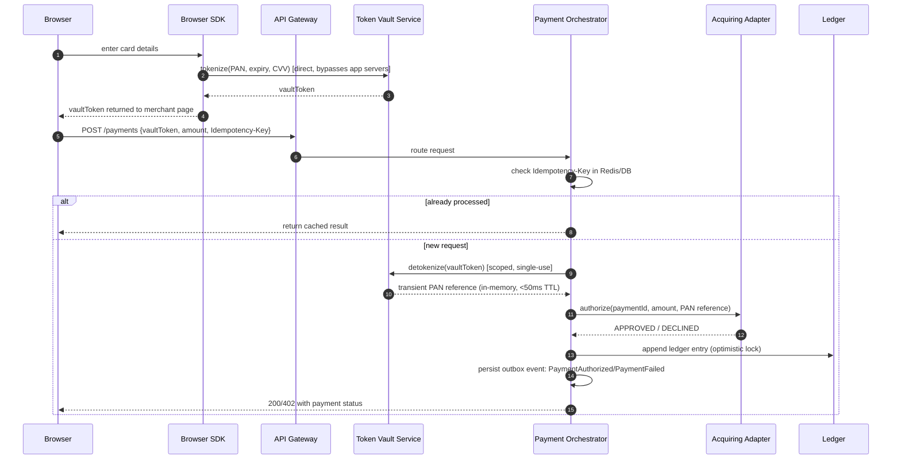
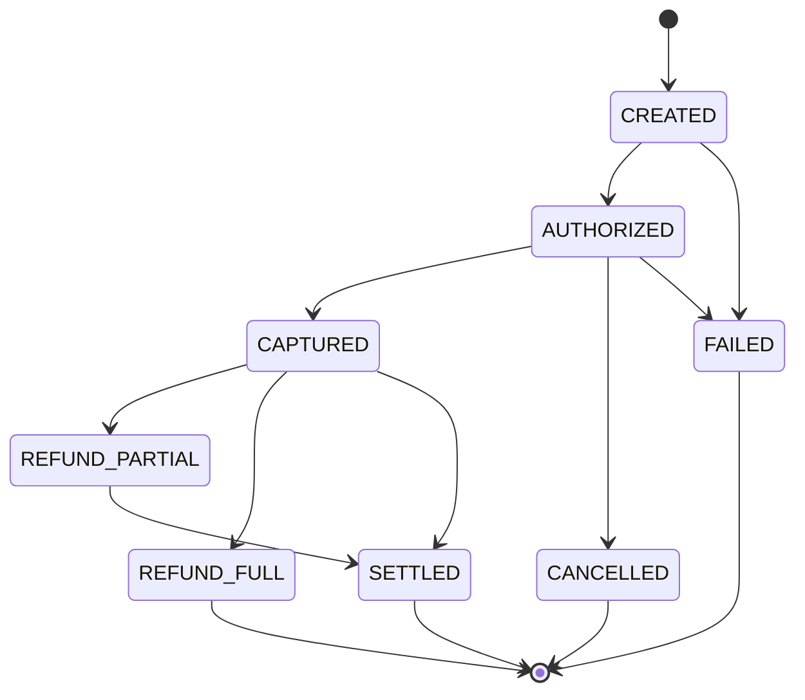
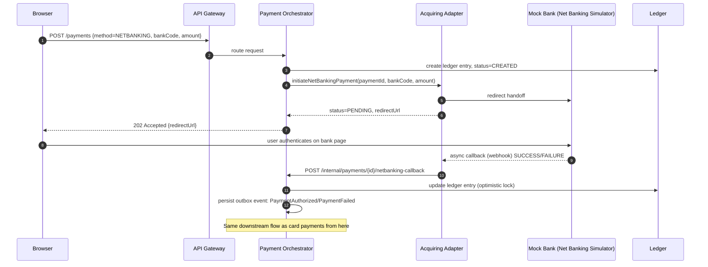
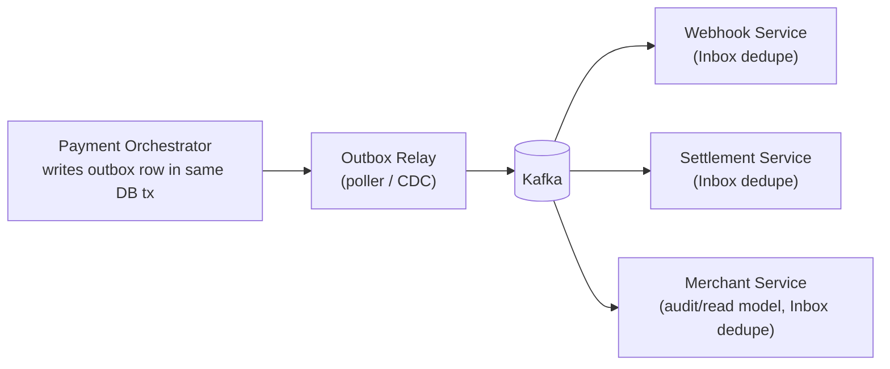
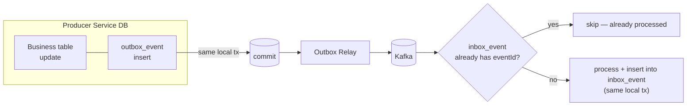
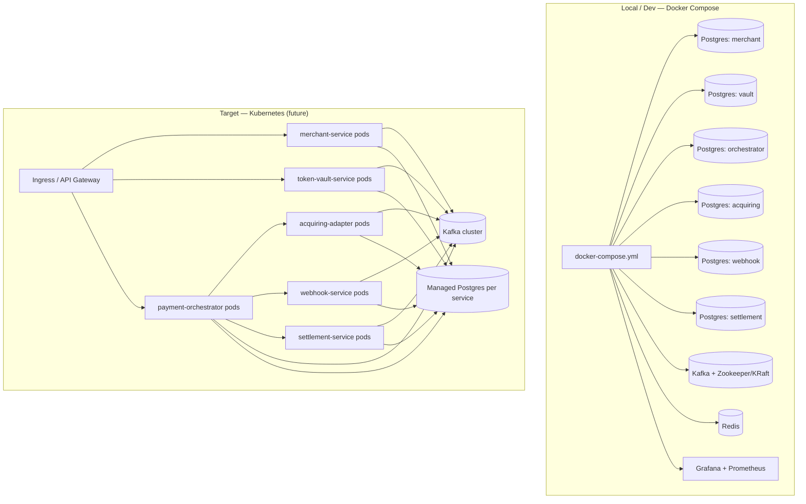

# SYSTEM_DESIGN.md — Distributed Payment Gateway

Status: **Draft — pending architecture freeze**
Scope: Portfolio/sandbox implementation of a Stripe/Razorpay-style payment
platform. PCI-aligned principles, no PCI certification claimed. Mock banks
and synthetic cards only.

This document is the single source of truth for architecture, service
boundaries, data ownership, contracts and deployment topology. No
implementation should diverge from this document without an accompanying
ADR.

---

## 1. Overall Architecture

Hexagonal (Ports & Adapters) microservices. Each service owns exactly one
database/schema. Synchronous REST is used only where a caller needs an
immediate answer (e.g. "authorize this payment now"); everything else —
state propagation, settlement, webhooks — flows through Kafka. There is no
2PC anywhere in the system; cross-service consistency is achieved through
SAGA, Transactional Outbox and Inbox.



### Architectural decisions at a glance

| Concern | Decision |
|---|---|
| Cross-service consistency | Orchestrated SAGA, no distributed transactions |
| Reliable publish | Transactional Outbox per service + Outbox Relay |
| Reliable consume | Inbox table per consumer, dedupe on `eventId` |
| API idempotency | `Idempotency-Key` header, Redis cache + DB unique constraint as source of truth |
| Ledger | Append-only, optimistic-locked, owned by Payment Orchestrator |
| PAN handling | Never leaves Token Vault; only a vault token flows downstream; raw PAN lifetime < 50ms |
| Service isolation | One database/schema per service, no cross-service joins |
| Reactive stack | WebFlux + R2DBC on the hot path (Orchestrator, Acquiring Adapter); JDBC acceptable elsewhere if justified by ADR |
| Resilience | Resilience4j (Circuit Breaker, Retry, TimeLimiter, Bulkhead) on every outbound call |

---

## 2. Service Interaction



Only the Orchestrator talks to both the Token Vault and the Acquiring
Adapter for a given payment. Merchant Service and Settlement Service never
call the Acquiring Adapter directly — they react to Kafka events instead.

---

## 3. Card Payment Sequence



Capture, cancellation, and refund follow the same shape: validate current
state against the payment state machine, call the Acquiring Adapter if an
external effect is needed, write a ledger entry, write an outbox event —
all within one local DB transaction per service.

### Payment state machine



---

## 4. Net Banking Sequence

Net banking has no tokenization step and involves a redirect to a
(simulated) bank page, so it uses a PENDING intermediate state while
waiting on an asynchronous bank callback.



---

## 5. Kafka Flow

### Topics

| Topic | Producer(s) | Consumer(s) | Partition Key | Purpose |
|---|---|---|---|---|
| `payment.events` | Payment Orchestrator | Webhook Service, Settlement Service | `paymentId` | State transitions: created, authorized, captured, cancelled, refunded, failed |
| `ledger.events` | Payment Orchestrator | Settlement Service | `paymentId` | Immutable ledger entries for reconciliation |
| `webhook.events` | Webhook Service (delivery outcomes) | Merchant Service (audit) | `merchantId` | Delivery attempts, success/failure, retry count |
| `settlement.events` | Settlement Service | Merchant Service, Ledger consumers | `merchantId` | Nightly settlement batch results |

### Event envelope (every event carries)

```json
{
  "eventId": "uuid",
  "eventType": "PaymentAuthorized",
  "aggregateId": "paymentId",
  "version": 1,
  "correlationId": "uuid",
  "causationId": "uuid",
  "timestamp": "UTC ISO-8601",
  "payload": { "...": "..." }
}
```

Events are immutable and never contain PAN, CVV, passwords or secrets —
only the vault token reference where a card reference is needed.



---

## 6. SAGA Orchestration

Orchestrated (not choreographed) SAGA, coordinated entirely by the Payment
Orchestrator, since it already owns the payment state machine and ledger.

**Example: Card authorization + capture saga**

1. `CREATED` — ledger entry written, outbox event queued.
2. Orchestrator calls Token Vault → detokenize. On failure: mark `FAILED`,
   no compensation needed (nothing external happened yet).
3. Orchestrator calls Acquiring Adapter → authorize. On failure: mark
   `FAILED`, emit `PaymentFailed`.
4. On success: mark `AUTHORIZED`, emit `PaymentAuthorized`.
5. On merchant capture request: Orchestrator calls Acquiring Adapter →
   capture. On failure: retry per Resilience4j policy, then mark
   `CAPTURE_FAILED` and emit a compensating event; ledger entry reflects
   the failed capture rather than a silent rollback (payments are
   append-only — we never delete a ledger row, we append a correcting
   entry).
6. On success: mark `CAPTURED`, emit `PaymentCaptured`.

**Compensation principle:** because the ledger is append-only, "rollback"
in this system always means *appending a corrective entry* (e.g. a
reversal), never mutating or deleting history. This is what makes the
SAGA safe without 2PC — every step is either idempotent-retryable or has
a well-defined compensating event.

---

## 7. Outbox / Inbox Design

**Outbox (producer side):** every service that emits events writes the
event row to an `outbox_event` table in the *same local transaction* as
its business state change. An Outbox Relay (polling publisher or CDC-based,
e.g. Debezium) tails this table and publishes to Kafka, marking rows
published. This guarantees "state change and event emission happen
together, or neither happens."

**Inbox (consumer side):** every service that consumes events keeps an
`inbox_event` table keyed by `eventId`. Before processing, the consumer
checks whether `eventId` has already been recorded; if so, it skips
processing (idempotent consumption). This protects against Kafka's
at-least-once delivery producing duplicate processing.



---

## 8. Ledger Design

- Append-only table, one row per financial movement (authorization,
  capture, refund, settlement adjustment).
- Never updated or deleted; corrections are new rows referencing the
  original entry.
- Optimistic locking (`version` column) on the parent payment aggregate to
  prevent concurrent writers from clobbering state, while ledger rows
  themselves are pure inserts.
- Owned exclusively by Payment Orchestrator's database; other services
  read ledger facts only via `ledger.events`, never via direct DB access.

Minimal shape:

| Column | Notes |
|---|---|
| `ledger_entry_id` | UUID, PK |
| `payment_id` | FK reference, indexed |
| `entry_type` | AUTH / CAPTURE / REFUND / REVERSAL / SETTLEMENT_ADJUSTMENT |
| `amount` | signed, minor units |
| `currency` | ISO 4217 |
| `created_at` | UTC |
| `correlation_id` | ties back to originating event |

---

## 9. Settlement Design

- Nightly batch job (scheduler) in Settlement Service.
- Reads `ledger.events` (already consumed into its own local read model via
  Inbox) grouped by `merchantId` for the settlement window.
- Produces a settlement batch: aggregate captured amount − refunds − fees.
- Writes its own append-only `settlement_entry` rows, then emits
  `settlement.events` for Merchant Service to reflect payable balance.
- Reconciliation: a separate scheduled job compares Settlement Service's
  view of ledger totals against Payment Orchestrator's ledger truth
  (via event replay or a reconciliation report) and raises an alert on
  mismatch — it never auto-corrects silently.

---

## 10. Card Vault Design (Token Vault Service)

- Sole component permitted to hold or momentarily handle raw PAN/CVV.
- Browser SDK tokenizes directly against Token Vault — app servers never
  see raw card data in transit for tokenization.
- AES-256 encryption at rest for any transient storage; raw PAN lifetime
  in memory is capped at 50ms for detokenize-for-authorization flows.
- Returns an opaque `vaultToken` to the caller; only this token is ever
  passed to the Orchestrator, logged, or placed on Kafka.
- No PAN/CVV ever appears in application logs, Kafka payloads, or the
  Orchestrator's database — enforced by code review + automated log/
  event payload scanning in CI.

---

## 11. PostgreSQL Schema Ownership

One database (or schema, per deployment choice) per service — no
cross-service joins, no shared tables.

| Service | Owns | Key tables (indicative) |
|---|---|---|
| Merchant Service | Merchant identity & config | `merchant`, `api_credential`, `webhook_config` |
| Token Vault Service | Tokenized card data | `vault_token` (encrypted PAN reference only) |
| Payment Orchestrator | Payment state + ledger | `payment`, `ledger_entry`, `outbox_event`, `inbox_event` |
| Acquiring Adapter | Provider-facing transaction log | `provider_transaction`, `outbox_event` |
| Webhook Service | Delivery tracking | `webhook_delivery_attempt`, `inbox_event` |
| Settlement Service | Settlement & reconciliation | `settlement_batch`, `settlement_entry`, `reconciliation_report`, `inbox_event` |

All migrations via Flyway, no automatic schema generation in production.

---

## 12. Deployment Architecture



Each service is independently deployable and independently scalable. The
Acquiring Adapter and Payment Orchestrator are expected to be the highest
-throughput services and are the primary WebFlux/R2DBC candidates.

---

## 13. Repository Structure

```
distributed-payment-gateway/
├── pom.xml
├── docker-compose.yml
├── docs/
│   ├── SYSTEM_DESIGN.md
│   ├── adr/
│   ├── diagrams/
│   └── openapi/ , asyncapi/
├── platform/
│   ├── common-core/
│   ├── common-security/
│   ├── common-kafka/
│   ├── common-observability/
│   └── common-test-support/
├── merchant-service/
├── token-vault-service/
├── payment-orchestrator-service/   # + saga/, statemachine/, ledger/
├── acquiring-adapter-service/      # + provider/
├── webhook-service/                # + delivery/, signing/
├── settlement-service/             # + batch/, reconciliation/
├── outbox-relay/
├── provider-simulators/
├── api-gateway/
├── browser-sdk/
└── infra/
    ├── kubernetes/
    ├── grafana/
    └── prometheus/
```

Each service follows the standard internal package shape:
`config, controller, service/impl, repository, entity, dto, mapper,
exception, security, validation, event/producer, event/consumer,
scheduler, client, util, constant`, per `02_ENGINEERING_STANDARDS.md`.

---

## 14. Technology Decisions

| Layer | Choice | Rationale |
|---|---|---|
| Language/runtime | Java 21 | Records, sealed classes, pattern matching for domain modeling |
| Web framework | Spring Boot 3.x + WebFlux | Non-blocking I/O for high-TPS payment path |
| DB access (hot path) | R2DBC | Reactive end-to-end on Orchestrator/Acquiring Adapter |
| DB access (low-throughput) | JDBC (ADR-gated) | Simpler for Merchant/Settlement if reactive gives no benefit |
| Messaging | Apache Kafka | Ordered, partitioned event backbone; replay for reconciliation |
| Cache | Redis | Idempotency keys, rate limiting |
| Resilience | Resilience4j | Circuit breaker, retry, time limiter, bulkhead on all outbound calls |
| Auth | Spring Security + JWT | Merchant + internal service auth |
| Migrations | Flyway | No auto schema generation in prod |
| Observability | OpenTelemetry, Micrometer, Prometheus, Grafana | Tracing + metrics across service boundaries |
| Testing | JUnit 5, Mockito, Testcontainers, WireMock | Real DB/Kafka in integration tests, stubbed providers |

---

## 15. Scalability Plan

- **Target:** 10,000 TPS — not claimed until load-tested; current status
  is architectural provisioning for it, not a demonstrated result.
- Kafka partitioning by `paymentId` keeps per-payment ordering while
  allowing horizontal consumer scaling.
- Acquiring Adapter and Payment Orchestrator scale independently and
  horizontally behind the gateway; both are stateless besides their own
  DB, so replica count is the primary scaling lever.
- Redis-backed idempotency check keeps duplicate-request detection O(1)
  and off the DB hot path.
- Settlement is inherently batch/off-peak, so it is scaled for throughput
  during a nightly window rather than for latency.
- Backpressure: WebFlux + Resilience4j bulkheads prevent a slow
  downstream (e.g. a degraded mock bank simulator) from exhausting
  threads upstream.
- Load testing plan (future ADR): ramp test against Acquiring Adapter and
  Orchestrator in isolation first, then full path, before any TPS claim
  is documented here.

---

## Open Decisions / Risks (tracked, not yet resolved)

- JDBC vs R2DBC final call for Merchant/Settlement services — pending ADR.
- Outbox Relay implementation: home-grown poller vs Debezium CDC — pending
  ADR and a small spike.
- Net banking callback authenticity verification approach (shared secret
  vs simulated mTLS) — pending Security Architect sign-off.
- Multi-currency ledger rounding rules — not yet specified.

This document is the permanent architectural source of truth for the
project. Any deviation requires a new ADR under `docs/adr/`.
